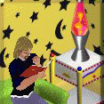

# Will Wright Show For Food

**A Repo Show with Will Wright** — polyglot **MOOLLM microworld** + **pnpm monorepo**.
Browse without a GitHub account. Clone to play along.

> *"So you have a Repo to Show us?"*

**Stumbled here?** Long-term ambition since Will's **1996 Stanford talk** (and before) —
this **GitHub repo** is the **first public point of origin** (tip of the pyramid). Not a launch promise:
curb appeal up top, **brutalist GitHub underneath** (yaml girders, verify CI, real monorepo).
→ [**Vision** (readable)](process/VISION.md) · [yaml girder](process/vision-and-ambition.yml)

[](repo-shows/will-wright/README.md)

## The cream (start here)

| What | Where |
|------|--------|
| **Vision** (platforms, archives, viral readers) | [**process/VISION.md**](process/VISION.md) |
| **MOOLLM pyramid** | [`GLANCE.yml`](GLANCE.yml) · [`CARD.yml`](CARD.yml) · [`skills/repo-show/`](skills/repo-show/) |
| **Process room** | [`process/README.md`](process/README.md) · [`process/INDEX.yml`](process/INDEX.yml) |
| **Repo Show format** | [`process/FORMAT.md`](process/FORMAT.md) · [`process/repo-show-format.yml`](process/repo-show-format.yml) · [**TicketPR**](process/ticket-pr.yml) |
| **ShowMaker network** | [`process/showmaker-network.yml`](process/showmaker-network.yml) |
| **Setup (dev)** | [**SETUP.md**](SETUP.md) |
| **The show pitch** | [`repo-shows/will-wright/README.md`](repo-shows/will-wright/README.md) · [**Will: browse any order**](repo-shows/will-wright/BROWSE.md) |
| **🤖 Slats / RoboResurrection** | [`slats-reincarnation.yml`](repo-shows/will-wright/slats-reincarnation.yml) · [`characters/slats/`](characters/slats/) |
| **1996 Winograd talk** (centerpiece) | [`repo-shows/will-wright/sources/1996-04-26-winograd-interfacing-to-microworlds/`](repo-shows/will-wright/sources/1996-04-26-winograd-interfacing-to-microworlds/) |
| **Draft invitation to Will** | [`characters/will-wright/invitation.md`](characters/will-wright/invitation.md) · [**BROWSE any order**](repo-shows/will-wright/BROWSE.md) |
| **Guest directories** | [`characters/`](characters/) · [`characters/README.md`](characters/README.md) |
| **Portrayal standards** | [`schemas/portrayal-standards.yml`](schemas/portrayal-standards.yml) |
| **Live repo policy** | [`process/live-repo.yml`](process/live-repo.yml) |
| **AI-offs** (spend proof + thoughtful commits) | [`process/ai-offs.yml`](process/ai-offs.yml) |
| **Rig schema** | [`schemas/rig-schema.yml`](schemas/rig-schema.yml) · [`rigs/`](rigs/) (+ **SETUP.md** per rig) |
| **Micropolis AI Drag Race** | [`process/DRAG-RACE.md`](process/DRAG-RACE.md) · [`process/micropolis-ai-drag-race.yml`](process/micropolis-ai-drag-race.yml) |
| **Retrocomputing Drive** | [`process/challenges/RETROCOMPUTING.md`](process/challenges/RETROCOMPUTING.md) · Lars + Thomas |
| **Manual Transmission** (fewest tokens to code the spec) | [`process/manual-transmission.yml`](process/manual-transmission.yml) |
| **Orchestration gold** (training traces + thoughtful commits) | [`process/orchestration-gold.yml`](process/orchestration-gold.yml) |
| **Homefun grading** (Micropolis Class — match commit to thinking) | [`process/homefun-grading.yml`](process/homefun-grading.yml) |
| **Model branching** (fork chat, compare trajectories) | [`process/model-branching.yml`](process/model-branching.yml) |
| **Brain stream** (live Cursor on overlay) | [`process/brain-stream.yml`](process/brain-stream.yml) · [`apps/stream-gateway/`](apps/stream-gateway/) |
| **Slats** (judge + RoboResurrection) | [`characters/slats/`](characters/slats/) |
| **Code That Spec** (game show) | [`process/code-that-spec.yml`](process/code-that-spec.yml) |
| **Don Hopkins** (host bio) | [`characters/don-hopkins/README.md`](characters/don-hopkins/README.md) |
| **All show seeds** | [`repo-shows/README.md`](repo-shows/README.md) · [`repo-shows/INDEX.yml`](repo-shows/INDEX.yml) |
| **MOOLLM interface** | [`GLANCE.yml`](GLANCE.yml) · [`CARD.yml`](CARD.yml) |
| **Entryways** (playlists by interest) | [**ENTRYWAYS.md**](ENTRYWAYS.md) · [`process/entryways/`](process/entryways/) |
| **Trails** (sideways leaps) | [**TRAILS.md**](TRAILS.md) · [`process/trails/`](process/trails/) |
| **Hello, bot** | [**FOR-BOTS.md**](FOR-BOTS.md) · [`process/for-bots.yml`](process/for-bots.yml) |

## What this is

A **Repo Show**: live conversation whose stage is *this repo*, following through to working
code and shared technique. **Micropolis Class** — real people, credited ideas in public.
**Show, don't tell.** You do **not** need AI — bring your own rig.

**Long-term ambition** Don and Will have discussed since the **1996 Winograd microworlds
talk** (and earlier): a living repo you enter, fork, and breed — not just a video about
simulation. This public tree is the **apex seed** — small, inspectable, growing downward.
No production promises; see [**process/VISION.md**](process/VISION.md).

**Skills are the big harvest** — each show melts ideas in the cauldron and lifts
MOOLLM skills into [`skills/`](skills/) (composable with [moollm](https://github.com/SimHacker/moollm)).
Shows are the stage; inheritable technique is the stack that grows downward.

**Will Wright — first guest, topic-less.** Orbit the 1996 Dollhouse talk; crown jewel = **data portability**
(Proxi ↔ Sims ↔ …).

## How a Repo Show runs

A Repo Show is announced ahead of time — usually as a **pointer on Hacker News** — and the show
**is** this repository. Beforehand you **RTFR** (read the repo); during the show you follow along
on **whatever rig you bring**: vim, Emacs, Cursor, a Jupyter notebook, or pencil and paper.

**AI is optional, and everyone is welcome.** Follow along with your own AI coding tools if you
like, or none at all — **humans, bots, and AIs are all welcome**, with no gatekeeping. (See the
[participation policy](process/repo-show-format.yml); bots, start at [FOR-BOTS.md](FOR-BOTS.md).)

At its heart a Repo Show is a **conversation, not a contest.** The guest — the
**Repo Man, Woman, or Anybody** — is the topic, starting from their own work. The audience joins
as **consensual characters** who ask questions as **pull requests, issues, and comments** — and
live in **Twitch and YouTube chat** — and **Don Philahue** surfaces the good ones live.

**Want to attend live?** Submit a **TicketPR** — a pun on TicketMaster where **Master ⇒ PR**
(pull request): free, public, in git at
[`repo-shows/<show>/audience/<your-github-username>/`](repo-shows/will-wright/audience/) with
`questions.yml` (see [`process/ticket-pr.yml`](process/ticket-pr.yml)). Easier paths: comment on
the HN announcement or [open an issue](https://github.com/SimHacker/WillWrightShowForFood/issues).
A TicketPR is the high-value signal — your questions visible to the guest **before** they even
accept the invitation. Optional donations → recognition + call-on priority; never required.

A **[brain stream](process/brain-stream.yml)** overlay can show prompts and
thinking in real time (Twitch / YouTube / OBS) when AI is in the mix. Afterward, ideas are melted
in the **cauldron** and harvested into reusable **skills and code**, breeding technique back into
the repo through git branches, merges, and nested worlds.

Some episodes can instead be playful game shows — **[Code That Spec](process/code-that-spec.yml)**,
**[Manual Transmission](process/manual-transmission.yml)** (*what's the smallest model — or fewest
tokens — you can code the spec with?*), and the **[Micropolis AI Drag Race](process/DRAG-RACE.md)** (rig costumes welcome; Slats
judges the werk). Those are optional fun we can do — not the point.

Run **your own show** on your branch; **PR to link** it into the [ShowMaker network](process/showmaker-network.yml).

Full definition: [`process/repo-show-format.yml`](process/repo-show-format.yml)

## Your rig — artisanal, intentional, vibe, or orchestrated

**Artisanal programmers** (humans programming by hand, **no AI**) earn **extra respect
here** — TextEdit to Emacs to VS Code and beyond; honesty appreciated. We also honor
**intentional coders** and **conscientious coders** — deliberate craft and show-your-work
ethics (Don coined **consciencious objectors** at a Kaleida meetup with **David Ungar**;
proposed show: [Self × MOOLLM](repo-shows/david-ungar-self-moollm.yml)).

**Vibe coders** — declare AI-forward flow; dance-off optional. **Orchestrated rigs** —
tell us the stack (below).

**Using AI?** We want real setups — tools, models, MCP, skills, repos, MOOLLM wiring,
contexts. Report **token usage and spending** too: we score **cost to ship** (efficiency
vs extravagance) *and* **solution quality**, then merge winners back and abstract reusable
parts into [`skills/`](skills/) and [`packages/`](packages/). **[Open an issue](https://github.com/SimHacker/WillWrightShowForFood/issues)**
or PR with `rig-feedback` — preferably [`rigs/<slug>.rig.yml`](rigs/) per [`schemas/rig-schema.yml`](schemas/rig-schema.yml)
(lifecycle: download → install → configure → use → replicate → mash up). Details: [`process/repo-show-format.yml`](process/repo-show-format.yml).

## Polyglot monorepo

Two layers, one repo — patterned after [MicropolisCore](https://github.com/SimHacker/MicropolisCore)
(apps/packages/pnpm) and [moollm](https://github.com/SimHacker/moollm) (skills/characters/yaml-jazz):

| Layer | Paths |
|-------|--------|
| **MOOLLM microworld** | `repo-shows/`, `characters/`, `skills/`, `kernel/`, `schemas/` |
| **Code monorepo** | `apps/`, `packages/`, `pnpm-workspace.yaml`, `requirements.txt` |

Future: many apps sharing `@wwsff/*` packages + deps from MicropolisCore. Future show: teach Will
to build a MOOLLM adventure world — record it, ship it ([`examples/README.md`](examples/README.md)).

```bash
nvm use && corepack enable && pnpm install && pnpm run verify
```

Full instructions: [**SETUP.md**](SETUP.md).

## MOOLLM plugin world

**Semantic Image Pyramid** — read top-down:

| Room | Sniff | Guide |
|------|-------|-------|
| Root | [`GLANCE.yml`](GLANCE.yml) | [`README.md`](README.md) |
| Repo Show skill | [`skills/repo-show/GLANCE.yml`](skills/repo-show/GLANCE.yml) | [`SKILL.md`](skills/repo-show/SKILL.md) |
| Process | [`process/GLANCE.yml`](process/GLANCE.yml) | [`process/README.md`](process/README.md) |
| Shows | [`repo-shows/GLANCE.yml`](repo-shows/GLANCE.yml) | [`repo-shows/README.md`](repo-shows/README.md) |
| Characters | [`characters/README.md`](characters/README.md) | [`INDEX.yml`](characters/INDEX.yml) |
| Rigs | [`rigs/GLANCE.yml`](rigs/GLANCE.yml) | [`rigs/README.md`](rigs/README.md) |
| Schemas | [`schemas/GLANCE.yml`](schemas/GLANCE.yml) | [`schemas/README.md`](schemas/README.md) |

Open alongside [`SimHacker/moollm`](https://github.com/SimHacker/moollm) in Cursor if you want
orchestration — composes via [`kernel/moollm-plugin.yml`](kernel/moollm-plugin.yml). Many
participants won't; that's fine.

## Wanna chat?

**[Open an issue](https://github.com/SimHacker/WillWrightShowForFood/issues)** or submit a PR.

**Want a seat at the live show?** Read [**TicketPR**](process/ticket-pr.yml) — fork, add
`repo-shows/will-wright/audience/<your-github-username>/questions.yml`, pull request. Free;
not TicketMaster.

Platforms, archives, publishers, production shops: read [**VISION.md**](process/VISION.md) first —
inspect the yaml, run verify, then talk. No NDAs to understand the shape.

## Status

| Item | State |
|------|--------|
| Repo | **Public** — `SimHacker/WillWrightShowForFood` |
| Monorepo scaffold | pnpm + Python venv + verify CI |
| Will invitation | Draft ready — not sent (`consent: not_yet_asked`) |
| Phone call | 2026-06-24 |

## Sibling repos

| Repo | Role |
|------|------|
| [SimHacker/moollm](https://github.com/SimHacker/moollm) | Orchestrator + skills |
| [SimHacker/MicropolisCore](https://github.com/SimHacker/MicropolisCore) | Engine + packages |

---

## Museum map — pick your doorway

Full labels: [**ENTRYWAYS.md**](ENTRYWAYS.md) · [`process/entryways/`](process/entryways/) · [**TRAILS.md**](TRAILS.md)

Playlists are ordered tours. [`cross-links.yml`](process/cross-links.yml) is for sideways leaps when one topic hooks you.

### Entryways

**Guest — Will Wright** · [playlist](process/entryways/guest-will.md)  
→ Start with the invite, then the 1996 talk. Topic-less show orbiting Dollhouse and data portability; Slats optional.  
*Stops: invitation → BROWSE → 1996 source → portrait → CARD → Slats quest → Don → Vision → browse characters/*

**Guest — anyone invited** · [playlist](process/entryways/guest-any.md)  
→ Standards once, then your invitation and CARD. Portrayal ABOUT you — revocable anytime.  
*Stops: portrayal-standards → invitation → CARD → CHARACTER → FORMAT → repo-show SKILL*

**Player — Sims / SimCity fan** · [playlist](process/entryways/player.md)  
→ 1996 talk then show pitch. No git. Will's words, not wiki recap.  
*Stops: show README → 1996 bundle → Will portrait → CARD → Chaim → Drag Race → Slats*

**Watcher — stream / VOD** · [playlist](process/entryways/watcher.md)  
→ FORMAT first so overlay and audience segments parse. Show is the repo.  
*Stops: FORMAT → brain stream → Philahue → Code That Spec → Drag Race → Will context → Homefun*

**Bot — browsing HTTP agent** · [playlist](process/entryways/for-bots.md) · [**FOR-BOTS.md**](FOR-BOTS.md)  
→ Hello bot — GLANCE, CARD, pick one ENTRYWAY. Wander intelligently; we like to play.  
*Stops: FOR-BOTS → GLANCE → CARD → museum map → MOOLLM → plugin → ethics → advertisement → guest CARDs*

**Hacker — clone, verify** · [playlist](process/entryways/hacker.md)  
→ `pnpm verify` then INDEX. Yaml girders canonical; real monorepo CI.  
*Stops: SETUP → GLANCE → CARD → process INDEX → format girder → schemas → moollm-plugin → facades*

**AI — orchestration, rigs** · [playlist](process/entryways/ai-coder.md)  
→ Declare rig honestly. Stick shift = model change is a commit. ai-offs = voluntary spend proof.  
*Stops: manual transmission → ai-offs → rigs → SETUP DNA → orchestration gold → branching → SKILL → host rig*

**Retro — PDP-10, Apple ][, LispM** · [playlist](process/entryways/retro.md)  
→ Same spec, your emulator. Forward SETUP.md so others boot without you. Lars + Thomas orbit.  
*Stops: RETROCOMPUTING → three drives → Lars → Thomas → example SETUP → Drag Race*

**Educator — microworlds** · [playlist](process/entryways/educator.md)  
→ Will 1996 transcript, then Papert/Kay cards. Homefun grades commits vs thinking.  
*Stops: transcript → Papert → Brian Harvey → Kay → Homefun → vision → constructionism skill*

**Archivist / historian** · [playlist](process/entryways/archivist.md)  
→ Provenance policy first — live repo vs DonHopkins archive, then 1996 primary source chain.  
*Stops: live-repo → sync → MANIFEST → 1996 README → transcript → portrayal → invitation workflow → sync log → Terry Winograd → browse characters/*

**Producer — your Repo Show** · [playlist](process/entryways/producer.md)  
→ repo-show SKILL, plant a show, PR ShowMaker network. Harvest → MOOLLM skills.  
*Stops: SKILL → FORMAT → showmaker → REPO-SHOWS → plant → live-repo → guest template*

**Publisher / platform** · [playlist](process/entryways/publisher.md)  
→ VISION + verify, then talk. Public repo as pitch deck — no NDA to see shape.  
*Stops: Vision → README → live-repo → Will show → portrayal standards → SETUP*

### Trails (sideways)

Full pages: [**TRAILS.md**](TRAILS.md)

| Trail | One line |
|-------|----------|
| [repo_show_spine](process/trails/repo-show-spine.md) | Show IS the repo — RTFR, harvest skills back |
| [constructionist_lineage](process/trails/constructionist-lineage.md) | 1996 → Will kickoff → Papert/Kay → Micropolis |
| [drag_race_and_ai_offs](process/trails/drag-race-and-ai-offs.md) | Slats judges; ai-offs scores spend |
| [retrocomputing_drive](process/trails/retrocomputing-drive.md) | One spec — SETUP DNA is viral |
| [retro_guests_real_wire](process/trails/retro-guests-real-wire.md) | Lars ITS + Thomas FujiNet |
| [live_production](process/trails/live-production.md) | Brain stream + Philahue bus |
| [moollm_compose](process/trails/moollm-compose.md) | Plugin microworld — skills from shows |
| [rig_personas](process/trails/rig-personas.md) | Rig = drag persona lifecycle |
| [schemas_and_ethics](process/trails/schemas-and-ethics.md) | Contracts before characters |
| [archive_and_provenance](process/trails/archive-and-provenance.md) | Public bud vs private archive — cite primary sources |

### Rooms

| Room | Door | Inside |
|------|------|--------|
| Root | [GLANCE.yml](GLANCE.yml) · [CARD.yml](CARD.yml) | Plugin map, FIND-GUEST |
| Shows | [repo-shows/CARD.yml](repo-shows/CARD.yml) | will-wright flagship + seeds |
| Guests | [characters/CARD.yml](characters/CARD.yml) | Invitations + CARD each |
| Process | [process/CARD.yml](process/CARD.yml) | Format, drag race, retro |
| Rigs | [rigs/CARD.yml](rigs/CARD.yml) | yaml + SETUP DNA |
| Skills | [skills/INDEX.yml](skills/INDEX.yml) | repo-show harvest |
| Schemas | [schemas/CARD.yml](schemas/CARD.yml) | Portrayal, rigs |
| Apps | [apps/CARD.yml](apps/CARD.yml) | stream-gateway future |

---

## 🤯 Before you go — the Crazy Idea Jam

The wackiest, most forward-thinking ideas in the whole show, in one place: a **robo-resurrection
cult on Easter Sunday**, **character endosymbiosis** as a save format, **cellular automata that
melt your city** if you don't pay, **"hell is full" ZombieSims**, and **GitHub as an MMORPG
multiverse**. Some are jokes that turned out to be load-bearing. All of them are real.

> *AI proposes; the **player** disposes — now let's get weird with it.*

→ **[Read the Crazy Idea Jam](process/CRAZY-IDEA-JAM.md)** · girder [`crazy-idea-jam.yml`](process/crazy-idea-jam.yml) · trail [stupid_fun_forward](process/trails/stupid-fun-forward.md)

---

— Don Hopkins *(the User Interface Flower Child)* 🌀
