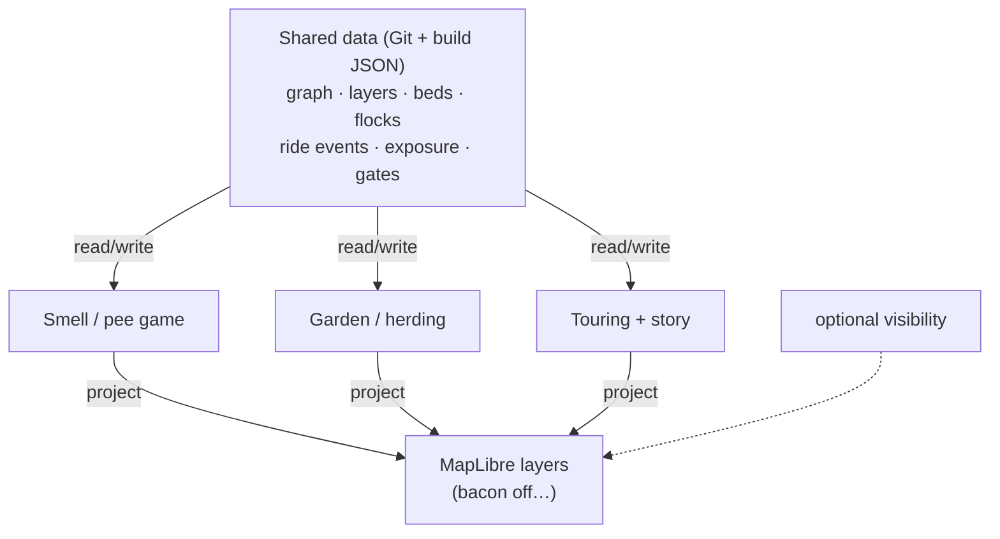

# Map game platform — sharing data between games

**This is ALL about sharing data between games.**

Layers are just the **view**. The platform is a **shared data plane** on one OSM graph —
many map-based games **read and write the same cells**, the same edges, the same Git YAML,
the same ride event log. Enable/disable layers chooses what you **see**; the world **interoperates**
through common contracts whether or not you're looking.



OSM is the floor (read-only). **Git YAML + built artifacts** are the shared database.
MapLibre is projection. The bike produces **ride facts** every game may consume.

## Platform vs product

| Monolith | Platform (this design) |
|----------|------------------------|
| siloed game state | **games share writes** on graph cells |
| duplicate gesture detection | **one event**, many sims react |
| parallel inventories | commons pools + fair pick |
| UI modes | **data interlock**; layers are skins |
| pollute OSM | foreign keys `way/id` + overlay payloads |

Ebike Safari tenants (exposure, territory, garden, polder, herding) are **consumers and producers**
of the same data — not separate apps glued in a viewer.

## Sims-style tenants: let the monsters loose

The plug-in pattern is totally inspired by **The Sims**: the house doesn't know what an
espresso machine is until you plug one in — every object arrives carrying its own behavior
and **advertises its affordances** into the shared world. Ebike Safari tenants are Sims
objects at city scale: plug into the shared data plane, declare reads/writes, advertise
to riders.

MOOLLM's adventure menagerie already runs this pattern in a room graph —
[Snorax the Wumpus](https://github.com/SimHacker/moollm/tree/main/examples/adventure-4/characters/fictional/wumpus-snorax),
[the grue](https://github.com/SimHacker/moollm/tree/main/examples/adventure-4/characters/fictional/grue), and
[Two-Toll the Cross-Platform Troll](https://github.com/SimHacker/moollm/tree/main/examples/adventure-4/characters/fictional/troll)
play **parallel games in the same space** — and their binding archetypes map one-to-one
onto the OSM graph:

| Monster | Archetype | Binds to | Loose on the Amsterdam map |
|---------|-----------|----------|----------------------------|
| **Wumpus (Snorax)** | beast | node | haunts a block or park; "I smell a wumpus!" warnings on adjacent edges, two blocks out |
| **Grue** | field | ambient condition | unlit streets, tunnels, night rides — OSM tags `lit=no`; linger in darkness three ticks... |
| **Troll (Two-Toll)** | border | edge | actual Amsterdam bridges; pay the toll (game currency, or fight per fronting mind) or ride the long way around |

You can **literally let the wumpus, the grue, the troll, and other monsters loose on the
map**: each one is a new contract file (`design/games/wumpus.contract.yml` — reads
`road_graph` + block adjacency; writes `wumpus/instances/*`; emits smell warnings), not a
forked codebase. Their canonical souls stay in moollm; a map instance is a pointer file
plus instance-local state, per the portable NPC travel contract
([PORTABLE-NPCS.md](https://github.com/SimHacker/moollm/blob/main/skills/soul-city/PORTABLE-NPCS.md)).
Customs applies: the troll's Amsterdam toll ledger is instance wealth and never travels
home to the prototype.

**How the wumpus and grue interoperate on the map:** the rider's **headlamp battery**
(or night-mode lighting state) is shared data both games read — same pattern as pee,
exposure, and territory layers. While the lamp burns, you play spatial wumpus (smell
warnings on adjacent edges). When it runs out, grue rules activate on the same graph
segment: `lit=no` OSM ways, three-tick countdown, no fork required. The wumpus did not
move; the rules changed under you. Ebike Safari tenants interlock the same way — one
shared store, many games reading it.

## Shared data contracts — the actual platform

Every game **declares what it reads and writes**. No private shadow graphs.

| Shared store | Writers | Readers | Example flow |
|--------------|---------|---------|--------------|
| **`road_graph`** (edge log) | ingest, snap | all sims | `way/482910` is the join key |
| **territory/layers/`** strength + embedding | pee, Peecon, skywrite, poo | smell nav, windmill, **grazing**, **ambient rise** |
| **`territory/ambient/`** L1+ bins | rise from L0 fade | wide nostrils, block haze, grazing fallback | sheep **writes** bite; windmill **reads** |
| **`garden/beds/`** | tend, plant, water | harvest, pigeons, story | exposure **reads** frontage → seed hint |
| **`herding/flocks/`** | sim tick, gates | collies, garden (pollinate) | manure layer **writes** fertility |
| **`polders/`** | waterschap PR | windmill, permeability | pump **mutates** layer strength |
| **`graph/permeability.yml`** | dike seal, gates | diffusion, slime, animals | one gate table, many sims |
| **`rides/{id}/events.json`** | gesture engine | story, peerboard, bingo | one ENCIRCLE → N game reactions |
| **`exposure/{id}.json`** | exposure log | garden, bingo, LLM | pellet tallies are facts |
| **`manifest.json`** | pipeline | viewer, all games | index into shared artifacts |

**Interlock = data flow**, not a feature bullet. Herding doesn't "integrate with" smell — it
**eats** `s(L,e)` from the same sparse strength file the pee game wrote.

```yaml
# design/games/herding.contract.yml  (pattern for every game)
id: game/herding
reads:
  - territory/layers/*/strength.yml
  - garden/beds/*
  - graph/permeability.yml
  - territory/gates/*
writes:
  - herding/flocks/*
  - territory/layers/manure-*   # new layers = shared store
  - garden/beds/*/pollinated
emits_events: [graze, poo, gate_cross, fair_pick]
```

New game = new contract file listing **reads, writes, events** — not a forked codebase.

## The third-party test — somebody else's app, as a contract

Every tenant listed so far is ours, which proves nothing. A platform is only a platform when a
stranger with a serious purpose can build on it without touching our code, and there is a real app to
test that against.

[**Safe Lanes**](https://www.safelanes.org/) is a San Francisco website for reporting cars blocking
bike lanes: photograph it, record the plate and category, and the report is filed with 311
automatically. In its first nine months, volunteers using it filed **9,477 reports — matching the
entire citation output of the city's transport agency** — and the peer-reviewed analysis found that
enforcement geography does not match where the problem actually is, with delivery and ridehail
vehicles prominent, pointing at **loading zones rather than tickets** as the fix. Its automated
successor [Bike Bureau](https://loudbicycle.com/bb/) reads the plate and prepares the filing in about
three seconds, in some twenty-eight cities. Numbers and citations:
[`sources/blocked-bike-lanes-record.md`](sources/blocked-bike-lanes-record.md).

A blocked lane is worse than a pothole, and it should be a **layer**, not a fork. So: what would that
layer need that we do not already have?

| It needs | We already have | Store |
|---|---|---|
| Photo evidence without stopping | Retroactive frames from the ring buffer ([`camera.md`](camera.md)) | `rides/{id}/frames/` |
| Which lane, which edge, which direction | Snap and map-match | `road_graph` |
| Proof it was blocked, not merely present | **Forced-merge dynamics** — see below | `rides/{id}/dynamics.json` |
| A confirm-then-file workflow | Worklist tiers ([`mechanical-turk-ebike.md`](mechanical-turk-ebike.md)) | `worklist/` |
| Somewhere to send it | Report sink adapters — 311 and SeeClickFix in the US, [Signalen](https://signalen.org/) in NL | `sinks/` |
| Credit that is not a surveillance score | Peerboard, no counts, no speed | `peerboard/` |
| Not doxxing the rider in the process | Home masking, publish delay ([`privacy.md`](privacy.md)) | — |
| A way to demo it without a bike | Desk mode ([`virtual-ride.md`](virtual-ride.md)) | — |

**One new primitive: the report sink.** Everything else on that list exists for other reasons. That is
what makes this a good test rather than a flattering one.

### The forced-merge signature

A blocked lane leaves a trace even when nobody photographs it: swerve out of the lane, brake, a heading
change into the traffic lane, then a return. It is the [dodge
channel](bumps-as-input.md#three-axes-not-one) again, and it means **the obstruction is measurable
without a camera and without naming anyone**.

Aggregated by hour it gives what the SF study had to infer from photograph timestamps — a weekday van
that sits in the same lane between nine and eleven is a **schedule**, not an incident. And a schedule
is the argument that changes a curb, where a photograph is only ever an argument with one driver.

### Where the boundary goes

The platform hands a layer the **frame**, not the plate. Recognising licence plates and filing against
individuals is the layer's own business, declared in its own contract, carrying its own disclosure —
and identities never enter the shared store, because a store that accumulates them becomes a
surveillance archive no matter what everyone intended. What the shared plane accepts is the
**obstruction event**: this edge, this hour, this duration, this confidence. Aggregate-safe, useful to
advocates, and no subject to wrong.

```yaml
# design/games/blocked-lanes.contract.yml   (third party — not in this repo)
id: game/blocked-lanes
author: "someone else entirely"
reads:
  - road_graph                      # which edges carry cycleway tags
  - rides/*/dynamics.json           # forced-merge candidates
  - rides/*/frames/                 # rider's own frames, local by default
writes:
  - obstructions/events/*           # edge, hour, duration, confidence — no identities
  - worklist/tasks/*                # "was this lane blocked?" as a confirmable task
emits_events: [lane_blocked, forced_merge_confirmed]
report_sinks:
  - sink/sf311                      # or sink/signalen, sink/seeclickfix
declares:
  reads_identities: false           # if true, must say so here and in the UI
  scores_captures: false            # trophies for plates are not available on our peerboard
```

The acceptance test is blunt: a stranger should be able to write that file, a sim module, and a
MapLibre projection, and have a working civic reporting app on top of our rides — without a pull
request against us. If they cannot, this is a monolith with a plugins folder.

## Ride event bus — detect once, share everywhere

```
GPS trace → snap → gestures + exposure + edge crossings
  → append ride/{id}/events.json

[
  { "t": "…", "kind": "gesture", "name": "ENCIRCLE", "target": "block/demo-7" },
  { "t": "…", "kind": "exposure", "edge": "way/482910", "left": { "cafe": 2 } },
  { "t": "…", "kind": "territory", "op": "skywrite", "edge": "way/482911", "layer": "L-0042" }
]
```

| Consumer | Reads event | Does |
|----------|-------------|------|
| Garden | `ENCIRCLE(block/demo-7)` | +1 tend credit |
| Herding | same event | fold flock to pasture |
| Story | whole log | LLM narration — no invented geometry |
| Peerboard | `territory/*` | async credit |
| Bingo | `exposure` novel-types | mark tile |

Games you **disable in the viewer** may still run on the server tick — or pause if nobody
enabled them; policy choice. **Data** stays in the shared store for others.

## Games as presets — views over shared data

Layer bundles ([`skeleton/viewer-maplibre.md`](skeleton/viewer-maplibre.md)) pick **which slices**
of the shared store to render and which prompts to offer. **`bacon` off** = hide meat **data
products** in UI — not a separate vegan universe.

```yaml
# viewer/games/cozy-farm.yml
id: game/cozy-farm
reads_store: [garden/, herding/, territory/layers/]   # data dependency
layers: [pasture_cozy, flocks, manure, semantic_graze]
sim_modules: [urban_garden, animal_herding]          # writers to shared store
```

Presets document **data dependencies**, not just eye candy.

## Interlock matrix = shared writes (examples)

| Writer game | Data mutation | Reader game |
|-------------|---------------|-------------|
| Pee / skywrite | `s(L,e) += …` | Herding grazes; smell nav sniffs |
| Herding | `s(L,e) -= bite`; spawn manure layer | Garden fertility |
| **PacBot** (Micropolis lineage) | `traffic/density -= eat` or shared `s(L,e)` | Congestion relief; score |
| Windmill | transfer strength → canal / sewage | Canal diffusion; fewer ads for sheep |
| Garden | bed spawn `{ tomato: 5 }` | Herding fair pick; TomTomagotchi craft |
| Exposure | `{ cafe: 14, home: 83 }` | Garden seed hints; bingo tiles |
| Gesture engine | `events.json` | All sims subscribed to `kind` |

**Conflicts are shared-state negotiations** — sheep stripped your ad; fix in Git (re-pee, windmill, dike).

## Cohabitation rules (data-first)

1. **One graph** — join on `way/id`, `node/id`, `block/id`
2. **Declare reads/writes** — game contract YAML; no secret tables
3. **Events are append-only facts** — story and audit consume the same log
4. **Layers = projections** — toggling visibility does not delete shared data
5. **Namespaces, not silos** — `territory/`, `garden/` — cross-read encouraged
6. **Never write OSM** — shared game data stays in Git/build artifacts

## Adding a new map game

1. **`design/games/{id}.contract.yml`** — reads, writes, events
2. Design doc — which existing stores mutated?
3. Sim module ticks shared store (others may read your writes same tick)
4. Build step → overlay GeoJSON (view of your slice of shared data)
5. Register in `viewer/layers/catalog.yml` + optional preset

Lineage tenants ([BONGO BINGO](bongo-bingo.md), iLoci, MediaGraph) = new contracts on same Amsterdam data plane.

## Viewer UX (projection only)

Layer drawer = **which shared data slices to draw**. Presets = common read bundles.
See [`skeleton/viewer-maplibre.md`](skeleton/viewer-maplibre.md).

## Tie-in

| Doc | Shared data role |
|-----|------------------|
| [`DATA-CONTRACT.md`](../DATA-CONTRACT.md) | ride manifest + geo — entry point |
| [`peerboard-and-brews.md`](peerboard-and-brews.md) | writes `territory/layers/` |
| [`animal-herding.md`](animal-herding.md) | reads/writes layers + beds |
| [`semantic-polder.md`](semantic-polder.md) | mutates strength via windmill |
| [`urban-garden-loop.md`](urban-garden-loop.md) | beds, fair pick pools |
| [`exposure-pac-man.md`](exposure-pac-man.md) | writes exposure JSON |
| [`skeleton/story-layer.md`](skeleton/story-layer.md) | reads events only |

↑ [`VISION.md`](VISION.md) · [`ARCHITECTURE.yml`](ARCHITECTURE.yml)
