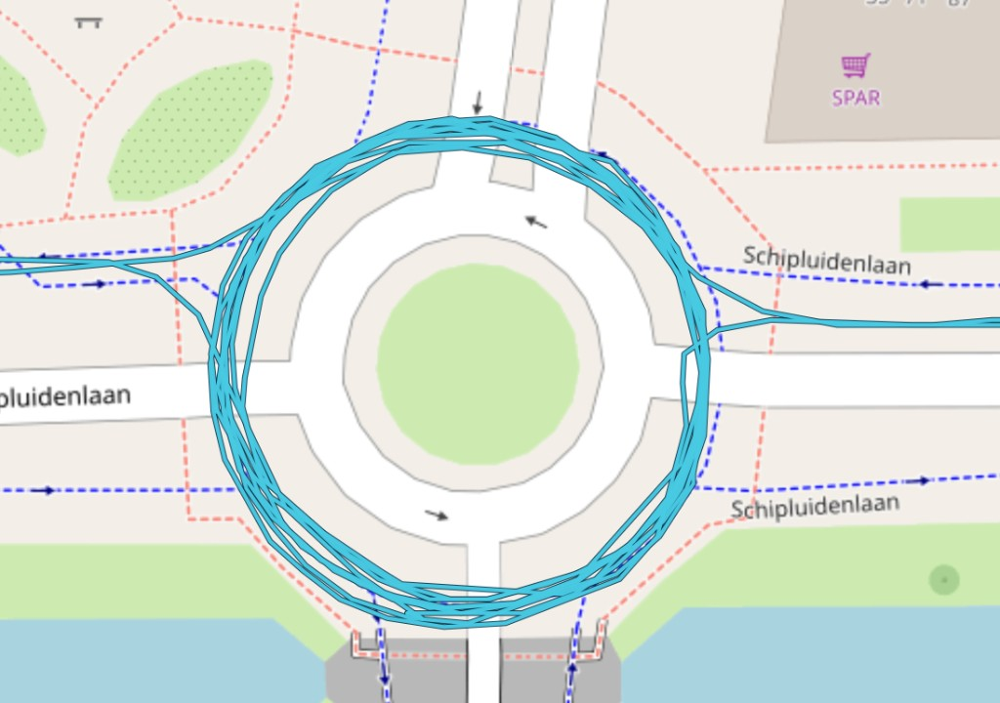
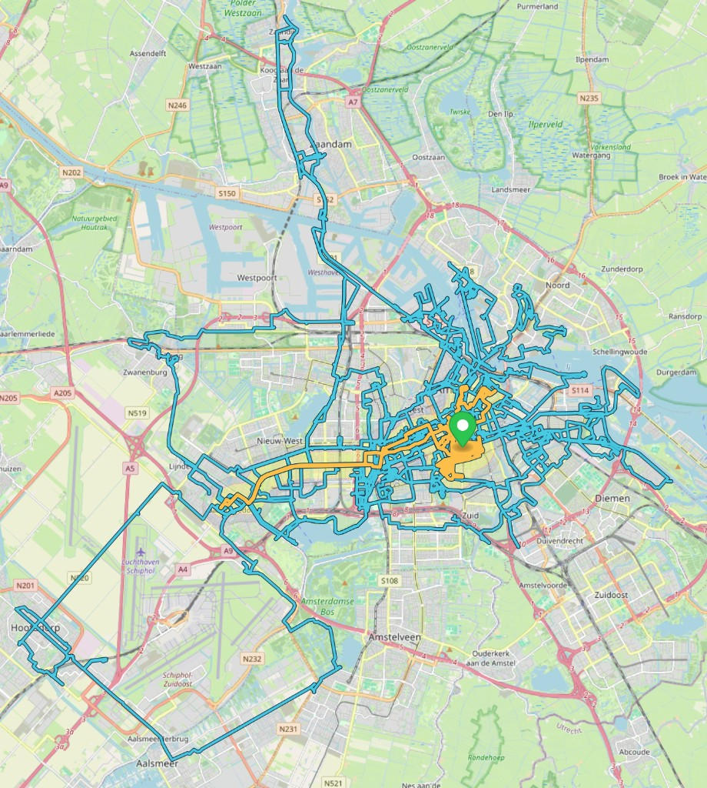
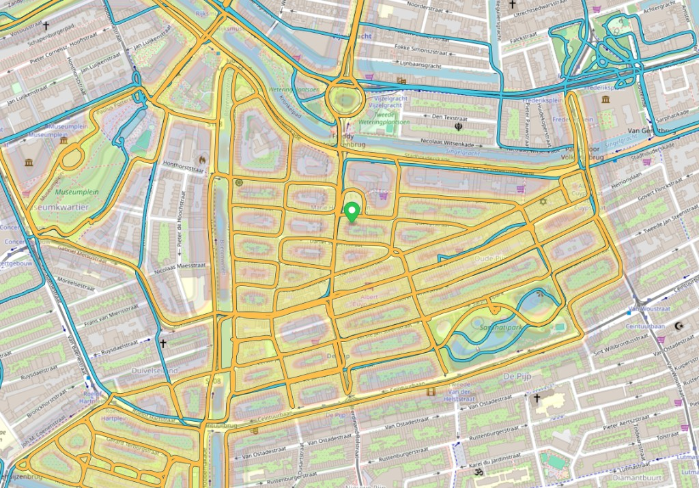

# Ride gestures — from the saddle, Sep 2026

Don's own traces. Public-safe: the gestures and the maps, not the private mail they
rode in on.

## Clockwise undo — Schipluidenlaan

Legal bike flow here is counter-clockwise (dashed blue arrows). The cyan stack is
the other way: enter from the west, six-to-eight clockwise laps, exit west.

In the game, a roundabout loop is a gesture with consequences. The wrong way is
**undo**. Late at night under a full moon it *feasts* the
[transgression](../transgression.md) meter — the game invites you out. Smile at
the dog walkers, keep going. Same laps at rush hour are still undo, just
expensive.

Roundabouts around art, flowers, trees, ponds, fountains are *objects*: encircle
to select, then commands on that POI.

## Lasso a block

Ride the perimeter → `ENCIRCLE(block)` → learn the addresses, run commands for
what's inside. Same family as the fountain loop; the object is the block.

## Coloring book — De Pijp

Ride every street of a neighborhood. The bike is the crayon. Blue is the wider
safari; orange/yellow is one district completed — Stadhouderskade / Boerenwetering /
Ceintuurbaan / Hemonylaan, Sarphatipark left as park.

That is `COMPLETE_STREET` at neighborhood scale: exposure of every frontage, not
a distance vanity score.

Live site: https://ebike-safari.com

↑ [README.md](../README.md)
