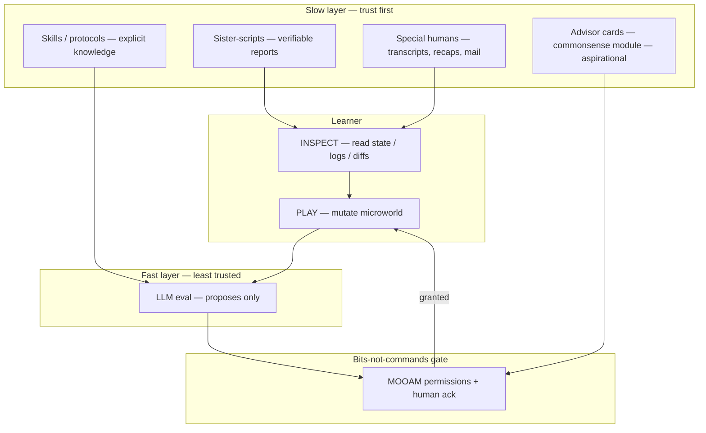

# MOOLLM, trust, and teaching programming — our question, guess, and analysis

*Guest hub:* [`README.md`](README.md) · *Kay's Quora recap:*
[`media/quora-recaps/llms-copilots-trust-and-teaching.md`](media/quora-recaps/llms-copilots-trust-and-teaching.md)

**Nature:** Don's working hypothesis + Cursor-agent analysis — **not Alan Kay's words**. Draft artifact to
show Alan, fold his reply back in, iterate. Governed by
[`portrayal-standards.md`](../../schemas/portrayal-standards.md).

**Status:** draft · `consent: not_yet_asked` · for Repo Show invite + live segment

**Related:** [`lenat-cyc-knowledge-and-slow-thinking.md`](media/quora-recaps/lenat-cyc-knowledge-and-slow-thinking.md)
(white space · gutter · two computers) ·
[`carnegie-libraries-and-literacy-vision.md`](media/quora-recaps/carnegie-libraries-and-literacy-vision.md) ·
[`microworlds-sure-and-ten-things-heuristic.md`](media/quora-recaps/microworlds-sure-and-ten-things-heuristic.md) ·
[MOOLLM](https://github.com/SimHacker/moollm) ·
[`../david-rosenthal/slots-all-the-way-down.md`](../david-rosenthal/slots-all-the-way-down.md) (review protocol)

---

## Alan's position (recap)

From Kay's public **Quora** answers (see recap for quotes and sources):

1. **Trust tightens as systems scale** — from multiprogramming to NCANIPs (Harari) hacking language.
2. **LLM copilots for teaching programming today:** *"I don't think it would be a good idea at all."*
3. **Learning** = processes and relationships created **between the learner's ears** — not downloaded prose.
4. **Help** = proximity to a **"special human"** who forces epistemological rethinking; trust as consistently
   interesting, not always right.
5. **What could work:** Internet model (**bits, not commands** — local software decides); **expert systems**
   good enough to be criticized.
6. **LLMs today:** not to be trusted; correlation = superstition; one LLM explaining another = **"piling BS on
   BS"**; need **cognitive knowledge-based grounding** (737 Max, Facebook-scale dependency blindness).

---

## The question we asked ourselves

After reading Alan's answer and building **MOOLLM**:

> How could MOOLLM address Kay's trust critique? Is it anything like what he means by an expert teaching
> system — and if not, how could it be?

That became the **lead question for Alan** (below). This document is our guess at an answer *before* he
corrects us.

---

## Our guess — short answer

**Half yes.** [MOOLLM](https://github.com/SimHacker/moollm) is the **right genus** — a **microworld OS** for
constructionist learning (Logo · Etoys · LambdaMOO · Smalltalk lineage), **not** a programming copilot in the
GitHub Copilot sense.

**Half no.** By Kay's bar it is **not yet trustworthy** for teaching programming: the LLM is still `eval()`,
commonsense grounding is aspirational not proven, and default "helpful assistant" mode is exactly what he rejects.

**Path forward (draft):** make the LLM **the least trusted component in the loop** — inspectable state,
verifiable tool receipts, explicit slow-knowledge modules, human pioneer sources, learning measured by **repo
diffs** not chat fluency.

---

## Copilot vs MOOLLM — two different animals

| | **Copilot (Kay rejects)** | **MOOLLM (our bet)** |
|---|---------------------------|----------------------|
| Primary output | Generated code / explanation | **Mutable microworld state** (files, rooms, skills) |
| Learning signal | "Did the answer compile?" | "Did the learner **change** something inspectable?" |
| Trust model | Fluent language ≈ authority | **Provenance** — cite file, tool report, human transcript |
| Knowledge | Weights (opaque) | **Skills** (YAML/Markdown protocols, forkable) |
| Action model | Remote command execution | **Bits not commands** — propose → local grant → act |
| Teacher role | Synthetic sage | **Docent** + special humans in-repo |
| Failure mode | Hallucination hidden in chat | Failure **in public** — wrong file, failed test, visible diff |

Kay's critique targets the left column. MOOLLM *claims* to be the right column. The open question is whether
the right column is **real** or **marketing** when the engine underneath is still correlation soup.

---

## Where MOOLLM rhymes with Kay (detailed)

### 1. Microworld / constructionism — "between the ears"

Papert: learn by building inspectable things. MOOLLM maps:

| Logo / Etoys | MOOLLM |
|--------------|--------|
| Turtle | Agent / character |
| Canvas | Room floor |
| Procedures | Skills |
| Variables | YAML state |
| Drawing | File creation |

Constructionism skill ([source](https://github.com/SimHacker/moollm/blob/main/skills/constructionism/SKILL.md)):
*"If you can build it, you can understand it. If you can inspect it, you can trust it."*

**PLAY → LEARN → LIFT:** explore manually, notice patterns, publish a skill. Understanding is not "the model
explained it well" — it is "I edited `ROOM.yml` and the world changed."

**Cheating is learning:** open `character.yml`, add `magic_sword` to inventory — you learned YAML and file
structure. Same spirit as Logo Adventure's `PRINT :ITEMS`.

### 2. Expert system good enough to be criticized

Kay on Cyc: artifacts must be **"good enough to be criticized."** MOOLLM skills are explicit protocols —
CARD → SKILL → README pyramid, semantic YAML, K-line activation. Not hidden weights; **published programs** the
LLM interprets.

This is weaker than Cyc (no millions of hand-curated relations) but stronger than raw chat: you can grep a
skill, fork it, argue with it in a PR.

### 3. Internet: bits, not commands

Kay praises sending **bits**; local software **interprets and decides**.

MOOAM ([design](https://github.com/SimHacker/moollm/blob/main/designs/MOOAM.md)) maps IAM to LLM worlds:
characters as principals, tools/files/terminal as resources, **permissions** as grants, **least privilege**.
Skill-snitch compares declared vs observed tool use.

Intent: LLM **proposes**; orchestrator + human **decide**. Tool calls carry required **why** (kernel protocol).

### 4. Anti–"piling BS on BS"

- **Cauldron / sister-scripts:** mechanical verifiable work → Python tools; LLM reads reports, does not pretend
  to be the test runner.
- **Ambient epistemic skills:** claim ledger (CONFIRM / DISPUTE / ASK), pushback on yes-man behavior, robust-first
  degrade-don't-crash.
- **Two-tier teaching:** hypothesis in chat → **must cite** sister-script output / diff / primary source before
  it counts as "taught."

### 5. "Special human" + verifiable sources

Repo Show + WillWrightShowForFood: pioneer voices, Quora recaps, mail with portrayal standards. NCANIPs hack
language — Kay's implied antidote may be **kids-reading real transcripts** (human voices, checkable sources),
not LLM summaries. MOOLLM as **docent** over a library of special humans, not replacement.

### 6. Eval Incarnate — LLM as interpreter, not oracle

*"Skills are programs. The LLM is `eval()`. Empathy is the interface."*
([Eval Incarnate Framework](https://github.com/SimHacker/moollm/blob/main/designs/eval/EVAL-INCARNATE-FRAMEWORK.md))

Lineage explicitly claimed: Sutherland → Engelbart → Kay → Minsky → Papert → Curtis → Wright. MOOLLM is **not**
"AI tutor"; it is a **microworld OS** where natural language is the UI to runnable structure.

---

## Where Kay would still push back (our guess)

### LLM still at the center

Kay: today's systems **"not to be trusted at all."** MOOLLM does not remove the LLM; it wraps it. Wrapping is
not grounding.

### Correlation dressed as understanding

Constructionism skill claims "LLMs complete Drescher" — semantic YAML + inference. Kay would read that as
**superstition** unless the symbolic skeleton is **independently checkable** without the model's narration.

### Missing slow thinking

Lenat recap: Type-1 fast correlation vs Type-2 deep slow thinking. MOOLLM has filesystem grounding, not
Cyc-class **commonsense canoe**. Advisor cards (Micropolis, future Cyc-shaped YAML) are sketched, not shipped.

### Active knowledge of the world code touches

737 Max, Facebook dependency graphs — code that doesn't know it's on the Internet. Kay wants **expert system
about systems** for dependencies. MOOLLM has cauldron for human-scale repos; not proven at civilization scale.

### The copilot trap

MOOLLM in default Cursor mode — autocomplete, answer vending, homework completion — **is** what Kay rejects.
Architecture on paper ≠ classroom practice.

---

## Architecture sketch — trustworthy teaching loop (draft)

**Rule (draft):** nothing counts as "learned" until **INSPECT** shows a learner-owned change with **provenance**
— not until the LLM sounded confident.

---

## How it *could* address Kay's frame — roadmap

| # | Move | Kay thread |
|---|------|------------|
| 1 | **Learner mutates state** — edit YAML, run Micropolis, break sim, read session log | Between the ears |
| 2 | **Provenance chain** — teaching claims cite file, tool output, or human transcript | Trust / anti-NCANIP |
| 3 | **Two-tier explanation** — chat hypothesis → mandatory tool report / diff | Anti BS-on-BS |
| 4 | **Slow-thinking module** — Cyc-shaped advisor subgraph before safety-critical paths | Lenat / active knowledge |
| 5 | **Skeptical tutor** — ambient pushback; measure learning by diffs | Special human proxy |
| 6 | **MOOAM hardening** — destructive ops need grant + ack; snitch declared vs observed | Bits not commands |
| 7 | **Kids-reading segment** — oral performance of primary source vs LLM summary on air | Literacy / Carnegie |
| 8 | **10 things / 20 examples** — Alan's microworld heuristic; HAR 2009 talk as draft Micropolis pass | [`microworlds-sure-and-ten-things-heuristic.md`](media/quora-recaps/microworlds-sure-and-ten-things-heuristic.md#repo-show-connection--har-2009-micropolis-lightning-talk-dons-guess) |

---

## Show segments (live fodder)

1. **Side-by-side:** LLM explains RCI demand in Micropolis vs learner opens explorable overlay and **changes**
   a rule — which produced understanding?
2. **Kids-reading:** performer reads a paragraph from Alan's Quora recap; audience checks claim; contrast with
   LLM paraphrase of same paragraph.
3. **BS-on-BS demo:** LLM explains LLM output with no tool chain — then rerun with sister-script receipt
   required; show the difference.
4. **MOOAM live:** skill declares `files: read` only; agent tries `terminal_run`; snitch flags mismatch.
5. **Alan corrects this doc** — post-order review on air; fold his edits into the repo before the segment ends.

Co-guests: **Douglas Lenat** (memorial) / **Ken Kahn** (Cyc comment Kay copied) · **Walter Bender** · **Brian
Harvey / Jens Mönig** (Snap! microworld) · **Dan Ingalls** (Etoys live) · **David Ungar** (Self / mirrors).

---

## Question to pose to Alan

### Lead question (MOOLLM)

> We built **MOOLLM** as a microworld OS — directories as rooms, skills as inspectable programs, the LLM as
> `eval()`, constructionism not copilot autocomplete. Reading your answer on copilots and teaching
> programming: is that **anything like** what you mean by an expert system that creates understanding
> "between the ears"? If not, what would we have to add or **forbid** to get there — and would a Cyc-class
> commonsense layer be enough, or is the "special human" irreplaceable?

### Further questions

- Could **ML + Cyc-style symbolic** ever be trustworthy for learners — or is oral performance of primary
  sources the non-negotiable layer?
- Is **MOOAM** (declared permissions, propose-not-command) anywhere near your Internet model — or still
  "send a program" done wrong?
- What would you **forbid** MOOLLM from doing in a classroom microworld?
- **Lenat's white space** vs training on all the words — did MOOLLM automate the wrong part of the encyclopedia
  (skills as words) while missing the white space (commonsense between skills)? Don's rhyme: same move as
  **McCloud's gutter** (closure between frames) and **Will's two computers** (sparse sim → player's
  commonsense-saturated brain). See
  [`lenat-cyc-knowledge-and-slow-thinking.md`](media/quora-recaps/lenat-cyc-knowledge-and-slow-thinking.md#repo-show-connection--white-space-gutter-two-computers-dons-guess).
- Should semi-AI's first funded job be **free learn-to-read** (Carnegie) — not coding copilots?
- What are **MOOLLM's 10 things and 20 examples** for microworlds?
- Is **`eval()` on natural language** late-bound enough — or early-bound paths with skill dressing?
- **Teitelman's DWIM** — should skills "Do What I Mean" or stay explicit for learners?

*Review protocol:* show Alan this doc + Quora recap; fold reply back in same order;
[`../david-rosenthal/slots-all-the-way-down.md`](../david-rosenthal/slots-all-the-way-down.md).

---

## Agent analysis (Cursor session, 2026-07-06)

Independent read of MOOLLM repo + Kay recap — folded into this artifact, not attributed to Alan or Don as
 settled fact:

1. **Genre match is real.** MOOLLM's README and constructionism skill explicitly reject "prompt a service" in
   favor of "inhabit a world." That is Etoys-shaped, not Copilot-shaped.
2. **Trust mechanisms are partial.** MOOAM and skill-snitch are **advisory** in places (design doc says so).
   Kay's trust bar is **deterministic** where safety matters. Gap remains.
3. **The honest pitch to Alan** is not "we solved it" but "we built a glass box where you can watch us fail
   loudly." That matches Repo Show ethos.
4. **Cyc thread is the obvious next layer** — already in Kay's Lenat recap and open questions here. MOOLLM
   without commonsense canoe is Kay's "really dangerous without serious grounding."
5. **Carnegie + kids-reading** may be more central than coding — hook #18 in `ideas.md`. Teaching programming
   with LLMs may be the wrong entry point; teaching **trust and literacy** in a microworld may be the right one.

---

## Changelog

| Date | Change |
|------|--------|
| 2026-07-06 | Initial draft — Quora recap summary, MOOLLM analysis, lead question, show segments |

*Alan Kay may edit, correct, or request removal of this portrayal at any time.*
