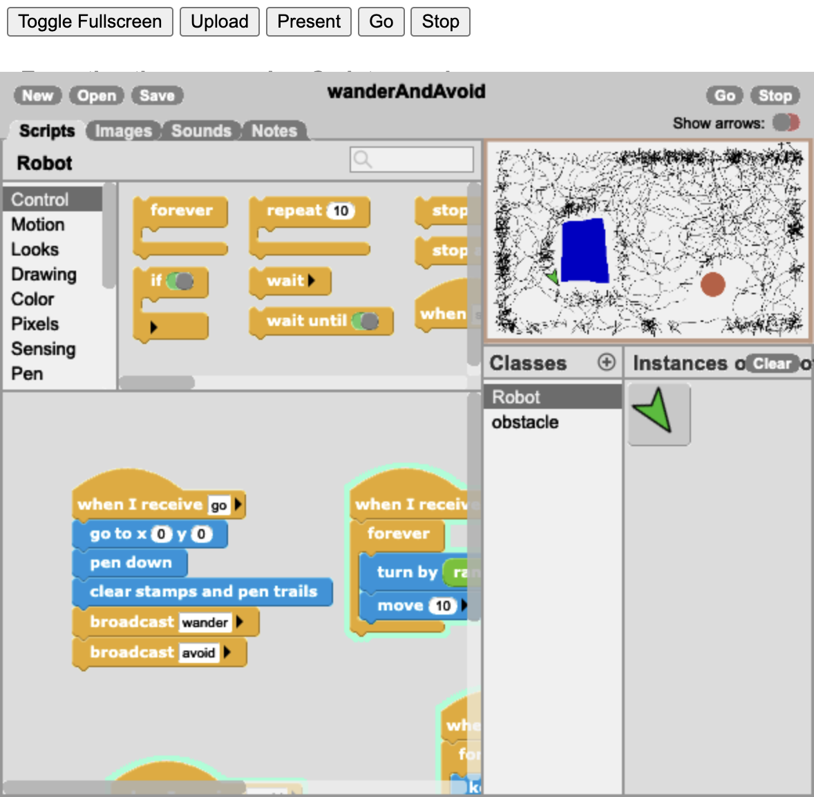
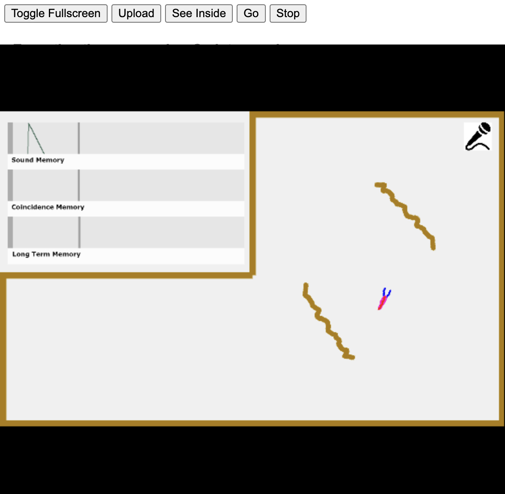

# Grey Walter, the Minsky essay, and the active essay that still runs

**Occasion:** Alan Kay's comment in a Quora thread, 19 September 2026, replying to Don in the
thread under Alan's own AGI answer. Verbatim, because the parenthesis is the whole reason this
folder exists:

> You might also be interested in how children could program from scratch the "7 steps from chance
> to meaning" of Grey Walter (the original turtle guy in the late 40s). This was a scheme that was
> later called "Hebbian Learning". I used it as the basis of an essay about Marvin Minsky for a
> chapter in Cynthia Solomon's book (**I should put this paper online …**). And we did an online
> "active essay" version in a programming language called "CP" (by John Maloney and Jens Mönig, and
> with the assistance of Yoshiki Ohshima).

**He does not need to put it online. Both halves are already there and he does not have the links.**
That is the exact failure this archive exists to fix, so this folder is the delivery.

The reply Don sends is drafted in
[`DonHopkins/characters/don-hopkins/notes/quora/comment-to-alan-kay-grey-walter-active-essay.md`](https://github.com/SimHacker/DonHopkins/blob/main/characters/don-hopkins/notes/quora/comment-to-alan-kay-grey-walter-active-essay.md).

## The two artifacts

| | What | Where | Status |
|---|---|---|---|
| **Print** | Kay, "Afterword to Essay 1" — the Minsky essay, in *Inventive Minds: Marvin Minsky on Education*, eds. Cynthia Solomon and Xiao Xiao, MIT Press 2019 | <https://doi.org/10.7551/mitpress/11558.003.0007> | Open access, free PDF, no paywall. **Not cached here — see below** |
| **Live** | "Marvin Minsky And The Ultimate TinkerToy" — active essay, web adaptation by Yoshiki Ohshima and John Maloney, English and Japanese, written in **GP** | <https://tinlizzie.org/tinkertoy/> | **Runs in a 2026 browser.** Verified 19 Sep 2026 |

Minsky's underlying essay is "The Infinite Construction Kit," originally in *LogoWorks: Challenging
Programs in Logo* (1986). Alan's chapter is the afterword to it.

**"CP" is GP.** General Purpose Blocks, by John Maloney, Jens Mönig and Yoshiki Ohshima, built in
Alan's group at SAP's Communications Design Group, then HARC/YCR. The essay itself names it: *"a
descendent of Logo — called GP for 'General Purpose'."* A typo in a comment, not worth correcting to
his face.

## It still runs, and here is the evidence

The sourcing table below claims the active essay works in a 2026 browser. **These are the
screenshots that claim rests on**, taken 19 September 2026 — filed here rather than only linked,
because a verification claim whose evidence lives somewhere else is a promise rather than a record.


*The GP VM boots and the wander-and-avoid project runs, drawing its trace. Grey Walter's tortoise,
in a browser, seventy-seven years after Elmer and Elsie — and the trace is the same artifact as his
candle photographs.*



*"See Inside" still opens the whole editor: palette, class list, scripts. The essay's argument is
that dynamic media beat inert media, and this button is the argument — the reader can take the lid
off and edit the thing they were just reading about.*



*CORA: Sound Memory, Coincidence Memory, Long Term Memory — three basins draining at three
different rates, sawtooth decaying in the window while you watch. Three copies of one part differing
only in rate of forgetting, and a conditioned reflex falls out of the arrangement.*

`duplication: declared. Canonical home is`
[`moollm designs/snap/gp-active-essay-tinkertoy/images/`](https://github.com/SimHacker/moollm/tree/main/designs/snap/gp-active-essay-tinkertoy)
`, which holds the long-form run record. These are copies kept in the archive folder on purpose —
per` [`dry-piles`](https://github.com/SimHacker/moollm/blob/main/designs/korz/dry-piles.md)`,
duplication is legal when declared and recomputable, and re-copying from the canonical path is the
recompute. Edit the originals, never these.`

## What is cached here

```
pdf/holland-2003-first-biologically-inspired-robots.pdf         7.9 MB, cached
pdf/kay-2019-ultimate-tinkertoy-afterword-unexcised.pdf        17.6 MB, 22 pp — FROM ALAN, review pending
images/2026-run-wander-and-avoid.png                            copy, declared above
images/2026-run-see-inside.png                                  copy, declared above
images/2026-run-conditioned-reflex-memories.png                 copy, declared above
```

Holland, "The first biologically inspired robots," *Robotica* 21(4), 2003 — the scholarly account of
Elmer and Elsie built from the Burden Neurological Institute archive. This is the single best source
on what Walter actually built and what it actually did, and it is the origin of every Walter fact
in this folder.

### Alan sent the afterword, and he sent the uncut one

**The document this folder could not obtain arrived from its author.** Alan sent Don the afterword
directly, in an **unexcised** version — the text before the cuts that produced the published chapter.

`consent: Don is asking Alan for permission and for a review of this folder and his character`
`directory as one batch — see` [`characters/alan-kay/permission-and-review.md`](../../permission-and-review.md)`.`
`Cached here on Don's judgement, pending that review, and Alan can approve it or ask for removal at`
`any time. If he asks, it goes — no discussion, no negotiation.`

**Two different documents, and only one of them needed asking.** Worth keeping straight:

| | What | Status |
|---|---|---|
| **Published** | "Afterword to Essay 1," *Inventive Minds*, MIT Press 2019 | **Open access** under the volume's OA licence. Caching it was never a permission question |
| **Unexcised** | The same afterword before editorial cuts | **Unpublished manuscript.** Not covered by the OA licence, so this one is Alan's call and nothing else |

**How the retrieval actually went, so nobody repeats the dead ends.** Every scriptable route to the
published chapter failed:

| Route | Result |
|---|---|
| `curl` to the DOI / chapter page | **403** |
| `curl` with a desktop browser user-agent | **403** — Cloudflare bot fingerprinting, not a paywall |
| OAPEN full-text search | Not held |
| OAPEN by ISBN 9780262350273 | Not held |
| DOAB | **Record exists** (handle `20.500.12854/78558`, book DOI `10.7551/mitpress/11558.001.0001`) but DOAB is a directory, not a host — it points back to MIT Press |
| **Asking the author** | **Worked, and returned a better document than the one being chased** |

`todo: the PUBLISHED chapter is still uncached — open the DOI in a browser and save it to pdf/ as`
`kay-2019-afterword-to-essay-1.pdf. Both versions are worth holding, because the diff between them is`
`its own artifact: it shows what an editor took out of an essay about learning machines.`

**The joke this folder was built on has now closed on itself.** The premise was *"he does not need to
put this online — both halves are already there and he does not have the links."* His reply was to
supply the one piece that resisted archiving, in a fuller form than the archive was trying to reach.
The open-access half is still the half that fought hardest, and the research-language half on
`tinlizzie.org` downloads without complaint.

## Why the live half is the half at risk

The print afterword has a DOI, a publisher, and will be findable in thirty years. The active essay
is the better artifact and it exists because somebody keeps `tinlizzie.org` up — running a research
language whose lab was dissolved in 2016.

**An essay arguing that dynamic media beat inert media, in which the inert half is the half that
got permanence.** The standing offer in Don's reply is to mirror it: pages, images, the four `.gpp`
projects, the VM, the Japanese version, with provenance and credit to Ohshima and Maloney attached.
Not done, and not to be claimed as done until Alan says yes.

## Grey Walter, for the deep dive

- **The tortoises.** Elmer and Elsie, 1948, at the Burden Neurological Institute in Bristol; later
  cannibalised into six more built with his technician "Bunny" Warren for the 1951 Festival of
  Britain. Number 6, Olga, was his personal one, rediscovered in 1995, now in the Science Museum,
  London.
- **He named them after a teacher**, which is the detail worth having in a thread about children.
  Walter's own account of *Machina speculatrix* opens with the Mock Turtle from *Alice's Adventures
  in Wonderland*: *"We called him Tortoise because he taught us"* — tortoise and taught-us being
  homophones. The original turtle guy chose a pun about teaching, two decades before Papert's
  turtle started teaching children.
- **The candle photographs.** Walter mounted lit candles on the tortoises' backs and photographed
  them in the dark on long exposures, so each robot's path drew itself as a streak of light. Taken
  at his house, late 1949 or early 1950. Two machines in one frame with Elsie crossing Elmer's
  track; headlamp trace and candle trace distinguishable as separate channels; and the photocell had
  to be **shielded from its own candle** or the machine would chase the mark it just made. Those
  photographs are what let Holland establish, decades later, that the behaviour in the published
  papers was real rather than idealised in prose — **the rendered trail was the verification
  record.** Worked out as a design constraint in
  [moollm READ-UNREAD.md](https://github.com/SimHacker/moollm/blob/main/designs/webtop/READ-UNREAD.md).
- **CORA**, the Conditioned Reflex Analogue, added to *Machina docilis*: three memories draining at
  three different rates, built from a few valves, educated with a police whistle and a kick. Three
  copies of one part differing only in rate of forgetting, and a conditioned reflex falls out of the
  arrangement. "Architecture dominates materials," demonstrated at the scale of three toilet tanks.
- **The seven steps.** "The Seven Steps from Chance to Meaning" is chapter 7 of *The Living Brain*
  (1953); the CORA circuit is in Appendix C. Also Walter's two Scientific American papers: "An
  Imitation of Life" (May 1950) and "A Machine That Learns" (August 1951).
- **On "later called Hebbian Learning."** Hebb's *The Organization of Behavior* is 1949 and CORA is
  1950–53, so Hebb is not later than Walter. The intended reading is that the *name* spread later.
  Logged here so the recap does not repeat it as chronology; not worth a word in public.

## The Braitenberg connection, which closes a thirty-year loop

**Will Wright cited this same lineage to Don in 1996.** In Terry Winograd's course on 26 April 1996,
asked how the Sims' people would work, Wright said: *"All we have to do is deal with them at a very
local kind of a state machine, Braitenberg Machine kind of level, and say that they're angry, and
they're hungry, and they're sleepy."*

Braitenberg's vehicles are Walter's tortoises continued — Arbib calls *Vehicles* (1984) "very much
in the spirit of *M. speculatrix* and its elaboration." So Alan's pointer and Will's pointer are
the same machine, thirty years apart, and all three men met the same effect from different sides:
Walter captioned two photocell robots *"the formation of a co-operative and a competitive
society"*; Braitenberg warned in his preface that "we will be tempted to use psychological
language… and yet there is nothing in these vehicles that we have not put in ourselves. This will
be an interesting educational game"; Wright shipped it deliberately and invented Simlish so the
projection could not be interrupted.

Full table, sourcing, and the argument:
[moollm designs/sims/sims-will-wright-microworlds-1996.md](https://github.com/SimHacker/moollm/blob/main/designs/sims/sims-will-wright-microworlds-1996.md)

## Sourcing

| Claim | Source | Status |
|---|---|---|
| Afterword open access, DOI 10.7551/mitpress/11558.003.0007 | MIT Press *Inventive Minds* OA volume, chapter 194044 | `verified: DOI resolves; 403 to curl, 200 in browser` |
| An unexcised version of the afterword exists, 22 pp | `pdf/kay-2019-ultimate-tinkertoy-afterword-unexcised.pdf` — sent to Don by Alan Kay, Sep 2026 | `held: provided by the author. Review and permission requested as one batch; removable on his word` |
| Active essay at tinlizzie.org/tinkertoy/, adaptation by Ohshima and Maloney | The page's own byline | `verified` |
| Active essay runs in 2026: VM boots, 4 projects load, See Inside opens, three memories decay | Run and screenshotted 19 Sep 2026 | `verified` |
| Walter named the tortoises after the Alice pun; his own text opens with it | Holland 2003, quoting Walter's manuscript; Guardian, "What the tortoise taught us," 7 Dec 2000 | `verified` |
| Candle-on-tortoise time exposures, late 1949/early 1950, photocell shield visible | Holland 2003, from the BNI archive | `verified` |
| Walter's "co-operative and competitive society" caption, and Holland calling it misleading | Holland 2003, on 'The Accomplishments of an Artefact' | `verified` |
| *Vehicles* "very much in the spirit of *M. speculatrix*" | Arbib, Phil. Trans. R. Soc. A 361 (2003) | `verified` |
| Braitenberg preface: "nothing in these vehicles that we have not put in ourselves" | *Vehicles*, MIT Press 1984, preface | `verified` |
| Wright's Braitenberg line | 1996-04-26 Winograd lecture transcript, [1:17:29] | `verified: term recovered by asking Wright directly` |
| Olga (#6) rediscovered 1995, Science Museum London; Festival of Britain six | davidbuckley.net History Makers | `verified` |
