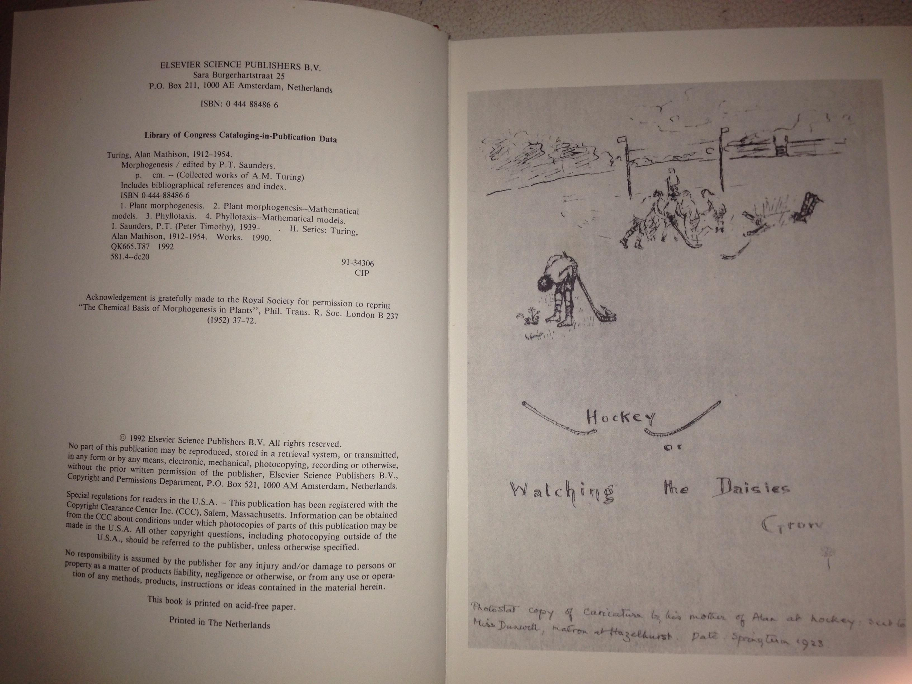

# Collected Works of A.M. Turing, Volume 3: Morphogenesis -- prefatory texts

**Typed in by Don Hopkins** from his copy of *Morphogenesis*, edited by P.T. Saunders
(Collected Works of A.M. Turing, Volume 3, Elsevier/North-Holland, 1992, ISBN 0 444 88486 6).
Plain-text original: [donhopkins.com/home/archive/Turing/Morphogenesis.txt](https://donhopkins.com/home/archive/Turing/Morphogenesis.txt).
Shared on HN: [15670523](https://news.ycombinator.com/item?id=15670523) (2017),
[18765355](https://news.ycombinator.com/item?id=18765355) (2018, *Alan Turing and the
mathematics of pattern formation*),
[30628227](https://news.ycombinator.com/item?id=30628227) (2022, *The deification of Alan
Turing*).

Bibliographic note from the volume: Turing, Alan Mathison, 1912-1954. Morphogenesis / edited
by P. T. Saunders. (Collected works of A. M. Turing, Volume 3). (C) 1992 Elsevier Science
Publishers B. V. All Rights Reserved. This file is a formatted transcription of the prefatory
matter Don typed in; the papers themselves are not reproduced here.

Inside the front cover is a drawing by Turing's mother of her son on the school hockey field
in the Springtime of 1923, captioned *Hockey or Watching the Daisies Grow* -- Don's scan is at
[../media/hockey-or-watching-the-daisies-grow.jpg](../media/hockey-or-watching-the-daisies-grow.jpg).

This is the book where Turing models cell growth as reaction-diffusion systems -- what we now
call Turing patterns -- and where the editor's introduction records that Turing told Robin
Gandy his new ideas were "intended to defeat the argument from design."

Transcription below is verbatim, including the original's spellings.

---

## Preface

It is not in dispute that A.M. Turing was one of the leading figures in twentieth-century
science. The fact would have been known to the general public sooner but for the Official
Secrets Act, which prevented discussion of his wartime work. At all events it is now widely
known that he was, to the extent that any single person can claim to have been so, the
inventor of the "computer". Indeed, with the aid of Andrew Hodges's excellent biography,
A.M. Turing: the Enigma, even non-mathematicians like myself have some idea of how his idea
of a "universal machine" arose - as a sort of byproduct of a paper answering Hilbert's
"Entscheidungsproblem". However, his work in pure mathematics and mathematical logic extended
considerably further; and the work of his last years, on morphogenesis in plants, is, so one
understands, also of the greatest originality and of permanent importance.

I was a friend of his and found him an extraordinarily attractive companion, and I was
bitterly distressed, as all his friends were, by his tragic death - also angry at the
judicial system which helped to lead to it. However, this is not the place for me to write
about him personally.

I am, though, also his legal executor, and in fulfillment of my duty I have organized the
present edition of his works, which is intended to include all his mature scientific writing,
including a substantial quantity of unpublished material. The edition will comprise four
volumes, i.e.: "Pure Mathematics," edited by Professor J.L. Britton; "Mathematical Logic",
edited by Professor R.O. Gandy and Professor C.E.M. Yates; "Mechanical Intelligence", edited
by Professor D.C. Ince; and "Morphogenesis", edited by Professor P.T. Saunders.

My warmest thanks are due to the editors of the volumes, to the modern archivist at King's
College, Cambridge, to Dr. Arjen Sevenster and Mr. Jan Kastelein at Elsevier (North-Holland),
and to Dr. Einar H. Fredriksson, who did a great deal to make this edition possible.

P.N. Furbank

## Alan Mathison Turing - Chronology

- **1912** Born 23 June in London, son of Julius Mathison Turing of the Indian Civil Service
  and Ethel Sara nee Stoney
- **1926** Enters Sherborne School.
- **1931** Enters King's College, Cambridge as mathematical scholar
- **1934** Graduates with distinction
- **1935** Is elected Fellow of King's College for dissertation on the Central Limit Theorem
  of Probability
- **1936** Goes to Princeton University where he works with Alonzo Church
- **1937** (January) His article "On Computable Numbers, with an Application to the
  Entscheidungsproblem" is published in "Proceedings of the London Mathematical Society".
  Wins Procter Fellowship at Princeton
- **1938** Back in U.K. attends course at the Government Code and Cypher School (G.C. & C.S.)
- **1939** Delivers undergraduate lecture-course in Cambridge and attends Wittgenstein's
  class on Foundations of Mathematics. 4 September reports to G.C. & C.S. at Bletchley Park,
  in Buckinghamshire, where he heads work on German naval "Enigma" encoding machine
- **1942** Moves out of naval Enigma to become chief research consultant to C.G. & C.S.
  In November sails to USA to establish liaison with American code-breakers
- **1943** January-March at Bell Laboratories in New York, working on speech-encypherment
- **1944** Seconded to the Special Communications Unit at Hanslope Park in north
  Buckinghamshire, where he works on his own speech-encypherment project "Delilah"
- **1945** With end of war is determined to design a prototype "universal machine" or
  "computer". In June is offered a post with National Physical Laboratory at Teddington and
  begins work on ACE computer
- **1947** Severs relations with ACE project and returns to Cambridge
- **1948** Moves to Manchester University to work on prototype computer
- **1950** Published "Computing Machinery and Intelligence" in "Mind"
- **1951** Is elected FRS. Has become interested in problem of morphogenesis
- **1952** His article "The Chemical Basis of Morphogenesis" is published in "Philosophical
  Transactions of the Royal Society"
- **1954** Dies by his own hand in Wimslow (Cheshire) (7 June)

## Preface to This Volume

It may seem surprising that this collection of Alan Turing's work includes a whole volume
devoted to biology, a subject in which he published only one paper. Biology was, however, far
more important to Turing than is generally recognized. He has been interested in the subject
right from his school days, and he has read, and been much impressed by, the book that has
had such a strong influence on many theoretical biologists over the years, D'Arcy Thompson's
(1917) classic "On Growth and Form". He was also, like so many who work in biology, attracted
by the sheer beauty of organisms. He wrote his (1952) paper not as a mathematical exercise,
but because he saw the origin of biological form as one of the fundamental problems in
science. And at the time of his death he was still working in biology, applying the theory he
had derived to particular examples.

I found reading the archive material a fascinating experience. For while at first glance
Turing's work on biology appears quite different from his other writings, it actually
exhibits the features typical of all his work: his ability to identify a crucial problem in a
field, his comparative lack of interest in what others were doing, his selection of an
appropriate mathematical approach, and the great skill and evident ease with which he handled
a wide range of mathematical techniques.

The biological work thus complements and completes the picture of Turing that the other
volumes reveal: it shows the same style applied to a different problem. On the other hand,
the nature of the material means that this volume differs from the others in two significant
ways. Most of what the other three contain has appeared before; for the most part there
seemed no reason to disagree with Turing's own judgment about what was worth publishing. The
biological manuscripts, however, remained unpublished not by his choice but on account of his
sudden death. I have therefore included a large amount of previously unpublished material.
Much of it is from manuscripts prepared by N. Hoskin and B. Richards from a manuscript by
Turing and from notes of his lectures, but some is by Turing himself. There is also a paper
prepared by Richards from the work he did for his MSc. Thesis under Turing's supervision but
also not published. I have, however, omitted a number of fragments.

The manuscripts were never edited into a form ready for publication and so I have had to
undertake this task myself. I have made some obvious minor corrections and filled in a few
gaps where it was clear what was missing, but there are no significant alterations. My aim
has been to produce nearly as possible the papers that would have appeared had Turing lived.
To avoid cluttering the text with indications of trivial deviations from the manuscript, I
have not marked the corrections. Readers whose primary interest is historical are therefore
warned that not only does the archive contain more material than is in this volume, but not
everything that is here is word for word as it appears in the manuscripts.

In preparing this volume I have not felt the need to provide the sort of editorial notes that
are found in the others. The mathematics is comparatively straightforward, and Turing was
obviously trying to be as clear as he could for what he expected would be a mixed audience,
very few of whom would know both mathematics and biology. Consequently, it is seldom
necessary to explain what he is doing at any particular point. Instead, I have written
introductions to the papers to put the work into context and to assist the reader with some
points which are no longer as well known as they were when Turing was writing.

## Acknowledgements

The Turing manuscripts are preserved in the library of King's College, Cambridge, and I am
grateful to the College and the archivists for their cooperation. I am also grateful to the
Royal Society of London, the Society for Experimental Biology, Bernard Richards and Alastair
Wardlaw for agreeing to the publication of material in which they have interests.

Finally, I wish to thank Robin Gandy, Mae-Wan Ho, Bernard Richards and Alastair Wardlaw for
helpful information and comments, and especially Nick Furbank, who organized the whole
project and contributed so much to its success.

## Introduction

Turing's work in biology illustrated just as clearly as his other work his ability to
identify a fundamental problem and to approach it in a highly original way, drawing
remarkably little from what others had done. He chose to work on the problem of form at a
time when the majority of biologists were primarily interested in other questions. There are
very few references in these papers, and most of them are for confirmation of details rather
than for ideas which he was following up. In biology, as in almost everything else he did
within science -- or out of it -- Turing was not content to accept a framework set up by
others.

Even the fact that the mathematics in these papers is different from what he used in his
other work is significant. For while it is not uncommon for a newcomer to make an important
contribution to a subject, this is usually because he brings to it techniques and ideas which
he has been using in his previous field but which are not known in the new one. Now much of
Turing's career up to this point had been concerned with computers, from the hypothetical
Turing machine to the real life Colossus, and this might have been expected to have led him
to see the development of an organism from egg to adult as being programmed in the genes and
to set out to study the structure of the programs. This would also have been in the spirit of
the times, because the combining of Darwinian natural selection and Mendelian genetics into
the synthetic theory of evolution had only been completed about ten years earlier, and it was
in the very next year that Crick and Watson discovered the structure of DNA. Alternatively,
Turing's experience in computing might have suggested to him something like what are now
called cellular automata, models in which the fate of a cell is determined by the states of
its neighbours through some simple algorithm, in a way that is very reminiscent of the Turing
machine.

For Turing, however, the fundamental problem of biology had always been to account for
pattern and form, and the dramatic progress that was being made at that time in genetics did
not alter his view. And because he believed that the solution was to be found in physics and
chemistry it was to these subjects and the sort of mathematics that could be applied to them
that he turned. In my view, he was right, but even someone who disagrees must be impressed by
the way in which he went directly to what he saw as the most important problem and set out to
attack it with the tools that he judged appropriate to the task, rather than those which were
easiest to hand or which others were already using. What is more, he understood the full
significance of the problem in a way that many biologists did not and still do not. We can
see this in the joint manuscript with Wardlaw which is included in this volume, but it is
clear just from the comment he made to Robin Gandy (Hodges 1983, p. 431) that his new ideas
were "intended to defeat the argument from design".

This single remark sums up one of the most crucial issues in contemporary biology. The
argument from design was originally put forward as a scientific proof of the existence of
God. The best known statement of it is William Paley's (1802) famous metaphor of a
watchmaker. If we see a stone on some waste ground we do not wonder about it. If, on the
other hand, we were to find a watch, with all its many parts combining so beautifully to
achieve its purpose of keeping accurate time, we would be bound to infer that it had been
designed and constructed by an intelligent being. Similarly, so the argument runs, when we
look at an organism, and above all at a human being, how can we not believe that there must
be an intelligent Creator?

Turing was not, of course, trying to refute Paley; that has been done almost a century
earlier by Charles Darwin. But the argument from design had survived, and was, and indeed
remains, still a potent force in biology. For the essence of Darwin's theory is that
organisms are created by natural selection out of random variations. Almost any small
variation can occur; whether it persists and so features in evolution depends on whether it
is selected. Consequently we explain how a certain feature has evolved by saying what
advantage it gives to the organism, i.e. what purpose it serves, just as if we were
explaining why the Creator has designed the organism in that way. Natural selection thus
takes over the role of the Creator, and becomes "The Blind Watchmaker" (Dawkins 1986).

Not all biologists, however, have accepted this view. One of the strongest dissenters was
D'Arcy Thompson (1917), who insisted that biological form is to be explained chiefly in the
same way as inorganic form, i.e., as the result of physical and chemical processes. The
primary task of the biologist is to discover the set of forms that are likely to appear.
Only then is it worth asking which of them will be selected. Turing, who had been very much
influenced by D'Arcy Thompson, set out to put the program into practice. Instead of asking
why a certain arrangement of leaves is especially advantageous to a plant, he tried to show
that it was a natural consequence of the process by which the leaves are produced. He did
not in fact achieve his immediate aim, and indeed more than thirty-five years later the
problem of phyllotaxis has still not been solved. On the other hand, the reaction-diffusion
model has been applied to many other problems of pattern and form and Turing structures (as
they are now called) have been observed experimentally (Castets at al. 1990), so Turing's
idea had been vindicated.

---

Up: [character README](../README.md) - [sources README](README.md)
