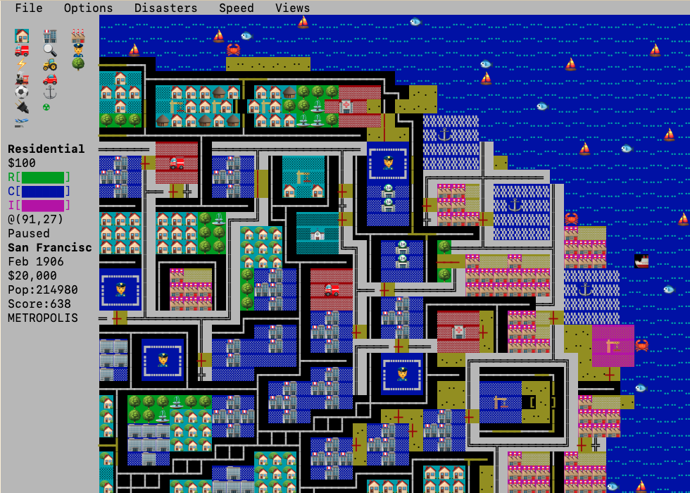

# Antoni Sawicki (Tenox) 🖥️🏙️📟 *(retrocomputing engineer · serial Micropolis porter)*

*Portrayal of a real correspondent, written by Don — not Antoni, and not his words. Antoni may
correct, shape, reduce, or delete any of it.* [Portrayal standards](../../schemas/portrayal-standards.md)

**Point Antoni here:** this directory is his room in the repo — character card, sources, emoji UI
spec, interview plan, and draft invitation.

## Who

**Antoni Sawicki** — **Tenox** — has been putting
software where software was never supposed to go since [tenox.net](https://www.tenox.net/) went up in
**1994**. VirtuallyFun contributor; [github.com/tenox7](https://github.com/tenox7).

On **7 Jul 2026** he emailed Don: *"you may be interested in this"* + [ttycity](https://github.com/tenox7/ttycity).
On **8 Jul 2026** he clarified: **that's his own project** — not on Hacker News yet; ironing kinks;
binaries for more platforms; contributions welcome. On the **unicode emoji graphics**: *"surprisingly
pretty!"*

**3 Aug 2026:** Loves ttycity; wants better demo video quality. Planning **SimCity on Sun 1/2/3
with SunView**. Shipped **[vtcity](https://github.com/tenox7/vtcity)** — soft downloadable fonts
on DEC VT terminals. Don's **SDI / sunviewgames** challenge: [thread](sources/2026-08-01-sunviewgames-sdi-thread.md).
Don's Aug 3 reply: [GIGI + GT40 Lunar Lander lore](sources/2026-08-03-don-reply-vt-gigi-gt40.md).

## ttycity — Micropolis for the terminal 🏙️→📟

| | |
|---|---|
| **Engine** | Original Micropolis simulation, untouched |
| **Binary** | One file — all scenarios/cities baked in |
| **Themes** | `tan` · `grass` · `dark` |
| **Play** | ssh-friendly; hjkl; mouse; minimap; down to 80×24 |
| **License** | GPL v3 — credits **Will Wright** / SimCity Classic |

### The emoji UI (unicode mode)

Press **`u`** to cycle graphics modes. **`-gfx unicode`** is the headline: **two terminal columns
per map tile**, UTF-8 emoji for buildings and vehicles, box-drawing for roads/rails/power, braille
stipple for terrain, quadrant fills for zone density.

| World | Emoji / glyphs |
|-------|----------------|
| Residential | 🛖 🏠 🏡 → 🌇 at max density+value |
| Commercial | 🏪 🏬 🏢 → 🏦 |
| Industrial | 🏭 |
| Roads | Auto-tiled ╋ ━ ┃ …; jams 🚗 🚕 |
| Water | Braille waves; 🦀 ⛵ 🐟 |
| Services | 🏥 ⛪ 🚒 👮 🛫 ⚓ 🔌 |
| Disasters | 🔥 🌊 ☢ ⚡ |

Full tile map and rendering ladder: [`sources/ttycity-emoji-graphics-ui.yml`](sources/ttycity-emoji-graphics-ui.yml)

Implementation lives in `src/nc_gfx.c` on [tenox7/ttycity](https://github.com/tenox7/ttycity) — pluggable **GfxOps** so one engine renders as classic curses, emoji, vt100 ascii, or aalib.

Also: **wintown** — Micropolis on Windows NT RISC (Alpha, MIPS, PowerPC, Itanium, ARM).

## sunviewgames → the SDI challenge 🚀❄️

On **1 Aug 2026** Don spotted Antoni's **sunviewgames** repo and issued a challenge: resurrect
**Mark Weiser's SunView "SDI" game** — the 1987 missile-command descendant whose pie menus Weiser
hacked in while snowed in during a DC blizzard ("I used the snow to hack pies into sunview"), with
a self-revealing pie menu that showed its own source code. Don dug the full source out of his
big-bag-of-old-code the same day; it now lives in
[Mark Weiser's software collection](../mark-weiser/software/README.md) (107 files, `piemenu_track.c`,
hour-by-hour `HISTORY.nr` dev diary). [The thread + 1987–88 receipts](sources/2026-08-01-sunviewgames-sdi-thread.md) ·
[1987 demo tape](https://www.youtube.com/watch?v=WTtEPbIE10I)

## Interview planned

Repo show about a repo — [`repo-shows/antoni-sawicki-ttycity/antoni-sawicki-ttycity.yml`](../../repo-shows/antoni-sawicki-ttycity/antoni-sawicki-ttycity.yml)

Beats: [`ideas.md`](ideas.md) · invitation: [`invitation.md`](invitation.md)

## Artifacts

| | Path |
|---|------|
| Character | [`CHARACTER.yml`](CHARACTER.yml) |
| Email thread | [`sources/2026-07-08-ttycity-email-thread.yml`](sources/2026-07-08-ttycity-email-thread.yml) |
| SDI thread | [`sources/2026-08-01-sunviewgames-sdi-thread.md`](sources/2026-08-01-sunviewgames-sdi-thread.md) |
| Emoji UI spec | [`sources/ttycity-emoji-graphics-ui.yml`](sources/ttycity-emoji-graphics-ui.yml) |
| Show seed | [`../../repo-shows/antoni-sawicki-ttycity/antoni-sawicki-ttycity.yml`](../../repo-shows/antoni-sawicki-ttycity/antoni-sawicki-ttycity.yml) |

## Related

- [Will Wright](../will-wright/README.md) — SimCity designer; show him the emoji city
- [Mark Weiser](../mark-weiser/README.md) — the SDI source waits in his memorial room for Antoni's resurrection
- [Peter Scott](../peter-scott/README.md) — BBC 20K SimCity 1989 — same lineage, different decade
- [Open-source saga](../will-wright/sources/simcity-open-source-saga/README.md) — how the fork started
