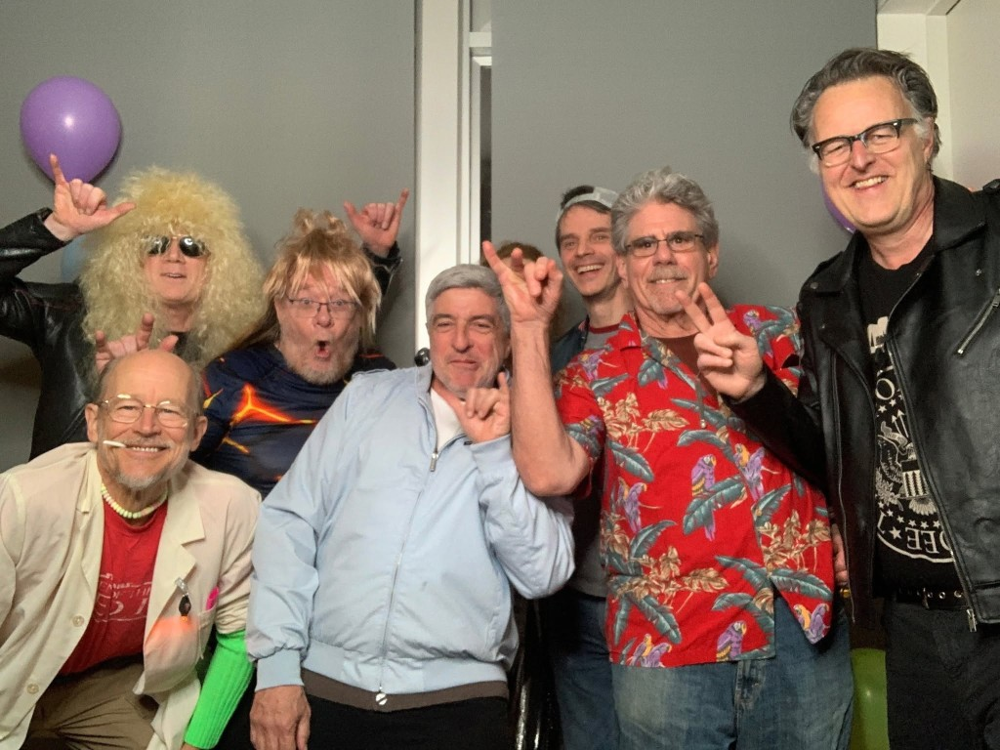
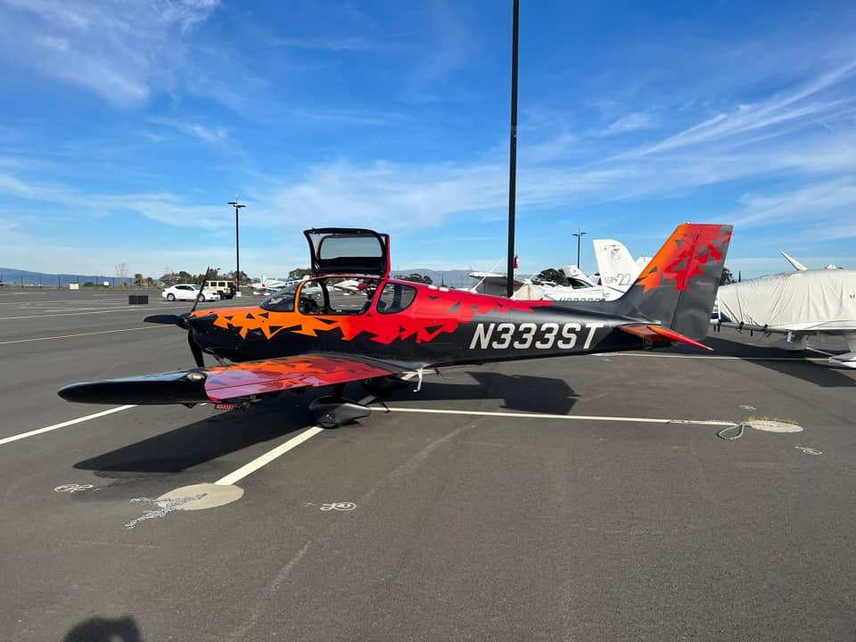
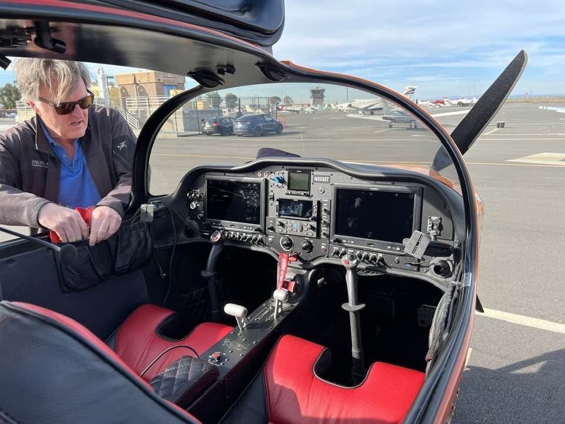

# Arthur van Hoff

Invitation portrayal — **not** Arthur van Hoff. [Standards](../../schemas/portrayal-standards.md)

**Field:** NeWS/HyperLook, PdB compiler, early Java (compiler-in-Java, AWT, HotJava), Marimba (Castanet/Bongo), TiVo, Flipboard, Jaunt VR

[Invitation](invitation.md) · [Show seed](../../characters/arthur-van-hoff/README.md)

## Birthday party

[`media/birthday-party.yml`](media/birthday-party.yml) · [`media/INDEX.yml`](media/INDEX.yml)

## Plane — N333ST

Arthur's plane — **N333ST**, Cirrus-class glass cockpit, shattered red/orange/black livery.
[`media/plane-n333st-exterior.yml`](media/plane-n333st-exterior.yml) · [`media/plane-n333st-cockpit.yml`](media/plane-n333st-cockpit.yml)

Verifiable sources in `CHARACTER.yml`. Subject may request correction or removal anytime.
