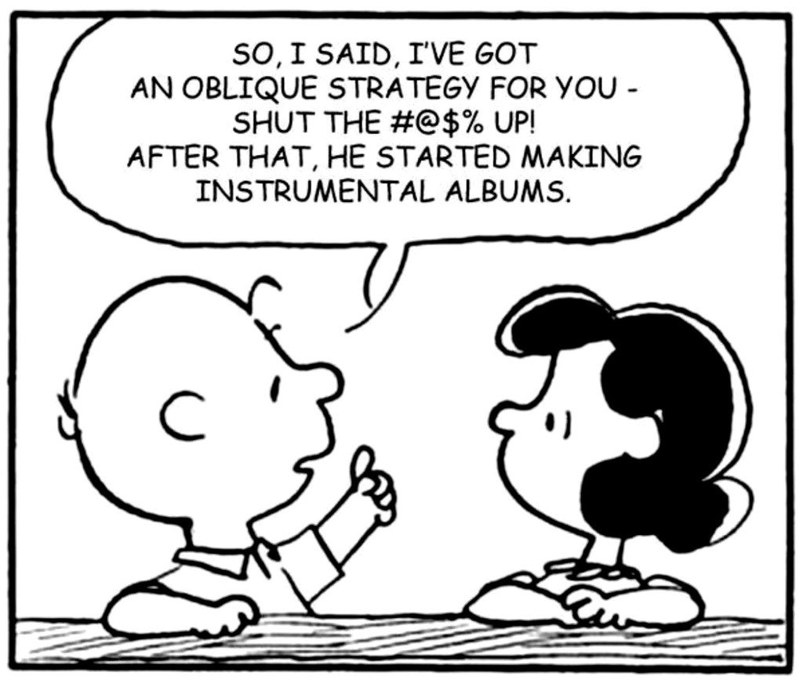

# The rudest Oblique Strategy

*A good-natured joke for the Eno room. AI-generated Peanuts-style parody panel, 2026.*

Charlie Brown claims credit for the whole ambient catalog: one rude card, decades of instrumental
albums. [Oblique Strategies](https://en.wikipedia.org/wiki/Oblique_Strategies) (Eno and Peter
Schmidt, 1975) never actually included this one — which may be why it works.

**Machine girder:** [`oblique-strategy-peanuts.yml`](oblique-strategy-peanuts.yml)
