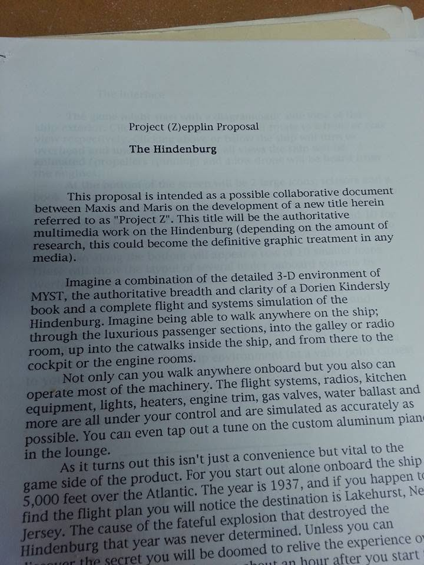

# Byrt Martinez

**Maxis, 1990s.** Kept a paper copy of the **Project (Z)epplin Proposal** — an unreleased Maxis
pitch for a walk-anywhere, operate-everything simulation of the **Hindenburg**, structured as a time
loop — and posted it to Maxis Alumni around 2015 with the caption *"Lookie what I found digging
through some old papers. Who all remembers this? 😀"*

## The archive

**[Project (Z)epplin — the Hindenburg proposal →](project-zeppelin.md)** — the full readable text,
what it describes, and why it reads like *Outer Wilds* two decades early.

## Open

- [ ] Confirm her role and dates at Maxis
- [ ] **Are there more pages?** The photograph shows page 1 with a section called *"The Interface"*
      bleeding through from the next sheet
- [ ] Who wrote it, and did Maris Multimedia ever respond?
- [ ] Consent to name and quote her here

## Repo orbit

- [Project (Z)epplin](project-zeppelin.md)
- [Mike Perry — LunaSim / Tycho Rising](../mike-perry/lunasim-tycho-rising.md) — the other unreleased Maxis simulation in this repo
- [Maxis catalog](../../catalogs/maxis/README.md)
