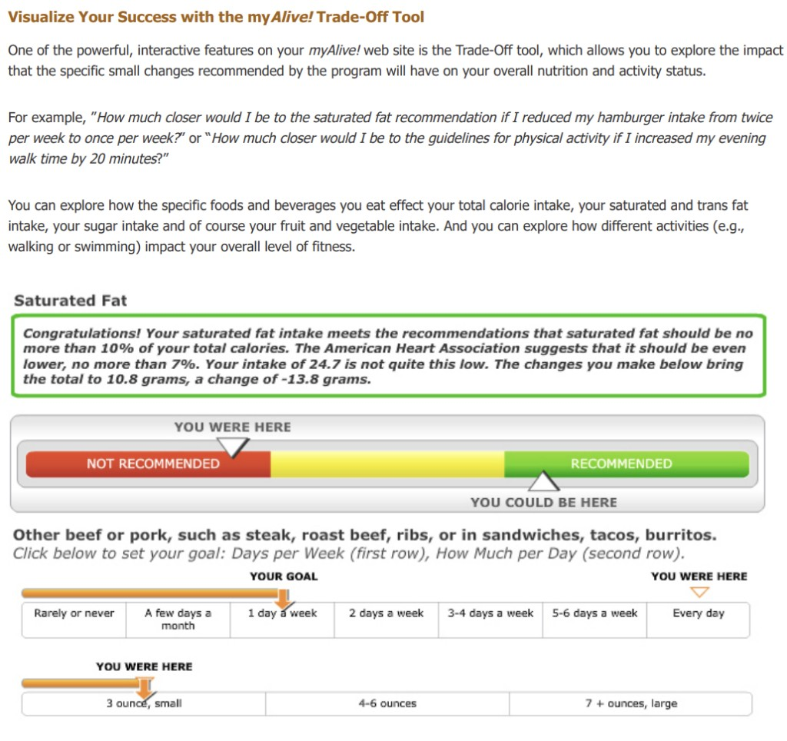

# OpenLaszlo 5.0 — LinkedIn announcement & Laszlo reunion thread

**When:** ~June–July 2026 (David's post ~1 month before Don's replies on 28–29 Jul 2026)  
**Author:** David Temkin (Software Preservation Society framing)  
**Primary post:** https://www.linkedin.com/feed/update/urn:li:activity:7476118515758809088/  
**Repo:** https://github.com/davidtemkin/openlaszlo-5.0  
**Live demo:** https://davidtemkin.github.io/openlaszlo-5.0/

For show prep with David, Henry Minsky, Oliver Steele, and the Laszlo band.
Don's replies in this thread are the opening bid for a Repo Show / reunion.

---

## David's announcement (verbatim core)

> The Software Preservation Society hereby presents: **OpenLaszlo 5.0**.
>
> I was talking with a friend about Laszlo Systems recently and realized that
> I had no way of looking at its long-lost platform and apps. So, I downloaded
> the source code and set the AI machine to the task of building it, then
> making it easy to run and use on modern systems. That meant:
>
> 1. removing all the Java from the distro  
> 2. porting the compiler and the server to TypeScript  
> 3. and, just because, making it so the compiler could run directly in the browser
>
> It's full-featured, and matches OpenLaszlo 4.9 (2010) capabilities. All the
> old demos, samples, tutorials, and documentation are there. Brought back a
> lot of really great memories!

**CC'd Laszlovians (from the post):** James Bret Simister, Oliver Steele, Adam
Wolff, Sarah Bradley, Pablo Kang, Eric Bloch, Anne Harrison, Amy Lewis, Sarah
Allen, Peter Andrea, Grig B., Raju Bitter, Antony Campitelli, Max Carlson,
Scott Evans, Charlotte L. Goldsberry, Jim Grandy, Lorien Henry-Wilkins, John
Sundman, Helena Kimball, Dan Lewis, Kent Libbey, Sue Liu, Kevin McCoy, Henry
Minsky, Susan O'Connor, Michael Ouye, Stephen Rogers, Hal Rucker, George
Shahid, Benji Shine, Joseph Silverman, P Tucker Withington, Lyndon Wong,
Christophe Coenraets, Loredana Crisan, Josh Crowley, Amy Darling, Mark Davis,
Michael Gregor, Antun Karlovac.

### What 5.0 actually is (from the README)

- LZX → DHTML compiler rewritten in **TypeScript** (no JDK / servlet / JSP).
- **In-browser compilation** via Service Worker (`lzc-browser.js`).
- Claims **byte-for-byte** parity with OpenLaszlo **4.9** DHTML output (production /
  debug / backtrace / profile), including the LFC runtime — verified against the
  Java oracle harness.
- Static-hostable (GitHub Pages); optional Node server for AMF-era example backends
  + WebSocket chat.
- New 5.0 code: MIT. Bundled 4.x runtime/docs/examples: CPL 1.0 (Laszlo Systems).

---

## Reunion energy (curated comments)

| Who | Beat |
|---|---|
| **Adam Wolff** | "omg laszlo reunion wen?" |
| **David** | "We need to do that! This fall?" |
| **Antun Karlovac** | Count me in; east-coast place; weather.lzx bug; "Bugzilla!"; early days felt like vibe-coding — idea on email → magic by evening |
| **Eric Bloch** | First *real* Temkin code contribution to OpenLaszlo? Tooling amazing |
| **David → Eric** | Oliver granted him a trivial check-in on day one; this time "agentmaxxing toward a very specific outcome" |
| **Grig B.** | Calendar app magic; shout-out Max Carlson on DHTML |
| **John Sundman** | Thanks; hi gang |
| **Charlotte Goldsberry** | 12 days of Christmas on eBay; "dragon drop" pre-Ajax |
| **Helena Kimball** | Also talking Laszlo/Pandora — "something in the air" |
| **Elliot Winard** | Wormhole SF 2026 ↔ San Mateo/Boston early 2000s |
| **David → Elliot** | "We were promised jetpacks, and time travel; but all we got was world-ending AI." |
| **Ron Lichty** | Software archaeology; longevity of software vs books/movies |
| **David → Ron** | Shelf life rant; recommends https://infinitemac.org |
| **Michael Gregor** | Culture and team were stellar |

---

## Don's replies (discussion hooks for the show)

### AI orchestration / MOOLLM

Ask: which AI tools and models, how do you orchestrate and switch?
Don: Cursor + multiple models; expensive ones incredible; [cauldron](https://github.com/SimHacker/moollm/blob/main/skills/cauldron/SKILL.md)
for design → cheap models for execution.

### cursor-mirror (for Laszlovian Lisp heads)

[cursor-mirror](https://github.com/SimHacker/moollm/tree/main/skills/cursor-mirror) —
"Watch Yourself Think"; read Cursor's local SQLite/transcripts; Church of the Eval Genius:
https://github.com/SimHacker/moollm/blob/main/designs/eval/CHURCH-OF-THE-EVAL-GENIUS.md

### Software Preservation Society + PIXIE

Ask whether SPS is recruiting. Point at Heinz Lemke PIXIE recovery (pie menus /
light pen / PDP-7):

- Listing: https://github.com/SimHacker/WillWrightShowForFood/tree/main/characters/heinz-lemke/sources/pixie-assembler-listing-1972
- Recovery notes: https://github.com/SimHacker/WillWrightShowForFood/blob/main/characters/heinz-lemke/pixie-source-recovery.md
- Flight of the PIXIE: https://www.youtube.com/watch?v=jDrqR9XssJI

### SimFaux

Still have sources/media; plug in new videos/characters (Trump era; keep Zappa + Triumph):
https://www.youtube.com/watch?v=gRodlxUZ9SQ

### Micropolis OpenLaszlo client

Historic LZX UI (AMF / Flash-era server is the hard part to revive):

https://github.com/SimHacker/MicropolisCore/tree/main/documentation/openlaszlo

Article voice Don pasted into the thread (also lives at the bottom of that README):
constraints + prototypes; Garnet/Brad Myers lineage; bridge to Svelte 5 + Wasm Micropolis.

### myAlive! Trade-Off Tool screenshot

Classic OL RIA Don dropped into the thread — constraint-driven health trade-off UI
(saturated-fat gauge + frequency/portion sliders; "YOU WERE HERE" / "YOU COULD BE HERE"):

*Provenance: Don Hopkins, posted into David's OpenLaszlo 5.0 LinkedIn thread, 29 Jul 2026.*

---

## Talk-about checklist (with David / Henry / Oliver)

1. **Agentmaxxing the compiler** — models, harness, byte-for-byte oracle; what broke first.
2. **Reunion this fall** — Adam / Antun / east coast; Repo Show as the asynchronous venue.
3. **Run historic apps on 5.0** — Explorer, weather.lzx, calendar; Micropolis LZX + AMF gap.
4. **Constraint story** — myAlive / Micropolis OL / Garnet; what modern frameworks rediscovered.
5. **Software shelf life** — David's longevity rant ↔ prestoration / Repo Show / PIXIE.
6. **Henry + Oliver** — LZX design, instance-first, Marvin lineage; Cc'd already on LinkedIn.

↑ [sources index](README.md) · [character](../README.md) · [show](../../../repo-shows/openlaszlo/README.md)
