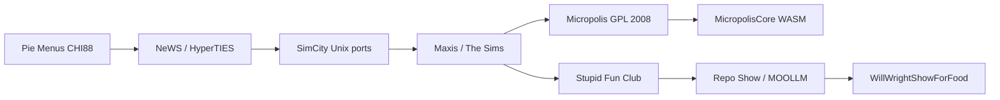

# Don Hopkins

*Sniff:* [`CARD.yml`](CARD.yml) · [`GLANCE.yml`](GLANCE.yml)

👤 **Don Hopkins** — user-interface designer and programmer: pie menus, The Sims,
Micropolis, Repo Show host. **YAML backbone, markdown facade:** the narrative lives
here; facts and timelines live in [`career/`](career/INDEX.yml).

**Wanna chat?** [Open an issue](https://github.com/SimHacker/WillWrightShowForFood/issues)
or submit a PR.

**Photos:** [`media.md`](media.md) — incl. the orange *LISP CHINE NUAL* t-shirt on Queen's Day, Amsterdam.

## Now

Porting **Micropolis** (open-source SimCity) to the web — WASM + SvelteKit. Running
**Micropolis Class** / **Repo Show** — live conversations whose stage is a GitHub repo
that follows through to working code. Building the **Sims content stack** in the browser
(Transmogrifier, RugOMatic, Wig-O-Matic lineage).

## The lineage (a bundle of ideas, culminating in MOOLLM)

Not one idea — a **growing bundle of great ideas** Don keeps collecting, building, and
braiding together, all circling the same joy: **worlds (or minds) you can navigate, edit,
and directly manipulate, made legible and fun.** Mirror worlds, mind maps, method of loci,
adventure-map editors, pie menus, gestural UIs. He learned many by studying others' work
and invented some himself — but the through-skill is surveying and comparing the whole
design space, writing up what works *and* what fails, and offering a better path (the way
Gosling designed NeWS). Don's *X-Windows Disaster* chapter (UNIX-HATERS Handbook) is the
critique; NeWS — "send code, not commands" — was his generous alternative, a bet that
quietly came true as AJAX / JavaScript / the web (his *Axis of Eval* manifesto). It starts with **6502
assembly** on the Apple ][ — the unlocker he used to hand-write his own **Forth** (and, in
Forth's RPN assembler, its terminal emulator, graphics, and drivers) — which got him onto
the **ARPANET** and into the **MIT-AI Lab**, and thus into **Zork**, Emacs, Lisp, and email
— then runs through **MUD1**, **LambdaMOO** (the *MOO* in
**MOOLLM**), **Logo Adventure**, Kaleida's **DreamScape**, **SimCity/Micropolis**, **The
Sims**, **iLoci**, and **LayAR** — each adding ideas to the pile — until they all come
together in **MOOLLM**, a live digital twin built out of the filesystem. Two axes:

- [`career/lineage.yml`](career/lineage.yml) — **the bundle of ideas across platforms**, culminating in MOOLLM
- [`career/range.yml`](career/range.yml) — **every layer of the stack** (6502 Forth to Rust/WASM/LLM; robots, computer vision, DevOps)

## Career map (YAML)

| File | What it covers |
|------|----------------|
| [`career/INDEX.yml`](career/INDEX.yml) | Index of all career backbone files |
| [`career/lineage.yml`](career/lineage.yml) | **The lineage** — a bundle of ideas (navigable, editable modeled worlds) from MUD1/Zork/LambdaMOO, culminating in MOOLLM |
| [`career/range.yml`](career/range.yml) | **The range** — bare metal (6502 Forth) to browser (Rust/WASM/LLM); robots, computer vision, DevOps |
| [`career/project-threads.yml`](career/project-threads.yml) | How threads branch and merge |
| [`career/work-history.yml`](career/work-history.yml) | Employment timeline (condensed) |
| [`career/simcity-lineage.yml`](career/simcity-lineage.yml) | SimCity → SimCityNet → OLPC → web |
| [`career/stupid-fun-club.yml`](career/stupid-fun-club.yml) | Will Wright's lab — robots, stories, SFC |
| [`career/on-stream.yml`](career/on-stream.yml) | Regular Don on stream vs Don Philahue |
| [`portrayal/voice.yml`](portrayal/voice.yml) | Voice, frobisms (from moollm adventure layer) |
| [`portrayal/heroes.yml`](portrayal/heroes.yml) | Mentors — Shneiderman, Weiser, Will, Kay |
| [`portrayal/presentations.yml`](portrayal/presentations.yml) | CHI'88 and verified talks |
| [`sync-sources.yml`](sync-sources.yml) | What we synced from upstream; dedupe rules |

## Career threads (how it all connects)

Details: [`career/project-threads.yml`](career/project-threads.yml)

## SimCity lineage (short)

| Version | Don's role | Platform |
|---------|------------|----------|
| SimCity (Unix) | NeWS/X11 ports, **SimCityNet** cooperative multiplayer | NeWS, X11/TCL/Tk |
| SimCity 2000 | Maxis ecosystem / Mac port era | Mac, PC, … |
| Micropolis (2008) | EA + **OLPC** GPL release | Linux, XO laptop, source |
| Micropolis web | C++ cleanup, **WASM**, SvelteKit, federation | Browser, native |

Full timeline: [`career/simcity-lineage.yml`](career/simcity-lineage.yml)

## On stream vs on stage

| Facet | Who |
|-------|-----|
| Regular Don — interview, implement, chat | **This character** ([`career/on-stream.yml`](career/on-stream.yml)) |
| Flamboyant AI announcer, Q&A DJ | [**Don Philahue**](../don-philahue/README.md) |

## Deeper

- [donhopkins.com](https://donhopkins.com)
- [SimHacker/MicropolisCore](https://github.com/SimHacker/MicropolisCore)
- [SimHacker/moollm](https://github.com/SimHacker/moollm)
- [moollm adventure-4 Don Hopkins](https://github.com/SimHacker/moollm/tree/main/examples/adventure-4/characters/real-people/don-hopkins) — fuller character layer (not duplicated here)

↑ [`../README.md`](../README.md) · [`CARD.yml`](CARD.yml) · [`../../process/cross-links.yml`](../../process/cross-links.yml)
