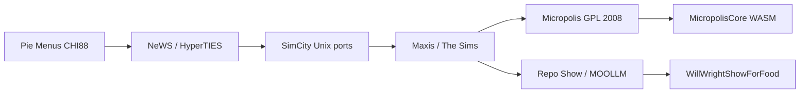

# Don Hopkins

👤 **Don Hopkins** — user-interface designer and programmer: pie menus, The Sims,
Micropolis, Repo Show host. This is the **public projection** — filtered from the
private DonHopkins working tree. LinkedIn/resume/biography/blog rolled into one place.

**Wanna chat?** [Open an issue](https://github.com/SimHacker/WillWrightShowForFood/issues)
or submit a PR.

## Now

Porting **Micropolis** (open-source SimCity) to the web — WASM + SvelteKit. Running
**Micropolis Class** / **Repo Show** — live conversations whose stage is a GitHub repo
that follows through to working code. Building the **Sims content stack** in the browser
(Transmogrifier, RugOMatic, Wig-O-Matic lineage).

## Career threads (how it all connects)

Details: [`career/project-threads.yml`](career/project-threads.yml) ·
[`career/simcity-lineage.yml`](career/simcity-lineage.yml)

## SimCity lineage (short)

| Version | Don's role | Platform |
|---------|------------|----------|
| SimCity (original) | Unix/X11 port, cooperative multiplayer (SimCityNet) | NeWS, X11/TCL/Tk |
| SimCity 2000 | Contributed to Mac port era / Maxis ecosystem | Mac, etc. |
| SimCity (Micropolis) | Open-sourced with EA + OLPC (2008) | GPL → web port |
| MicropolisCore | Modern engine — WASM, SvelteKit, federation | Browser, native |

Full table: [`career/simcity-lineage.yml`](career/simcity-lineage.yml)

## On stream vs on stage

| Facet | Who |
|-------|-----|
| Regular Don — interview, implement, chat | **This character** (`master-of-ceremonies` coalesced here — not a separate character) |
| Flamboyant AI announcer, Q&A DJ | [**Don Philahue**](../don-philahue/) |

## Deeper

- [donhopkins.com](https://donhopkins.com)
- [SimHacker/MicropolisCore](https://github.com/SimHacker/MicropolisCore)
- [SimHacker/moollm](https://github.com/SimHacker/moollm)
- Private working tree (filtered export source): sibling `DonHopkins/` repo locally

## What we filter out (stays private)

Home address, expat/tax, correspondence PII, home automation credentials, personal
life-management YAML. Public gets career, public correspondence summaries, show-facing bio.
