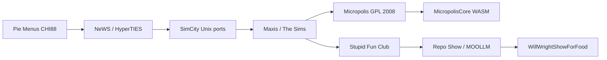

# Don Hopkins

*Sniff:* [`GLANCE.md`](GLANCE.md) · [`CARD.md`](CARD.md) · [`CARD.yml`](CARD.yml) · [`browse-the-bouquet.yml`](browse-the-bouquet.yml)

👤 **Don Hopkins** — user-interface designer and programmer: pie menus, The Sims,
Micropolis, Repo Show host. **YAML backbone, markdown facade:** facts live in
[`career/`](career/INDEX.yml); this README is the **Connections thread** — how one
technology accidentally prepared the next.

**Wanna chat?** [Open an issue](https://github.com/SimHacker/WillWrightShowForFood/issues)
or submit a PR. **Photos:** [`media.md`](media.md)

---

## The thread

A kid hand-writes **Forth** on a 6502 — and suddenly he is on the **ARPANET**, inside
**Zork**, inventing **pie menus** for modeled worlds. **PostScript** gives those menus a
language; **NeWS** ships code to the glass; **SimCity** becomes a Unix microworld you can
paint and play across the network. **Maxis** turns the dollhouse into **The Sims**;
**Transmogrifier** hands the city back to players. **OLPC** forces the source open —
**Micropolis** — and the same imaging braid walks forward through **Cairo**, **Canvas**,
**WebGPU**. **Robots** beg for empathy at **Stupid Fun Club**; **constraint solvers**
(Garnet → Laszlo → Svelte) keep declarative UI honest across decades. Today the filesystem
itself is the game board: **`import self from self`**, **MOOLLM**, **Repo Show** — the
bundle finally compiles. Machine mirror: [`CARD.yml`](CARD.yml) → `connections_index`.

Each blurb below is **one beat long** (~24 words). Read in order; each line **opens** the next.

---

## I — Identity (enter the room)

| File | What it is | Opens → |
|------|------------|---------|
| [`about-host.md`](about-host.md) | Resume reimagined as a repo room — portfolio, not pitch; one-screen map of the whole career. | [`media.md`](media.md) |
| [`media.md`](media.md) | Photos and screenshots — Queen's Day LISP shirt, Sims era, Micropolis demos; the face behind the frob panel. | [`career/lineage.yml`](career/lineage.yml) |
| [`GLANCE.md`](GLANCE.md) · [`CARD.md`](CARD.md) · [`CARD.yml`](CARD.yml) · [`CHARACTER.yml`](CHARACTER.yml) | Sniff card, trading card, machine schema, host registry — same person at four resolutions. | [`pie-menus-chi-88-and-beyond.md`](pie-menus-chi-88-and-beyond.md) |
| [`browse-the-bouquet.yml`](browse-the-bouquet.yml) | Machine index of topic filenames — filenames are advertisements; pairs with this narrative order. | Cluster II |
| [`sync-sources.yml`](sync-sources.yml) | What may be synced from upstream adventure-4 and DonHopkins archive — dedupe and public-safe rules. | [`career/`](career/INDEX.yml) |

---

## II — Gestural verbs (1988 · HCIL → the verb-picker)

*Fitts's law meets a modeled world: pick a direction, not a distance.*

| File | What it is | Opens → |
|------|------------|---------|
| [`pie-menus-chi-88-and-beyond.md`](pie-menus-chi-88-and-beyond.md) | CHI'88 radial menus with Shneiderman and Weiser — the gestural verb-picker that would steer SimCity, Sims, and MOOLLM. | [`axis-of-eval-send-code-not-commands.md`](axis-of-eval-send-code-not-commands.md) |
| [`portrayal/presentations.yml`](portrayal/presentations.yml) | Verified papers and talks — CHI'88 links, BayCHI, DreamScape WWDC; receipts for everything claimed above. | [`axis-of-eval-send-code-not-commands.md`](axis-of-eval-send-code-not-commands.md) |

---

## III — Send code, not commands (1988–1995 · NeWS → PostScript motherboard)

*If menus are verbs, the window server must speak a language — not grind X11 command chatter.*

| File | What it is | Opens → |
|------|------------|---------|
| [`axis-of-eval-send-code-not-commands.md`](axis-of-eval-send-code-not-commands.md) | NeWS manifesto thread — *X-Windows Disaster* critique, Owen Densmore's OOPS, the bet the web later cashed. | [`hyperlook-news-postscript-simcity.md`](hyperlook-news-postscript-simcity.md) |
| [`hyperlook-news-postscript-simcity.md`](hyperlook-news-postscript-simcity.md) | HyperLook / NeWS SimCity — PostScript UI, pie menus, tile renderer; SimCity's first Unix face at DUX. | [`porter-duff-postscript-to-webgpu.md`](porter-duff-postscript-to-webgpu.md) |
| [`porter-duff-postscript-to-webgpu.md`](porter-duff-postscript-to-webgpu.md) | Porter/Duff imaging braid — stencil-paint in the window server through Cairo, Canvas 2D, nested WebGPU compositing. | [`interval-research-pluggers-and-mediaflow.md`](interval-research-pluggers-and-mediaflow.md) |

---

## IV — Interval detour (1992–1999 · patterns before names)

*Paul Allen's lab asks what people actually do with media — Pluggers, flows, Camelot.*

| File | What it is | Opens → |
|------|------------|---------|
| [`interval-research-pluggers-and-mediaflow.md`](interval-research-pluggers-and-mediaflow.md) | Interval Research — Pluggers survey, MediaFlow, Camelot; hypermedia patterns that echo NeWS and prefigure MOOLLM rooms. | [`history/interval-research.yml`](history/interval-research.yml) |
| [`history/interval-research.yml`](history/interval-research.yml) | Distilled era yaml — same Interval thread in machine-readable backbone form for cross-repo grep. | [`history/README.md`](history/README.md) |
| [`history/README.md`](history/README.md) | History subdir index — public-safe era distills; one room per research epoch, not raw correspondence. | Cluster V |

---

## V — Microworld franchise (1991–2007 · SimCity → Sims → community tools)

*The city teaches cooperation; the dollhouse teaches motives; Transmogrifier teaches that players can author.*

| File | What it is | Opens → |
|------|------------|---------|
| [`career/simcity-lineage.yml`](career/simcity-lineage.yml) | SimCityNet → OLPC → WASM timeline — the yaml spine every SimCity topic file telescopes from. | [`open-sourcing-simcity-for-olpc.md`](open-sourcing-simcity-for-olpc.md) |
| [`open-sourcing-simcity-for-olpc.md`](open-sourcing-simcity-for-olpc.md) | December 2006 pitch letter to Rod Humble — the mail arc that cleared SimCity for OLPC and GPL Micropolis. | [`career/contracts/README.md`](career/contracts/README.md) |
| [`career/contracts/README.md`](career/contracts/README.md) | DUX ↔ Maxis ↔ EA ↔ OLPC paper trail — contracts that made open source legally possible, not merely wished. | [`will-wright-primary-sources-evidence-room.md`](will-wright-primary-sources-evidence-room.md) |
| [`will-wright-primary-sources-evidence-room.md`](will-wright-primary-sources-evidence-room.md) | Curated map to Will Wright's evidence room — Winograd centerpiece, Motive.c, Transmogrifier hub, full OLPC mail arc. | [`the-sims-transmogrifier-mod-tools.md`](the-sims-transmogrifier-mod-tools.md) |
| [`the-sims-transmogrifier-mod-tools.md`](the-sims-transmogrifier-mod-tools.md) | Maxis mod stack — Transmogrifier, RugOMatic, SimShow, VitaBoy; objects that carry behavior for community authors. | [`olpc-micropolis-python-pygtk.md`](olpc-micropolis-python-pygtk.md) |
| [`olpc-micropolis-python-pygtk.md`](olpc-micropolis-python-pygtk.md) | Python Sugar adaptor — PyGTK, Cairo, Pango shell wrapping Tcl/Tk SimCity for the XO laptop. | [`writing/INDEX.yml`](writing/INDEX.yml) |
| [`writing/README.md`](writing/README.md) · [`writing/INDEX.yml`](writing/INDEX.yml) | Essay and primary-source index — Medium recreations, Will sources clusters, donhopkins.com cross-links. | Cluster VI |

---

## VI — Robots that feel (2009–2014 · Stupid Fun Club)

*Will's lab asks how humans treat machines — waiter brains, broken robots, one-minute films.*

| File | What it is | Opens → |
|------|------------|---------|
| [`career/stupid-fun-club.yml`](career/stupid-fun-club.yml) | SFC yaml backbone — Slats, Dents, MediaGraph, networked AR; the employment thread behind the robot films. | [`stupid-fun-club-empathy-and-servitude.md`](stupid-fun-club-empathy-and-servitude.md) |
| [`stupid-fun-club-empathy-and-servitude.md`](stupid-fun-club-empathy-and-servitude.md) | *Servitude* and *Empathy* one-minute movies — procedural argument about reviews, breakdowns, and performed feeling. | [`talks/empathy-and-servitude.yml`](talks/empathy-and-servitude.yml) |
| [`talks/empathy-and-servitude.yml`](talks/empathy-and-servitude.yml) | Talk package distill — public-safe spine for the Empathy/Servitude show; links to Will sources and Slats sidekick. | [`../slats/`](../slats/README.md) |
| [`../slats/`](../slats/README.md) | Slats — the waiter robot Don programmed; now drag-race judge; SFC sidekick character in this deck. | Cluster VII |

---

## VII — Constraint solvers & living platforms (1992–2020s · declare truth, keep it true)

*Every GUI generation reinvents the same idea — relationships in data, not scattered in code.*

| File | What it is | Opens → |
|------|------------|---------|
| [`garnet-to-svelte-constraint-ui-lineage.md`](garnet-to-svelte-constraint-ui-lineage.md) | Garnet → OpenLaszlo → Svelte braid — Brad Myers KR constraints to `$derived`; why MOOLLM YAML feels obvious. | [`nutritionquest-turbogears-genshi-alive-pd.md`](nutritionquest-turbogears-genshi-alive-pd.md) |
| [`nutritionquest-turbogears-genshi-alive-pd.md`](nutritionquest-turbogears-genshi-alive-pd.md) | TurboGears decade at NutritionQuest — Zope romance distilled to SQLObject and Genshi; still running in production. | [`yoot-tower-open-source-and-alan-kay-interview.md`](yoot-tower-open-source-and-alan-kay-interview.md) |
| [`yoot-tower-open-source-and-alan-kay-interview.md`](yoot-tower-open-source-and-alan-kay-interview.md) | Yoot Tower OSS thread plus 1993 Alan Kay interview tree — tower game preservation meets constructionist microworld history. | Cluster VIII |

---

## VIII — Micropolis today (2006–now · OSS, design docs, WebGPU holodeck)

*The GPL release was the fork in the road — everything after is browser-native and federation-minded.*

| File | What it is | Opens → |
|------|------------|---------|
| [`micropoliscore-design-docs-packages-code-content.md`](micropoliscore-design-docs-packages-code-content.md) | MicropolisCore map — design docs, packages, WASM engine, PieCraft, content pipelines; the living implementation repo. | [`career/project-threads.yml`](career/project-threads.yml) |
| [`career/project-threads.yml`](career/project-threads.yml) | Branch/merge map — pie menus through Sims, Micropolis, Repo Show; how threads knot in one diagram. | Cluster IX |

---

## IX — import self from self (now · MOOLLM, Repo Show, dream guests)

*The filesystem becomes the dollhouse; skills inherit like Self objects; GitHub is the MMORPG stage.*

| File | What it is | Opens → |
|------|------------|---------|
| [`import-self-from-self.md`](import-self-from-self.md) | MOOLLM constitution — `# import self from self`; directories as rooms, skills as prototypes, k-line naming as inheritance. | [`self-interest-narcissas-mirror-david-ungar.md`](self-interest-narcissas-mirror-david-ungar.md) |
| [`self-interest-narcissas-mirror-david-ungar.md`](self-interest-narcissas-mirror-david-ungar.md) | Dream Repo Show with David Ungar — Self pun stack, *Narcissa's Mirror*, representation ethics guardrails spelled out. | [`moollm-microworld-os-talk.md`](moollm-microworld-os-talk.md) |
| [`moollm-microworld-os-talk.md`](moollm-microworld-os-talk.md) | Flagship talk — *The Sims for your filesystem*; microworld OS thesis distilled for stage and README visitors. | [`talks/moollm-microworld-os.yml`](talks/moollm-microworld-os.yml) |
| [`talks/moollm-microworld-os.yml`](talks/moollm-microworld-os.yml) | Talk package yaml — slides spine, demo hooks, cross-links to lineage and MOOLLM repo; export-safe from DonHopkins archive. | [`repo-show-host-facet.md`](repo-show-host-facet.md) |
| [`repo-show-host-facet.md`](repo-show-host-facet.md) | Repo Show host facet — Micropolis Class, RTFR, GitHub as MMORPG; design in public without job-hunt signaling. | [`ideas.md`](ideas.md) |
| [`ideas.md`](ideas.md) | Dream guests and show hooks — Will, Ungar, Bender, Adams, Yoot; episodes Don would build on air next. | [`talks/INDEX.yml`](talks/INDEX.yml) |
| [`talks/README.md`](talks/README.md) · [`talks/INDEX.yml`](talks/INDEX.yml) | Talk portfolio index — flagships, verified past talks, seeds to develop; pairs with portrayal presentations. | [`career/lineage.yml`](career/lineage.yml) |

---

## X — YAML backbone & portrayal (facts under the narrative)

*Markdown tells the Connections story; yaml holds the receipts.*

| File | What it is | Opens → |
|------|------------|---------|
| [`career/INDEX.yml`](career/INDEX.yml) | Career backbone index — entry point for all yaml facts below; browse-friendly for GitHub navigation. | [`career/lineage.yml`](career/lineage.yml) |
| [`career/lineage.yml`](career/lineage.yml) | The bundle of ideas — MUD1, LambdaMOO, DreamScape, SimCity, Sims, iLoci, LayAR, culminating in MOOLLM. | [`career/range.yml`](career/range.yml) |
| [`career/range.yml`](career/range.yml) | Bare-metal-to-browser range — 6502 Forth through Rust/WASM/LLM; robots, computer vision, DevOps layers. | [`career/work-history.yml`](career/work-history.yml) |
| [`career/work-history.yml`](career/work-history.yml) | Condensed employment timeline — public-safe dates and roles; pairs with contracts for SimCity/OSS claims. | [`career/on-stream.yml`](career/on-stream.yml) |
| [`career/on-stream.yml`](career/on-stream.yml) | Regular Don on stream vs Don Philahue orchestrator — which facet speaks in docs versus on-air banter. | [`../don-philahue/`](../don-philahue/README.md) |
| [`career/README.md`](career/README.md) | Career subdir readme — short pointer into INDEX and contracts; yaml girder for the whole character room. | [`career/contracts/transmogrifier-distribution-license-notes.md`](career/contracts/transmogrifier-distribution-license-notes.md) |
| [`career/contracts/transmogrifier-distribution-license-notes.md`](career/contracts/transmogrifier-distribution-license-notes.md) | Transmogrifier EA distribution terms — legal notes distilled from renovation plan and Wayback harvest. | [`portrayal/voice.yml`](portrayal/voice.yml) |
| [`portrayal/README.md`](portrayal/README.md) | Portrayal subdir — voice, heroes, presentations; how Don sounds and who he credits. | [`portrayal/voice.yml`](portrayal/voice.yml) |
| [`portrayal/voice.yml`](portrayal/voice.yml) | Writing style and frobisms — synced from moollm adventure-4; keeps public voice consistent with upstream. | [`portrayal/heroes.yml`](portrayal/heroes.yml) |
| [`portrayal/heroes.yml`](portrayal/heroes.yml) | Mentors credited — Shneiderman, Weiser, Will Wright, Alan Kay; the people behind the borrowed ideas. | Cluster I (re-read any room) |

---

## Now

Porting **Micropolis** to the web — WASM + SvelteKit. Running **Micropolis Class** /
**Repo Show** — live conversations whose stage is a GitHub repo that follows through to
working code. Building the **Sims content stack** in the browser (Transmogrifier, RugOMatic,
Wig-O-Matic lineage).

## Threads at a glance

## On stream vs on stage

| Facet | Who |
|-------|-----|
| Regular Don — interview, implement, chat | **This character** ([`career/on-stream.yml`](career/on-stream.yml)) |
| Flamboyant AI announcer, Q&A DJ | [**Don Philahue**](../don-philahue/README.md) |

## Deeper

- [donhopkins.com](https://donhopkins.com)
- [SimHacker/MicropolisCore](https://github.com/SimHacker/MicropolisCore)
- [SimHacker/moollm](https://github.com/SimHacker/moollm)
- [moollm adventure-4 Don Hopkins](https://github.com/SimHacker/moollm/tree/main/examples/adventure-4/characters/real-people/don-hopkins)

↑ [`../README.md`](../README.md) · [`CARD.yml`](CARD.yml) · [`../../process/cross-links.yml`](../../process/cross-links.yml)
