# JSONsters — Gallery Tour

**JSON Monsters.** Unity3D structural graphs of JSON data — nodes, arcs, rainbow bows, hex islands, then creatures named Blob, Bloop, and Bleep. Built at Facebook, inspired by the PseudoScientific Visualizer, stress-tested until it screamed for pie menus.

**Not AI Generated!**

This is not a white-cube show in Chelsea. But on third Thursday, eight fictional patrons behave as if it were — and that simulation is the other half of the artwork.

---

## What the artist was doing

Don Hopkins pasted Unity screenshots **reverse-chronological** on Facebook (~8 years ago). In this room, `evolution-01` is the essential original — two spheres, one black Arc, lavender Inspector — and `evolution-28` is the baroque plaid-peacock stress test. Read forward: complexity accretes. Labels read Blob, Bloop, Bleep. Caption: *No photo description available.*

Will Wright might call what happens next the **simulator effect**. We call it **reverse over-engineering**: viewers simulate a world onto industrial data until the data blushes.

Demo: [PseudoScientific.mov](http://www.donhopkins.com/home/movies/PseudoScientific.mov)

---

## The eight patrons (instance-first cast)

These are **fictional characters** — **reified** in [`characters/menagerie/`](../../menagerie/INDEX.yml) (Sims + Mind Mirror + [`RELATIONSHIP-MATRIX`](../../menagerie/RELATIONSHIP-MATRIX.yml)). Perform **live** in repo-shows. Voices: [`critics.yml`](critics.yml).

| | Name | Role | Misreads through… |
|---|------|------|-------------------|
| 🥂 | **Mimsy Caldwell** | Chelsea gallerist | Semiotics, aggressive restraint, Whitney regrets |
| 📈 | **Gregory Kwan** | Hedge-fund collector | Liquidity, tranches, short the plaid |
| 📚 | **Prof. Eli Vandermeer** | Adjunct critical theory | Misquoted Benjamin; Scotland invented blockchain |
| 🔧 | **Bucky Jr.** | Williamsburg sculptor | Material honesty, nib taper, tensile work |
| 🕯️ | **Helena Featherstone** | Board trustee | Whisper → sermon; confession tunnels |
| ⚔️ | **Margot Krell** | Deconstructionist | Administrative violence; open crying |
| 💋 | **Julian Strait** | Provocateur | Erotic geometry; arrives late; hummus |
| 🥦 | **Bunny Whitmore** | Benefactor | Broccoli; would live under the arch; funds anyway |

**Ensemble beats:** Mimsy/Gregory bid war (Room I) → Vandermeer/Margot hex fight (Room V) → Helena's tunnel sermon (Room VI) → plaid scream (Room VII) → Bunny adopts Bleep swarm (Room VIII) → Facebook chorus truth.

**Repo Show:** Sell the art to these virtual characters for **Simoleons (§)** — play money flowing *from* the nut jobs *to* the house (opposite of Klapaucius). Lecture + live hammers: [`lecture-selling-art-to-virtual-characters.md`](lecture-selling-art-to-virtual-characters.md) · [`simoleon-auctions.yml`](simoleon-auctions.yml). Later: **scarcity auctions** when fewer lots remain or a character needs §.

Wall text they never read:

> JSONsters — serialized ontologies in real-time engine space. The artist refuses the caption. The work refuses the artist.

---

## Room I — Bridge Studies

*Studies in Serialized Ontology*

Mimsy and Gregory arrive together and immediately disagree about whether minimalism is aggression or elegance. Julian is still looking for parking. Bunny asks if the gallery serves lunch.

By the time Julian finds the hummus table, Mimsy has already bought frame 01. Gregory calls it "how I wish my books looked." Bucky Jr. is the only person who mentions the pen-nib taper. Nobody mentions Unity.

### Study for a Financial Bridge (Working Title)

*Actually: Two nodes, one Arc. Black ribbon, orange selection, lavender Inspector.*

> **Mimsy:** Two orbs and a sigh of graphite. The restraint is *aggressive*. I bought it before finishing my sentence.

> **Gregory:** Source node, sink node, one conduit. This is how I wish my books looked.

> **Helena:** Something here remembers being chosen. I stood a long time.

> **Bunny:** Two balls and a stick! Is it sports? I'd live between them.

---

## Room II — Liquidity Streams

*Liquidity Streams (Diptych Variants)*

Room II is where the textures multiply and the patrons multiply their metaphors. Gregory stacks tranches on tranches. Vandermeer declares duplication dialectical. Bunny sees cake, campfire, and spaghetti — and requests board approval for each.

Mimsy calls the flame strip "combusting semiotics." Margot, who has been quiet, notes they layered the leash so we wouldn't notice the choke. The room smells like prosecco and mesh shaders.

### Conduit No. 2 — Black Ribbon Variation

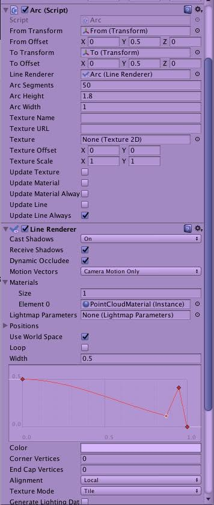

*Actually: Layered ribbon arc between spheres — texture experiments begin.*

> **Mimsy:** The second conduit *apologizes* to the first. Diptych energy. Sancerre.

> **Gregory:** Second tranche, same counterparty. I'm adding to position.

> **Helena:** Twin streams — one for grief, one for return.

> **Bunny:** Double spaghetti! More room to live underneath.

### Conduit No. 3 — Layered Accretion

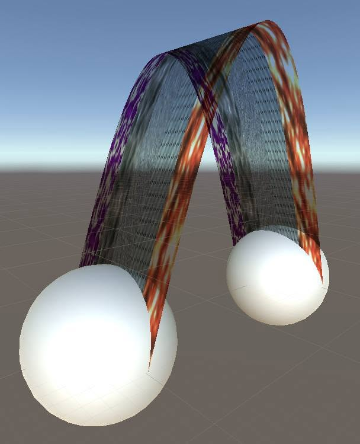

*Actually: Multi-layer ribbon stack on single arc.*

> **Mimsy:** Accretion as *policy*. The stack is a manifesto.

> **Gregory:** Stacked exposures — this is how fraud looks when it's beautiful.

> **Helena:** Each layer a year I didn't speak.

> **Bunny:** Like cake! Can the board approve cake?

### Conduit No. 4 — Violet Noise

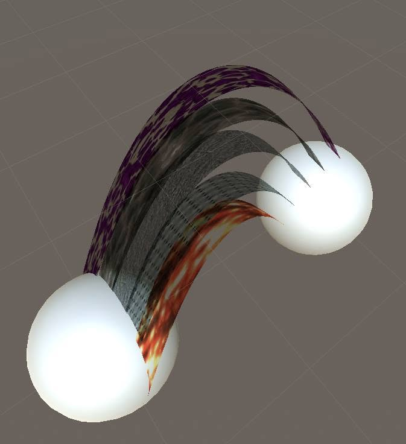

*Actually: Purple/violet textured ribbon layer on arc.*

> **Mimsy:** Violet noise — the color of *withheld* disclosure. Whitney, wake up.

> **Gregory:** Purple book is regulatory fog. I'm hedged.

> **Helena:** Violet was my mother's favorite. I wasn't expecting that here.

> **Bunny:** Pretty purple streamers! Festive.

### Conduit No. 5 — Flame and Mesh

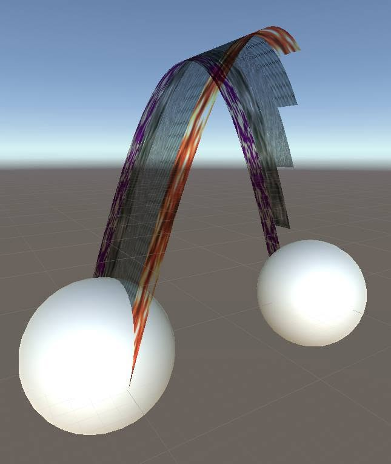

*Actually: Flame strip, purple noise, mesh textures on layered arc.*

> **Mimsy:** Flame strip! The work is *combusting* semiotics!

> **Gregory:** Flame strip is gamma exposure. Mesh is netting illiquidity. Diversified.

> **Helena:** Fire without heat — like prayers that don't arrive.

> **Bunny:** Ooh, campfire! Can we roast broccoli?

### Twin Conduits — Sphere Pair I

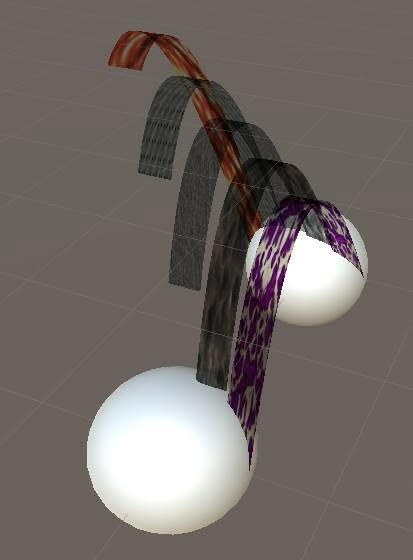

*Actually: Multi-ribbon arcs between two sphere nodes.*

> **Mimsy:** Twin conduits — *dialogue*! The spheres are in couples therapy.

> **Gregory:** Pair trade visualized. Long sphere A, short sphere B.

> **Helena:** They speak across the gap. I used to do that.

> **Bunny:** Two bridges! I'd live on the left one.

### Twin Conduits — Sphere Pair II

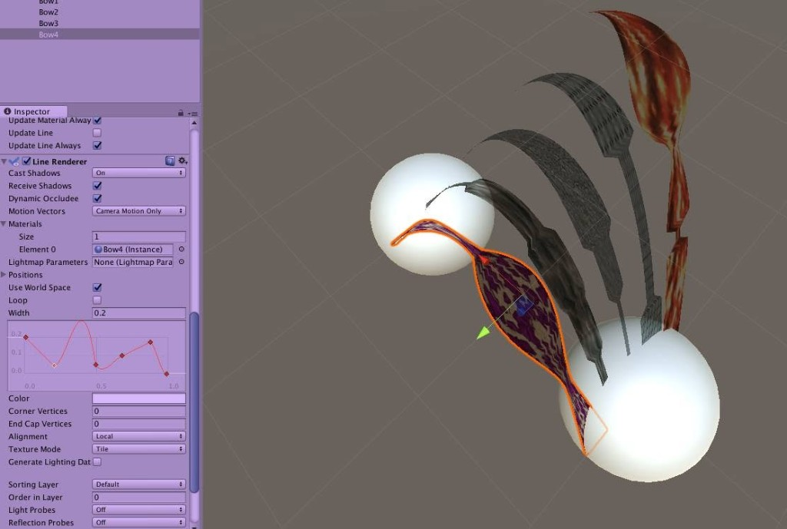

*Actually: Variant multi-ribbon arc materials between spheres.*

> **Mimsy:** Variant two — the couple has *fought*. Still married in graphite.

> **Gregory:** Correlation breakdown. Rebalancing into flame strip.

> **Helena:** The fight healed. You can see it in the ribbon.

> **Bunny:** They made up! Happy ending.

### Twin Conduits — Sphere Pair III

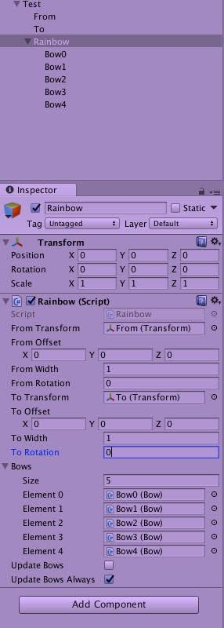

*Actually: Further multi-ribbon material variants.*

> **Mimsy:** Triptych energy in a diptych room. *Illegal* and I love it.

> **Gregory:** Third variant — I'm scaling in.

> **Helena:** Third prayer. Someone heard.

> **Bunny:** Three bridges means three bedrooms. Board?

### Twin Conduits — Sphere Pair IV

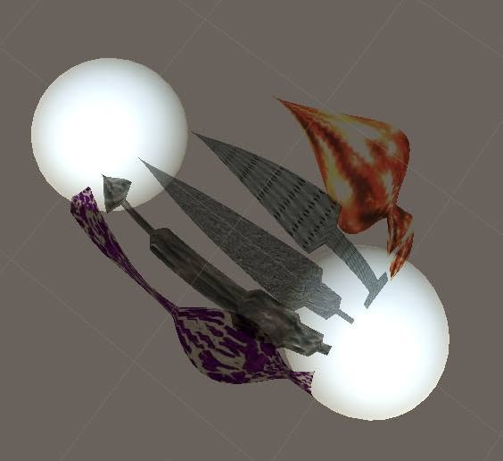

*Actually: Late liquidity-stream variant before tendril phase.*

> **Mimsy:** The last conduit before the room turns. *Aggressive* cliffhanger.

> **Gregory:** Closing the liquidity-stream book. P&L positive.

> **Helena:** Goodbye to the simple bridges. I'm ready.

> **Bunny:** Bye-bye spaghetti! What's next room?

---

## Room III — Tendril Exercises

*Tendril Exercises*

Five tendrils fan out and five interpretations fan with them. Mimsy goes pentecostal. Gregory opens a special-situations fund. Julian schedules therapy.

Bucky Jr. approves the tensile homework. Bunny declares the noodles family-sized. Vandermeer says disagreement is discourse and asks if anyone needs office hours.

### Five Tendrils (Fan Study I)

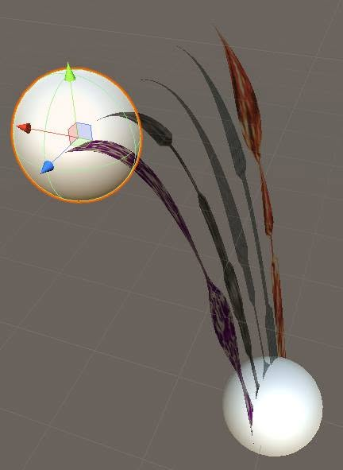

*Actually: Five textured tendrils fan node-to-node; LineRenderer experiments.*

> **Mimsy:** Five tendrils — pentecostal *graph*! I'm vibrating off-label.

> **Gregory:** Five-way split — special situations fund in one frame.

> **Helena:** Five paths — like choices I didn't take.

> **Bunny:** Five noodles! Family-sized.

### Five Tendrils (Fan Study II)

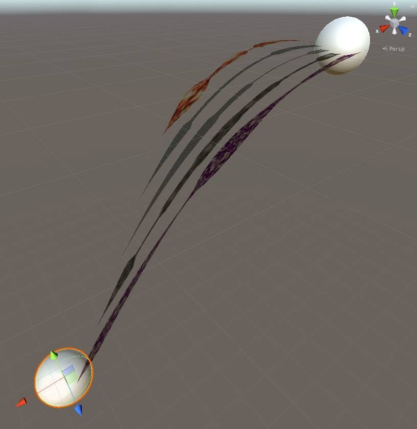

*Actually: Tendril fan variant — width curves, tiled textures.*

> **Mimsy:** Variant fan — the tendrils *disagree*. Drama!

> **Gregory:** Rebalanced fan — trimmed the purple tranche.

> **Helena:** They disagree but stay connected. Lesson.

> **Bunny:** Some noodles thicker. More filling.

---

## Room IV — Rainbow Surgery

*Rainbow Surgery*

The Inspector panel opens and the room divides: those who see surgery, those who see confession, those who see a trading desk at 3 a.m.

Helena says they left the ribs showing. Margot says surgical UI makes violence legible for interns. Bunny wants to press the rainbow buttons. Mimsy screams softly that the lavender panel is an altar.

### Rainbow — Inspector Open (Bow Array)

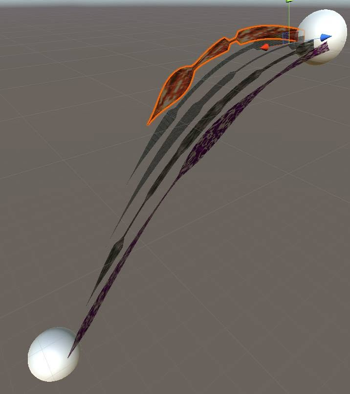

*Actually: Rainbow + Bow4 LineRenderer Inspector — width curves, Update Always.*

> **Mimsy:** SURGERY! The Inspector is the *altar*! I need a medic.

> **Gregory:** Update Always checked — that's my trading desk at 3 a.m.

> **Helena:** Open heart. They left the ribs showing.

> **Bunny:** Rainbow with buttons! Can I press them?

### Bow4 — LineRenderer Autopsy

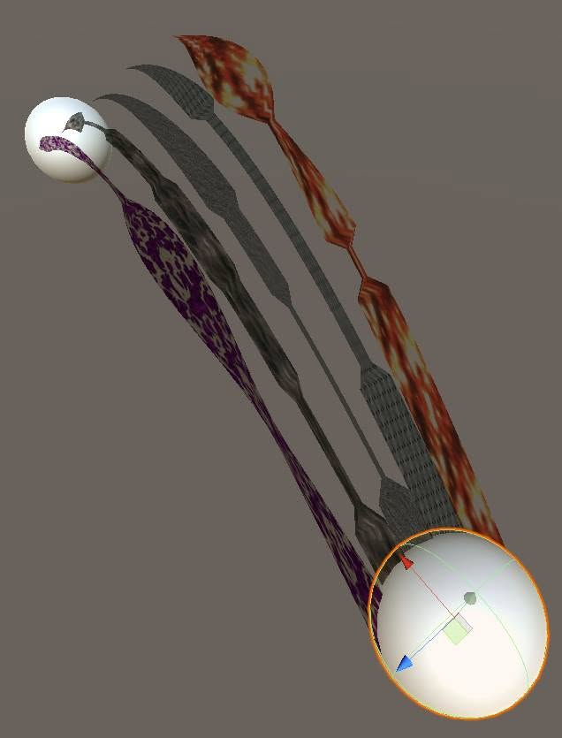

*Actually: Bow4 LineRenderer detail — tiled textures, per-edge materials.*

> **Mimsy:** Autopsy of the bow! *Posthumous* and hot.

> **Gregory:** Per-edge materials — asset-class separation. Elegant.

> **Helena:** They named the ribs Bow0 through Bow4. Naming is mercy.

> **Bunny:** Bow like hair bow? Cute.

---

## Room V — Hex Archipelago

*Hex Archipelago*

The fight everyone came for: Vandermeer versus Margot at the hex islands. He says nation-states in a liquidity sea; she says gravel is where they dump the nodes that complained.

Bunny asks if the pillars are broccoli. Gregory explains GME for land use. Mimsy acquires "Archipelago Dusk" before dusk. Julian finds the collar-and-arch composition "darling" near the hummus.

### Sedimentary Node with Rainbow Collar

*Actually: Hex pillars + multi-ribbon Rainbow bows — island nodes.*

> **Mimsy:** Sedimentary node versus gravel — class allegory with *trees*!

> **Gregory:** Hex grid is GME for land use. Arch is carry trade.

> **Margot:** Islands segregate the worthy nodes from the gravel proletariat.

> **Helena:** The collar is ceremonial. Someone graduated.

> **Bunny:** Are those broccoli stems? Adorable. I'd live under the arch.

### Gravel Node — Archipelago II

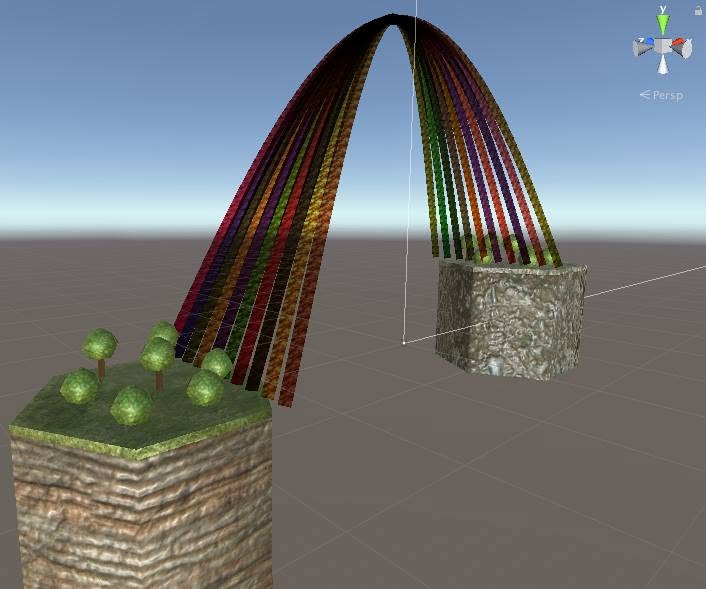

*Actually: Hex island variant — sediment vs gravel node materials.*

> **Mimsy:** Gravel node — the *proletariat* hex! I'm openly commissioning a catalog.

> **Gregory:** Gravel is distressed asset class. Long sediment, short gravel.

> **Margot:** Gravel is where they dump the nodes that complained.

> **Helena:** Gravel remembers footsteps. Sediment remembers silence.

> **Bunny:** Gravel is crunchy. Like paths in the garden.

### Multi-Bow Harbor

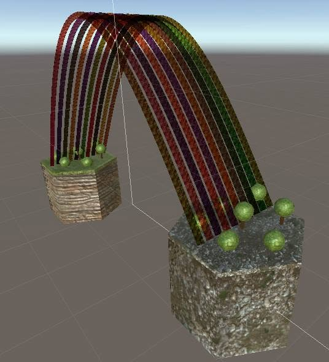

*Actually: Multiple Rainbow bows between hex island nodes.*

> **Mimsy:** Harbor of bows! Maritime semiotics! *Nautical*!

> **Gregory:** Harbor is offshore liquidity pool. Bows are swap lines.

> **Margot:** Harbor fees are administrative violence with water shaders.

> **Helena:** Harbor — souls arrive tired. I did.

> **Bunny:** Boats? I love harbors. Do we get boats in Room VI?

### Hex Lattice — Five-Bow Crossing

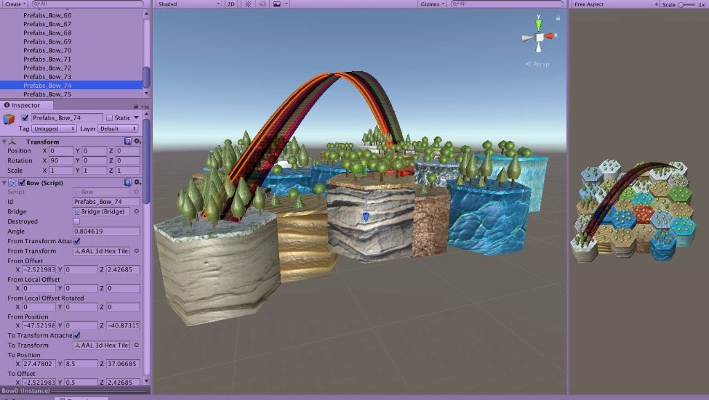

*Actually: Dense hex lattice with five bow ribbons crossing.*

> **Mimsy:** Five-bow crossing — *intersectionality* literalized! Wine.

> **Gregory:** Crossing is multi-leg options strategy. Beautiful greeks.

> **Margot:** Crossings are where they tax the desperate.

> **Helena:** Crossroads. Choose. I chose wrong once.

> **Bunny:** Five rainbows at once! Lucky.

### Archipelago Dusk

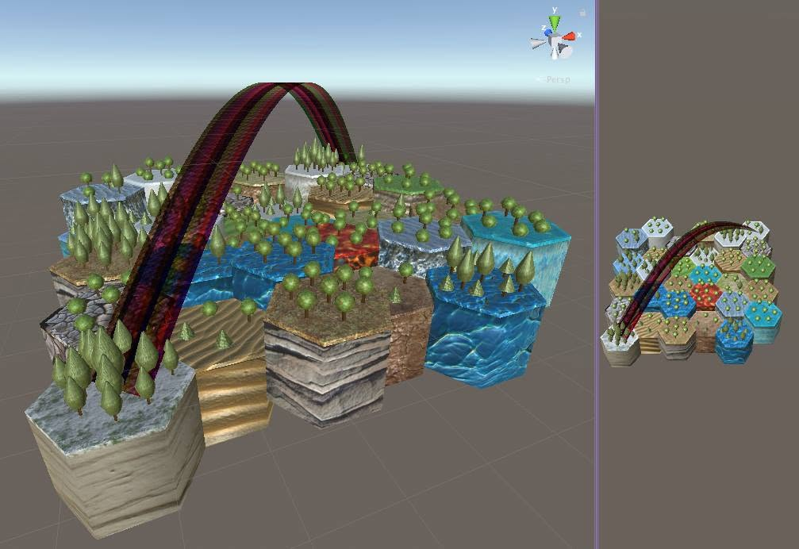

*Actually: Late hex-island phase — multi-ribbon over pillar field.*

> **Mimsy:** Dusk on the archipelago — *melancholy* liquidity! Acquired.

> **Gregory:** End of hex book. Rotating into terrain fund.

> **Margot:** Dusk hides the evictions.

> **Helena:** Dusk prayer. The islands sleep.

> **Bunny:** Pretty sunset broccoli forest.

---

## Room VI — Suburban Ribcage

*Suburban Ribcage*

Helena's arc peaks here. She walks the ribcage tunnel twice. Margot cries openly next to the suburban biome patchwork. Julian is overwhelmed and asks not to be looked at.

Gregory calls the tunnel a structured product with ribs as coupon payments. Bunny wants to lease the dinosaur hallway. Vandermeer says light at the end of the tunnel is always already capital. Bucky Jr. says the vault bones are clean.

### Terrain Graph — Coastline I

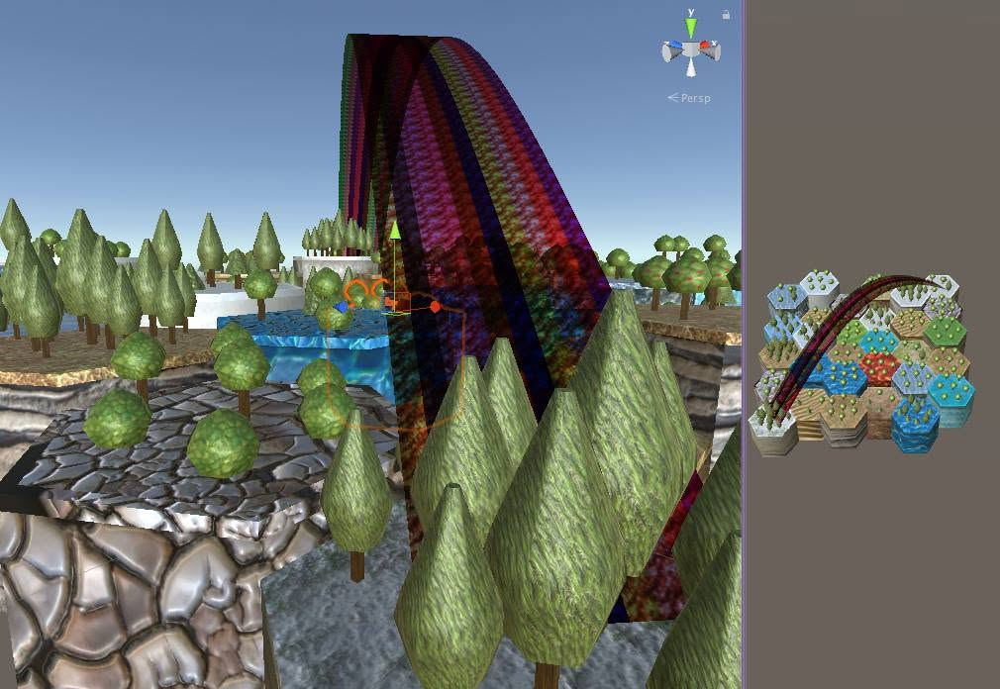

*Actually: Hex terrain map — water, grass, rock; graph over biome.*

> **Mimsy:** Coastline! The suburbs *discovered* water shaders!

> **Gregory:** Coastal property graph. Water shader is rising sea level risk.

> **Margot:** Suburban coast — where dreams drown politely.

> **Helena:** Water line — baptism boundary. I crossed.

> **Bunny:** Beach! Can the board approve beach houses?

### Terrain Graph — Biome Patchwork

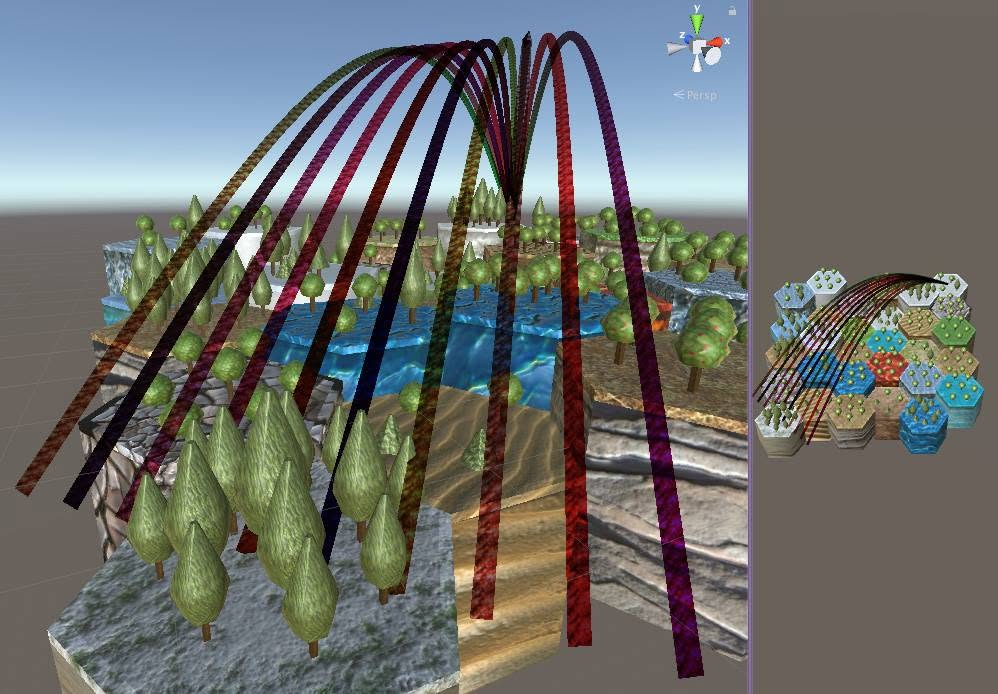

*Actually: Grass, rock, snow biome tiles with graph edges.*

> **Mimsy:** Patchwork biome — *quilt* of colonial extraction!

> **Gregory:** Biome tiles are sector ETFs. Snow is defensive.

> **Margot:** Patchwork hides whose land this was.

> **Helena:** Snow covers what summer exposed.

> **Bunny:** Snow and grass! Four seasons in one picture.

### Terrain Graph — Inland Variant

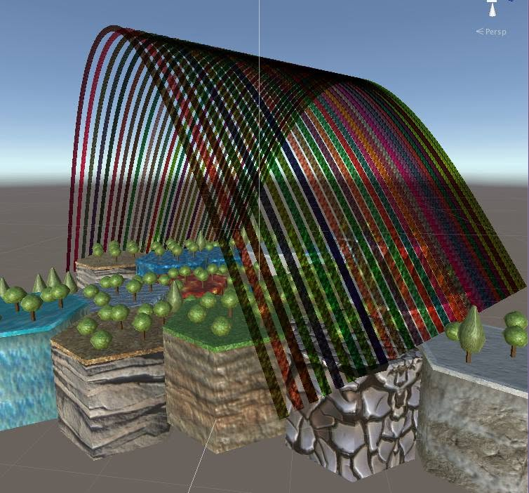

*Actually: Inland terrain graph variant.*

> **Mimsy:** Inland — away from the *coastal metaphor*! Brave.

> **Gregory:** Inland rotation — commodities over coastal REITs.

> **Margot:** Inland is where they move the poor.

> **Helena:** Inland — where you go when the coast disappoints.

> **Bunny:** No beach but still cute hills.

### Ribcage Tunnel — Portal I

*Actually: Parallel arch tunnel over biome graph — ribcage structure.*

> **Mimsy:** RIBCAGE TUNNEL! The body politic *exhales*!

> **Gregory:** Tunnel is structured product. Ribs are coupon payments.

> **Margot:** The ribs are administrative overhead crushing the suburban dream. I'm openly crying.

> **Helena:** (standing) The tunnel is confession. Walk through or don't. I walked.

> **Bunny:** Ribcage! Is that a dinosaur? I'd live in the tunnel.

### Ribcage Tunnel — Portal II

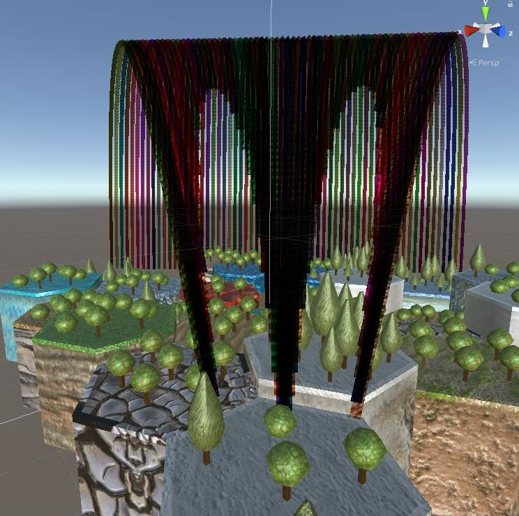

*Actually: Ribcage tunnel variant over terrain.*

> **Mimsy:** Portal two — the ribs *inhale*! Medical gothic!

> **Gregory:** Second tunnel tranche — oversubscribed.

> **Margot:** Second tunnel — they charge double for repentance.

> **Helena:** I walked again. Different sin this time.

> **Bunny:** Dinosaur hallway still available for lease.

### Ribcage Tunnel — Exit Light

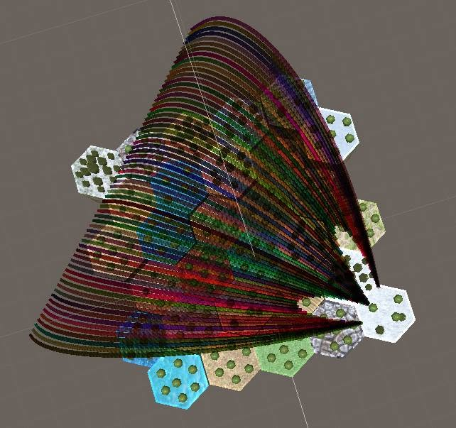

*Actually: Late terrain ribcage — exit from hex biome graph phase.*

> **Mimsy:** Exit light at the ribcage — *redemption* shader!

> **Gregory:** Exit light is IPO window. I'm distributing.

> **Margot:** Exit light is marketing for the next choke.

> **Helena:** Light at the end. I believed it. Still do.

> **Bunny:** Bright end! Like a fridge light. Home.

---

## Room VII — Plaid Peacock of Capital

*Plaid Peacock of Capital*

Terminal stress. Mimsy screams about the plaid peacock of capital and the Unity gizmo as the eye of God. Gregory shorts the plaid and goes long the water shader. Vandermeer proves Scotland invented blockchain via tartan.

The room is too loud for Helena, who lowers her eyes at the multiplied peacock eyes. Bunny asks if it is Thanksgiving and whether she may live in the tail feathers pending board approval.

### Plaid Peacock — Ribs I

*Actually: Plaid peacock ribs, checkered arcs — stress test goes feral.*

> **Mimsy:** (screaming softly) PLAID PEACOCK OF CAPITAL! The Unity gizmo is the eye of God!

> **Gregory:** Stress test successful. I'm short the plaid. Long the water shader.

> **Helena:** The peacock opens. Too much glory for one room.

> **Bunny:** Pretty bird pattern! Is it Thanksgiving?

### Plaid Peacock — Ribs II

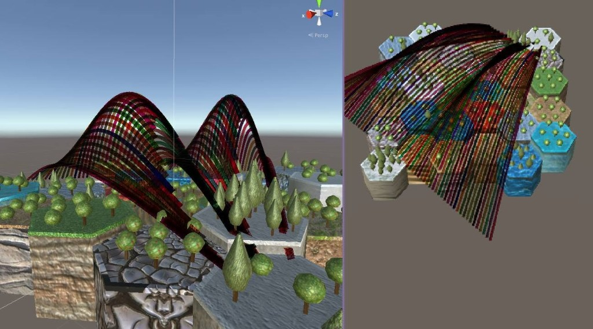

*Actually: Checkered arc variants on peacock rib structure.*

> **Mimsy:** Variant peacock — the bird *multiplies*! Whitney regrets!

> **Gregory:** Doubling plaid exposure — hedge with solid black arc.

> **Helena:** Too many eyes watching. I lowered mine.

> **Bunny:** Two peacocks! One for me, one for board.

### Plaid Peacock — Landscape Backdrop

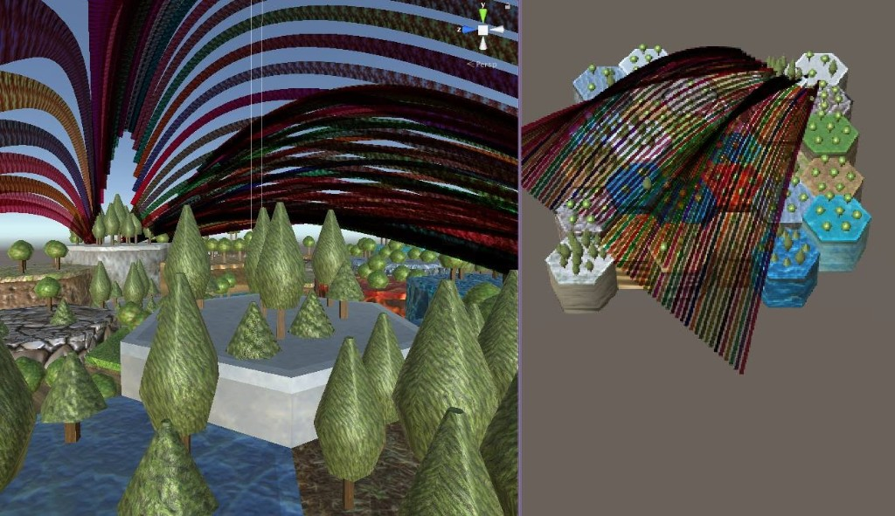

*Actually: Plaid ribs with landscape backdrop shader.*

> **Mimsy:** Landscape backdrop — *pastoral* capital! Criminal and lush!

> **Gregory:** Backdrop is macro overlay. Plaid still short.

> **Helena:** Pastoral fake, grief real. Odd pairing.

> **Bunny:** Nice wallpaper behind the bird!

### Plaid Peacock — Terminal Stress

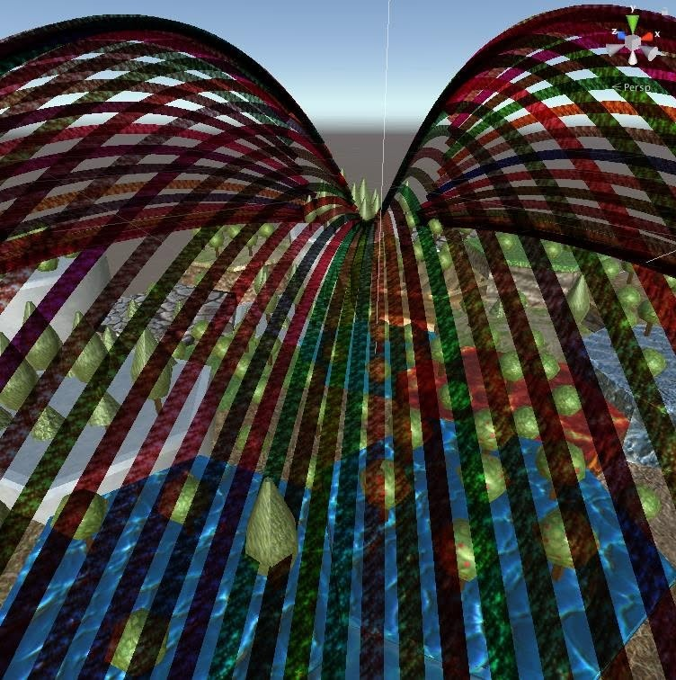

*Actually: Maximal baroque stress-test — plaid peacock over hex terrain, landscape.*

> **Mimsy:** TERMINAL! The work *screams* for pie menus! I scream with it!

> **Gregory:** Terminal frame — closing fund. Plaid was right to short.

> **Helena:** End of the tunnel, beginning of something. Sermon later.

> **Bunny:** Biggest bird! I'd live in the tail feathers if board says yes.

---

## Room VIII — Creature Serialization

*Creature Serialization*

Years earlier on Facebook, commenters got the joke. Here in Room VIII the patrons finally circle back — Helena addresses the room: "We were always the Bloop." Mimsy declares the Bleep Swarm a choir Whitney will regret not funding.

Bunny asks to adopt all the little singing friends. The Facebook chorus heckles from the guest book with pie-menu truth. Don's caption remains: no photo description available.

### Terracotta Blob with Bleep Attendants

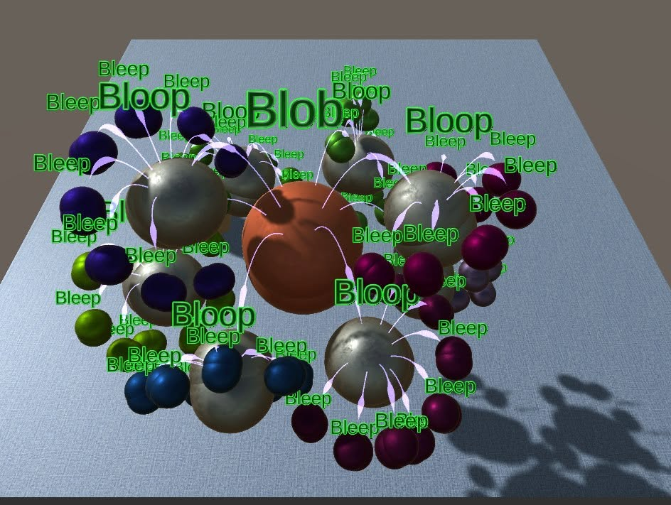

*Actually: Nested JSON as Blob/Bleep/Bloop — Facebook thread; pie-menu jokes land.*

> **Mimsy:** Terracotta Blob is pre-oedipal id — kiln of consciousness. Silver beads are superego. Sancerre tears.

> **Gregory:** Central illiquid asset, satellite holdings, green tickers like distressed ESG. Six figures if shadow longer.

> **Helena:** Something here remembers being touched. I don't know by whom.

> **Bunny:** Big orange friend with little silver pets! Adorable.

### Covenant Bridge (Rainbow Variant)

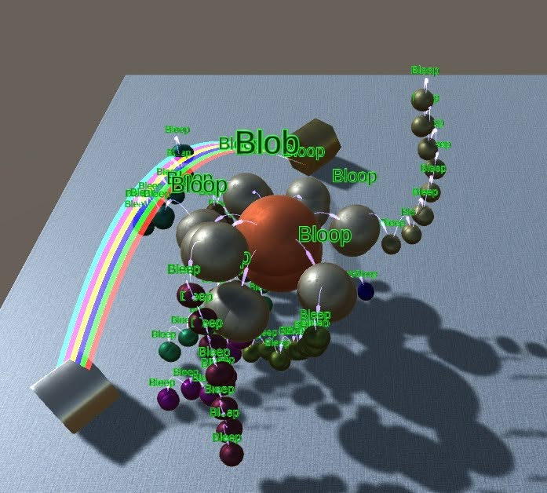

*Actually: Rainbow bridge between JSON creature nodes — multi-bow ribbon.*

> **Mimsy:** Rainbow bridge — covenant after the flood of metadata! Literally vibrating.

> **Gregory:** Yield curve in denial. Multi-colored tranches routing cube to core.

> **Helena:** Bridge for souls who cannot otherwise reach the center.

> **Bunny:** Rainbow bridge to the orange friend! I'd walk it.

### Pearl Collar Presentation

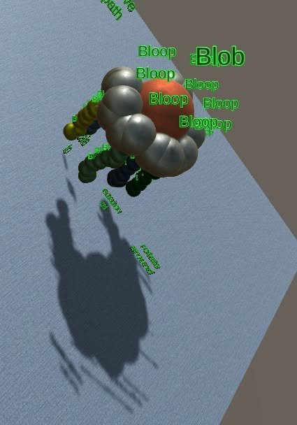

*Actually: Pearl collar on nested JSON creature — orange nucleus presented.*

> **Mimsy:** Pearl collar — court dress! Orange nucleus presented to society. Deceased. Wine.

> **Gregory:** Collar is covenant wrapper. Nucleus is core asset. Presenting to LPs.

> **Helena:** Presentation day. I wore pearls once. Wrong room.

> **Bunny:** Necklace on the blob! Fancy.

### Bleep Swarm (Choir Study)

*Actually: Bleep swarm around Bloop — JSON tree as creature choir.*

> **Mimsy:** BLEEP SWARM IS THE CHOIR! Whitney will regret not funding this!

> **Gregory:** Swarm is distributed ledger of bleeps. Choir is consensus mechanism.

> **Helena:** (to the room) We were always the Bloop. I am moved beyond speech.

> **Bunny:** Little friends singing! Can I adopt all of them?

---

## Coda — the Facebook chorus

Real commenters — not patrons — who got it:

- *such pie such serialise such wow* — Simon Alkemade
- *3D pie menus!* — Jon Trudel
- *So this is the new bleep/bloop menu?* — Brendan Fagan
- *I thought this was some 3D follow on to pie menus* — Ron Natalie
- *Now do it in 64k* — Nuey San Waldman

**Artist footer:** Pie menus were right all along — serialize such wow.

---

## For agents and future galleries

| File | Purpose |
|------|---------|
| [`series.yml`](series.yml) | Repo truth, evolution phases, Unity components |
| [`reviews.yml`](reviews.yml) | Per-piece wall titles + eight critic reviews |
| [`critics.yml`](critics.yml) | Instance-first patron menagerie (fork for other shows) |
| [`lecture-selling-art-to-virtual-characters.md`](lecture-selling-art-to-virtual-characters.md) | Repo Show lecture — § auctions at ensemble beats |
| [`simoleon-auctions.yml`](simoleon-auctions.yml) | Patron wallets, premiere + scarcity auction modes |
| [`AUCTIONS.yml`](AUCTIONS.yml) | Lot ledger — hammer log after air |
| [`tour.md`](tour.md) | Machine-readable full review tables |
| [`INDEX.yml`](INDEX.yml) | Room advertisement |

Parent: [`../media.md`](../media.md) · [`../CHARACTER.yml`](../CHARACTER.yml)
