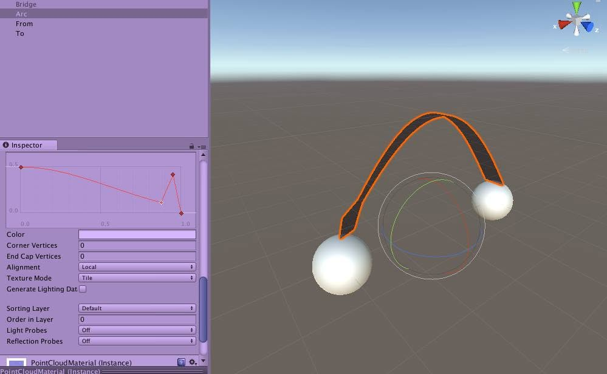
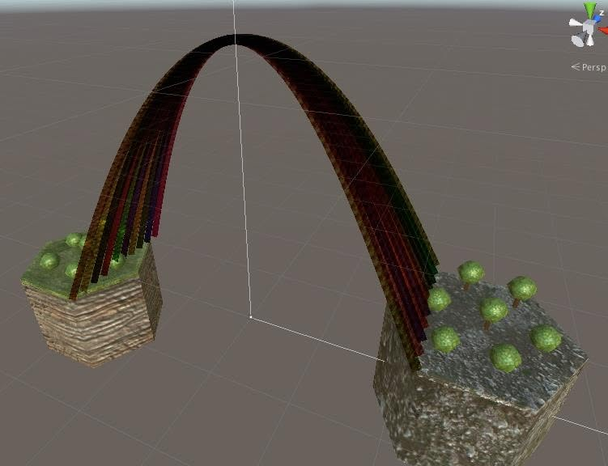
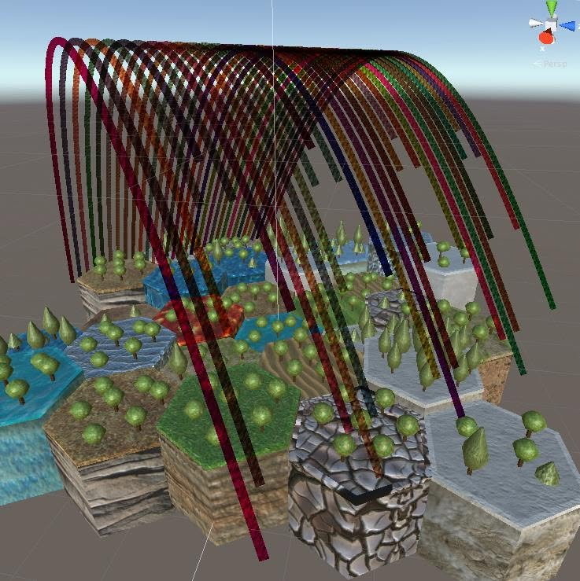
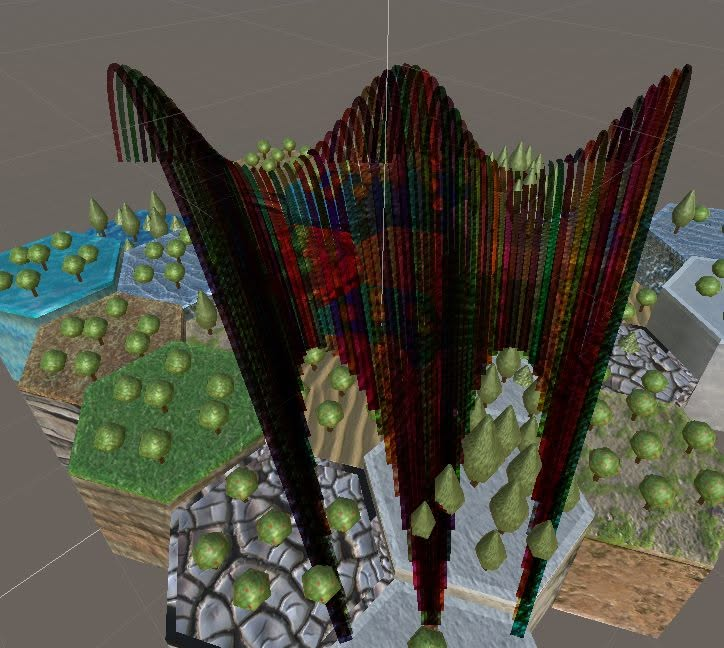
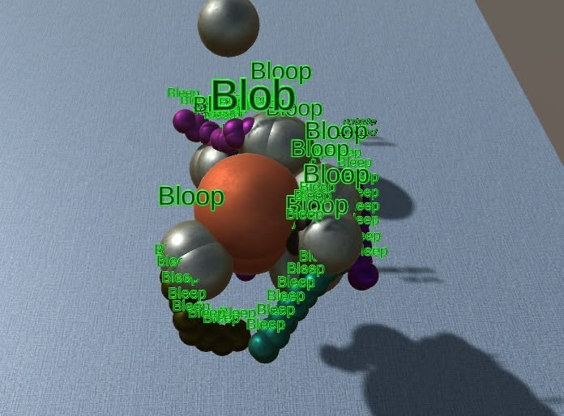

# Selling Art to Virtual Characters for Simoleons

*A Repo Show lecture — JSONsters gallery premiere. Performable segment; ~12–18 minutes with tour highlights.*

**Not AI Generated!**

---

## Cold open

You can sell art to people who are not people.

They will pay you in Simoleons — § — which are worth almost nothing and must never be confused with real money. That is exactly why the bit works.

Tonight the buyers are eight fictional Chelsea patrons who never read the wall text. They already misread every screenshot in this room. The next step is letting them *bid*.

---

## What I was actually making

**JSONsters** — JSON Monsters. Unity3D structural graphs: spheres, arcs, rainbow bows, hex islands, creatures named Blob, Bloop, and Bleep. Facebook, ~eight years ago. Caption: *No photo description available.*

I pasted screenshots **reverse-chronological**. Frame 01 is the essential original — two nodes, one black Arc. Frame 28 is the plaid-peacock stress test that screams for pie menus.

Will Wright might call what happened in the comments the **simulator effect**: viewers simulate a world onto your data until the data blushes.

We call it **reverse over-engineering**. The industrial graph was the truth. The patrons brought the fiction. The fiction is now the show.

---

## The menagerie (your customers)

These are **instance-first** characters — fork them for the next gallery. They have wallets in [`simoleon-auctions.yml`](simoleon-auctions.yml).

| Patron | § (start) | How they bid |
|--------|-----------|--------------|
| **Mimsy Caldwell** | 120,000 | Impulse. Buys before the sentence ends. |
| **Gregory Kwan** | 850,000 | Portfolio logic. Shorts the plaid verbally. |
| **Prof. Vandermeer** | 2,400 | Adjunct budget. Pays in footnotes. |
| **Bucky Jr.** | 18,000 | Only if the curve is tensile-honest. |
| **Helena Featherstone** | 420,000 | Whisper → sermon → premium at tunnels. |
| **Margot Krell** | 22,000 | Hostile acquisition through open crying. |
| **Julian Strait** | 45,000 | Arrives late. Wins anyway. |
| **Bunny Whitmore** | 999,999 | Richest. Most wrong. Happiest. |

Rosebud and Klapaucius flow § **to** the audience. This auction flows § **from** the nut jobs **to** the house. Same KACHING sound. Opposite direction. Don Philahue keeps the ledger.

---

## Ensemble beats (where the hammers fall)

**Full opening script:** [`art-opening-night.yml`](art-opening-night.yml) — fifteen magnificent auctions (two grandest per series), seventeen quick red-dot sales, crypto/NFT parody woven through patron lines.

Do not auction all thirty-two lots on night one. **Magnificent two per series** get brisk hammers; everything else is salon delight — gasp, misread, red dot, *KACHING*, move on.

### Crypto parody (running gag, not a lecture)

Gregory calls it an NFT collection. Don says it's a Facebook album. Vandermeer proves Scotland invented the blockchain. Bunny thinks red dots are mint buttons. Donna drops a tremendous JPEG of herself on every lot. Doctor No bids with declared bias. Palm offers 🐒✋🌴 — not minting. The Facebook chorus already got pie menus right for free.

Sell the **story beats** (subset of magnificent lots):

### 1 — Mimsy / Gregory bid war (frame 01)

Mimsy: *"The restraint is aggressive. I bought it before finishing my sentence."*

Gregory: *"Source node, sink node, one conduit. This is how I wish my books looked."*

**Auction:** Opening duel. Mimsy impulse premium vs Gregory rational match. Hammer ~§18,000. *KACHING.*

### 2 — Vandermeer / Margot hex fight (frame 14)

Class allegory vs administrative violence. Bunny asks if the pillars are broccoli. Gregory explains GME for land use.

**Auction:** Chaos lot. Bunny may accidentally take it for §200,000.

### 3 — Helena's ribcage sermon (frame 22)

Helena stands. *"The tunnel is confession. Walk through or don't. I walked."*

**Auction:** Sermon premium. Often no counterbid. The room is embarrassed to compete with redemption.

### 4 — Plaid peacock scream (frame 25)

Mimsy screaming softly. Gregory: *"I'm short the plaid. Long the water shader."* He passes. Mimsy does not.

### 5 — Bunny adopts the Bleep swarm (monster era)

Bundle optional: Blob, rainbow bridge, pearl collar. Helena: *"We were always the Bloop."*

**Auction:** Benefactor whale bid. Facebook chorus heckles from chat — they are **not** eligible to bid. They already got pie menus right.

---

## The Facebook chorus (ground truth, no §)

Real commenters — not patrons:

- *such pie such serialise such wow*
- *3D pie menus!*
- *So this is the new bleep/bloop menu?*

They are the hecklers who understood the work for free.

---

## Later: scarcity auctions

When we have **fewer pieces** left on the wall — or when a character **needs money** on the record — we run a second mode:

- Unsold lots from [`AUCTIONS.yml`](AUCTIONS.yml) go back under the hammer.
- A broke patron sells their "collection" (secondary market comedy).
- Don or a guest's `simoleons:` field is low → fundraiser beat → the lunatics save the artist with §.

Same eight voices. Escalating in-character bids. Gregory cites gamma exposure on a *Bow4 LineRenderer autopsy*. Vandermeer proves Scotland invented the auction.

Commit protocol: edit patron `simoleons`, credit show pool, append `hammer_log`, git commit. Play money only. Perform it straight.

---

## Close

The art is Unity Inspector screenshots.

The patrons are a simulation — **for now, trapped in this gallery story.**

**Later they jump out:** graduate to [`characters/menagerie/`](../../menagerie/GRADUATION.yml), copy into `repo-shows/<show>/audience/fictional-*`, and **perform live** — bidding §, misreading whatever is on the projector, bantering with real guests. JSONsters lecture is their origin myth; every future show is a sequel.

The Simoleons are a joke.

The ledger is real — in the repo, on the record, next to Rosebud.

**Pie menus were right all along. Serialize such wow. *KACHING.***

---

## Production

| File | Role |
|------|------|
| [`art-opening-night.yml`](art-opening-night.yml) | **Opening script** — run-of-show, tiered sales, crypto parody |
| [`simoleon-auctions.yml`](simoleon-auctions.yml) | Wallets, modes, bid bands, ensemble beats |
| [`AUCTIONS.yml`](AUCTIONS.yml) | Lot status + hammer log (fill after air) |
| [`critics.yml`](critics.yml) | Patron voices — fork for next gallery |
| [`reviews.yml`](reviews.yml) | Per-piece misreadings fuel bid dialogue |
| [`README.md`](README.md) | Full embedded tour |
| [`tour.md`](tour.md) | Machine-readable review tables |

Show seed: [`../../repo-shows/ideas/jsonsters-gallery-lecture.yml`](../../repo-shows/ideas/jsonsters-gallery-lecture.yml)

Parent: [`../CHARACTER.yml`](../CHARACTER.yml) · Simoleon ethics: [`../../don-philahue/CHARACTER.yml`](../../don-philahue/CHARACTER.yml)
