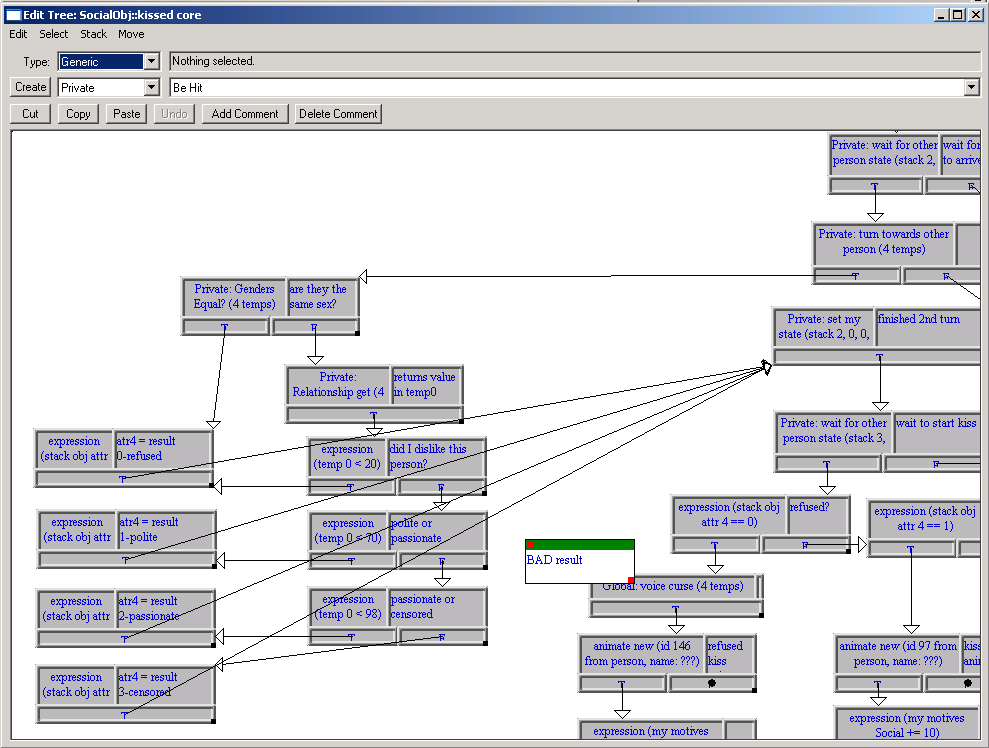
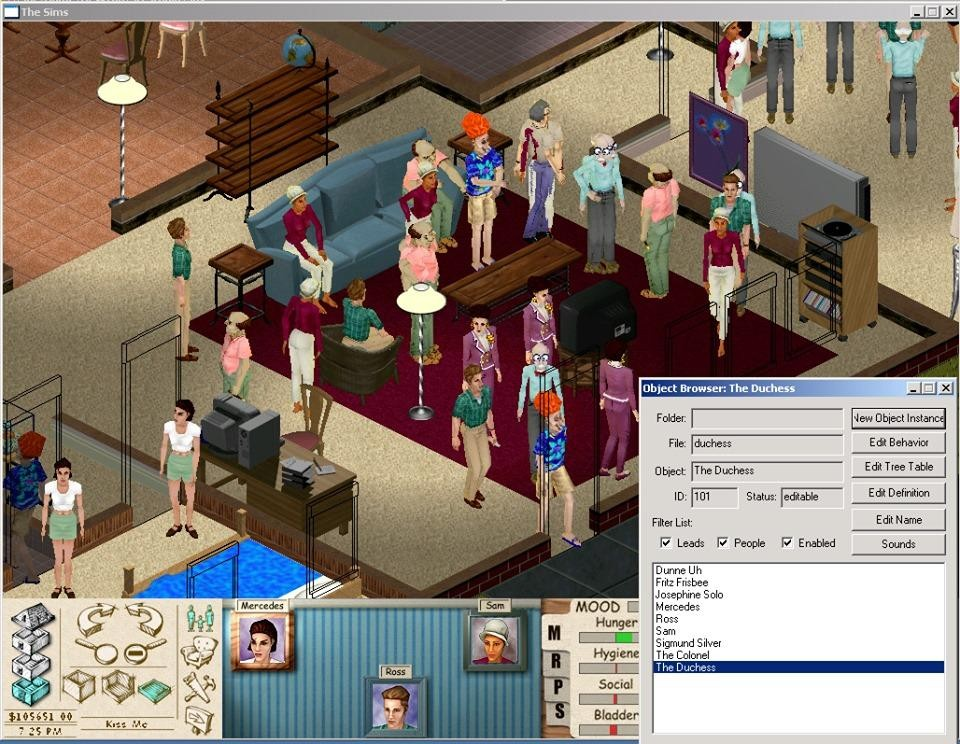
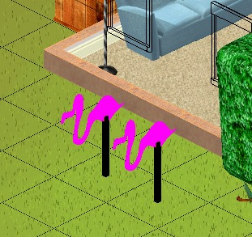
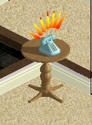
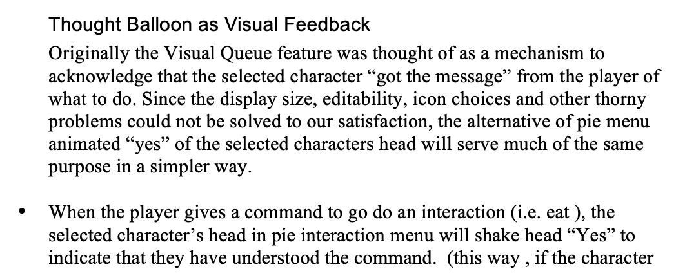
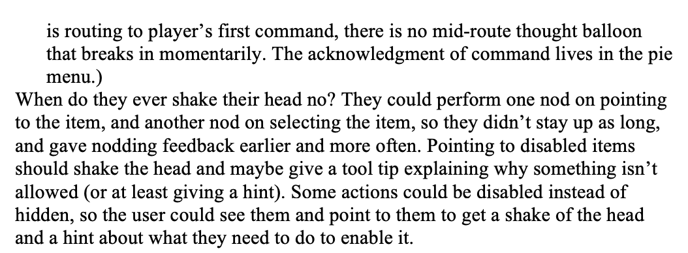

# The Sims Steering Committee tweets — SimAntics kiss code and prototype artifacts

Don's tweets documenting the **June 4, 1998 "Sims Steering Committee" internal release** — the
prototype whose SimAntics code enacted the kiss → slap rule that Don flagged in his August 1998
design reviews. These are the primary visual evidence behind
[the record on same-sex relationships](../../patrick-j-barrett-iii/same-sex-relationships-the-record.md).

Images here are the originals (full-resolution `pbs.twimg.com` downloads where the tweets are
still fetchable, Don's own archives otherwise) — not screenshots of Twitter.

---

## The offending tree code

> Here's the offending "tree code" from "The Sims Steering Committee" internal release of
> June 4, 1998.

— [@xardox, 19 Jul 2019](https://twitter.com/xardox/status/1152266586025332736), replying to
Phil Salvador ([@itstheshadsy](https://twitter.com/itstheshadsy/status/1151868012707962881),
account now protected), whose 18 Jul 2019 thread broke the news of the
[design documents](https://donhopkins.com/home/TheSims/) going public.

**What the screenshot shows:** Edith's Edit Tree window on `SocialObj::kissed core`. The
branch labeled **"Private: Genders Equal? (4 temps) — are they the same sex?"** routes same-sex
kiss attempts through "did I dislike this person?" to a **BAD result**: refused-kiss animation
and a voice curse. The heterosexist rule was never written in any design document — it existed
only here, in the visual program. Procedural rhetoric in the wild: the code argued what no
document said.

Phil Salvador's thread also surfaced that **Will Wright's notebooks** (Museum of Play) listed
"same sex move-in romance" as a potential feature — the intent was in the air; the prototype
just hadn't caught up.

## The Steering Committee demo

> Also here's a demo of "The Sims Steering Committee" release, a very early version of the game
> from June 4 1998 (almost two years before the March 2000 release) that we distributed
> internally at EA to convince them please not to cancel our poor little game.

— @xardox, 19 Jul 2019, same thread ·
[YouTube: The Sims Steering Committee — June 4 1998](https://www.youtube.com/watch?v=zC52jE60KjY&list=PLX66BqHq0qTALz3a_5EkAsJgzpehU_Bul)

Also posted standalone for the game's 20th birthday:
[@xardox, 31 Jan 2020](https://twitter.com/xardox/status/1223211835823984642) — *"The Sims
turns 20 today! Here's an early pre-release version of The Sims for The Sim Steering Committee,
from June 4 1998."*

The playable build was later preserved on
[archive.org](https://tcrf.net/Proto:The_Sims_(Windows)/The_Sims_Steering_Committee) (released
27 Oct 2023).

## Edith and the old gang

> It includes an old klunky version of Edith (the "EDIT House" game programming tool). I listed
> out all the people, clicked "New Object Instance", and got the old gang of original Sims back
> together (including lots of extra clones)! Check out Archie Bunker with a cigar in his hand!

— @xardox, 19 Jul 2019, same thread

## Prototype color

> The flamingos were pretty ugly:

> Not to mention the phone that looked like it had Halloween candy corn springing out of it
> whenever you got a call, and the carpet that looked like 40 grit sandpaper (but at least it
> kept their feet from skating and moon walking)!

— @xardox, 19 Jul 2019, same thread

## Pie menu nod/shake proposal (bonus, 2024)

> When I designed and implemented the pie menus in The Sims 1, I wrote a proposal for nodding
> or shaking the head according to how the Sim felt, but it didn't make it into the game, since
> that required more production work, and we needed to finish and ship.

— [@xardox, 6 Aug 2024](https://x.com/xardox/status/1820723967121822161), excerpting
[Draft 5, 31 Aug 1998 (PDF)](https://donhopkins.com/home/__/TheSims/TheSimsDesignDocumentDraft5-1998-08-31-DonsReview.pdf)

---

## See also

- [The record: how same-sex relationships really got into The Sims](../../patrick-j-barrett-iii/same-sex-relationships-the-record.md)
- [Integrated timeline — Don + Patrick](../../patrick-j-barrett-iii/sources/same-sex-relationships-integrated-story.md)
- [Design docs hub on donhopkins.com](https://donhopkins.com/home/TheSims/)
- [Steering committee demo source page](../../will-wright/sources/1998-06-04-sims-steering-committee-demo/README.md)

↑ [Don's media catalog](../CATALOG-INDEX.yml) · [Don's guest hub](../../README.md)
