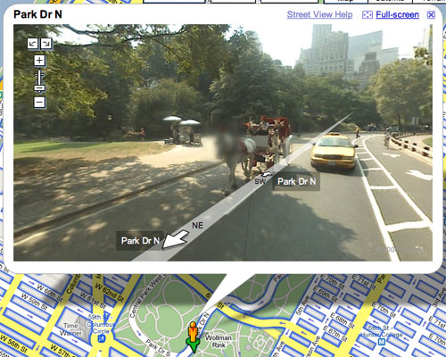

# "Why the long face?" — Jamie Zawinski (LiveJournal, 14 May 2008)

**Author:** [Jamie Zawinski](https://www.jwz.org/) (jwz)  
**Posted:** Wed, 14-May-2008 10:53 AM  
**URL:** https://jwz.livejournal.com/885506.html  
**Wayback:** https://web.archive.org/web/20080519122810/https://jwz.livejournal.com/885506.html  
**Tags:** maps, www  
**Music:** Northern State — Better Already

---

Google has begun [blurring faces](http://google-latlong.blogspot.com/2008/05/street-view-revisits-manhattan.html) on Street View:

This reminds me of the "censorship" pixelization code in The Sims that prevents you from ever
seeing their little **1×2-pixel SimRogenous zones**. (**Don Hopkins** once told me a long story
about how hard that was to implement...)

There are also now Wikipedia links in the maps (checkbox on the "More" tab). There aren't very
many of them, though. Anyone know what triggers their presence?

## Secondary thread (same post)

Commenters dig into **Wikipedia geo coordinates** → **geo microformat** → jwz's existing
`<META NAME="geo.position" CONTENT="37.771007;-122.412694">` on DNA Lounge pages vs Google's
pick of Wikipedia `{{coord}}` templates. jwz: *"How many more formats am I going to have to
present this nonsense in?"*

Full comment thread: [`jwz-livejournal-comments-full.md`](jwz-livejournal-comments-full.md)

## Show hooks

| Angle | Guest / bit |
|-------|-------------|
| **SimRogenous** coinage | Don — the "long story" jwz references; shimmer RNG, no mesh underneath |
| Horse face blur vs human faces in carriage | Comedy bit — bad AI or sentient-horse humor |
| Maps + semantic web formats | jwz DNA Lounge geo tags; Wikipedia coord microformats |
| Pixelation then and now | Bridge to [HN 2022 pixelation thread](../../sims-pixelation-censorship-hn-2022.md) |

↑ [Bundle README](README.md)
