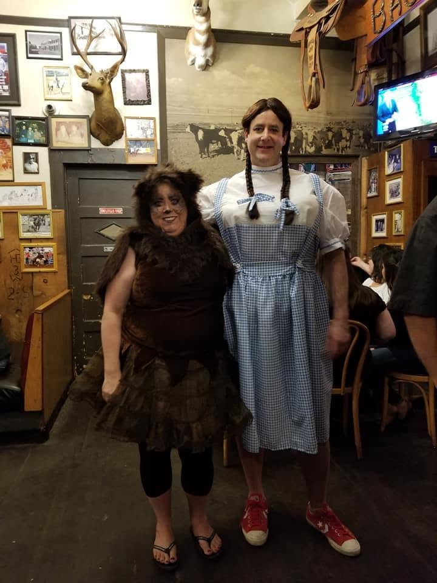

# Weird Sims objects on a Windows XP VM — 20th anniversary, 12 May 2019

*Source:* Don Hopkins to Maxis Alumni, **12 May 2019** —
[post](2019-05-12-maxis-alumni-post.jpg) · [comments](2019-05-12-maxis-alumni-comments.png).
18 reactions, 7 comments.

> "I realized the **20th anniversary of The Sims** is looming, so I dusted off some of my old weird
> Sims objects **and Edith**, and got them running in a **Windows XP virtual machine**! Anybody have
> some favorite objects you have sitting around or you'd like me to dig up? I've got an entire
> archive of **Heather Castillo's SimFreaks** collection, and all of the **SimSlice** objects, the
> **Cupid sculpture** that makes you fall in love with anyone in the neighborhood, the **Crowd
> Sitter** that makes lots of people shut up and sit down, and **Satan** of course!"

And the shared post underneath: *"Just got The Sims 1 running on a virtual machine! Going through my
piles of old weird Sims objects…"* — with a 1:30 video of a Sim standing on grass under a plumbob
beside a boxy robot object and a scatter of bowling pins.

**This is a preservation status report disguised as an anniversary post.** *Edith* — the SimAntics
visual programming environment — running again, in 2019, in a VM, along with an archive of
third-party object collections that no longer exist anywhere else.

## What's confirmed running

| Artifact | Status |
|---|---|
| **The Sims 1** | running on a Windows XP VM |
| **Edith** | *running* — the in-house SimAntics editor |
| **SimFreaks archive** (Heather Castillo) | *"an entire archive"* — [catalog](../../../../catalogs/simfreaks/README.md) |
| **SimSlice objects** (Steve Alvey) | *"all of"* — [catalog](../../../../catalogs/simslice/README.md) |
| **Cupid sculpture** | falls in love with anyone in the neighborhood |
| **Crowd Sitter** | *"makes lots of people shut up and sit down"* — [its own page](../../../will-wright/sources/2018-04-23-sims-crowd-sitter/README.md) |
| **Satan** | "of course" |

## The emerald plumbob

> "Maybe I should make a **translucent Emerald green plumb-bob texture with platinum trim**, to
> celebrate the 20th anniversary! 😉"
> → [Anniversary List — Chart of Gemstone and Jewelry Gifts](http://www.bernardine.com/jewelry-anniv.htm)

The traditional 20th-anniversary gifts are **emerald** and **platinum**. The Plumbob is already a
floating green gem. The joke writes itself and Don went to a jewelry chart to check it — which is
also, unintentionally, a proposal for the least invasive possible anniversary mod: retexture the
franchise's icon in its own anniversary stone.

Worth doing, and worth knowing that the icon in question is
[placeholder art Charles London was forbidden to update](../../../charles-london/README.md).

## Freakslice

> "Congratulations to **Heather Castillo (SimFreaks)** and **Steve Alvey (SimSlice)** on their
> marriage engagement! Rumor has it they're changing their last names to **Freakslice**."

**The two largest Sims 1 third-party object studios married each other.** SimFreaks and SimSlice were
the load-bearing content sites of the original custom-object economy; their proprietors are a couple.
Rooms: [Heather Castillo](../../../heather-castillo/README.md) ·
[Steve Alvey](../../../steve-alvey/README.md) · show seed:
[heather-and-steve](../../../../repo-shows/heather-and-steve/README.md).

*(Note on names: **Heather Alvey** is the account that replies "Lol. Busted!" below. This repo uses
**Heather Castillo** throughout, the name she published under.)*

### Transmogrify Self

> "Looks like Steve and Heather have both been using **'Transmogrify Self'**:"

> **Heather Alvey:** *"Lol. Busted!"*

Steve in Dorothy's gingham and red shoes, Heather as the Cowardly Lion. Don frames it as a **feature
name**: [Transmogrifier](../../../will-wright/sources/2004-transmogrifier-documentation-hub/README.md)
was his own tool for exporting, editing and reimporting Sims objects, so a costume becomes an
invocation — *Transmogrify Self* on two people who spent years transmogrifying everything else.

## Satan, invited to the wedding

> "**I've invited some guests for your wedding in The Sims!**"

**The Edith object browser on the left, and its consequences on the right.** Don selected **NPC
Satan** and spawned a congregation of him — a lawn full of identical dark-suited figures milling
around a small house, invited to a real couple's wedding as a joke told *in the object system* rather
than about it.

This is the single most useful screenshot in the thread: **Edith and the running game side by side, in
2019**, which is the whole argument for the VM. The tooling still works, so the objects are still
editable, so the archive is still live rather than merely stored.

## Jenny Martin's question

> **Jenny Martin:** *"Do you have the original demo?"*

**Unanswered in the screenshot.** "The original demo" most likely means the pre-release Sims demo /
**SimShow**-era public build, or the [steering committee build](../../../will-wright/sources/1998-06-04-sims-steering-committee-demo/README.md).
Follow up — she is a Maxis Alumni admin and the person who
[posted the Commodore 64 SimCity disk](../../../will-wright/sources/2017-04-28-simcity-c64-floppy/), so
the question may be an offer.

*(Jenny Martin is **not** [Jerry Martin](../../../jerry-martin/) the composer. Different people.)*

## Open

- [ ] **Publish the VM recipe.** Sims 1 + Edith on Windows XP under emulation is a reproducible
      preservation result; write it up.
- [ ] Post the 1:30 video somewhere durable
- [ ] Answer Jenny Martin: which demo, and does it exist?
- [ ] Make the **emerald plumbob**
- [ ] Inventory the SimFreaks and SimSlice archives against the catalogs
- [ ] Confirm the Cupid sculpture's author (SimSlice? SimFreaks? Don?)

## Repo orbit

- [Crowd Sitter](../../../will-wright/sources/2018-04-23-sims-crowd-sitter/README.md) — named here, has its own page
- [Transmogrifier documentation hub](../../../will-wright/sources/2004-transmogrifier-documentation-hub/README.md) · [naming saga](../../../will-wright/sources/2000-05-17-transmogrifier-naming-saga/README.md)
- [SimFreaks](../../../../catalogs/simfreaks/README.md) · [SimSlice](../../../../catalogs/simslice/README.md)
- [Heather Castillo](../../../heather-castillo/README.md) · [Steve Alvey](../../../steve-alvey/README.md) · [heather-and-steve show](../../../../repo-shows/heather-and-steve/README.md)
- [Edith / SimAntics demo](../../../will-wright/sources/don-youtube-exdu4ETscs-edith-simantics-demo/README.md)
- [Livin' Large crew, with Dr. Strange and Gnomingo](../../../will-wright/sources/2010-03-11-livin-large-team-photo/README.md) — the in-house version of the same joke instinct
