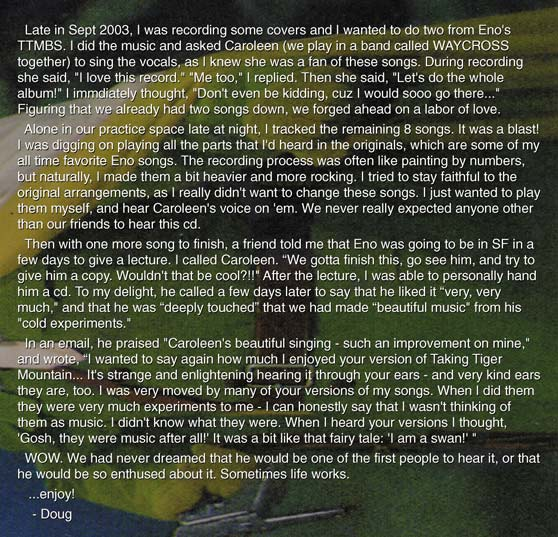

# Doug Hilsinger — media 🐅

*Primary-source images kept with Doug's portrayal. Captions are factual; tell us any corrections.*

**`doug-hilsinger-caroleen-beatty-yourmusiclawyer.png`** — Doug and Caroleen, from the
[yourmusiclawyer.com feature](http://yourmusiclawyer.com/queues/2004/brian_eno/index.html) on the
album (the page that also hosts Eno's phone message). Doug is wearing what looks like a
**Nina Hagen** t-shirt.

**`doug-story-saucefaucet.png`** — screenshot of **Doug's own account** (from
[saucefaucet.com](http://www.saucefaucet.com/dug_notes.html) ·
[archive](https://web.archive.org/web/20230128165231/http://www.saucefaucet.com/dug_notes.html)) of
recording the all-by-hand cover of Brian Eno's *Taking Tiger Mountain (By Strategy)* with Caroleen
Beatty, and handing Eno a CD.

See the full story: [`../taking-tiger-mountain-by-serendipity.md`](../taking-tiger-mountain-by-serendipity.md).
