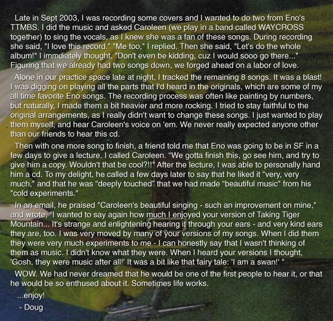

# Taking Tiger Mountain, by Serendipity 🐅🏔️

*A true story Don loves to tell — and would love to tell properly **with** Doug, Brian, Scott, and
Will. Album facts are public record (sources below); the San Francisco encounter is Don's own
recollection; Doug's account is quoted from his own site.*
[Portrayal standards](../../schemas/portrayal-standards.yml)

> **Why this is gold for the show:** Doug's record is a **tangible example of "honor by
> transformation" that Brian Eno already publicly loves** — Eno called it *"beautiful music"* made
> from his *"old experiments."* It's a gift to a guest: a way to let Brian hear his own 1974 work
> through **fresh ears**, warmly, with no ego at stake — because the transformation already won his
> blessing twenty years ago.

## The record

In **Fall 2003**, San Francisco multi-instrumentalist **Doug Hilsinger** re-recorded **Brian Eno's
*Taking Tiger Mountain (By Strategy)*** (1974) — the whole album, track for track — with vocalist
**Caroleen Beatty**. The soul of it was a self-imposed rule: **no keyboards, no synths, no
samplers, no drum machines.** Hilsinger played *everything* by hand — drums, bass, guitar, pedal
steel, sitar guitar, glockenspiel, melodica, autoharp, percussion, background vox, treatments — and
Beatty sang (and clapped). Recorded at **Saucefaucet Int'l** (his practice space and bedroom), it
turned Eno's famously **cold, machine-tinged** experiment **warm, organic, and aggressively
alive.** Released **May 18, 2004** on **DBK Works (CD #111)**, subtitled *"A Modern Revolutionary
Peking Opera"* — effectively a **30th-anniversary** tribute, arriving alongside Virgin's remastered
reissue of the original. The cover even uses the **same Chairman Mao-era postcard** Eno had bought
in **San Francisco's Chinatown** in 1972, which inspired the album's title and songs.

*(Doug and Caroleen are San Francisco scene veterans — both in **Waycross**; Doug played in **BOMB**
(Bill Laswell–produced) and **The Hall Flowers**; Caroleen fronted **The Bedlam Rovers** and
collaborated with **Jon Langford** of the Mekons. They performed the album live as the
**ENORCHESTRA**.)*

## Doug's own words

From [Doug's account on saucefaucet.com](http://www.saucefaucet.com/dug_notes.html):

> *"Late in Sept 2003, I was recording some covers and I wanted to do two from Eno's TTMBS… During
> recording she said, 'I love this record.' 'Me too,' I replied. Then she said, 'Let's do the whole
> album!'… Alone in our practice space late at night, I tracked the remaining 8 songs. It was a
> blast!… I made them a bit heavier and more rocking. I tried to stay faithful to the original
> arrangements… I just wanted to play them myself, and hear Caroleen's voice on 'em. We never really
> expected anyone other than our friends to hear this cd.… Then with one more song to finish, a
> friend told me that Eno was going to be in SF in a few days to give a lecture. I called Caroleen.
> 'We gotta finish this, go see him, and try to give him a copy. Wouldn't that be cool?!!' … I was
> able to personally hand him a cd. To my delight, he called a few days later to say that he liked
> it 'very, very much,' and that he was 'deeply touched' that we had made 'beautiful music' from his
> 'cold experiments.'… 'I am a swan!'… WOW. We had never dreamed that he would be one of the first
> people to hear it.… Sometimes life works."* — Doug

## Eno's blessing

Doug handed Eno a CD-R of rough mixes in **November 2003**, at an Eno lecture in San Francisco
(Pitchfork describes it as a **Long Now Foundation** appearance). Eno phoned a few days later:

> *"I am deeply moved by your versions of my songs… I like it very, very much!"* — Brian Eno

He thanked Doug for making *"beautiful music"* out of his *"old experiments,"* **wrote the liner
notes** for the release, and later told Pitchfork, dryly, *"They aren't bad songs after all."*

🔊 **Eno's actual phone message to Doug:**
[`audio/…PhoneMessageToDougHilsinger.mp3`](../brian-eno/audio/TakingTigerMountainBrianEnoPhoneMessageToDougHilsinger.mp3)
(also published via [yourmusiclawyer.com](http://yourmusiclawyer.com/queues/2004/brian_eno/index.html)
and [saucefaucet](http://www.saucefaucet.com/tiger.html)).

## The serendipity — Don meets Doug

This was **San Francisco, 2006**. A few days earlier, Don had been at the **Long Now talk where
Brian Eno and Will Wright spoke about generative art** — asking the pair a question from the floor —
and afterward joined **Will and Brian for dinner**, where he told Brian he wanted to introduce him
to his good friend **Scott Draves ("Spot")**, who hadn't been at the talk. They agreed to meet up a
few days later, while Brian was still in town. So that evening's gathering at **Scott's apartment**
(Don already knew Eno's music well; this was about bringing **Brian and Spot** together) was the
**introduction of Brian to Scott** — *not* Don's first meeting with Brian.

Then, **minutes after leaving Scott's place**, pure coincidence took over. Driving home from SF back
to Berkeley, Don thought: *the night is young, I've got nothing to do — why not finally explore a
renowned San Francisco bar I've never been to, right on my route toward the highway?* So he stopped
at **The Eagle** — the famous, historic SF gay **bear** bar, an inclusive, community-foundational
institution. It was practically empty, and the friendly bartender was **Doug** — whom Don was
**meeting in person for the first time**, though they'd unknowingly shared the audience at that very
**Long Now talk** a few days before (Doug, it seems, recognized Don as the guy who'd asked a
question). They got to talking, hit it off, and landed on **Eno** and the talk.

At some point Doug put on some music — **his own**, though he didn't say so. It *entranced* Don:
Eno's songs he knew by heart, in a warm, rocking version he'd **never** heard. He told Doug how much
he loved it. **Only then** did Doug reveal it was his own record — and he was **deeply moved** by
the compliment.

> Telling an artist you love a piece of music — when you don't even know **they** made it — is the
> sincerest form of tribute. The whole spirit of the album, mirrored back: Eno loved his own work
> *transformed* by Doug; Don loved Doug's work without knowing Doug had made it. Sincerity all the
> way down. 🐅

Doug gave Don a copy of the CD that night. That **one night in 2006 was the only time Don and Doug
have met.** (Don's reliable line back into this circle is **Will** — whom he keeps in touch with
regularly in the SF Bay Area — and **Scott**, with whom he still collaborates. That's why a
**reunion** inviting **Brian**, **Will**, and **Doug** is the dream.)

## Why it belongs in the show

- **Constraints create freedom** — the "no keyboards" rule is the most Eno-ish, most
  Oblique-Strategy move imaginable, and it's exactly what gives the cover its warmth and character.
- **Transformation as homage** — original → tribute → whatever we make next; the recursive move at
  the heart of the Repo Show, turned into a repeatable **audience activity** ("honor it by
  transforming it").
- **Fresh ears for the maker** — a rare gift to a guest: hear your own decades-old work re-grown by
  someone who loves it, with the blessing already given.
- **Scenius** — a Bay Area scene (Waycross, the ENORCHESTRA, Caroleen's Mekons ties) doing it for
  love, not money.

## Don's wish

Don and Doug met just that once, in 2006, and haven't been in touch since; Don has **reached out and
not yet heard back** (as of 2026). The hope is simple: **sing Doug's praises**, play the work, tell
this story on the show, and — if Doug's up for it — have him join **Don, Scott (Spot), Brian, and
Will** for a reunion about honoring music by transforming it. Doug, if you ever read this: thank
you. The door is wide open. 🐅

## Listen + sources

- **Full album (YouTube):** [playlist](https://www.youtube.com/watch?v=kZ5szyqkAHQ&list=PLED572AC3412407F4) · title track [*Taking Tiger Mountain*](https://www.youtube.com/watch?v=i-cI1o_wBPc)
- **Full album (SoundCloud, Doug's own upload):** https://soundcloud.com/doug-hilsinger/sets/brian-enos-taking-tiger
- **Eno's phone message:** [local mp3](../brian-eno/audio/TakingTigerMountainBrianEnoPhoneMessageToDougHilsinger.mp3) · [yourmusiclawyer.com](http://yourmusiclawyer.com/queues/2004/brian_eno/index.html)
- **Doug's story + liner notes:** http://www.saucefaucet.com/tiger.html · http://www.saucefaucet.com/dug_notes.html · [press bio](http://www.saucefaucet.com/tigerbio.html)
- **Discogs** (DBK Works #111, "A Modern Revolutionary Peking Opera", 18 May 2004): https://www.discogs.com/release/1949546
- **AllMusic** (Dave Thompson: *"the most gloriously impertinent record from 2004"*): https://www.allmusic.com/album/brian-enos-taking-tiger-mountain-by-strategy-mw0000469810
- **Pitchfork** (2004, 8.6): https://pitchfork.com/reviews/albums/3988-taking-tiger-mountain-by-strategy-with-caroleen-beatty/
- **Eno's original (Wikipedia):** https://en.wikipedia.org/wiki/Taking_Tiger_Mountain_(By_Strategy) — note Eno & Peter Schmidt developed **Oblique Strategies** *during* the 1974 sessions
- **Beloved by fans:** r/eno threads celebrate both the original and Doug's cover (one fan: *"Doug's take kind of unlocked some of the songs on the original for me"*).
