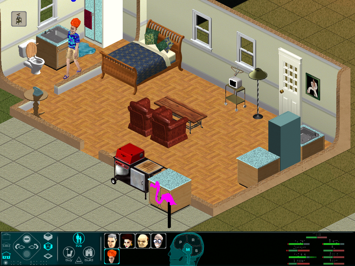
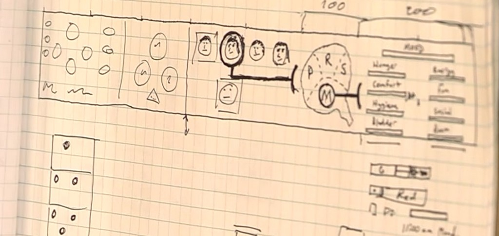
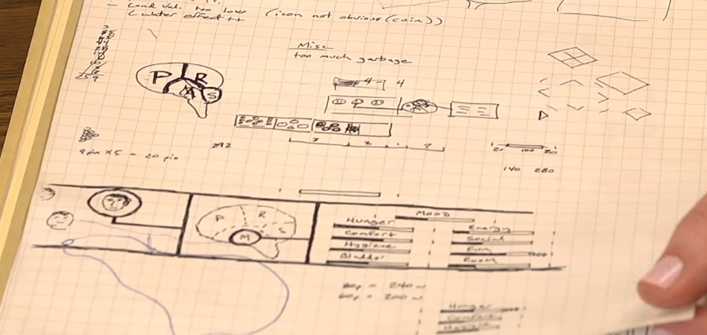

# Eric "Bobo" Bowman — media

## The "throbbing brain" Sims UI (not shipped)

Bobo's **"throbbing brain"** — a Sims needs/mood interface prototype that **did not ship** — plus his
hand-drawn UI sketches.

## Further reading — The Sims and its players

**Tanja Sihvonen — *Players Unleashed! Modding The Sims and the Culture of Gaming*** (her PhD thesis,
Amsterdam University Press, open access via OAPEN):
<https://library.oapen.org/handle/20.500.12657/34685>

A scholarly study of The Sims' modding/user-created-content culture. There's a great story here:
around 2008 in Amsterdam, Don and Eric Bowman (both original Sims 1 programmers) ran into Tanja by
chance at the Sound Garden — she was writing this very thesis, and didn't know she'd just met two of
the game's original programmers.

See also: [`CHARACTER.yml`](CHARACTER.yml) · [`README.md`](README.md)
