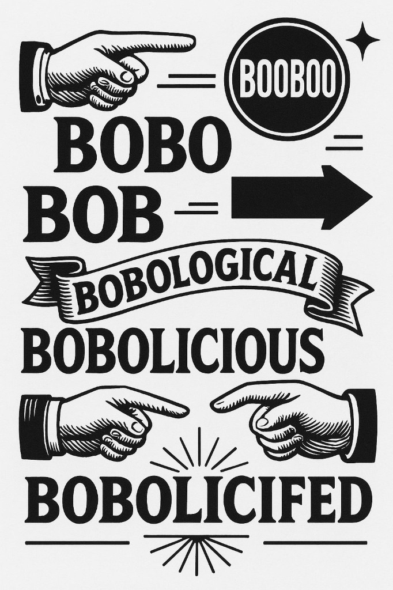
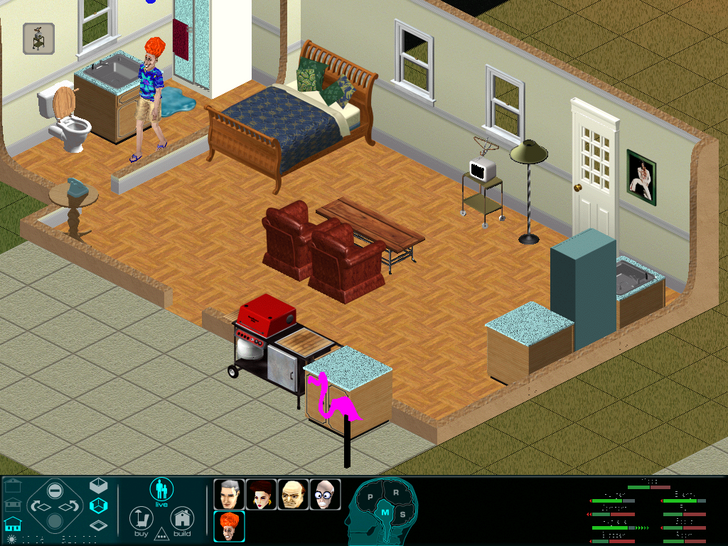
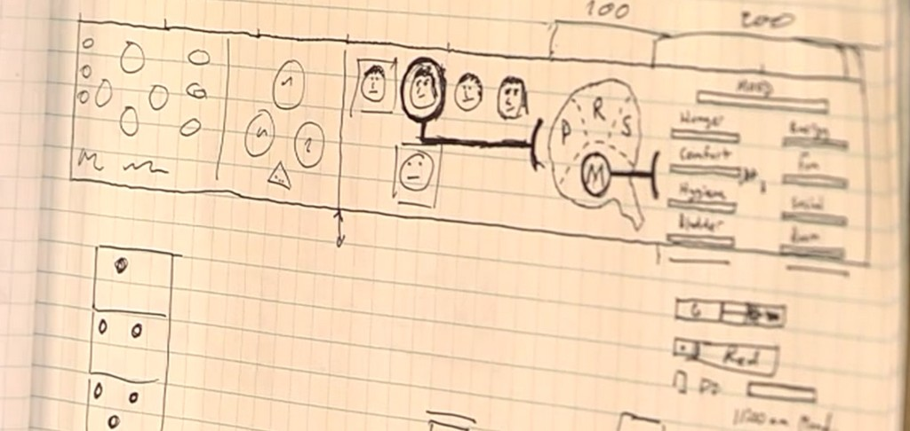
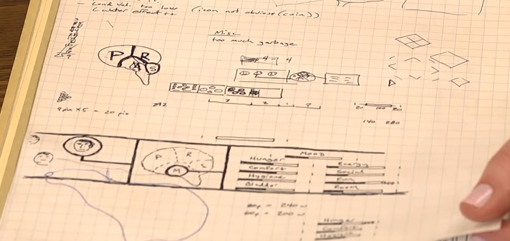

# Eric "Bobo" Bowman — media

## Bobo signage

Letterpress-style directory signage — the complete Bobo declension, manicule hands included.
Full page: [`bobo-signage.md`](bobo-signage.md) · [`bobo-signage.yml`](bobo-signage.yml)

## Team lunch — a Hornblower bay cruise, probably 1997

Shared by Eric with Don in August 2026, and **now dated and placed**: a Maxis team event aboard a
**Hornblower cruise on San Francisco Bay**, probably **1997**, settled by Eric's own 2017 Maxis
Alumni post of the same photo and the thread under it — Shannon Gray Copur remembered "that cruise
in the bay," Christine McGavran named the Hornblower event and confirmed she's the back of the head
in the foreground, and Jim Mackraz asked whether it was the one "with the chocolate fountain."
Will and Luc are in frame; Don's caption: *"Luc looks like the cat that ate the canary! Will looks
like it was his canary…"* Full story and metadata:
[`team-lunch-from-eric-bowman.md`](team-lunch-from-eric-bowman.md) ·
[`team-lunch-from-eric-bowman.yml`](team-lunch-from-eric-bowman.yml)

## New Year's Eve at Will's, 1999 → 2000

Jamie Doornbos, Eric, and two of Eric's Reed friends at Will Wright's millennium-rollover party —
six weeks before The Sims shipped. Full page:
[`nye-1999-2000-will-wright-party.md`](nye-1999-2000-will-wright-party.md) ·
[`nye-1999-2000-will-wright-party.yml`](nye-1999-2000-will-wright-party.yml)

## The "throbbing brain" Sims UI (not shipped)

Bobo's **"throbbing brain"** — a Sims needs/mood interface prototype that **did not ship** — plus his
hand-drawn UI sketches.

## Further reading — The Sims and its players

**Tanja Sihvonen — *Players Unleashed! Modding The Sims and the Culture of Gaming*** (her PhD thesis,
Amsterdam University Press, open access via OAPEN):
<https://library.oapen.org/handle/20.500.12657/34685>

A scholarly study of The Sims' modding/user-created-content culture. There's a great story here:
around 2008 in Amsterdam, Don and Eric Bowman (both original Sims 1 programmers) ran into Tanja by
chance at the Sound Garden — she was writing this very thesis, and didn't know she'd just met two of
the game's original programmers.

See also: [`CHARACTER.yml`](CHARACTER.yml) · [`README.md`](README.md)
