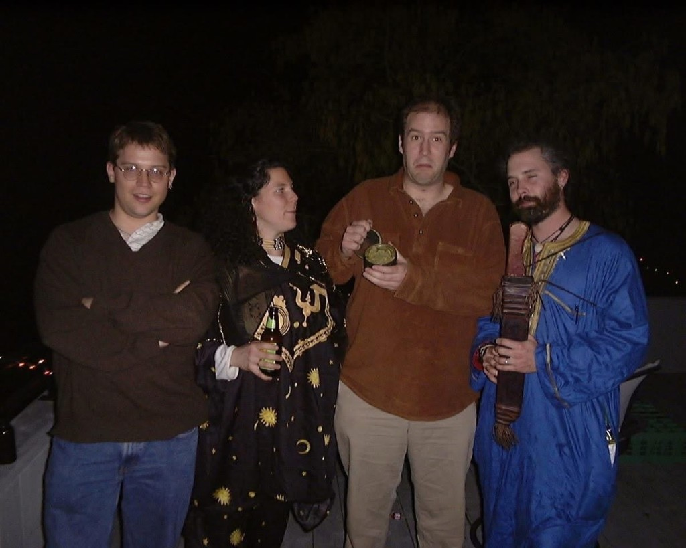

# New Year's Eve at Will's, 1999 → 2000

*Photo from Eric Bowman, August 2026. The millennium rollover at Will Wright's party — six weeks
before The Sims shipped.*

Left to right: **[Jamie Doornbos](../jamie-doornbos/)**, one of Eric's friends from Reed in a
celestial-print robe, **Eric "Bobo" Bowman**, and another Reed friend in a blue robe. Y2K came
and went, the world's computers survived, and The Sims shipped that February.

**Machine girder:** [`nye-1999-2000-will-wright-party.yml`](nye-1999-2000-will-wright-party.yml) ·
Back to [`media.md`](media.md)
