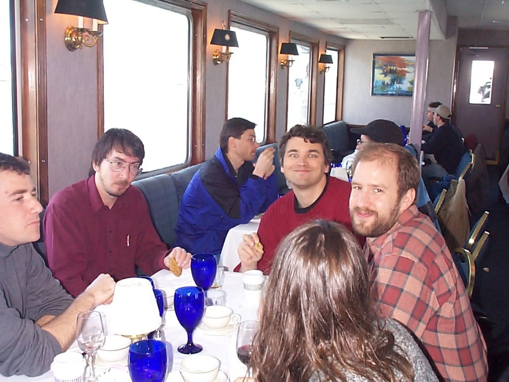

# Team lunch — photo from Eric "Bobo" Bowman

*Shared by Eric Bowman with Don in chat, August 2026. **Now dated and placed** by Eric's own 2017
Facebook post of the same photo and the thread under it.*

**A Hornblower cruise on San Francisco Bay, probably 1997** — a Maxis team event. Not the
early-2000s restaurant this first looked like: the brass sconces and cobalt glasses are a charter
boat's dining saloon, which is exactly what the thread says it is.

## What the thread settled

Eric posted the same photo to Maxis Alumni, tagged *with Will Wright and 2 others*
([post](team-lunch-from-eric-bowman-facebook-post.jpg) · [comments](team-lunch-from-eric-bowman-facebook-comments.png)),
with no more memory of it than Don had:

> "I have no recollection the circumstances or the date … **maybe 1997?** We all seem to be enjoying
> our **cookies** though, especially **Luc**."

Then his colleagues reconstructed it between them:

- **Shannon Gray Copur** — *"Was that when we took that cruise in the bay? I bet **Tammy** would
  remember. 😜"*
- **Ocean Quigley** — *"That looks like Christine McGavran in the foreground?"*
- **Christine McGavran** — *"Was that from a **Hornblower cruise** team event? (And I do think that
  is me)"* — **self-confirmed**, matching Eric's separate ID of "the back of Christine's head."
- **Jim Mackraz** — *"with the **chocolate fountain**?"*
- **Don Hopkins** — *"**Luc** looks like the cat that ate the canary! 😉 **Will** looks like it was
  his canary… ;("*

Two independent recollections (Shannon's "cruise in the bay", Christine's "Hornblower cruise team
event") plus Eric's "maybe 1997" put the photograph on the water in the year EA bought Maxis.

Eric's tag and Don's comment both place **Will Wright** and **Luc Barthelet** in frame, which
corroborates Don's first reading of the faces: **Luc** grinning in the dark red sweater, **Will** in
the blue jacket mid-bite. *Still Don's reading, not Eric's confirmation* — see the YAML.

## Don's joke, and why it lands

*"Luc looks like the cat that ate the canary. Will looks like it was his canary."*

If this is 1997, **Luc Barthelet** had just become general manager of Maxis under EA, and Will was
the studio's founder-designer inside an acquired company —
[Dollhouse](../will-wright/sources/1996-04-26-winograd-interfacing-to-microworlds/README.md) still
years from shipping, [Tycho Rising](../mike-perry/lunasim-tycho-rising.md) about to be shelved, and
[a tabbed EA legal binder](../melissa-bachman-wood/the-box.md#6-ea-law-legal-checklist-1997) newly
in circulation. A cat-and-canary joke about a team cruise photo is a joke about that year.

Luc's own room: [`luc-barthelet`](../luc-barthelet/) · show seed:
[Sims Online](../../repo-shows/luc-barthelet-sims-online/).

## Confirmed and open

| Person | Status |
|---|---|
| **Christine McGavran** | foreground, back of head — self-confirmed |
| **Ocean Quigley** | far left — confirmed by Eric |
| **"Paul P"** | background, the other table — confirmed by Eric. *RIP.* |
| **Will Wright** | in frame per Eric's tag and Don's comment; Don reads him as the blue jacket, mid-bite |
| **Luc Barthelet** | in frame per Don's comment; Don reads him as the dark red sweater, grinning |
| maroon shirt, glasses, cookie in hand | unidentified |
| right foreground, red plaid shirt | unidentified — Eric himself? Unasked |
| **Tammy** | named by Shannon as the person who'd remember. Not yet asked. |
| The **chocolate fountain** | Jim Mackraz's detail, uncorroborated and excellent |

**Ask Eric:** which figure is you, is the plaid shirt yours, who is Tammy, and was there a chocolate
fountain.

**Machine girder:** [`team-lunch-from-eric-bowman.yml`](team-lunch-from-eric-bowman.yml) ·
Back to [`media.md`](media.md)

From the same chat: the photo from **Will's New Year's Eve party, 1999 → 2000** —
[`nye-1999-2000-will-wright-party.md`](nye-1999-2000-will-wright-party.md).
