# "Who can guess what this is?" — the Facebook PIXIE guessing game

**For Heinz** — read this instead of Facebook. Screenshots and listing
crops live in [`facebook-guessing-game-2026-07/`](facebook-guessing-game-2026-07/README.md).
Updated **27 Jul 2026** (third day of the thread; still growing).

---

## Note from Don to Heinz

Thank you, Heinz! The more I learn about your life, the more fond I am
and feel a kinship with you. So please keep writing and sending stuff!

On the Facebook "Internet Old Farts Club" I posted a teaser — just one
clip of your listing — and asked people to guess what it was, and it went
wonderfully well.

In three days there have been **161 "likes"** and even more powerfully
**173 comments**! Some from old farts who programmed on PDP-7s and PDP-1s
themselves, and many from younger farts who had a great time guessing,
made many great guesses, and were very interested in what it was.

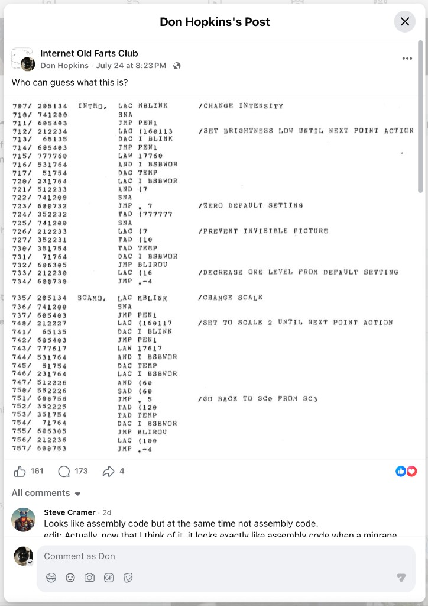

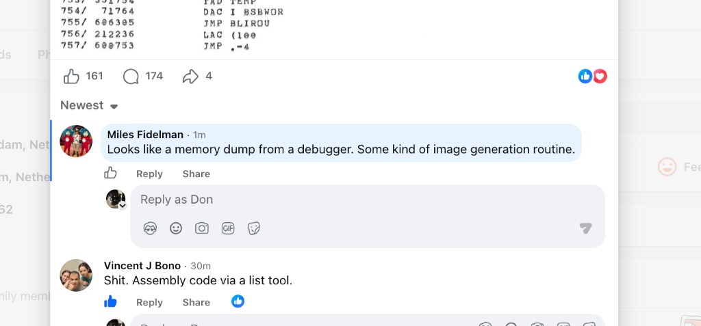

After the dust settles I will copy the entire conversation and preserve
it. What follows is what we have so far — so you are spared the
excruciatingly dreadful and invasive experience of using Facebook yourself.

---

## Why this is in the repo

Hours after the [assembler listing was transcribed](pixie-assembler-listing-1972/TRANSCRIPTION-REPORT.md),
Don posted listing pages to the **Internet Old Farts Club** Facebook group
as a guessing game — and the thread became a live demonstration of exactly
the archaeology this repo does, crowd-sourced in under an hour on day one,
and still going strong three days later.

This is the show format working **time-shifted**: evidence posted cold, an
audience of veterans (and curious younger farts) deducing in comments,
corrections arriving from people who were *there* (or one machine over),
the whole exchange preserved and replayable. A Repo Show episode is this
thread with voices and a screen recording; this write-up is the thread
checked into git so the discussion can keep happening — in the repo, on
stream, or fifty years from now.

## The game

Don posted the SYMELEC page with `INTMO,`/`SCAMO,` (change intensity /
change scale, the light-button handlers around `PEN1` and `BLINK`)
captioned only "Who can guess what this is?" — then dripped clues: the
listing header page, "Blinkenlights!" (the display-file pages), "Here is
some networking code!" (the `/LINK TRANSFER ROUTINE FOR PIXIE (PDP7-TITAN)`
page), the SYMELEC symbol table, the `/RING STRUCTURE PROCESSOR MAY 1969`
page, Heinz's handwriting and thesis links, CARS, the emulation plan —
and the reveal: [*Flight of the PIXIE* — Yuja Wang](https://www.youtube.com/watch?v=jDrqR9XssJI).

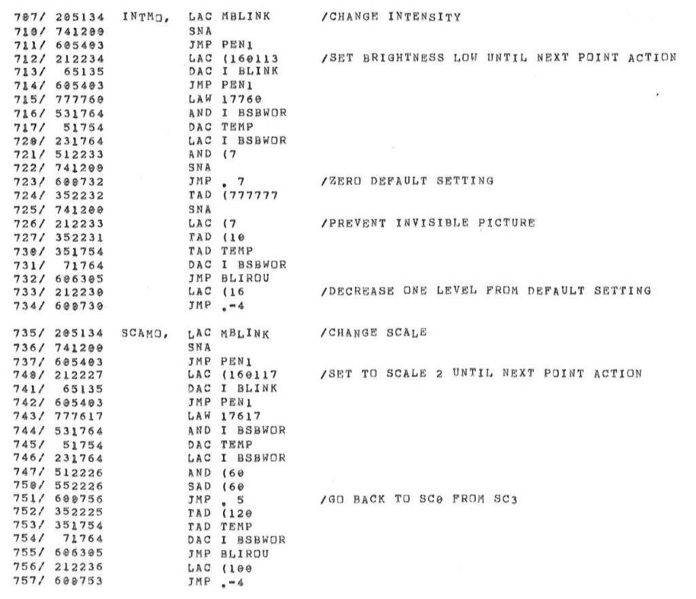

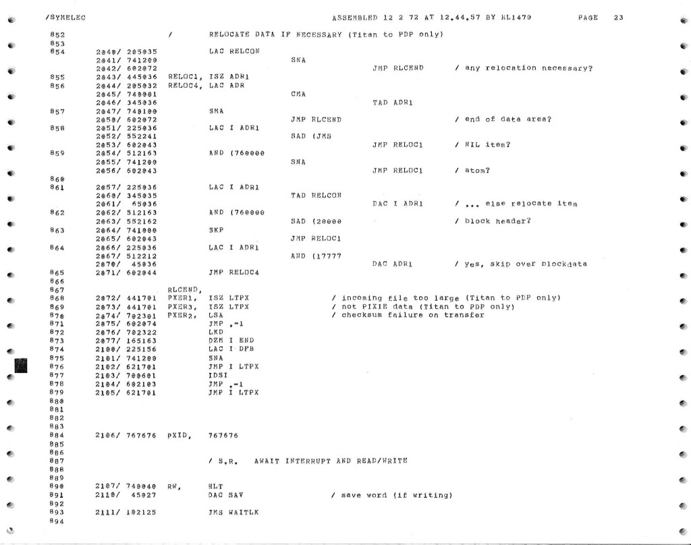

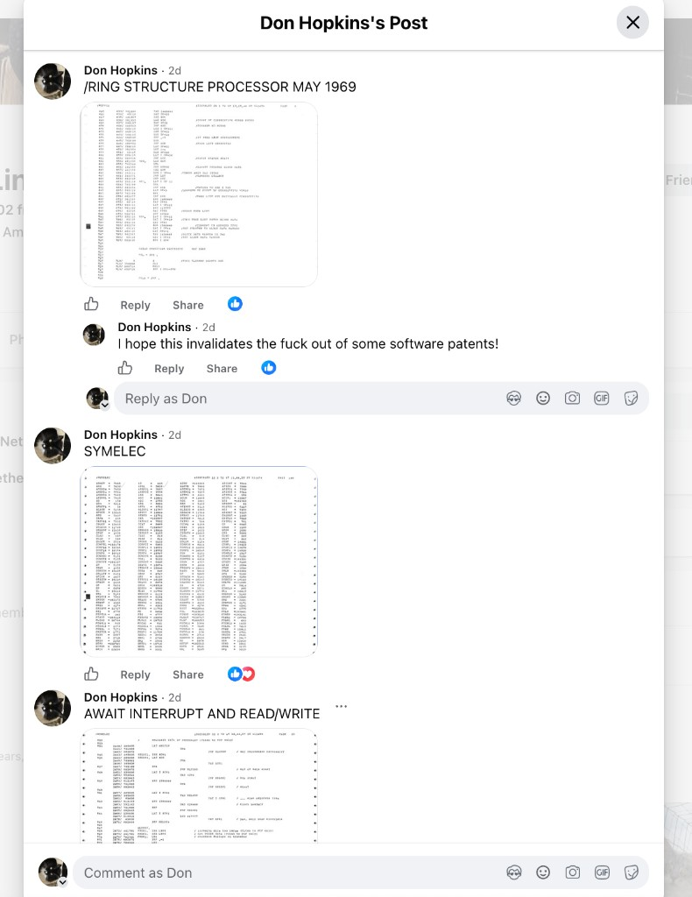

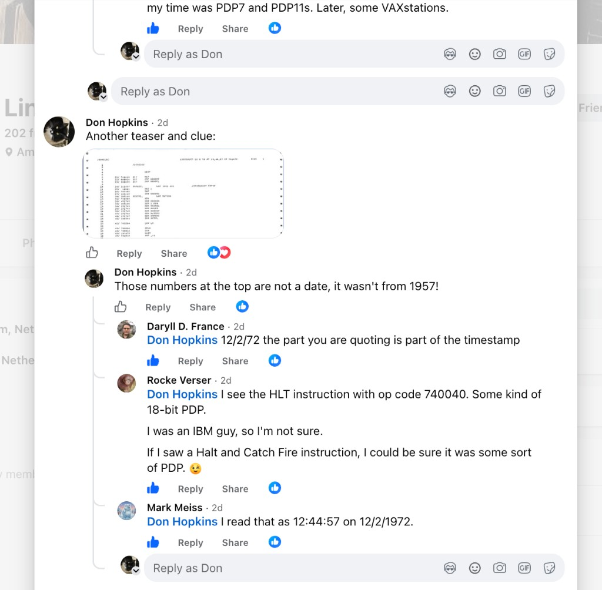

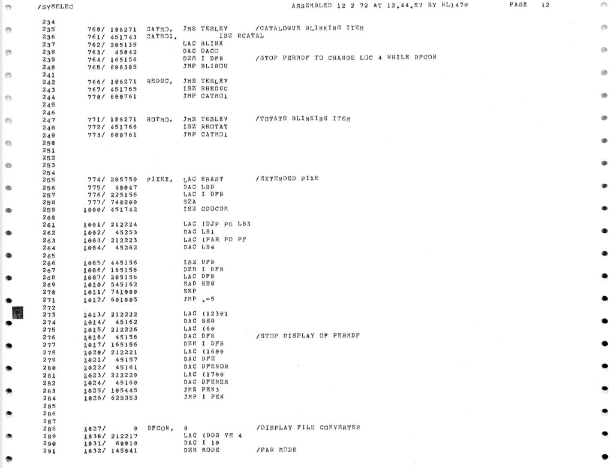

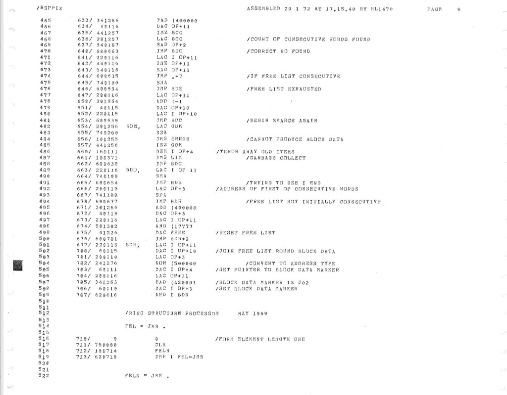

## Scoreboard (as of 27 Jul 2026, ~three days in)

| | Day 1 evening | Day ~3 |
|---|---|---|
| Reactions ("likes") | climbing | **161** |
| Comments | ~41 and climbing | **173** |
| Shares | — | **4** |

The full dump is still pending. Below is a curated reconstruction from
screenshots + Don's paste — enough for Heinz to enjoy without Facebook.

## The deduction chain (the crowd got there in ~40 minutes)

1. Early guesses: PDP-8, Moon Lander, "Part of the pen driver code from an
   old space war computer game?", Super Mario Bros, Soylent Green, Duck Hunt,
   DeLorean daytime running lights, "Poutine Clicker"…
2. **Darryl Robert Seamans** spotted the label `PEN1` — "something to do
   with a light pen?"
3. **Don Baccus** nailed the family from the word width: "18 not 12 bit so
   PDP-1/4/7/9/15 family" — six 3-bit octal digits per word, `777777` = −1
   in 18-bit two's complement.
4. Baccus first guessed *original PDP-1 Spacewar* from the light pen +
   blinking + fame heuristic; **Stavros Macrakis** corrected: PDP-1 and
   light pen sound right, "but Spacewar didn't use the light pen"
   (tic-tac-toe and Mouse in a Maze did).
5. Don to James Temple's PDP-8 guess: "Your guess is so close it's an
   off-by-one error!" — and on the `12 2 72` header: "Those numbers at the
   top are not a date, it wasn't from 1957!" (it's the Cambridge assembler's
   `ASSEMBLED 12 2 72 AT 12,44,57 BY HL1470` stamp — Daryll D. France and
   Mark Meiss read it correctly as **12:44:57 on 12/2/1972**).
6. The Titan link-transfer page gave it away. Baccus: an early CAD program
   named **Pixie** on a PDP-7 hooked to a TITAN mainframe at Cambridge —
   PDP-7 front-end for graphics and light pen, Titan for heavy computation.
   Exactly right.

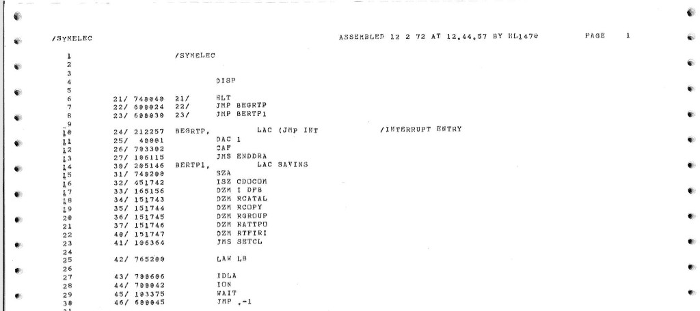

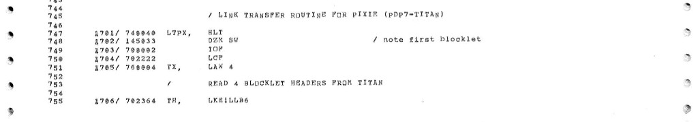

## Standout later comments (days 2–3)

### Joerg Micheel — settle-the-bet analysis

Independent of Baccus, Joerg posted a full proof that it is **not** a
PDP-11, lands on the PDP-4/7/9/15 family, and names what the teaser page
is doing:

- Word width: object codes like `741200`, `205134` exceed 16-bit octal
  (`177777`) → 18-bit words.
- Instruction set: `LAC` / `DAC` / `LAW` / `TAD` / `SAD` / `SNA` with `I`
  indirect — DEC 18-bit accumulator ISA, not PDP-11 `MOV`/`ADD`/`BR`.
- `TAD` + `LAW` rules out PDP-1 (`ADD`) and PDP-8 (no `LAC`/`LAW`).
- Application: attribute-editing for a light-pen vector-graphics program —
  `INTMO` steps intensity, `SCAMO` steps scale, both wrap, with
  **"PREVENT INVISIBLE PICTURE"** so you can't dim something to nothing.
  Constants like `160113`/`160117` are display-processor commands; `PEN1`
  = light pen; `BLINK` = blinking cursor.

### Aron Insinga — assembler literacy + 18-bit history

Aron's reply to Steve Cramer's migraine joke is a miniature DEC-assembler
tutorial (addresses, encoded words, labels with commas, `I` indirect,
`(` literals, `.` current location, `/` comments, skip instructions) —
and he points people at Bob Supnik's
[architecture of DEC's 18-bit machines](https://simh.trailing-edge.com/docs/architecture18b.pdf).
Elsewhere he traces 18-bit words from the IBM Defense Calculator / 701 /
TX-0 lineage and explains why early DEC machines were 18-bit rather than
"illegal word size."

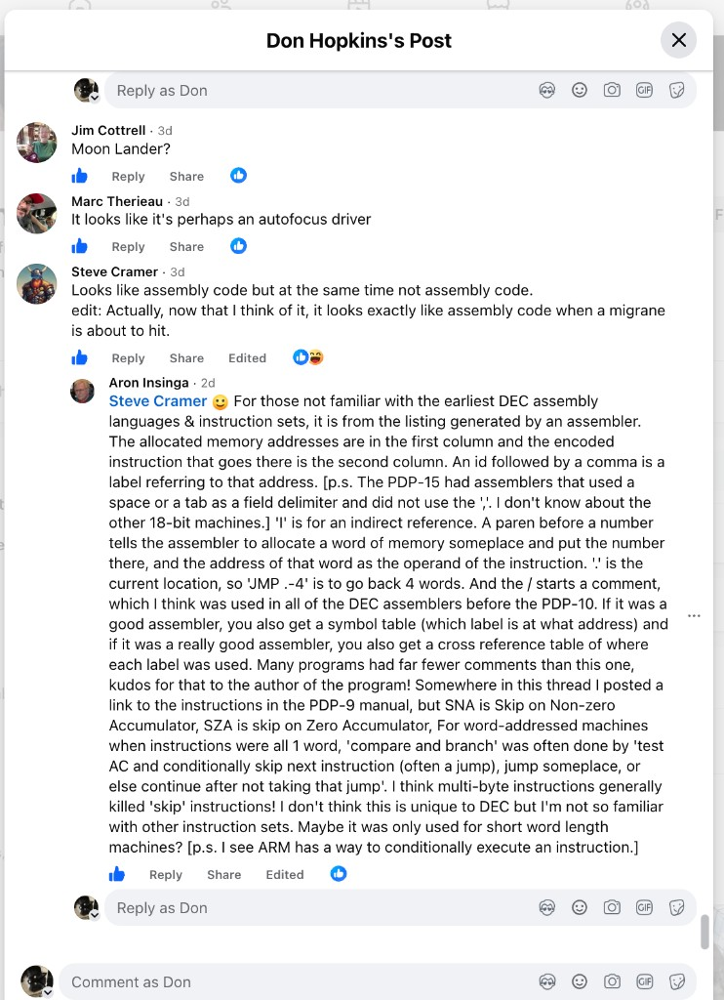

### Don — PIXIE as network-distributed UI (1969)

After Baccus nailed the architecture, Don spelled out why it matters
(paraphrased for the record; full text was in the Facebook reply):

PIXIE is a **network distributed user interface in 1969**. The PDP-7 is
not a dumb terminal — it runs the display file, light-pen interrupt
handler, tracking cross, rubber-band lines, and radial light-button menus
locally at interrupt speed. The application (circuit analysis) runs across
the room on Titan. Web browser ↔ server; NeWS server with interactive
PostScript for a remote client — PIXIE predates the vocabulary.

The listing has the wire protocol: `/LINK TRANSFER ROUTINE FOR PIXIE
(PDP7-TITAN)` moves **blocklets** with headers, word counts, checksums,
retry ("try again if header format wrong"), and errors for checksum
failure / file too large / not PIXIE data. There is a **relocation** pass
that swizzles ring-structure pointers after Titan→PDP transfer —
serializing linked structures across a network link in 1969. Asynchronous
structured-data exchange feeding local interactive feedback: AJAX, decades
before the term.

Kicker: David Rosenthal was a Cambridge undergrad on this same PDP-7/340,
snuck in at night, used Titan a year later, and later built NeWS at Sun
with James Gosling — where Don implemented pie menus, independent
rediscovery of the same Fitts'-Law principles as the radial light buttons
in the 1969 film.

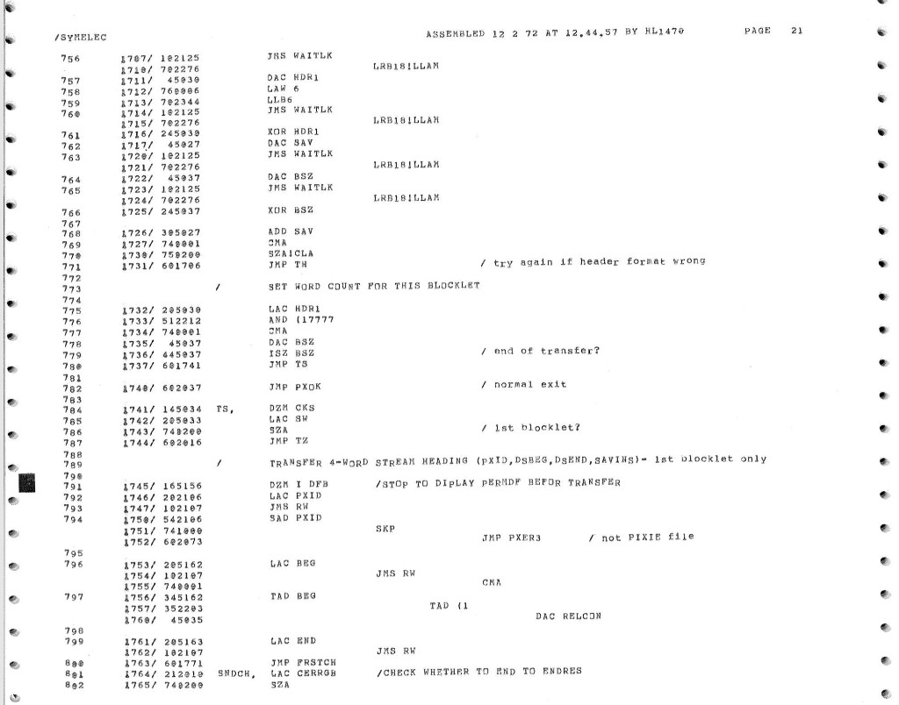

### Don Baccus — after the NeWS connection

Baccus: he had noticed the blocklets and retry sophistication; the NeWS
connection was news to him and "very cool." He recalled writing a virtual
kernel for a fully loaded PDP-8/E (32KW, RK05s) to run several OS/8
instances, with custom paging hardware and a real-time debugger — "the
world was full of wonders crammed into tiny machines back then."

### Light pens in the wild — Dean S Horak

Dean posted photos of sturdy metal light-pen prototypes he built for PCs
talking to 3270 emulators — still in his office. Don: nice metal feel, not
cheap Bakelite (and linked the Bakelite Museum).

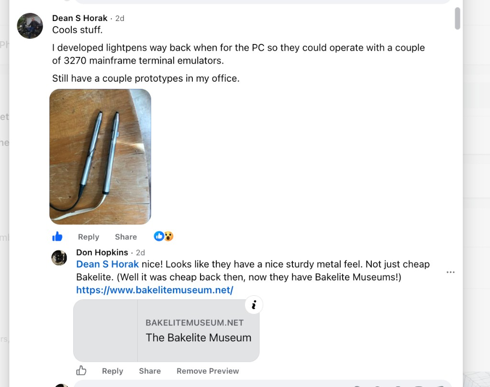

### Heinz in the thread

Don told the room: Heinz is the author of the code, the guy in the video,
one of the PIXIE paper authors; he kept the listings, notes, and PhD
thesis; great handwriting; runs **CARS** ([cars-int.org](https://cars-int.org/about-cars/));
just back from their conference in Japan; digitizing old code and notes.
Links posted to the annotated thesis, the recovered listing, the
[emulation plan](pdp7-reference/EMULATION-PLAN.md), and the
[Titan link protocol](pdp7-reference/TITAN-LINK-PROTOCOL.md).

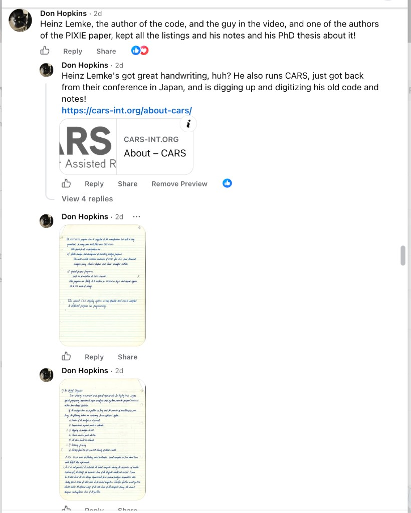

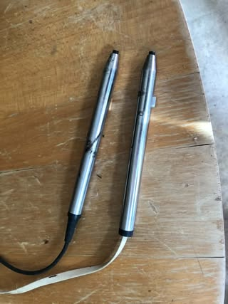

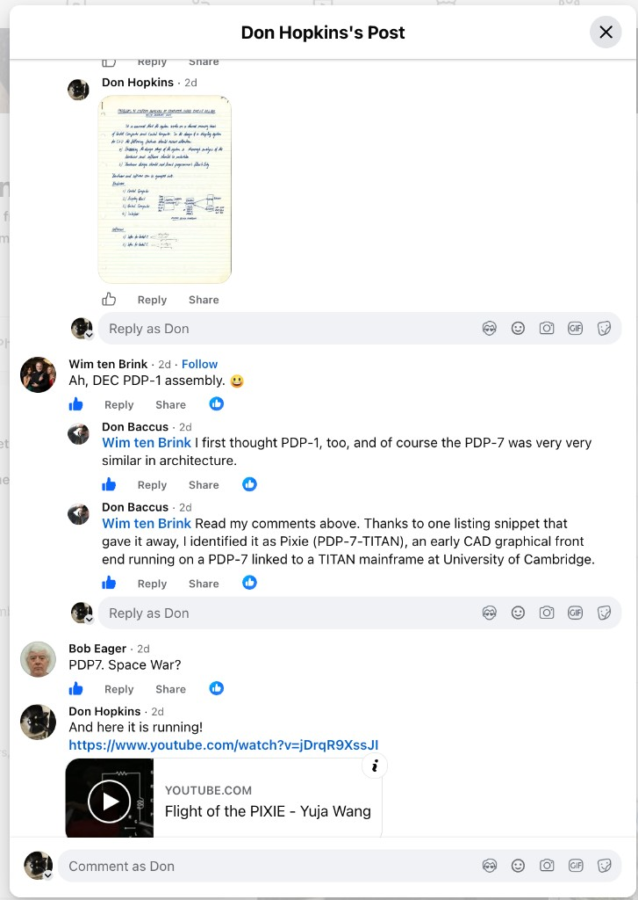

## The players

- **Don Baccus** — the thread's ace deducer, and no accident: 14 years as
  "Hacker and The Big Honcho" at **Oregon Software** (1977–91, the Portland
  compiler house — Pascal-2 for DEC machines), which is why
  18-bit-vs-12-bit word width was his *first* observation. Later a
  co-founder of **OpenACS** and a PostgreSQL contributor of the 2000 era —
  plus a published ornithologist and nature photographer
  ([donb.photo.net](https://donb.photo.net),
  [birdnotes.net](http://birdnotes.net)). Not to be confused with John
  Backus of FORTRAN/BNF fame, though the near-collision is
  period-appropriate.
- **Stavros Macrakis** — MIT Project MAC, **Macsyma team** (compiler and
  math modules; Harvard CS PhD; still a Maxima maintainer). When he says
  Spacewar! didn't use the light pen, that's MIT lab-lore with authority.
- **Joerg Micheel** — day-2/3 settle-the-bet analysis (word width + ISA +
  what `INTMO`/`SCAMO` do).
- **Aron Insinga** — assembler literacy for the room; DEC 18-bit history;
  Supnik paper pointer.
- **Ric Werme** — librarian move: `PDP7-TITAN` → Cambridge Supervisor
  Planning Document 10 (see sequel below).
- **The chorus** (growing): Bruce Orcutt (PDP-7, PDP-11s, VAXstations),
  Andrew Birner (GE/Honeywell 36-bit octal), Bob Eager, Darryl Robert
  Seamans (`PEN1`), James Temple (off-by-one PDP), Rocke Verser (HLT
  `740040` → 18-bit PDP), Tim Gleason (PDP-9L/15 floor experience),
  Thomas Cherryhomes, Graham Toal, Rick Smith, Paul Wood ("circuit
  simulator using a light pen… 1972. Quite incredible"), Dean S Horak
  (light-pen hardware), Bill Westfield / Dave Hsu (pie menus / hierarchy),
  Jon Loeliger (ASR 33 in the film), Phil Karn, and Steve Cramer, whose
  "assembly code when a migraine is about to hit" still deserves a lower
  third.

## Threads worth keeping

- **The Type 30 / Type 340 exchange** — Baccus: "Original Spacewars on the
  18-bit PDP-1." Don: original Spacewar! ran on the **Type 30 Precision
  CRT**; PIXIE drives the **Type 340 Precision Incremental** (also offered
  for the PDP-1). Manual mirrored in-repo:
  [`pdp7-reference/H-340_Type_340_Precision_Incremental_CRT_System_Nov64.pdf`](pdp7-reference/H-340_Type_340_Precision_Incremental_CRT_System_Nov64.pdf)
  (Bitsavers original:
  <https://bitsavers.org/pdf/dec/graphics/H-340_Type_340_Precision_Incremental_CRT_System_Nov64.pdf>).
  Full comparison: [`pdp7-reference/`](pdp7-reference/README.md).
- **The recruiting hook** — Don: "SIMH implements both displays! But it
  needs a virtual Lightpen driver to run this code. Anybody want to help
  write one?" Starter kit: [reference library](pdp7-reference/README.md),
  [recovered source](pixie-assembler-listing-1972/README.md), Type 370
  light pen diagnostic as acceptance test,
  [EMULATION-PLAN.md](pdp7-reference/EMULATION-PLAN.md).
- **Prior art** — under the May 1969 Ring Structure Processor page: "I hope
  this invalidates the fuck out of some software patents!" A 1969 dynamic
  ring-structure store with garbage collection driving interactive
  graphics, timestamped by a lineprinter.

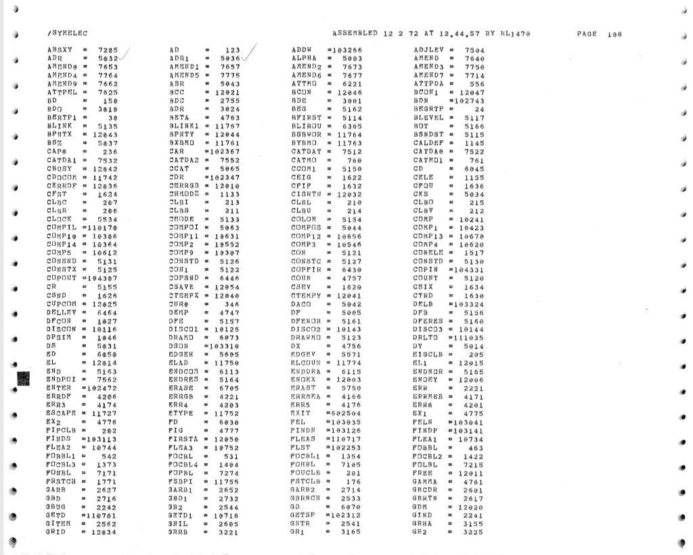

- **Audience proof for the show** — a cold room reverse-engineered machine,
  architecture, application, and institution from page scans in under an
  hour, then kept volunteering history, hardware photos, and document
  finds for days. That *is* the Repo Show format working.

## Sequel — Ric Werme finds Planning Document 10 (25–26 Jul 2026)

Don dripped the networking page (`LTPX,` / `LINK TRANSFER ROUTINE FOR PIXIE
(PDP7-TITAN)`). Baccus: "PDP-7, not PDP-1, then… This program appears to be
called 'Pixie'." Then **Ric Werme** did the librarian move: *"I see
'PDP7-TITAN'. That gets me to"*
[Cambridge Supervisor Planning Document 10](https://cucps.soc.srcf.net/titan/supplan/pd10.htm)
— *Software for the Titan/PDP-7 link*, **C.A. Lang, 2 December 1965**.
Facebook's own link preview returned **403 Forbidden**; the document is
live in a browser and now **mirrored in-repo**:

→ [`pdp7-reference/cambridge-supervisor/`](pdp7-reference/cambridge-supervisor/README.md)
([readable MD](pdp7-reference/cambridge-supervisor/pd10-titan-pdp7-link.md) ·
[HTML mirror](pdp7-reference/cambridge-supervisor/pd10-titan-pdp7-link.htm))

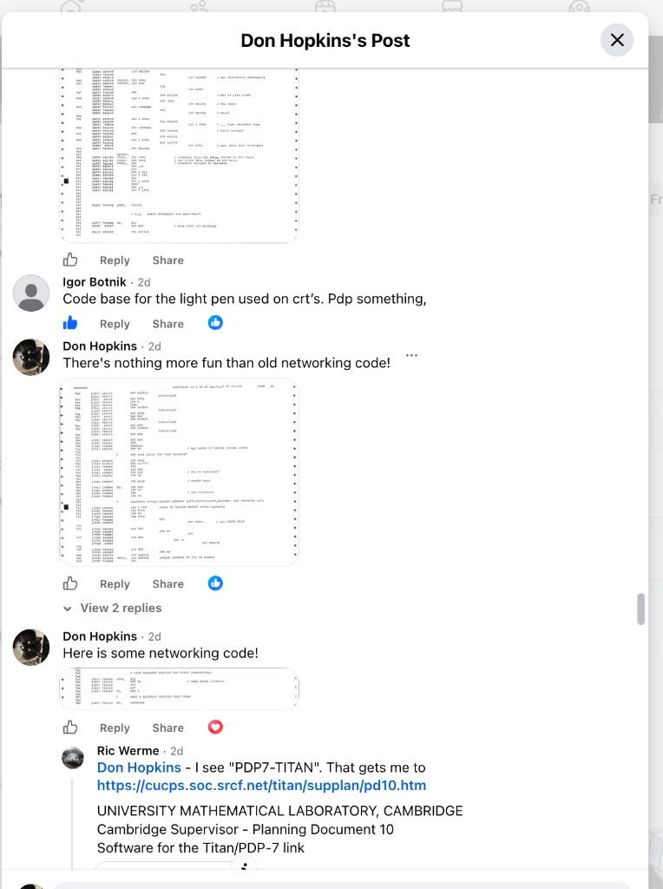

Don: *"wow thank you, that document is very helpful for documenting the
hardware and software and getting the code running again!!"*

PD10 is the missing **system** spine under PIXIE's application blocklets:
Titan-as-master, Attentions (light-pen sees / display interrupts queued on
the PDP-7), 18→48-bit packing extracodes, Titan disk via a peer program,
and the explicit recommendation of a **second teletype** at the PDP-7 —
the architectural blessing for Heinz's two-chair nightly workflow. How it
maps onto `/LTPIX`:
[`TITAN-LINK-PROTOCOL.md`](pdp7-reference/TITAN-LINK-PROTOCOL.md).

## Curated quotes (Heinz-friendly highlights)

> **Steve Cramer:** Looks like assembly code but at the same time not
> assembly code. edit: Actually, now that I think of it, it looks exactly
> like assembly code when a migrane is about to hit.

> **Joerg Micheel:** …And what it is: the attribute-editing routines of a
> light-pen vector-graphics program — INTMO steps an object's intensity
> and SCAMO steps its scale, both wrapping around, with a "PREVENT
> INVISIBLE PICTURE" guard…

> **Paul Wood:** …it is apparently PDP-7. And the 'application' is a
> circuit simulator using a light pen. All that in 1972. Quite incredible
> really.

> **Don Baccus:** I've been around long enough to know that most of what we
> think about today was being implemented long ago, often in simpler form
> due to lack of memory etc, but there. … The world was full of wonders
> crammed into tiny machines back then …

> **Bill Westfield:** I didn't realize that Pie menus were that old!

> **Dave Hsu:** Cool. Pie menus, but apparently not hierarchical, in 1969?!

> **Jim Cottrell** (on the Yuja Wang reveal): I have a Tape of Yuja Wang.
> What does that Have to Do with Her Playing?!?

## Links posted into the thread (for Heinz)

- Annotated PhD thesis:
  [`phd-thesis-1972/annotated/`](phd-thesis-1972/annotated/README.md)
- Recovered assembler listing:
  [`pixie-assembler-listing-1972/`](pixie-assembler-listing-1972/README.md)
- Emulation plan: [`pdp7-reference/EMULATION-PLAN.md`](pdp7-reference/EMULATION-PLAN.md)
- Titan↔PDP-7 link protocol:
  [`pdp7-reference/TITAN-LINK-PROTOCOL.md`](pdp7-reference/TITAN-LINK-PROTOCOL.md)
- Reveal video: *Flight of the PIXIE* —
  <https://www.youtube.com/watch?v=jDrqR9XssJI>
  ([production story](../cambridge-films-flight-of-the-bumblebee.md))
- CARS: <https://cars-int.org/about-cars/>
- Type 340 manual (local):
  [`pdp7-reference/H-340_Type_340_Precision_Incremental_CRT_System_Nov64.pdf`](pdp7-reference/H-340_Type_340_Precision_Incremental_CRT_System_Nov64.pdf)
- Supnik 18-bit architecture paper:
  <https://simh.trailing-edge.com/docs/architecture18b.pdf>

## Still to do

- Full Facebook conversation dump once the thread cools (Don promised).
- Optional: show segment that *is* this thread — evidence on screen,
  audience deduces live.

## Links

- Illustrations:
  [`facebook-guessing-game-2026-07/`](facebook-guessing-game-2026-07/README.md)
- Reveal video: *Flight of the PIXIE* —
  <https://www.youtube.com/watch?v=jDrqR9XssJI>
- The listing the pages came from:
  [`pixie-assembler-listing-1972/`](pixie-assembler-listing-1972/README.md)
- How it was transcribed the same day:
  [`TRANSCRIPTION-REPORT.md`](pixie-assembler-listing-1972/TRANSCRIPTION-REPORT.md)
- CUCPS PD10 (public): <https://cucps.soc.srcf.net/titan/supplan/pd10.htm>
- Local PD10 kit:
  [`pdp7-reference/cambridge-supervisor/`](pdp7-reference/cambridge-supervisor/README.md)

↑ [Thread index](THREAD-INDEX.md) · [character README](../README.md) ·
[show seed](../../../repo-shows/pixie-pie-menus-pdp7.yml)
