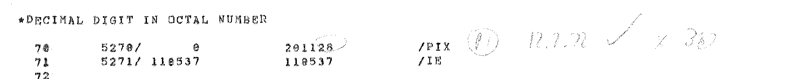
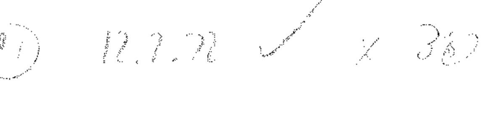
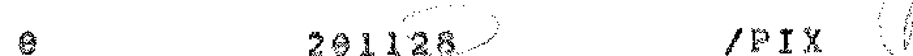
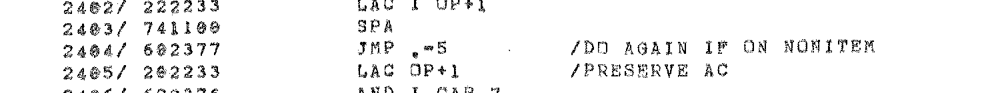
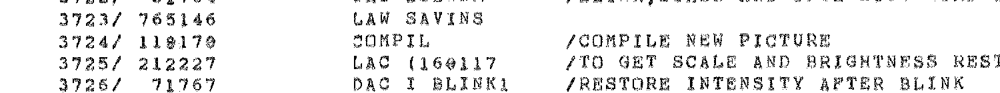
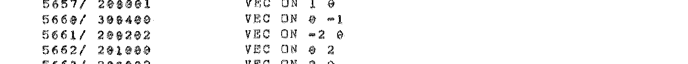
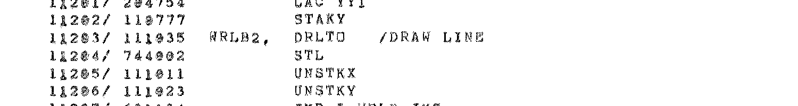

# Exhibits: the scan behind the bug journal

Crops of the scanned 1972 listing, cut from [`pages/`](../pages/) at full resolution and not
retouched. Each crop shows a word whose reading mattered: running the program in the cabinet
found it, and the story is in the [bug journal](../../../../../packages/cabinet/BUG-JOURNAL.md).
The zooms are 4× with nearest-neighbour scaling, so every pixel is a scan pixel.

Three readers read each word. Apple Vision OCR produced the raw witness text in
[`ocr-raw/`](../ocr-raw/). The LLM scribes produced the transcription, reading the page images
([report](../TRANSCRIPTION-REPORT.md)). The printed page is the third, and it's the only one that
counts.

## Why the readers got them wrong

The scan is two-tone and dithered at 200 dpi. The line printer slashes its zero, and dither speckle
fills the slashed oval, so a 0 reads as an 8, a 9 or an @. Apple Vision reads `291128`,
`118170` and `209202`, zeros turned to 8s and 9s, and at 2404 it read `69237`, a zero turned to 9
and a digit dropped. The first-digit errors at 11204 and 1011 are different: a clear 7, read as 1.

| Word | Page | Printed | Apple Vision | Scribes | What running it did |
|---|---|---|---|---|---|
| 5270 | 055 | `201128` (sic) | `291128` | `201128` | PIX drew garbage |
| 2404 | 029 | `602377` | `69237` | `602375` | F halted the machine |
| 3724 | 044 | `110170` | `118170` | `103170` | F never finished |
| 5661 | 060 | `200202` | `209202` | `200200` | the raster sat off the cross |
| 11204 | 097 | `744002` | `144002` | `144002` | every line drawn invisible |

At 11204 the scribe's word matches the Vision witness digit for digit, and the address column was
misread by Vision too (`14204`). The report's first failure mode is a scribe falling back on the
witness text when its own image read failed. That would explain it. Nobody has checked the agent
log for this page.

## 5270: the 8 in an octal number, and Heinz's pencil

The 1972 assembler flagged it, `*DECIMAL DIGIT IN OCTAL NUMBER`, and stored 0. Heinz circled the
number in pencil and wrote beside it a circled mark, the date 12.7.72, a tick, and "x 38" or
"X 30". If it's "X 30", that's the fix: P I X is `20 11 30` in 340 character code.

The slashed zero and the 8 side by side, on the same word:

## 2404: JMP .-5

2404 − 5 is 2377. The last two digits are clear 7s. The transcription had `602375`, which jumps
onto the exit of the routine before, and the stray pointer it left overwrote the interrupt routine.

## 3724: COMPIL

`110170` is `JMS COMPIL`. At 4× the third digit, a slashed zero, is hard to tell from an 8.
The transcription's `103170`, here and at 3604, is not a digit-for-digit confusion of either.

## 5661: VEC ON -2 0

The operands assemble to `200202`. The final 2 is clear on the page and in Vision's reading; the
transcription dropped it to 0.

## 11204: STL

`744002` is `STL`, set the link, which `DRLTO` executes to mean "draw visibly". Read as
`144002` it's `DZM 4002`, and every line went out with the beam off.

