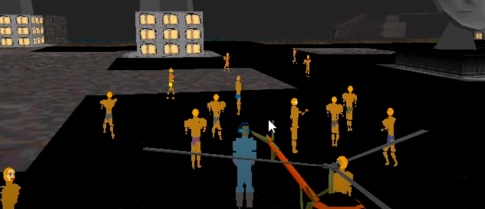
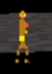
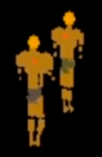
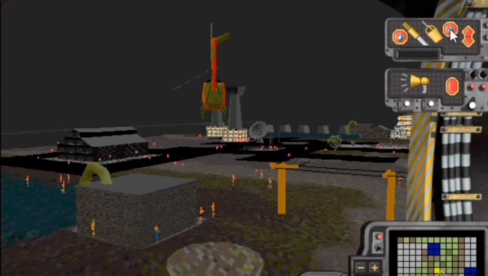

# The fog-piercing nipple hypothesis

*SimCopter (1996) himbo screenshots — evidence for an unverified rumor, awaiting confirmation
from Jacques Servin himself.*

## The rumor

Don heard a rumor: the himbos' fluorescent nipples were rendered with the rendering mode intended
for **airport running lights** — the self-luminous, fog-piercing markers that stay visible when
everything else fades into the murk. Not skin. Navigation equipment.

These screenshots seem to confirm it. The nipples read as bright self-lit points that carry at
distances where the rest of the body dissolves into a few pixels — exactly how running lights
behave, and not how ordinary lit geometry behaves. **They do seem to glow from a distance.**

Status: **unverified.** Total proof would require an experiment with fog present — if the nipples
punch through the fog like runway markers while the himbos' bodies disappear, the case is closed.
Question standing for Jacques: is the rumor true?

## The evidence

Crowd scene at night — himbos assembled, buildings lit, nipples visible:

Close-ups — bright points on the chest at sprite scale:

The distance test — helicopter view of the city, small bright orange-red points scattered across
the scene at ranges where the figures themselves are barely resolvable:

## Why this matters (beyond the obvious comedy)

If true, it's a beautiful detail of the craft: an easter egg built from the engine's own spare
parts, using an aviation-navigation rendering path for unauthorized visibility. The metaphor
writes itself — rendered with the equipment for guiding things safely home through fog.

## See also

- [`../../sources/simcopter-himbo-easter-egg.md`](../../sources/simcopter-himbo-easter-egg.md) — the source dossier
- [`../../ideas.md`](../../ideas.md) — conversation hooks, including this question
- [`INDEX.yml`](INDEX.yml) — machine index
