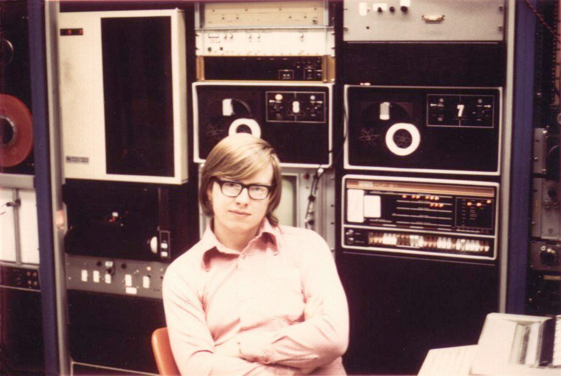

# James Gosling ☕



*Mid-1970s — Don Hopkins archive.* A very young **James Gosling**: handsome fellow, arms crossed,
direct eye contact, thick rectangular glasses, wide-collar pink shirt — and that **satisfied**
look. He sits in front of his **PDP-8 hotrod muscle car**, not a glass-room timeshare terminal but
*racks he can touch*: DEC front-panel switches and indicator lamps, dual **DECtape** drives (reels
labeled 0 and 7), patch bays and modules stacked behind him. Warm faded print grain; interior lab
light. The expression of someone who already knows what the iron can do — the same through-line as
**Gosling Emacs**, **NeWS**, and **Java**: sit at the console, write the language, ship the system.

Metadata: [`media/gosling-young-pdp8-hotrod.yml`](media/gosling-young-pdp8-hotrod.yml) ·
contrast with Cambridge **PDP-7/Titan** PIXIE: [`../heinz-lemke/cambridge-films-flight-of-the-bumblebee.md`](../heinz-lemke/cambridge-films-flight-of-the-bumblebee.md)

```
    ┌─────────────────────────────────────────────────────────────────┐
    │  G O S L I N G   E M A C S  ──►  N e W S  ──►  J a v a          │
    │       │              │                │              │          │
    │   MockLisp      PostScript         network         behavior     │
    │   extension     code+graphics      windows         on the       │
    │   languages     + data             (SunDew)         internet     │
    └─────────────────────────────────────────────────────────────────┘
```

*Sniff:* [`CARD.yml`](CARD.yml) · [`GLANCE.yml`](GLANCE.yml) · [`GLANCE.md`](GLANCE.md)

Invitation portrayal — **not** James Gosling. [Standards](../../schemas/portrayal-standards.yml)

**Field:** Network window systems (Andrew, NeWS/SunDew), Gosling/UniPress Emacs, Java; extension-language lineage; Liquid Robotics

| → | |
|---|---|
| **Invitation** | [invitation.md](invitation.md) *(draft — not sent)* |
| **Show prep** | [ideas.md](ideas.md) |
| **Media** | [media/README.md](media/README.md) |
| **Show seed** | [repo-shows/james-gosling/](../../repo-shows/james-gosling/README.md) |

---

## Why he's here

**James Gosling** (b. 1955, Calgary; CMU PhD 1983) — father of **Java**. Before Java:

- **Gosling Emacs** — first Unix Emacs; UniPress ("Evil Software Hoarder Emacs" per RMS → GNU Emacs)
- **Andrew** window system at CMU — with [**David Rosenthal**](../david-rosenthal/README.md)
- **NeWS/SunDew** at Sun — PostScript-programmable, network-transparent windows (**send a program,
  not a data structure**); AJAX before AJAX

Self-described record-holder for *"the largest number of cheesy little extension languages."*
Don worked on Gosling Emacs at UniPress and NeWS at Sun (Gosling's 1990 email brought Don in).
Dec 1, 1995 — Terry Winograd's **CS547**: *Bringing Behavior to the Internet* — Don on camera
~1:00:30 asking Java-security questions ([YouTube](https://www.youtube.com/watch?v=dgrNeyuwA8k)).

Proposed **Repo Show** guest — solo or **NeWS reunion** with [Arthur van Hoff](../arthur-van-hoff/README.md),
[Rosenthal](../david-rosenthal/README.md), [Owen Densmore](../owen-densmore/README.md). Trail:
[`live_objects`](../../process/trails/live-objects.md) · [`send_code_not_commands`](../../process/trails/send-code-not-commands.md)

---

## Nav

```
  invitation.md ──────► brutalist letter (text only; links below)
  repo-shows/james-gosling/ ──► SHOW.yml · pair w/ van Hoff · NeWS→Java segments
  terry-winograd/media/cs547-ARCHIVE.md ──► 1995 Java talk catalog
```

Verifiable sources in [`CHARACTER.yml`](CHARACTER.yml). Subject may request correction or removal anytime.

↑ [`../GLANCE.yml`](../GLANCE.yml)
