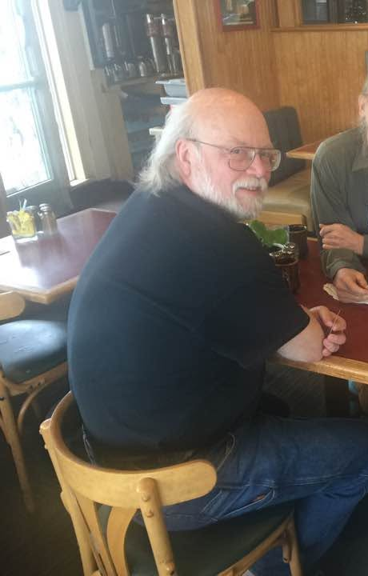

# James Gosling — lunch at Hobee's

*Don Hopkins photo — James in frame, John Gilmore's shoulder only (face cropped out for privacy).*

**James Gosling** at **Hobee's** — black t-shirt, glasses, white beard, looking back at the camera. **John Gilmore** appears as shoulder and forearm only (olive shirt); face cropped out. Red laminate tabletop — ketchup, Tabasco, water glass, napkins. Wood-paneled casual restaurant booth.

Don (2026-07): *"The smell of the cinnamon tea brought me back and triggered many old memories!"*

## Who's in frame

| Person | Visible |
|--------|---------|
| **James Gosling** | Left seat — full figure |
| **John Gilmore** | Right shoulder and forearm only — face out |
| **Third diner** | Cropped out |

Cropped from [`gosling-hobees-lunch-original.png`](gosling-hobees-lunch-original.png) — left 48% of width.

## Show thread — RMS natalism / doctor.el

While revisiting this photo (2026-07), Don shared the **kabuki-west baby-announcement** story with James — he had not heard it yet:

Don ran RMS's post through Emacs **doctor.el** → RMS replied *"Funny."* and asked if the replies were pure doctor or hand-enhanced.

Primary source: [RMS vs Doctor](http://www.art.net/studios/hackers/hopkins/Don/text/rms-vs-doctor.html) · [Richard Stallman](../../richard-stallman/README.md)

## Context

- Photographer: Don Hopkins
- Jaunt VR era: [Don's jaunt media](../../don-hopkins/media/jaunt-vr/INDEX.yml)

## See also

- [Young Gosling at the PDP-8 hotrod](gosling-young-pdp8-hotrod.md)
- [Arthur van Hoff](../../arthur-van-hoff/CHARACTER.yml)

Private photo — confirm with James Gosling before redistribution beyond repo context.

Machine girder: [`gosling-hobees-lunch.yml`](gosling-hobees-lunch.yml)

↑ [James Gosling](../README.md) · [media index](README.md)
