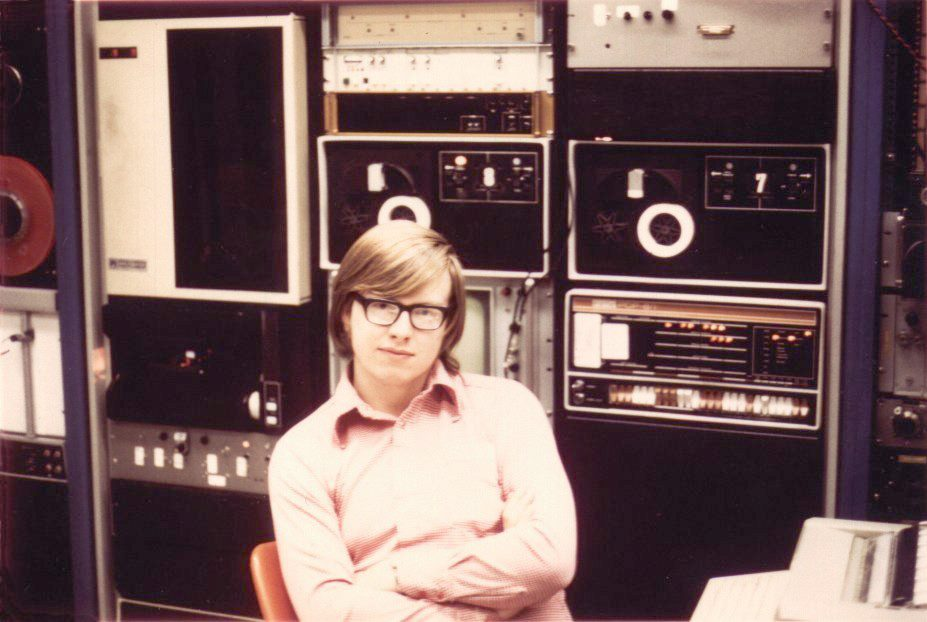

# James Gosling at the PDP-8 hotrod

*Mid-1970s — Don Hopkins personal archive.*

A young **James Gosling**: direct eye contact, thick rectangular glasses, wide-collar pink shirt, arms crossed — and that **satisfied** look. He sits in front of his **PDP-8 hotrod muscle car**, not a glass-room timeshare terminal but *racks he can touch*: DEC front-panel switches and indicator lamps, dual **DECtape** drives, patch bays stacked behind him. Warm faded print grain; interior lab light.

The expression of someone who already knows what the iron can do — the same through-line as **Gosling Emacs**, **NeWS**, and **Java**: sit at the console, write the language, ship the system.

## The rig

| Piece | Detail |
|-------|--------|
| **Platform** | DEC PDP-8 family — toggle switches, indicator lamps, DEC stripe livery |
| **Storage** | Dual DECtape drives (reels labeled **0** and **7**) |
| **Metaphor** | Student-owned minicomputer as hot rod — *his* machine, wired into racks he can touch |

Contrast with Cambridge **PDP-7/Titan** PIXIE: personal 8-bit hotrod vs distributed graphics satellite — [Heinz Lemke's flight of the bumblebee](../../heinz-lemke/cambridge-films-flight-of-the-bumblebee.md).

## Repo Show tie-in

- Cheesy little extension languages — constraints breed languages
- Gosling Emacs lineage — the kid at the switches becomes the person who ships NeWS then Java
- [James Gosling show seed](../../../repo-shows/james-gosling/README.md)

**Repo ethos:** Schematics in the repo. No gatekeeping. Bare-hands rig class welcome. ([hardware-hacker-builder](../../../process/vision-and-ambition.md#hardware-hackers-and-builders))

## Questions for James on air

Don loves this photo — wants to **ask**, not lecture:

1. Whose rig — yours, lab, borrowed? Where was this?
2. What was on the PDP-8 + DECtape stack (reels 0 and 7)?
3. What had you just gotten working when that photo was taken?
4. Arms crossed, satisfied — what does that expression mean to you now?
5. From toggling switches here to SunDew/NeWS/Java — what carried?

## Face puppet

**James Gosling at the PDP-8** — James puppeteers live (webcam through paste-on young-Gosling portrait) or records offline → submits clip to repo. Spec: [faceball guest characters](../../../apps/performance-space/faceball-construction-set.yml#guest-characters).

## Provenance

Private scan — confirm with James Gosling before public redistribution beyond this repo context. Pulled from Heinz/PIXIE correspondence thread (2026-07).

Machine girder: [`gosling-young-pdp8-hotrod.yml`](gosling-young-pdp8-hotrod.yml)

↑ [James Gosling](../README.md) · [media index](README.md)
