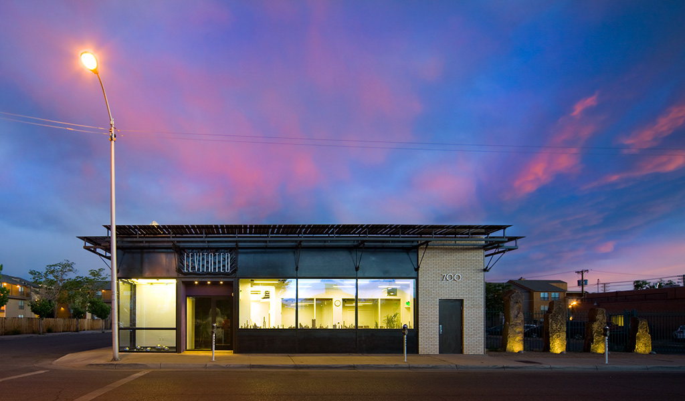

# Jared Tarbell 🌱🧮🪵 (a dream guest — and old friend)

*Invitation portrayal — **NOT** Jared Tarbell, and not claims about his views. Warm contact of
Don's since 2005; consent not yet asked.*
[Portrayal standards](../../schemas/portrayal-standards.md)

**Who:** **Jared S. Tarbell** — generative artist and programmer from **Albuquerque, New Mexico**.
Built two of the defining generative-art sites of the early web: **[levitated.net](http://levitated.net/)**
(2000 — open-source Flash sketches, cast members conjured and orchestrated entirely by code) and
**[complexification.net](http://complexification.net/)** — the *Gallery of Computation* (2004 —
Substrate, Happy Place, Sand Traps; algorithms written up seriously, prints sold). Co-founded
**Etsy** (July 2005) — his co-founder **Rob Kalin** found him *through his art site* and asked him
to build a marketplace for handmade goods. Etsy's success let him buy an old building in downtown
Albuquerque and open the **[Levitated Toy Factory](http://levitated.guru/)** (2014) — "We mine
computational gems" — laser cutters and digital fabrication turning nature-inspired algorithms into
wooden toys and artifacts: the **LifeStar** (spherical laser-cut voronoi spacemaker), Castle Builder,
Invader Cubes.

**The friendship, in one arc:** **Will Wright pointed Don at levitated.net in 2005** because he
loved it and knew Don would too — Don wrote to Jared, and told him Spore's *tidepool* level was
reminiscent of his multi-legged procedural Flash creatures. In **February 2010** Jared came to
Amsterdam to speak at **FITC** and finally met Don in person, with his wife **Laurie** — Don showed
them the city; **Will friended Jared on Facebook the same week**. In **2014** came the Levitated
launch: *"The abstract gems we discover will be manufactured into actual physical artifacts using
the finest natural materials… I believe there is magic to be discovered in this realm."*

**Why him, why now:** Jared is the purest living example of the show's deepest thread — **the stage
orchestrated dynamically by scripts**. His Flash work didn't animate a timeline by hand; the code
*was* the cast, conjuring and directing thousands of actors procedurally. That's the same rotation
as [Marc Canter's Director insight](../marc-canter/timeline-rotated-90-degrees.md) taken one step
further — and it runs straight into the [repo-as-simulation deep move](../../process/VISION.md#the-deep-move--the-repo-is-a-simulation).
Then he did it again in *atoms*: algorithms → laser → wood. Code to craft to play.

## Talk-about menu

- **Levitated → Complexification** — giving the code away, then getting academic about it; Substrate and the Gallery of Computation.
- **Etsy origin story** — found through his art; wrote his own shopping cart to sell prints; the marketplace followed the artist's need.
- **Levitated Toy Factory** — bits & atoms; LifeStar; what 18 months of a dream factory taught him.
- **The Spore tidepool kinship** — Will → Don → Jared, procedural creatures all the way down.
- **Amsterdam 2010** — FITC, meeting in person, the gift at the Ambassade desk.
- **New Mexico wilderness** — where the algorithms walk.

## In the repo

| | |
|--|--|
| **Machine card** | [`CHARACTER.yml`](CHARACTER.yml) |
| **Invitation (memory-jogging)** | [`invitation.md`](invitation.md) |
| **Show ideas** | [`ideas.md`](ideas.md) |
| **Correspondence (public-safe)** | [`correspondence.yml`](correspondence.yml) |
| **Media** | [`media/`](media/) — Toy Factory storefront, 2014 launch poster |
| **Show seed** | [`../../repo-shows/jared-tarbell/`](../../repo-shows/jared-tarbell/README.md) |

## Sources

- [levitated.net](http://levitated.net/) · [complexification.net — Gallery of Computation](http://complexification.net/) · [levitated.guru](http://levitated.guru/)
- [Right Click Save — The Interview: Jared S. Tarbell](https://www.rightclicksave.com/article/the-interview-jared-s-tarbell-generative-art-etsy)
- [Artnome interview (2020)](https://www.artnome.com/news/2020/8/24/interview-with-generative-artist-jared-tarbell)
- [beyond tellerrand Düsseldorf 2018 talk](https://beyondtellerrand.com/events/dusseldorf-2018/speakers/jared-tarbell)

*See also:* [`../ben-cerveny/`](../ben-cerveny/) · [`../scott-draves/`](../scott-draves/) (generative-art kin) ·
[`../will-wright/`](../will-wright/) · [`../paul-haeberli/`](../paul-haeberli/) (pointed Don at Jared's levCAWorm)

🐒✋ *Shelved in Palmhoo under [Generative Art & Music](../../palmhoo/generative-art-and-music/README.md)
— organisms grown from math, then laser-cut into wood. And levCAWorm earns a footnote in
[Palm on Worms](https://github.com/SimHacker/moollm/blob/main/examples/adventure-4/pub/stage/palm-nook/study/palm-on-worms-fieldnotes.yml):
the cellular-automaton worm was crawling through this crowd's inboxes back in 2010.*
