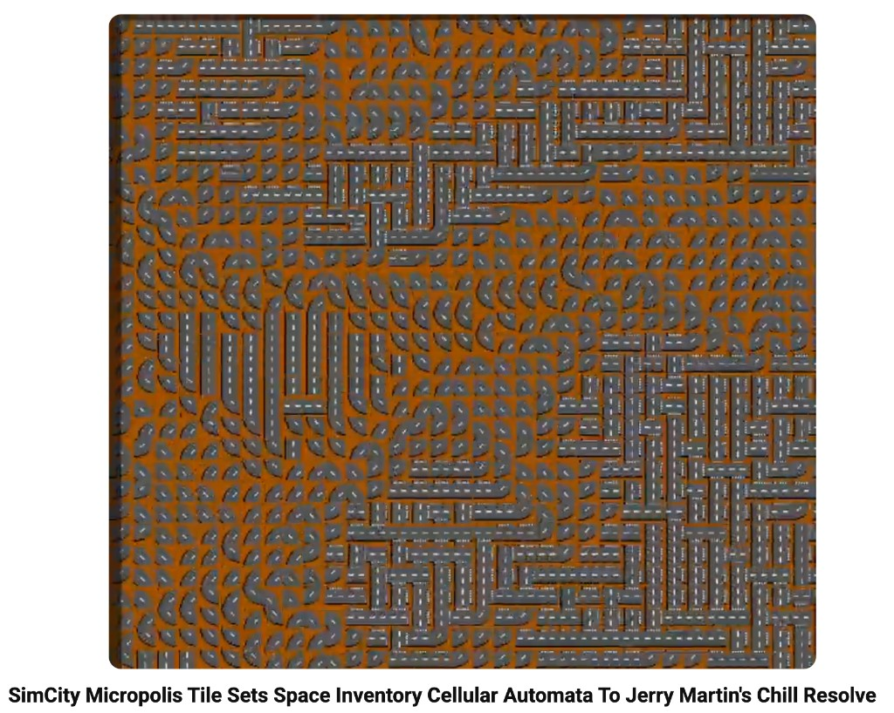

# Jerry Martin 🎵

*Invitation portrayal. A respectful, source-grounded sketch — not Jerry Martin, and not his words.*
[Portrayal standards](../../schemas/portrayal-standards.yml) · consent level 2 · authored by Don Hopkins

## Who

**Jerry Martin** is a composer, producer, and sound designer best known for the music of **The Sims**,
**SimCity 3000**, and **SimCity 4** at Maxis (where he was Studio Audio Director and Lead Composer).
His scores gave those digital worlds their warm, lived-in character — the sound of a place that feels
like home. He now releases his own work as **Jerry Martin Music** ([jerrymartinmusic.com](https://jerrymartinmusic.com/))
and via **BoomBamBoom** ([boombamboom.com](https://boombamboom.com/); albums *The House Always Wins*
and *Be Tonal*).

## "Chill Resolve" — perfect for Micropolis

Jerry's **"Chill Resolve"** (from *Be Tonal*) is the music in Don's **Micropolis** cellular-automata
video — Don performed the Space-Inventory CA live, with SimCity tile sets, and it's a perfect match.
Mesmerizing even without watching the CA. Hear more — and support Jerry — at his site.

▶️ **Watch:** [SimCity Micropolis Tile Sets — Space Inventory Cellular Automata to Jerry Martin's "Chill Resolve"](https://www.youtube.com/watch?v=319i7slXcbI)

## Why a Repo Show

Paired with [David Levitt](../david-levitt/README.md) for a **music + theory** show: how game music is
composed, scored, and made to respond to a living simulation. Also a natural for the audio side of a
Sims team reunion.
