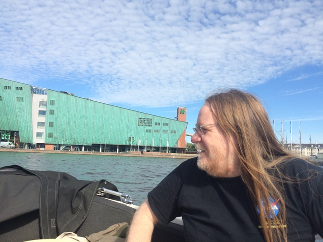
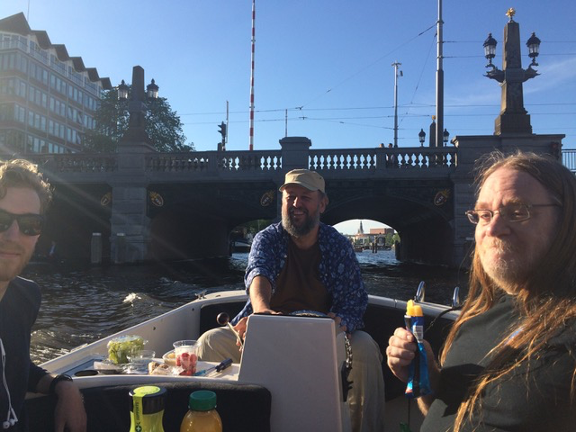
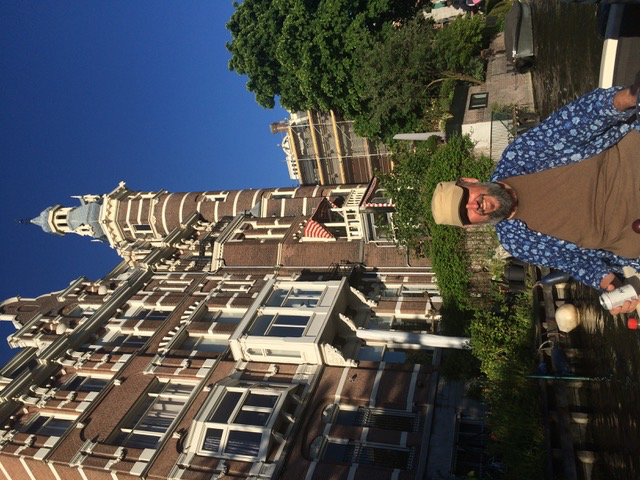

# Don ↔ Jim — correspondence & the Amsterdam boat ride

*Firsthand history from Don's mail archive (2008–2025), summarized with light excerpts. Full
correspondence stays offline; quotes get Jim's blessing before airing. Contact details scrubbed
per [portrayal standards](../../schemas/portrayal-standards.md). Even older correspondence exists
offline — excavation TODO.*

## Timeline

### 2008 — "How would you recommend that I contact Will Wright?"

**18 Oct 2008, "Immersive."** Jim, back in California and playing with **immersive visualization**
(the [ESA pub](http://cse.ucdavis.edu/~chaos/chaos/pubs/esa.htm)), wrote Don wanting to **interface
it to games** — and asked how to reach **Will Wright**: *"I'm guessing he'd be interested in seeing
our cave system."* Standing invitation for a **CAVE tour** if Don was in the Bay Area.

**The show writes itself:** Jim was trying to get immersive viz in front of Will **eighteen years
ago**. This show is the delayed rendezvous.

### 2013 — the video tape thread ("Powers of Feedback")

**17 Aug 2013.** Don asked whether *Space-Time Dynamics in Video Feedback* was online. Jim:
[youtube.com/watch?v=B4Kn3djJMCE](https://www.youtube.com/watch?v=B4Kn3djJMCE) — plus a second
video ([KQec0NULt1I](https://www.youtube.com/watch?v=KQec0NULt1I)) and the Art & Science Lab's
**MacroScope** immersive rig (*"Soon on your Oculus Rift!"*).

The provenance detail: **Don's copy of the tape came from Kathy Abelson** — Don's office mate at
Sun and a great technical writer, author of the **NeWS manual** that Don meticulously reviewed and
helped illustrate. Years earlier, when the internet was slow, Don had digitized her tape as a
low-res QuickTime — lousy compression, but the **narration and music** survived. Don said the tape reminded him of *Powers of Ten*. Jim's reply:
**"Powers of Feedback."**

The **director's-cut thread**: Don proposed dubbing the tape's narration over the clean YouTube
transfer. Jim explained he'd **axed the original soundtrack over music rights** (*"small-time
folks got famous… waited too long to ask"*) but agreed the explanatory narration should go back on
— the U-Matic master had narration and music on separate tracks. **Open show project: help Jim
finish the director's cut.**

Same thread: **Don posted Jim's video to Will's Facebook page** ("he'd get a kick out of it");
Jim offered **Will and Don a Cave tour**; and they agreed there's *"a cool iPad app in there —
one that cats and babies can use and appreciate — the litmus test of a fine ArtSci app."*

### 2013 — the CA pedagogy offer

**21 Dec 2013.** Replying to Don's *"Rewriting SimCity/Micropolis in JavaScript! (plus cellular
automata ;)"* thread, Jim asked how current Don's **Python CA simulator** was and offered to
**co-develop an introduction to CAs and CA structural complexity theory**, stepping systematically
through emergent phenomena and mechanisms — citing
[Feldman & Crutchfield 2003](http://csc.ucdavis.edu/~cmg/compmech/pubs/2dnnn.htm) (excess entropy
in 2D patterns) and
[Hanson & Crutchfield 1997](http://csc.ucdavis.edu/~cmg/compmech/pubs/ECA54TitlePage.htm)
(computational mechanics of CA). Test bunnies: his
[graduate class](http://csc.ucdavis.edu/~chaos/courses/ncaso/). Pedagogy wish: **1D CAs with
1+1D space-time diagrams**. That offer is still the seed of the show's CA segment.

### 2019 — Amsterdam: the canal boat ride 🚤

May 2019, Jim was resident at the **UvA Institute for Advanced Study** (Oude Turfmarkt 147, top
floor, in the attic, "slightly serpentine"), and it turned out **Brouwerij 't IJ** — Don's
windmill-pub recommendation — was already **Jim's local** (he was staying in Indische Buurt).
**Cornelis Boon** connected the dots ("small world"); **Ben Cerveny** had the boat. Friday
**24 May 2019, 5 PM**, pickup at the IAS dock on the Rokin; cheeses, meats, vegetables, and juices
aboard.

Jim's own subject lines from that weekend: **"Happy crew"** — *"…giddy with their successful
repair"* — and, of a photo of Ben at the helm, **"A man in his element."**

The week after: Don showed Jim **Sims 1 object programming** ("It's really strange") and CA demos
at the IAS attic; Jim's PhD students dragged everyone out drinking; the windmill pub closed at
8 PM on them (*"A pub that closes at 8 PM?"*).

**The CAM-8 revelation (25 May 2019):** Jim has **CAM-8 hardware and SPARCstations sitting
around — missing the software**; Norm Margolus couldn't locate it either. And the memory: **1983,
first cellular automata conference at Los Alamos (LASL then)** — Tom Toffoli and Norm in the back
of the room, **wire-wrapping the first CAM** to get it working. It didn't, until a year later.
Jim's verdict: *"CAM-6 simulator, definitely the way to go"* — i.e., **Don's CAM6 reimplementation
is the living path.** Prime Rebounce-adjacent show beat: the software archaeology of CAM-8.

**The soundtrack credits (27 May 2019):** Don finally asked who made the film's music. Jim:

| Track | Artist | Release |
|-------|--------|---------|
| *Mosaic* | Richard Burmer | Fortuna Records (1984) FOR/LP025 |
| *Bali Agung* | E. Schoener | Celestial Harmonies (1980) CEL-002 |
| ***Rio Chama*** | **J. P. Crutchfield** | **1984** |

**Jim composed one of the tracks himself.** (The YouTube upload credits Burmer and Schoener;
*Rio Chama* is the sleeper credit.)

### 2022 — the pepper spray exchange

Don: *"Why is it that they always pepper spray the hippies instead of the Proud Boys?"*
Jim: *"Fair point."*

### 2025 — the browser-dynamics answer

**25 Jan 2025.** Replying to Don's WebGPU-video-feedback-simulator question
([sources/2025-01-25-psychedelic-graphics-hn.md](sources/2025-01-25-psychedelic-graphics-hn.md),
cc **Ben Cerveny**): his friend Ed's in-browser dynamics work —
[Ed Puckett's ODE plotter](https://ed-puckett.github.io/bq/examples/ode-plotter.html) — and the
*"wholly unrealized"* plan to move his
[Jupyter notebook class demos](https://csc.ucdavis.edu/~chaos/courses/poci/) onto that framework.
**Another ready-made show project: help realize the plan.**

## The dripping handrail 💧

A Crutchfield paper Don particularly enjoyed: the **"dripping handrail"** model — a spatially
extended relaxation oscillator (think water condensing along a handrail, dripping when it crosses
threshold) introduced in **Crutchfield & Kaneko, "Are Attractors Relevant to Turbulence?"**
(*Phys. Rev. Lett.* **60**, 2715–2718, 1988;
[abstract](https://csc.ucdavis.edu/~chaos/chaos/pubs/aart-title.html)). The punchline: spatially
extended systems live in **transients that outlast the universe**, so the asymptotic attractor can
be irrelevant to what you actually observe. It later got pointed at the sky — QPOs of Scorpius X-1
as transient chaos ([Scargle, Donoho, Crutchfield et al., *ApJ Lett.* 411, 1993](https://csc.ucdavis.edu/~chaos/Publications/qpolfnsx1tc-title.html)).
Show beat: **simulate the handrail in the browser** — it's a natural Sandspiel/CAM6 sibling, and
the video-feedback film's "noise-driven spatial structures in a relaxation oscillator" section is
its cousin.

## Show beats extracted

1. **The 2008 payoff** — Jim wanted immersive viz in front of Will in 2008; deliver the meeting.
2. **Director's cut jam — live** — restore the narration (and story of the lost music rights) on
   the 1984 film, recorded **live on the show**, MST3K-style: *we're the robots.* Kathy Abelson's
   tape as the missing narration source.
2b. **The CA playground plan** — the Dec 2013 co-development offer, now unlocked: Norman Margolus
   has given Don permission to build interactive web apps from *Cellular Automata Machines*
   chapters; first cut is a modular TypeScript rewrite of CAM6; Jim's structural-complexity layer;
   students' homefun.
3. **CAM-8 software archaeology** — the hardware exists; the bits are lost; the 1983 LANL
   wire-wrap story told by someone who was in the room.
4. **Dripping handrail live** — browser sim; transient chaos as performance.
5. **Ed Puckett / browser dynamics** — realize the "wholly unrealized" plan on air.
6. **Amsterdam reunion** — Jim knows the canals, the IAS, and the windmill pub; Ben Cerveny has
   a boat. The show could literally film afloat.

## See also

- [`abraham-video-feedback-lineage.md`](abraham-video-feedback-lineage.md) — Abraham 1976 → Physica D 1984
- [`sources/2025-01-25-psychedelic-graphics-hn.md`](sources/2025-01-25-psychedelic-graphics-hn.md)
- [`ideas.md`](ideas.md) · [`README.md`](README.md) · [Ben Cerveny](../ben-cerveny/README.md)
