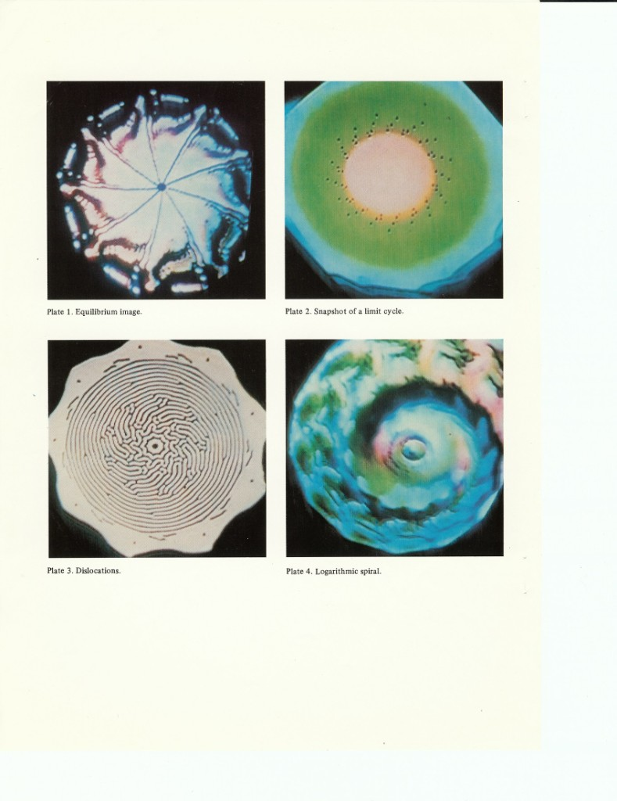
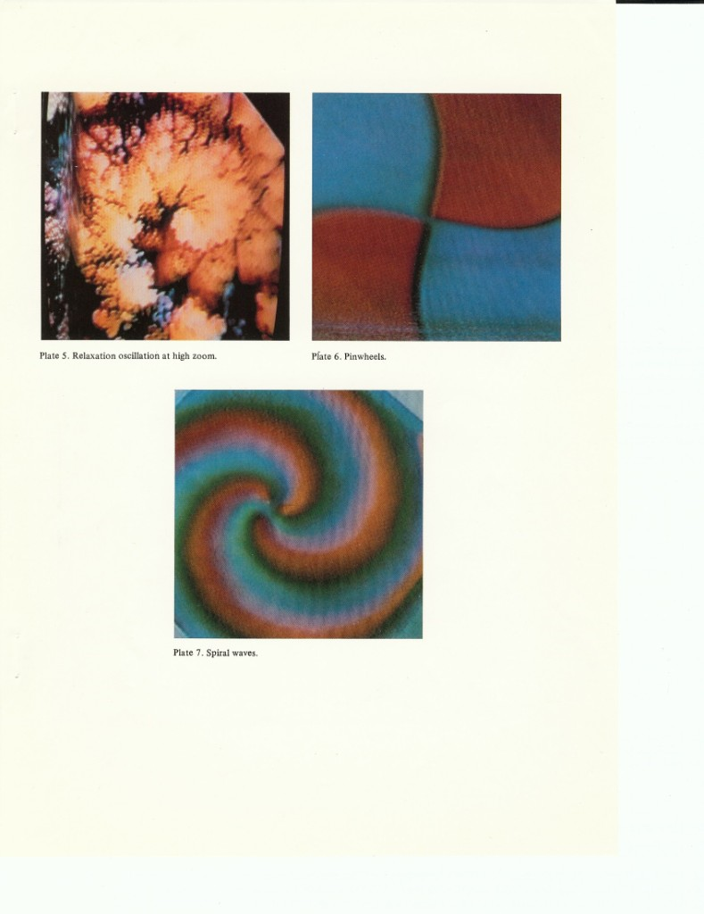

# Jim Crutchfield — papers & film annex 🦋🎞️

*Local copies of key papers plus the companion film — summaries, commentary,
and the reasons each one lives in this repo. The 1984 paper and the 1984 film
are two performances of the same work: the paper is the score, the film is the
concert.*

## In this directory

| File | Paper |
|------|-------|
| [`crutchfield-1984-space-time-dynamics-in-video-feedback.pdf`](crutchfield-1984-space-time-dynamics-in-video-feedback.pdf) | "Space-Time Dynamics in Video Feedback," *Physica* **10D** (1984) 229–245 |
| [`crutchfield-2002-what-lies-between-order-and-chaos.pdf`](crutchfield-2002-what-lies-between-order-and-chaos.pdf) | "What Lies Between Order and Chaos?" in *Art and Complexity*, J. Casti ed., Oxford (2002) |

Canonical sources: [UC Davis PDF](https://csc.ucdavis.edu/~cmg/papers/Crutchfield.PhysicaD1984.pdf) ·
[abstract page](https://csc.ucdavis.edu/~chaos/chaos/pubs/stdvf-title.html) ·
[DOI 10.1016/0167-2789(84)90264-1](https://doi.org/10.1016/0167-2789(84)90264-1) ·
[Jim's films page](https://csc.ucdavis.edu/~chaos/chaos/films.htm)

## Space-Time Dynamics in Video Feedback (1984)

**The move:** point a video camera at its own monitor and treat what happens
not as a party trick but as a **spatiotemporal dynamical system** — then argue
that the rig is a **space-time analog computer**. "The information no longer
goes from here to there, but rather round and round the camera-monitor loop...
From this dynamical flow of information some truly startling and beautiful
images emerge."

**What's in it:**

- **The physics of the loop.** The vidicon tube stores and integrates charge
  (a temporal low-pass filter) and diffuses electrons (a spatial low-pass
  filter); the knobs — **zoom, rotation, focus, f/stop, brightness, contrast,
  hue** — become the control parameters of a dynamical system. Focus is,
  wonderfully, a hands-on **spatial diffusion rate** control.
- **Two models.** A discrete-time **iterated functional equation** on the
  space of images, and a continuous **reaction-diffusion PDE** in the direct
  lineage of **Turing's 1952 morphogenesis paper** — with one Korz-flavored
  twist: the rotation/magnification term makes the spatial coupling
  **nonlocal**.
- **A taxonomy of behavior:** fixed-point images, limit cycles (a 7-second
  color oscillation stabilized by a tiny mark near the screen center — left
  running two hours one evening with no deviation), chaotic image sequences,
  noise-driven bursts, and — where dynamical systems theory runs out of
  vocabulary — **"quasi-attractors"**: maze-like **dislocation** patterns that
  are stable as a *class* of similar images rather than as any exact image.
  Pinwheel images are compared to Winfree's rotating waves in heart tissue;
  spiral color waves to Belousov-Zhabotinsky.
- **The CA claim (§5).** Video feedback "does, in fact, simulate some
  two-dimensional automata and rapidly, too" — rotation and magnification give
  **nonlocal neighborhoods**, focus sets the **neighborhood radius**, and
  proposed variation (6), *"inserting a digital computer into the feedback
  loop via a video frame buffer,"* generalizes the rig to arbitrary lookup-table
  rules and lattice dynamical systems.
- **The price tag footnote:** "The cost for this space-time simulator is a
  little over $1000, approximately a cheap home computer."
- **Provenance:** premiered (as film) at the **International Workshop on
  Cellular Automata, Los Alamos, May 1984**. Acknowledgments thank **Ralph
  Abraham** for the introduction to video feedback (the 1976 cascades paper —
  see [abraham-video-feedback-lineage.md](../abraham-video-feedback-lineage.md)),
  **Doyne Farmer** and CNLS for support, and **Larry Cuba** — the *Star Wars*
  Death Star briefing animator — for loaning the video equipment behind
  Plates 6 and 7.

### The plates

Scanned from the printed Physica D article:

*Plate 1: a nine-fold equilibrium image (360°/40° rotation = 9 — "symmetry
locking," the spatial cousin of frequency locking). Plate 2: one frame of the
7-second limit cycle. Plate 3: dislocations — laminar stripes outside, a
maze of broken symmetry inside; the quasi-attractor specimen. Plate 4: the
logarithmic spiral, "structure and periodic coloring [that] occur often in
organisms, such as budding ferns and conch shells."*

*Plate 5: a noise-amplified burst — "noise-driven spatial structures in a
relaxation oscillator," first cousin of the **dripping handrail** (Crutchfield
& Kaneko 1988, cited below). Plates 6-7 (shot
on Larry Cuba's equipment): luminance-inversion pinwheels compared to the
rotating electrical waves of the beating heart, and outward-spiralling color
waves reminiscent of Belousov-Zhabotinsky.*

### The film 🎞️

> **Space-Time Dynamics in Video Feedback** — *"A film by Jim Crutchfield,
> Entropy Productions, Santa Cruz (1984). Original U-matic video transferred to
> digital video. 16 minutes."*
> **[Watch on YouTube](https://www.youtube.com/watch?v=B4Kn3djJMCE)** (posted
> by YoDrChaos, 77k+ views) · [Jim's films
> page](https://csc.ucdavis.edu/~chaos/chaos/films.htm)

The film is the paper's taxonomy **performed**: equilibrium images blooming
into symmetry-locked mandalas, the limit cycles breathing, chaotic image
sequences, the "noise-driven spatial structures in a relaxation oscillator"
section (one YouTube commenter: *"sounds like every good drug trip"*; another:
*"Finally a documentary about the creation of the universe"*), dislocation
mazes, pinwheels, and spiral waves. The soundtrack — credited on the upload to
**Richard Burmer** (*Sun Dreams*, *Mechanical Witch*, *Sunshade*) and
**Eberhard Schoener** (*Nadi*, from *Bali-Agúng*) — gives it the pacing of a
planetarium show; viewers keep comparing it to Eames's *Powers of Ten*, and
they're right to: it's *Powers of Feedback*.

**Read one, watch the other.** Section 3's taxonomy tells you what you're
looking at; the plates above are frames from the same family of experiments.
A companion piece from the same shop: [*Chaotic Attractors of Driven
Oscillators* (1982)](https://youtu.be/Sq8Vu40Bw1g), Entropy Productions.

**The Don connection.** A hand-me-down videotape of this film reached Don
around **1990** and quietly rewired him ([the story](../README.md#don--jim-over-the-years-)).
His own video feedback experiments — up through Mac-era feedback with live
background removal — and the "point the system at itself and steer" instinct
behind the [CAM6 performance
platform](../../don-hopkins/cam6-cellular-automata-machine.md) grew in its
afterglow. An open dream: Don's tape carried **explanatory narration** that
the online transfer lacks — the director's cut wants to exist, or better,
**Jim narrating over the film live**.

### Why this paper (and film) live in this repo

- **It's the video verse of the feedback-loop hymn — and the voice stuff is
  the other verse.** Alvin Lucier ran the loop through a room and a voice
  (*I Am Sitting in a Room*, 1969, audio); Crutchfield ran it through a
  camera-monitor pair (1984, video); the [robopoetry telephone game and
  Rhetoric Organ](../../don-hopkins/rhetoric-organ-semantic-modulator-keyboard.md)
  run it through a speech recognizer, a language model, and a speech
  synthesizer (2026, voice and text) — with [Pink Trombone as the adversarial
  larynx](../../../repo-shows/voystick-pink-trombone/SHOW.yml). Same hymn,
  three instruments: room, camera, mouth. The show wants all three loops on
  one stage.
- **Injection is an instrument.** The most delightful way to play a video
  feedback loop: **hold things up in front of the camera** — hands, faces,
  flowers, confetti, puppets, dolls, stuffed animals, jewelry — and watch the
  loop metabolize them: iterated, smeared, symmetry-locked, folded into the
  attractor. It's exactly the [adversarial Pink Trombone
  move](../../don-hopkins/rhetoric-organ-semantic-modulator-keyboard.md) in
  the video register — playing a loud Pink Trombone over the speech is
  holding a flower in front of the camera. Same attack, different sense organ:
  **inject a signal the loop didn't generate and make the system believe it
  was always there.** Prompt injection by hand, by face, by confetti.
- **Variation (6) is the telephone game's architecture, proposed forty-two
  years early.** The paper's list of extensions includes *"inserting a digital
  computer into the feedback loop via a video frame buffer"* — swap the frame
  buffer for a language model and you have the robopoetry loop's wiring
  diagram: the LLM is the frame buffer. And the buildable version is in the
  browser: [korz-prime](../../david-ungar/korz-prime.md) sketches compiling
  Korz specs into **WebGPU compute shaders with the video camera in the
  loop** — camera → shader pipeline → canvas → camera, variation (6) live in
  a tab, with 1984's knobs (rotation, zoom, pan, focus) as shader uniforms.
- **It premiered in the conference series where the CAM was born.** The film
  premiered at the 1984 Los Alamos workshop, in the same series where Toffoli
  and Margolus's first CAM hardware made its debut appearances a year earlier.
  That thread runs straight to the [Norman Margolus
  show](../../../repo-shows/norman-margolus/SHOW.yml), Don's CAM6.js, and the
  CAM-8 software-archaeology beat.
- **Nonlocal neighborhoods are dimension guards.** Rotation, zoom, and pan
  parameterize *which cells are your neighbors* — rotation twists the
  neighborhood, zoom scales it, pan translates it — and **focus sets its
  radius** (defocusing is literally turning up the spatial diffusion rate).
  It's the same generalization
  [korz-prime](../../david-ungar/korz-prime.md) makes when it reads cellular
  automata as fully-crystallized Korz ("CA at absolute zero") with
  neighborhoods as dimensions. Video feedback is the analog machine where you
  *turn the neighborhood with a lens ring* — the optical bench is the
  dimension-selection UI.
- **Turing 1952 is the shared ancestor** of this paper's PDE model, of
  reaction-diffusion texture work everywhere, and of the morphogenesis riffs
  in the [hierarchy-of-bleeds fluid
  CA](../../../repo-shows/heather-and-steve/afterlife-zombie-bridge.yml).
  Plate 3's dislocations are what the blood/chum flood z-buffer wants to look
  like when it grows up.
- **The film is watchable today.** Crutchfield's 16-minute companion film
  ([YouTube, 77k views](https://www.youtube.com/watch?v=B4Kn3djJMCE)) shows
  the experiments the paper formalizes.

## What Lies Between Order and Chaos? (2002)

Written for John Casti's *Art and Complexity* volume: Crutchfield's most
accessible statement of the thesis behind computational mechanics — that
**structure lives between order and randomness**, and that both extremes are
cheap while the middle is where nature (and art) does its work. Entropy
measures surprise but not organization; his **statistical complexity** and
**ε-machines** measure the intrinsic computation a process performs — how much
history it stores and how it uses that memory to behave.

### Why this paper lives in this repo

- **It's the aesthetic theory of the whole jam.** "Between order and chaos" is
  the operating point of Eno's generative systems ([brian-eno
  ideas](../../brian-eno/ideas.md)), Don's [Musical
  Gas](../../don-hopkins/musical-gas-granular-ca-synth.md), the CAM6 space
  inventory sets, and the [rhetoric
  organ](../../don-hopkins/rhetoric-organ-semantic-modulator-keyboard.md)'s
  dramaturgy (ride the loop up to peak absurd beauty, then gong it).
- **It's korz-prime's temperature axis with the sign conventions worked out.**
  Fully crystallized rules at one end (strict tier, CA at absolute zero),
  noise at the other, and the interesting representations in between — the
  soft/strict two-tier design is a bid to *live* at Crutchfield's operating
  point rather than visit it.
- **Art & Science Laboratory credentials:** Jim co-founded the Santa Fe
  Art & Science Lab and built the *Theater of Pattern Formation* with composer
  David Dunn — performed at CalArts and **Burning Man**. He has already staged
  pattern formation as a show; the Repo Show format is his home turf.

## Cited, not downloaded

- Packard, Crutchfield, Farmer & Shaw, **"Geometry from a Time Series,"**
  *Phys. Rev. Lett.* 45:712 (1980) — reconstruct the attractor from one
  measurement stream; the Santa Cruz Dynamical Systems Collective's
  calling card (and the *Eudaemonic Pie* roulette era).
- Crutchfield & Kaneko, **"Are Attractors Relevant to Turbulence?"** *PRL*
  60:2715 (1988) — the **dripping handrail**; transients that outlast the
  universe. Show beat: simulate it in the browser.
- Mitchell, Hraber & Crutchfield, **"Revisiting the Edge of Chaos"** (1993) —
  evolving cellular automata to compute; the GA-meets-CA thread.
- **Films:** [*Space-Time Dynamics in Video Feedback*
  (1984)](https://www.youtube.com/watch?v=B4Kn3djJMCE) and [*Chaotic Attractors
  of Driven Oscillators* (1982)](https://youtu.be/Sq8Vu40Bw1g), both Entropy
  Productions, Santa Cruz.

## See also

- [abraham-video-feedback-lineage.md](../abraham-video-feedback-lineage.md) — the 1976 → 1984 handoff
- [README.md](../README.md) — who Jim is, the friendship, and the show plans · [CHARACTER.yml](../CHARACTER.yml)
- [The Rhetoric Organ / robopoetry loop](../../don-hopkins/rhetoric-organ-semantic-modulator-keyboard.md) — the voice-and-text verse of the feedback hymn
- [CAM6](../../don-hopkins/cam6-cellular-automata-machine.md) — Don's cellular-automata performance platform, grown in the film's afterglow
