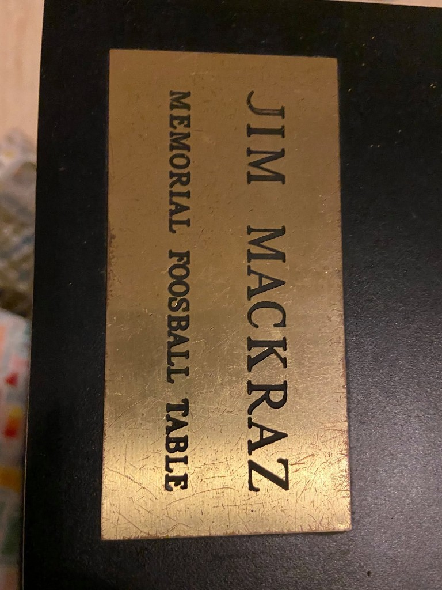
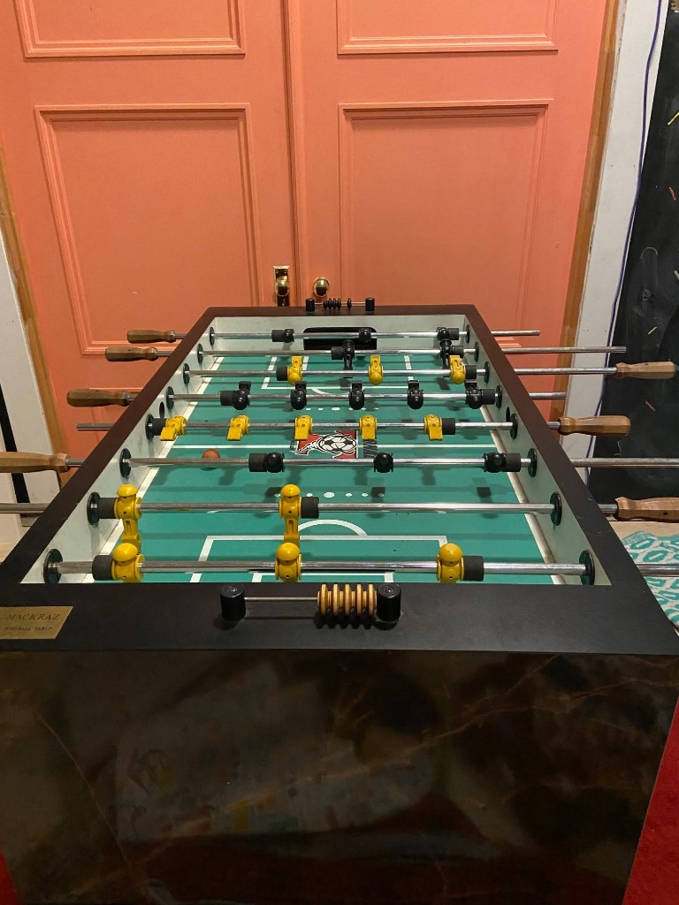

# The Jim Mackraz Memorial Foosball Table

*Context:* a side thread in the [31 May 2021 Brain UI / beta screenshots
discussion](../will-wright/sources/2021-05-31-brain-ui-beta-screenshots/README.md) on Maxis Alumni.
Someone posted photos of a **Tornado** foosball table bearing a brass plaque; the comments that
followed are the archive.

## The plaque

**JIM MACKRAZ / MEMORIAL FOOSBALL TABLE**

A joke memorial on a real object — the kind of office humor that outlives the office. The table is a
**Tornado** (the tournament-grade brand; Bradford Smith below calls it *"one of the best tables I've
gotten to play on"*). It currently lives in **Alameda, California** — Eric Hedman locates it as
*"unearthed in far away Al Ameda."*

## The thread

The photos landed in the middle of Don's Brain UI nostalgia post. The comments that followed treat
the memorial plaque as fact until Jim Mackraz shows up:

> **Jim Siefert** — *"Hey, Jim Mackraz, want your table back."*
>
> **Jim Mackraz** — *"ha"*
>
> **Jim Mackraz** — *"Can I get the plaque?"*
>
> **Jim Mackraz** — *"Save it for a special occasion?"*
>
> **Eric Lennon Bowman** ([room](../eric-bowman/)) — *"Rest In Peace, dude"*
>
> **Jim Mackraz** — *"Jim's FAMILY?"*
>
> **Michael Murguia** — *"I was just all, wait wut?"*
>
> **Eric Lennon Bowman** — *"You have to love a **Will joke** that comes home to roost 20 years
> later."*
>
> **Jim Mackraz** — *"Hi Jason. I'd like to try to get the table. Let's connect"*
>
> **Jason Haber** — *"Welcome back to the land of the living! I'll message you."*
>
> **Karen Moss** — *"Jim Mackraz you type really well for a ghost - or zombie"*
>
> **Bradford Smith** — *"I loved this table. Played so many games with **Guillaume Pierre,
> Renaud Ternynck and Kip Katserelis**. One of the best tables I've gotten to play on. Glad it
> continues to have a good home! **Always wondered who Jim Mackraz was and what happened to
> him.**"*
>
> **Jim Mackraz** — *"Bradford Smith I obviously should have been creating my brand."*
>
> **Eric Irk Hedman** ([room](../eric-hedman/)) — *"Bradford Smith he was always **part of the
> solution and never part of the problem.** (TM) and then he was taken from us… his name lost to
> history until this table was unearthed in far away Al Ameda"*
>
> **Karen Moss** — *"PS: Foosball is the devil"*
>
> **Jim Mackraz** — *"Karen Moss hey."*
>
> **Eric Irk Hedman** — *"Poor Jim…."*
>
> **Jim Mackraz** — *"John Biundo you want in on this?"*

## What the thread establishes

**The memorial is a Will Wright joke that aged into furniture.** Eric Bowman's *"Will joke that comes
home to roost 20 years later"* is the key line — the plaque predates the Facebook thread by roughly
two decades, and the alumni group treated it as an epitaph until Jim typed back. Bradford Smith had
played on the table for years at Maxis **without knowing Jim was alive**, which is both funny and a
measure of how fast people scatter after a studio closes.

**Jim wants the table back.** His first response to seeing the photos is practical — *"Can I get the
plaque?"* then *"Hi Jason. I'd like to try to get the table. Let's connect."* **Jason Haber** appears
to be the current keeper (Alameda). Whether the reunion happened is not recorded here.

**The table was a social hub.** Bradford names three regular opponents — **Guillaume Pierre, Renaud
Ternynck, and Kip Katserelis** — and ranks it among the best foosball tables he's played. That is
office-culture evidence: CTG leadership ([Jim Mackraz](README.md)) presided over a game that outlasted
the org chart.

**Same thread, different Jim joke:** Jim's other appearance in the Brain UI post is
[`#stillproud` on the stippled shower door](../will-wright/sources/2021-05-31-brain-ui-beta-screenshots/README.md#censorship-shipped-before-nakedness)
— censorship-before-nakedness. Two kinds of memorial in one comment section.

## Open

- [ ] **Who posted the three photos?** Jason Haber is the likely owner; confirm.
- [ ] Did Jim get the table (or the plaque) back?
- [ ] When was the plaque made, and who engraved it? Will Wright's joke — but who executed it?
- [ ] Where was the table during the Maxis years — Walnut Creek? EA campus?
- [ ] **Guillaume Pierre, Renaud Ternynck, Kip Katserelis** — rooms or identifications wanted.
- [ ] **Jim Siefert, Jason Haber, Bradford Smith, Karen Moss, Michael Murguia, John Biundo** — who
      were they at Maxis?

## Repo orbit

- [Brain UI thread, 31 May 2021](../will-wright/sources/2021-05-31-brain-ui-beta-screenshots/README.md) — parent post; shower door `#stillproud` in the same comments
- [Jim Mackraz](README.md) — CTG lead on The Sims; [polished turd correction](sources/2026-08-21-polished-turd-correction.md)
- [Eric Bowman](../eric-bowman/) · [Eric Hedman](../eric-hedman/)
- [Building The Sims reunion show](../../repo-shows/building-the-sims/team-stories.md)
