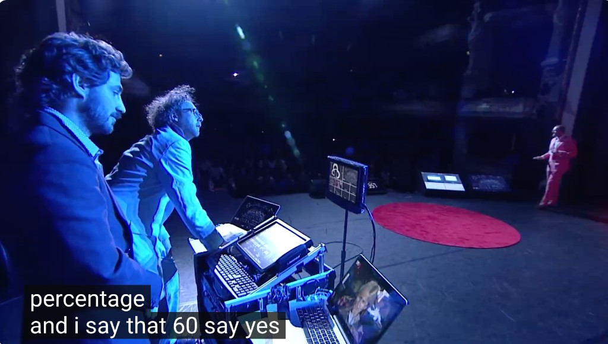
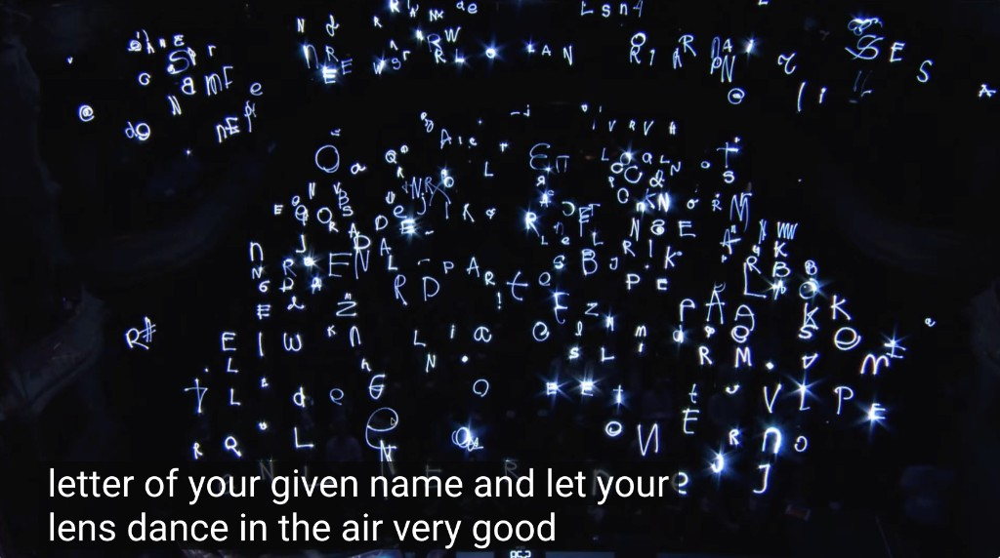

# Keez Duyves 💡📡🪦

*Portrayal of a real invitee, written by Don — not Keez.*
[Portrayal standards](../../schemas/portrayal-standards.md)

**Keez Duyves** ([Urban Nation](https://urban-nation.com/artist/keez-duyves/), [PIPS:lab](http://www.pipslab.org/)) is the Dutch image wizard behind audience-participation light art, multi-user 360 cinema, and **Die Space** — the afterlife social network you join by being dead (and, at TEDxAmsterdam, by writing your name in light).

Don’s friend since a **Trouw** performance ~2009. Amsterdam. **Definitely inviting.** Inter Will Wright into Die Space.

*Die Space live control cyberspace decks on stage.*

---

## Friendship arc (receipts)

| When | What |
|------|------|
| ~2009 | First meet: **PIPS:lab at Trouw**. [Ben Cerveny](../ben-cerveny/) maybe there. |
| 8 Jun 2009 | Don wrote a friend: Canvas on the **Volkskrant** roof across from Trouw; PIPS:lab’s **10-year** anniversary of weird live video performance art. |
| 11 Jun 2009 | Don → [Jaron Lanier](../jaron-lanier/): meet PIPS:lab (pipslab.nl); modern Body Electric yearning. |
| Jul 2011 | dpdk (Rotterdam) 360 stitch/stream freelance → Don names **PIPS:LAB**; Owen already a fan. |
| (lineage) | Co-founder **Steye Hallema** later Jaunt VR creative director (*Ashes to Ashes*). |
| 22 Aug 2012 | Earliest Keez-named saved mail — Facebook friends (Pinterest notice). |
| 2012–13 | Messenger: Unity World-from-data vs Island demo; pie menus in 3D; Keez “a little inbetween gaffertape and messaging objects.” |
| 7 Mar 2017 | **Anyways** at the **NDSM** lab — six-participant synced 360; Don alone as audience; Keez orchestrated. Next day Don told Arthur (Jaunt) to cultivate artists like Keez on a **JavaScriptable** 360 player. |
| Mar 2024 | Die Space on HN as the worked example of massively multiplayer CV. |
| 2026 | Parker / NDSM visit path; Repo Show invite. |

Not the other Amsterdam Keez (Kees Colijn / Arthur’s friend from the ’90s). Full: [`sources/friendship-arc-receipts.md`](sources/friendship-arc-receipts.md).

---

## Why this show

| Beat | Why Will / Don care |
|------|---------------------|
| **Die Space** | First interactive SNS for the deceased — “you can still chat when you’re dead” ([TEDx](https://www.youtube.com/watch?v=ApyDSq_DbQo) · [HD](https://www.youtube.com/watch?v=aQz_irTiqGE)) |
| **Lumasol / Luma2solator** | Live light-writing with feedback; 500k+ paintings; ZKM; crowd becomes the instrument |
| **Anyways** | Synced 360 cinematic for 6 — Don never saw anything like it ([Vimeo](https://vimeo.com/206409021)) |
| **JS player unfinished business** | 2017: artists who invent original 360 uses need a *programmable* player — WebXR / Repo Show rematch |
| **Massively multiplayer CV** | Roomful of shiny LEDs, cameras → shared cloud ([HN 2024](https://news.ycombinator.com/item?id=39821421)) |
| **Participation not observation** | Urban Nation / PIPS:lab credo since before Trouw |
| **SO DUTCH** | NDSM studio; Trouw / Canvas recycled newspaper buildings; Parker visit path |

---

## Then vs now (brainstorm teaser)

**Then (handmade, already genius):** seat LEDs + camera → names in light; six orchestrated HMDs; Luma2solator live feedback; Jaunt-era dreams of programmable live 360 and rooftop NYE fireworks with shared virtual rockets (and, escalating, Arduino-lit real ones).

**Now (newly cheap / newly weird):** WebXR Anyways-for-N; Repo Show as a living diespace.nl; Mind Mirror + LLM afterlife chat; latent-space pigment with Lumasol; Gaussian/NeRF capture of a performance volume; Will + Parker in the NDSM lab.

Full ladder: [`ideas.md`](ideas.md).

---

## Will Wright Show For Food — a Repo Show

**Will Wright is in** — signed on for the [premiere](../../repo-shows/will-wright-premiere/README.md) and more. Keez’s room is for a dedicated Repo Show (and a Will-facing Die Space segment): sources, stills, transcript digest, audience PRs — not a dead mp4 on YouTube with a toxic comment section.

[Invitation](invitation.md) · [Ideas](ideas.md) · [CHARACTER](CHARACTER.yml) · [Show seed](../../repo-shows/keez-duyves/) · [Friendship receipts](sources/friendship-arc-receipts.md) · [TEDx digest](sources/tedx-amsterdam-2012-diespace.md) · [HN 2024](sources/2024-03-hn-diespace-massively-multiplayer-cv.md)

Verifiable sources in `CHARACTER.yml`. Subject may request correction or removal anytime.
