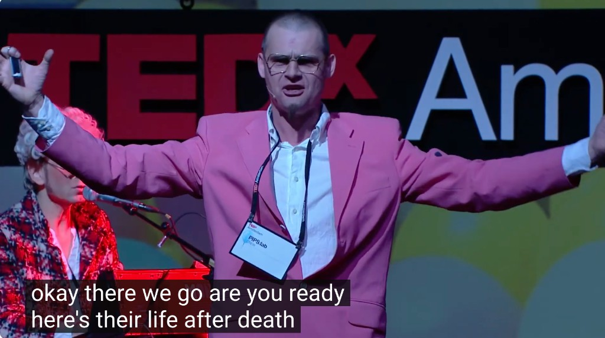

# Keez Duyves 💡📡🪦

*Portrayal of a real invitee, written by Don — not Keez.*
[Portrayal standards](../../schemas/portrayal-standards.md)

**Keez Duyves** ([Urban Nation](https://urban-nation.com/artist/keez-duyves/), [PIPS:lab](http://www.pipslab.org/)) is the Dutch image wizard behind audience-participation light art, VR cinema experiments, and **Die Space** — the afterlife social network you join by being dead (and, at TEDxAmsterdam, by writing your name in light).

Don’s friend. Amsterdam. **Definitely inviting.** Show Will Die Space.

*On-stage presenter in the pink suit — PIPS:lab CREW badge; **not Keez** (name TBD / leave unnamed).*

---

## Why this show

| Beat | Why Will / Don care |
|------|---------------------|
| **Die Space** | First interactive SNS for the deceased — “you can still chat when you’re dead” ([TEDx](https://www.youtube.com/watch?v=ApyDSq_DbQo) · [HD](https://www.youtube.com/watch?v=aQz_irTiqGE)) |
| **Lumasol / Luma2solator** | Live light-writing with feedback; 500k+ paintings; ZKM; crowd becomes the instrument |
| **Massively multiplayer CV** | Don’s [HN 2024](https://news.ycombinator.com/item?id=39821421) — nod/shake polls, face cloud; LEDs → modern tracking |
| **Participation not observation** | Urban Nation bio line — PIPS:lab credo |
| **AnywaysVR** | Multi-user 360 cinema Don never saw anything like |
| **SO DUTCH** | NDSM / Amsterdam inventiveness; Parker visit path to the studio |

---

## Will Wright Show For Food — a Repo Show

**Will Wright is in** — signed on for the [premiere](../../repo-shows/will-wright-premiere/README.md) and more. Keez’s room is for a dedicated Repo Show (and a Will-facing Die Space segment): sources, stills, transcript digest, audience PRs — not a dead mp4 on YouTube with a toxic comment section.

[Invitation](invitation.md) · [Ideas](ideas.md) · [CHARACTER](CHARACTER.yml) · [Show seed](../../repo-shows/keez-duyves/) · [TEDx digest](sources/tedx-amsterdam-2012-diespace.md) · [HN 2024](sources/2024-03-hn-diespace-massively-multiplayer-cv.md)

Verifiable sources in `CHARACTER.yml`. Subject may request correction or removal anytime.
