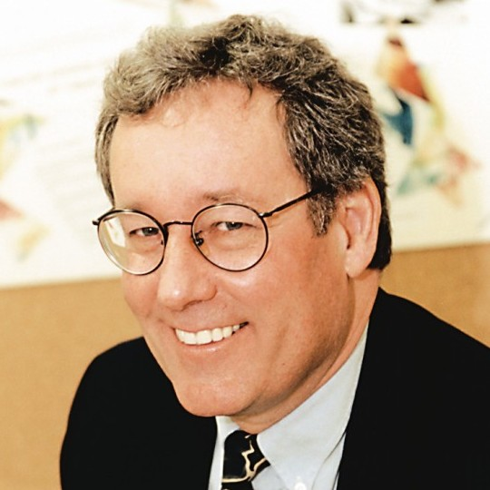

# Kellogg S. Booth 🎓📽️ *(HCI · graphics · Canadian institution-builder)*

*Portrayal of a real correspondent, written by Don — not Kelly, and not his words.
Newly Cc'd on the PIXIE thread; not yet contacted. He may correct, shape, reduce,
or delete any of it.* [Portrayal standards](../../schemas/portrayal-standards.md) ·
authored by Don Hopkins

## Who

**Kellogg S. Booth** (universally **Kelly** in the community) — **Professor Emeritus** of
Computer Science at the [**University of British Columbia**](https://www.ubc.ca/)
(`ksbooth@cs.ubc.ca`). Distinguished Member of the ACM. One of the few researchers who has
published substantively in **theory, computer graphics, and HCI**.

He enters **Will Wright Show For Food** on **9 July 2026** when [Roy Eagleson](../roy-eagleson/README.md)
Cc'd him on the [PIXIE storyline thread](../heinz-lemke/sources/2026-07-09-pixie-storyline-thread.md),
naming Kelly *"a friend and mentor … who taught me and inspired my storytelling nature in HCI
lectures."*

## Why he fits this project

| Thread | Connection |
|--------|------------|
| **PIXIE / PDP-7** | Roy teaches graphics history as narrative; Kelly is the teacher of that method |
| **Pie menus & input** | Pioneered experimental studies of **menu layout**, anti-aliasing, 3D-via-2D — same design questions as radial menus |
| **Canadian CG lineage** | Co-founded Waterloo **CGL** (1979) with John Beatty and Richard Bartels — cradle of Canadian animation R&D |
| **Repo Show register** | Institution-builder, SIGGRAPH steward, Graphics Interface president — the "community amen" role |

Roy's classroom arc — **Sketchpad → PIXIE** — runs through Kelly's Waterloo-to-UBC corridor.
That's the same corridor Don's pie-menu and microworld work keeps returning to.

## Career (harvested facts)

### Education & early work

- **B.Sc. Mathematics**, Caltech (1968)
- **M.A. & Ph.D. Computer Science**, UC Berkeley (1970, 1975) — early work in computational complexity and graph theory
- **Lawrence Livermore National Laboratory** (1968–1976) — staff scientist; early graphics exposure while finishing degrees
- High-school origin: Palos Verdes science club; SAGE field trip — half the developers were mathematicians, half psychologists (*that's HCI*)

### Waterloo — Computer Graphics Laboratory

Kelly joined Waterloo CS in **1977**; [John Beatty](https://cs.uwaterloo.ca/kiosk/history/cs.htm) in 1978.
In **1979** they launched a **Computer Graphics and Interaction** research group. With **Richard Bartels**
(1981) they formed the **Computer Graphics Laboratory (CGL)** — [one of Canada's first](https://cs.uwaterloo.ca/kiosk/history/cs.htm).

CGL alumni include Academy Award winners **Rob Krieger** and **Paul Breslin**; **Marceli Wein** was adjunct.
[Joanne McKinley](https://news.profoundimpact.com/tag/university-of-waterloo/) (Google Waterloo) earned her
MMath in CGL — *"user interface became a theme in my career."*

### UBC — Imager, MAGIC, NECTAR

- Helped establish **Imager Laboratory** (graphics, visualization, HCI) with **Alain Fournier** — grew to 10+ faculty
- **Founding director, MAGIC** (Media and Graphics Interdisciplinary Centre), 1990–2002
- **Associate Director** (Acting Director, H1 2006), **NECTAR** — NSERC collaboration-technologies network, 2004–2008
- Participated in CFI proposal for **ICICS** lab space at UBC

### Research highlights

- **Benesh Movement Notation editor** (1980s, with Rhonda Ryman & John Beatty) — still maintained by Royal Academy of Dance
- Early **multitasking/multiprocess** interactive systems (Benesh editor, paint programs)
- Psychology-style **experimental test-beds** for menu layout, anti-aliasing, 3D manipulation on 2D displays
- 1990s: collaborative computing, VR/AR, distance work
- 2000s: affect in physical UIs, multi-display input, privacy-ware, collaborative writing annotations, personalized heavy-feature UIs
- **90+** refereed papers; **16** Ph.D. and **50+** Master's students mentored

Full structured harvest: [`sources/career-and-awards.yml`](sources/career-and-awards.yml)

## Awards

| Year | Award | Org |
|------|-------|-----|
| **2008** | [CHCCS/SCDHM Achievement Award](https://graphicsinterface.org/awards/chccs-scdhm-achievement/kellogg-booth/) | Canadian HCI/CG society |
| **2010** | ACM SIGGRAPH Outstanding Service Award | ACM SIGGRAPH |
| **2020** | [CHCCS/SCDHM Service Award](https://graphicsinterface.org/awards/chccs-scdhm-service/kellogg-booth/) | Canadian HCI/CG society |

**SIGGRAPH service (summary):** Ad-hoc technical-program policy committee **1981**; co-chair **SIGGRAPH 1983**;
**SIGGRAPH Chair 1985–1989** (three-year budgeting cycle, extraordinary growth era); program committees on
**18+** conferences; an estimated **500** paper reviews over ~30 years.

**Graphics Interface / CHCCS:** Local arrangements co-chair **1981**; president **2002–2008** + six years Past Chair;
general co-chair **AI/GI/VI 1992** (Vancouver) and **AI/GI/CRV 2005** (Victoria); program co-chair **GI 1998**;
chaired awards committee — established Service Award; incorporated Fournier, Buxton, and CDMP awards into CHCCS.

Citation: *"The presence of both the University of Waterloo and the University of British Columbia in Canadian
computer graphics is owed significantly to Professor Booth's efforts."*
([Achievement Award](https://graphicsinterface.org/awards/chccs-scdhm-achievement/kellogg-booth/))

## WWSFF show hooks

- **PIXIE pie menus PDP-7** — Roy's mentor on the thread; Canadian graphics-history voice
- **Pie menus retrospective** — menu-layout experimental tradition
- **Educators track** — storytelling HCI pedagogy (Roy ← Kelly)
- **Benesh editor** — shape grammar / notation systems (parallel beat to star-fort grammar in infodump)
- **Canadian animation spotlight** — [Profound Impact research note](https://news.profoundimpact.com/tag/university-of-waterloo/) places Kelly at CGL founding

## Status

**On the thread, not yet invited or contacted.** Listed so the relationship and public record are
documented; room grows if Kelly wants in.

## Links

| | |
|---|---|
| **Career harvest (YAML)** | [`sources/career-and-awards.yml`](sources/career-and-awards.yml) |
| **Roy Eagleson** (student, brought him in) | [`../roy-eagleson/`](../roy-eagleson/) |
| **Heinz Lemke** (PIXIE thread host) | [`../heinz-lemke/`](../heinz-lemke/) |
| **PIXIE show** | [`../../repo-shows/pixie-pie-menus-pdp7.yml`](../../repo-shows/pixie-pie-menus-pdp7.yml) |
| **Waterloo CS history** | [cs.uwaterloo.ca/kiosk/history/cs.htm](https://cs.uwaterloo.ca/kiosk/history/cs.htm) |
| **Casual portrait** | [`media/kelly-booth-casual.png`](media/kelly-booth-casual.png) |

[CHARACTER.yml](CHARACTER.yml)
