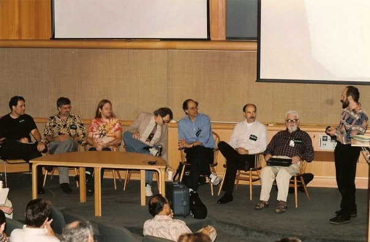

# Ken Kahn 🎈🐦🌀

Invitation portrayal — **not** Ken Kahn. [Standards](../../schemas/portrayal-standards.md)

Fifty years of AI, creativity, and education: the 1979 MIT thesis that made
animated films from story descriptions (advisor Carl Hewitt; text-to-video,
45 years early), **ToonTalk** (programming as a video-game city — robots
trained by demonstration, messages carried by birds to nests), the
**eCraft2Learn AI blocks** for Snap!, and the book **The Learner's
Apprentice: AI and the Amplification of Human Creativity**.

Lately: publishing documented chatbot-collaboration experiments, including
[a machine-written history of two AI myths](https://toontalk.github.io/misc/ai-history-two-claims.html)
that he editor-in-chiefed between Claude and ChatGPT —
[making-of here](https://docs.google.com/document/d/1SuekouRgA8NrQMOJdmpfowesV4-qTQxmhOe54aTYyw8/edit) —
in which the models argued each other out of half a dozen overclaims and
neither could draw the *Perceptrons* cover spirals until one taught the
other where the ambiguity has to hide.

*Ted Selker's NPUC workshop, IBM Almaden — Marc Davis, Ken Kahn, Don
Hopkins (in the Terrapin Station tie-dye), Fred Lakin, Danny Bobrow, Tim
Brown, John McCarthy, Ted Selker.
[The photo's own dating dispute, preserved](sources/npuc-almaden-panel.md).*

**Start here:** [Invitation](invitation.md) ·
[Interview hooks](ideas.md) ·
[The 2026 experiments](sources/2026-chatbot-experiments.md) ·
[CS547 / Gosling / ToonTalk (2023)](sources/2023-02-stanford-cs547-gosling-toontalk/README.md) ·
[Show seed](../../repo-shows/ken-kahn/README.md)

Verifiable sources in `CHARACTER.yml`. Subject may request correction or removal anytime.
