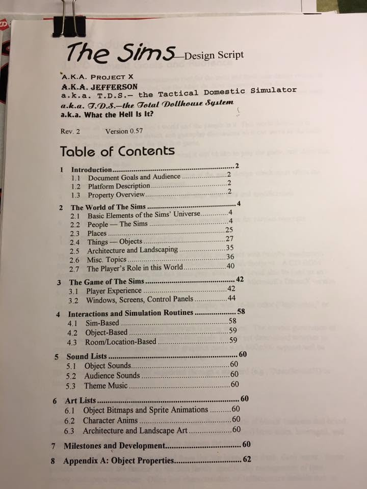
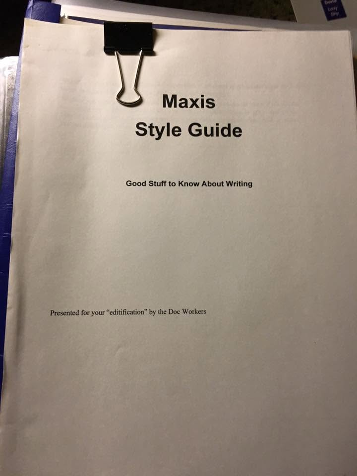
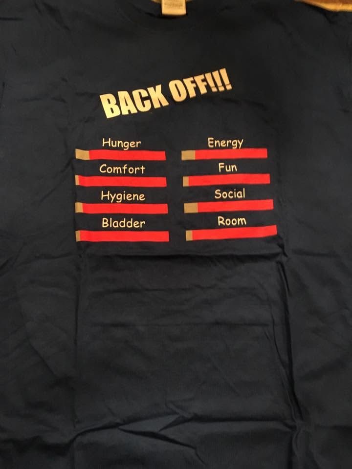
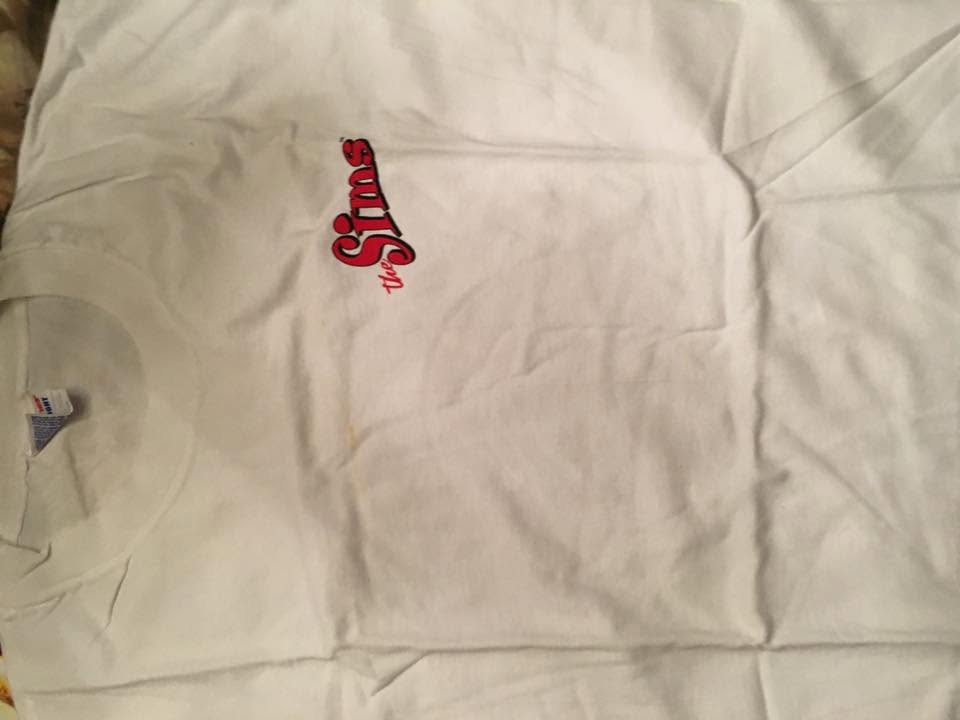
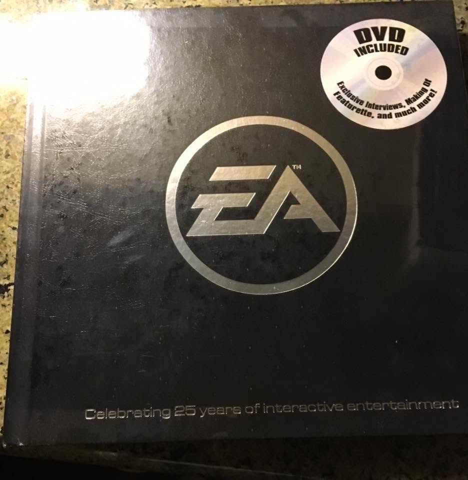
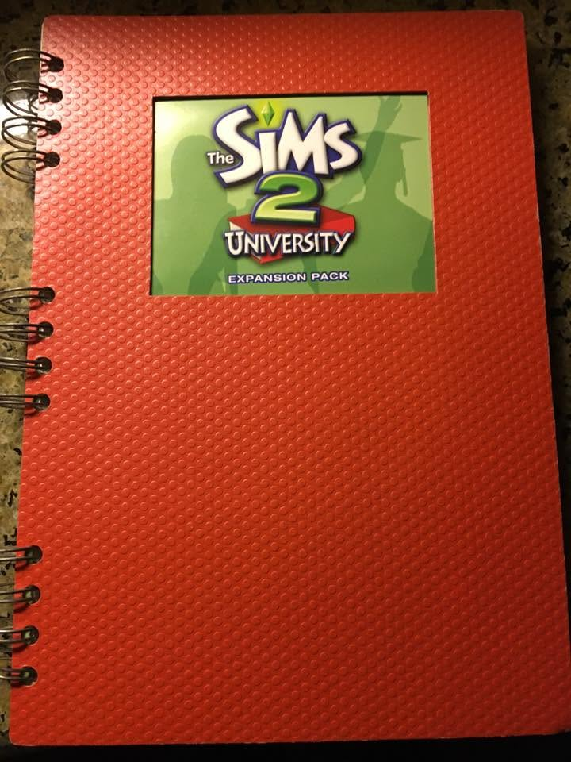

# The box: Melissa Bachman-Wood's Maxis collection

*Source:* Melissa Bachman-Wood on Maxis Alumni, **c. 2017** (thread timestamps read "9y" as of 2026)
— [comment thread](media/facebook-thread-comments.png). Photographs of her own collection, later
mailed to Don Hopkins.

Twelve artifacts, ranging from a T-shirt to a document that renames the franchise.

---

## 1. The Design Script — five working titles on one page

> **The Sims** — Design Script
> **A.K.A. PROJECT X**
> **A.K.A. JEFFERSON**
> *a.k.a. T.D.S.— the Tactical Domestic Simulator*
> *a.k.a. T.D.S.—the Total Dollhouse System*
> **a.k.a. What the Hell Is It?**
> Rev. 2 · Version 0.57

Each line is set in a different typeface, escalating from small caps to script to bold — the page is
**typographically staged as a joke that stops being funny.** By the fifth alias the document is
asking its own readers what it is.

**This decodes filenames already published.** Don's
[design-documents directory](../will-wright/sources/the-sims-design-documents-zip/README.md)
contains `TDSB.pdf`, `TDSBInfo.pdf`, `TDSEditToDo.pdf`, and `TDRObjects.pdf` — opaque until now.
**TDS = the Tactical Domestic Simulator / Total Dollhouse System.** *Jefferson* is corroborated
there too, by six `Jefferson*.pdf` files (game description, character motives, development
milestones, demo tutorial, spectrum of challenge, tools) and by the
[ShaMedic Maxis history Q&A](../will-wright/sources/2022-shamedic-maxis-history-qa/article.md).

*Dollhouse* is the name Will used at [Stanford in April 1996](../will-wright/sources/1996-04-26-winograd-interfacing-to-microworlds/README.md)
— *"This is a game I call Dollhouse."* So the chain of names is now: **Dollhouse → Project X →
Jefferson → TDS → The Sims**, with "Total Dollhouse System" preserving the old name as a backronym.

"Tactical Domestic Simulator" is worth pausing on. Maxis in 1997 was a company being bought by the
publisher of *Jane's Combat Simulations* — a logo away on
[the EA legal binder below](#6-ea-law-legal-checklist-1997). Naming a game about laundry and
bladders a *tactical simulator* is a joke, but it's the joke of a studio that knew which shelf the
industry wanted to file it on. The pitch it eventually shipped under kept the tactics and dropped
the word.

### The table of contents is itself evidence

| § | Section | Page |
|---|---|---|
| 1 | Introduction — Document Goals and Audience · Platform Description · Property Overview | 2 |
| 2 | **The World of The Sims** — Basic Elements 4 · **People — The Sims 4** · Places 25 · Things — Objects 27 · Architecture and Landscaping 35 · Misc 36 · The Player's Role 40 | 4 |
| 3 | The Game of The Sims — Player Experience 42 · **Windows, Screens, Control Panels 44** | 42 |
| 4 | Interactions and Simulation Routines — Sim-Based 58 · Object-Based 59 · Room/Location-Based 59 | 58 |
| 5 | Sound Lists — Object · Audience · Theme Music | 60 |
| 6 | Art Lists — Object Bitmaps and Sprite Animations · Character Anims · Architecture and Landscape Art | 60 |
| 7 | Milestones and Development | 60 |
| 8 | Appendix A: **Object Properties** | 62 |

**People get 21 pages; sound, art, and milestones share page 60.** Sections 5, 6 and 7 all begin on
the same page, which means they are headings with nothing under them. The document is 62 pages of
which the last three sections are aspirational — a design script caught mid-thought, at Rev 2,
version **0.57**.

Note too that *"Interactions and Simulation Routines"* is already split **Sim-based / Object-based /
Room-based**. The idea that objects and rooms carry their own behavior — the thing that became
SimAntics and the advertisement system — is structural in the table of contents before it has any
content.

**This document has never been published.** Don has the physical copy. See
[the outstanding scan](#what-is-still-owed).

---

## 2. Bug #4124 — "Is this a bad thing"

| Field | Value |
|---|---|
| Bug # | **4124** · Priority **A** · Status **Open** · Progress **New** |
| Entered by | **Michael Sundblom**, 8/23/2002, 8:03:06 PM |
| Version | Reported and current: **Alpha 8/23** |
| Type / Location | **Crash Bug** / **Live Mode** |
| Reproduction | **Always** · Difficulty **Easy** |
| Keywords | death · child · crash · save · saving |
| Assigned to | **Alex Fennell** — last assigned to **Melissa Bachman-Wood** |

> **Summary:** DE+UL Win98 Crash happens after killing child and quitting.
>
> **To Reproduce:** 1. Install combo. 2. CREATE a family consisting of 1 Adult Sim and 1 Child Sim.
> 3. Choose any lot and neighborhood. 4. **Kill off child Sim (starvation).** 5. After child turns to
> a head stone, QUIT. 6. Click no to saving. Killing child Sim and quitting without saving causes
> crash to Desktop.

**DE+UL** is *The Sims Deluxe* plus *Unleashed* — the combo install, August 2002, weeks before
Unleashed shipped. Priority A, always reproducible, easy.

Then, handwritten in marker across the update field, and stickered over with glitter stars:

> **"Is this a bad thing"**

This is the funniest document in the archive and also a real specimen of what QA work on *The Sims*
was. Someone had to write *"Kill off child Sim (starvation)"* as step 4 of a reproduction case, in
the flat imperative of a test script, and file it under keyword **death**. The joke and the glitter
are what you do afterward. The bug is real: the game crashed on the way out the door after a child
died and you declined to save it — the exact sequence a player would perform to un-do a mistake.

**Michael Sundblom** and **Alex Fennell** have no rooms here. Whoever wrote the marker and applied
the stars is unidentified.

---

## 3. The job panel, designed on an envelope

A **Maxis envelope** — *2121 N. California Blvd., Walnut Creek, CA 94596-3572 · Main 510 933 5630 ·
Fax 510 927 3736 · www.maxis.com* — with the **Sims career panel sketched on the back**:

- A boxed **Job** area with a small portrait/icon, two lines for the job title, **$385**, a **Good**
  rating, and **"Need 2 ☺"**
- A vertical skill list with tick-mark bars: **Cooking · Mechanical · Charisma · Body · Logic ·
  Creativity**
- Below, worked out longhand: *"$385,– Av."* · *"$385"* · *"Need ☺ 2"* · *"Need 2 ☺"*

Those are **the six shipped Sims skills, in a shipped-looking order**, with the promotion
requirement already expressed as a count of smileys — *friends you need before you get promoted.*
Someone thinking through the career panel wrote **relationships as a number next to a salary**, on
the back of company stationery. That's the entire Sims economy of ambition on an envelope: skills
you grind, friends you need, money you get.

The repeated *"Need 2 ☺"* reads like someone testing how to say it in the smallest space — the
labeling problem, not the design problem.

**Attribution unknown.** The handwriting is not identified; the envelope is undated. Worth asking
Don, and Melissa.

---

## 4. Maxis Style Guide — "Good Stuff to Know About Writing"

> **Maxis Style Guide** — Good Stuff to Know About Writing
> *Presented for your "editification" by the **Doc Workers***

The documentation team's house style manual, self-published under a pun and a labor-union
byline. Maxis had enough writers to need a shared style, and enough humor to sign it collectively.
**Contents unphotographed** — this is a cover only, and the inside is the interesting part: a games
company's rules for how to write about its own simulations. Ask for the rest.

---

## 5. Sims 1 marketing gatefold — "Creation is the easy part…"

The two halves of a gatefold: **"Creation is the easy part… Keeping them under control is another
story."**

The left panel is a character lineup with personality traits as name plates — **David** (Lazy, Shy),
**Shannon** (Active, Playful), **Stan** (Serious, Neat), **Justin** (Outgoing, Nice), **Doris**
(Grouchy, Sloppy) — and then a sixth Sim rendered as **an untextured purple wireframe with a
floating head and a disembodied hand**, labeled **"????"** with question marks where the traits go.

Marketing put an **unfinished asset in the advertisement on purpose.** The sixth Sim is you, or the
one you haven't made, and it is shown mid-pipeline: mesh without skin. A games ad in 1999 admitting
its own render pipeline exists, as a promise that you get to finish it.

The copy on the right is the game's whole thesis in a paragraph:

> "Here's the game that really hits close to home — putting you in charge of your own simulated
> people. From conservative to crazy, customize the personalities, skills and appearance of your own
> Sims. Build them anything from a mansion to a matchbox, furnish their homes and move them in. Then
> help your Sims pursue careers, make friends and get married — **or end up a complete mess. Whether
> they prosper or perish is up to you.** Once you pay The Sims a visit, you'll never want to leave."

And note the fine print: **"Maxis — A Division of Electronic Arts."** Two years after
[the legal binder](#6-ea-law-legal-checklist-1997), the studio name is a division label.

---

## 6. EA LAW Legal Checklist, 1997

> **Legal Checklist** · ©1997 **EA LAW** 2nd Edition
> Tabs: Placement of Notices · Title Specific Notices · Hardware & Tool Notices · Discs & Docs Guidelines

**The acquisition, drawn as a diagram.** Electronic Arts at the top, five lines descending to
**EA Sports, Bullfrog, Maxis, Origin, Jane's Combat Simulations** — dated 1997, the year EA bought
Maxis. Bullfrog and Origin were absorbed in 1995 and 1992; putting Maxis on the same bracket is the
org chart telling you what happens next.

This is also the least glamorous and most explanatory object in the box. What arrives with a
corporate parent is **a tabbed binder about where to put notices**. It is the same year and the same
company whose "very stringent" **art lock** froze
[a placeholder that became the Plumbob](../will-wright/sources/2021-05-31-brain-ui-beta-screenshots/README.md),
and the year [Tycho Rising](../mike-perry/lunasim-tycho-rising.md) was shelved.

---

## 7–10. The rest

| Artifact | | Note |
|---|---|---|
| **"BACK OFF!!!"** T-shirt |  | **The motive panel as a mood ring.** All eight needs — Hunger, Comfort, Hygiene, Bladder, Energy, Fun, Social, Room — in the red. The UI as wearable warning label; the interface was legible enough to staff that a bar chart of your own needs works as a joke on a shirt. |
| The Sims logo tee |  | Launch-era staff shirt |
| **EA 25 Years** book |  | 2007 corporate history with a DVD of interviews. **The DVD is worth ripping** — corporate anniversary discs are where on-camera interviews with people who have since left go to be forgotten. |
| Sims 2 University notebook |  | 2005 promo swag |

---

## The thread: where do you put this?

A small, well-behaved argument about preservation:

**Chris Bennett** — *"I absolutely know someone at the Stanford Library would love this. He archives
materials from entertainment software. If you want to PM me I can get you his contact info."*

**Melissa** — *"Thanks Chris! Would want to start with the Sims folks still at EA, since they own
the franchise, but will ping you for the Stanford contact, too!"*

**Chris** — *"Oh for sure! Don't want to step on any IP."*

**Lyndsay Pearson** — *"I'd call myself a hoarder more than an archivist but we've been finding ways
to display this sort of stuff 😉"*

**Melissa** — *"Lyndsay that's great news! I'll post pics of anything else I unearth (I also had a
whole collection of Sims 1 Prima guides?!), let me know if any of it would be wanted."*

**Don Hopkins** (a year later) — *"Your wonderful package arrived in the mail! I will scan it and put
the PDF online as soon as I get a chance! It's got lots of interesting stuff in it that I've never
seen, that aspiring game developers will be fascinated by!"*

Four options surface in six comments: **the rights holder, a university library, an employee's
personal display case, and a colleague with a scanner.** The material went to the colleague with a
scanner, and Don says outright he had **never seen** some of it — a Sims developer learning his own
project's history from a QA colleague's box, eighteen years later.

The Stanford lead is the same institution that held
[Will's 1996 Winograd lecture](../will-wright/sources/1996-04-26-winograd-interfacing-to-microworlds/README.md)
until Don went looking for it, and
[2020-stanford-archives-will-wright-lectures](../will-wright/sources/2020-stanford-archives-will-wright-lectures/README.md)
is the thread where that worked.

---

## What is still owed

- [ ] **Scan the Design Script.** Don committed to this publicly in 2018 and it hasn't happened.
      62 pages; the codename page alone justifies it. Target:
      [`donhopkins.com/home/TheSimsDesignDocuments/`](https://donhopkins.com/home/TheSimsDesignDocuments/)
      beside the `TDS*` and `Jefferson*` PDFs it explains.
- [ ] **Scan the Maxis Style Guide** — contents entirely unknown.
- [ ] **Rip the EA 25 Years DVD.**
- [ ] Photograph the rest of the bug reports, if there are more.
- [ ] Ask about the **Sims 1 Prima guides** collection.
- [ ] Identify the handwriting on the envelope sketch and the marker on bug #4124.
- [ ] Rooms needed: **Melissa Bachman-Wood** (this one, needs her consent), **Lyndsay Pearson**,
      **Chris Bennett**, **Michael Sundblom**, **Alex Fennell**.

## Repo orbit

- [Melissa Bachman-Wood](README.md) — her room
- [The Sims design documents](../will-wright/sources/the-sims-design-documents-zip/README.md) — `TDSB.pdf`, `Jefferson*.pdf`, and 90 more
- [ShaMedic Maxis history Q&A](../will-wright/sources/2022-shamedic-maxis-history-qa/article.md) — the Jefferson naming era
- [Brain UI / Plumbob / art lock](../will-wright/sources/2021-05-31-brain-ui-beta-screenshots/README.md) — the same EA-era process rules
- [Dollhouse at Stanford, April 1996](../will-wright/sources/1996-04-26-winograd-interfacing-to-microworlds/README.md) — the name before the codenames
- [Transmogrifier naming saga](../will-wright/sources/2000-05-17-transmogrifier-naming-saga/README.md)
- [Mike Perry — Tycho Rising](../mike-perry/lunasim-tycho-rising.md) — the other 1997 casualty
