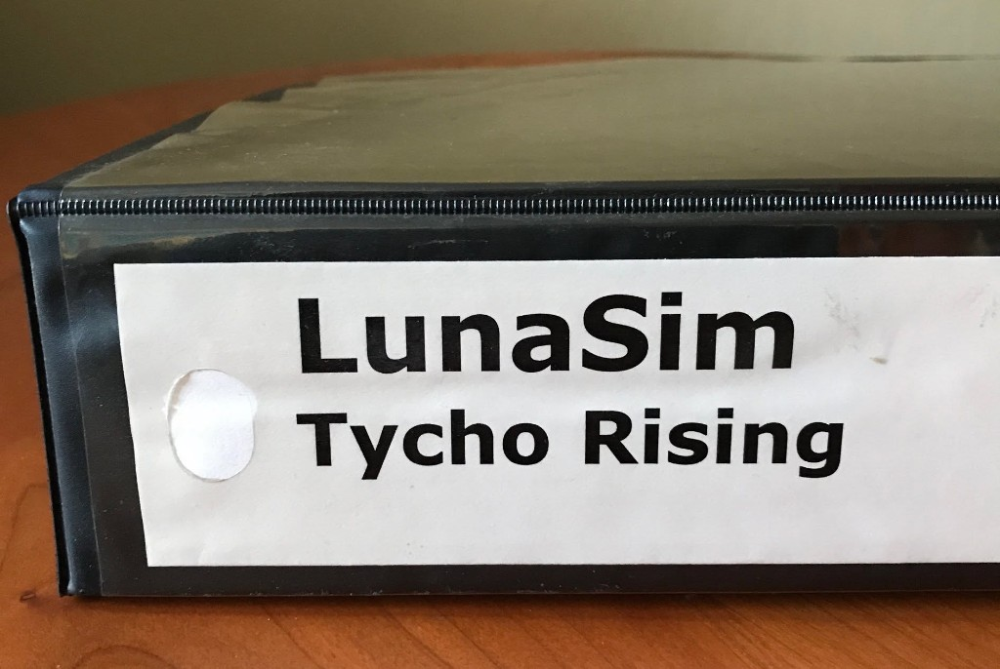
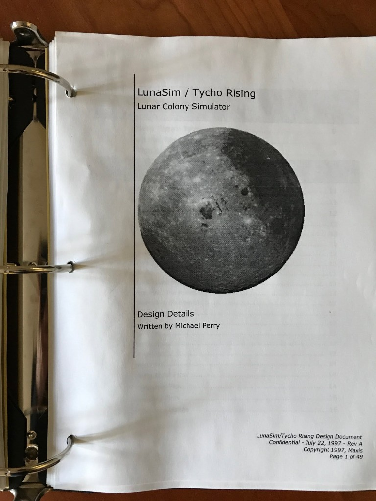
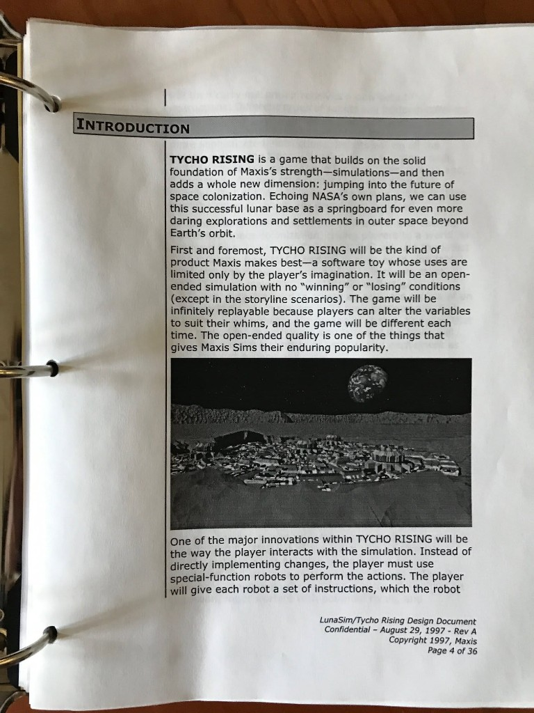
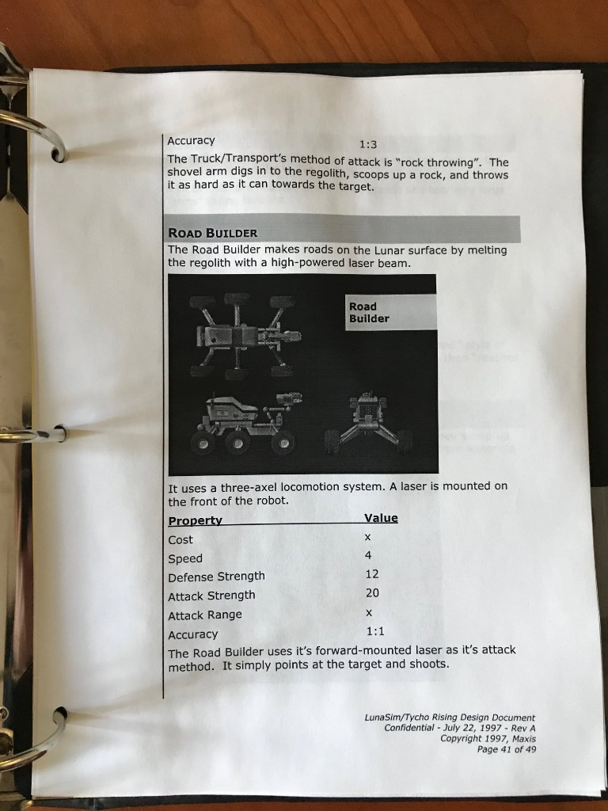
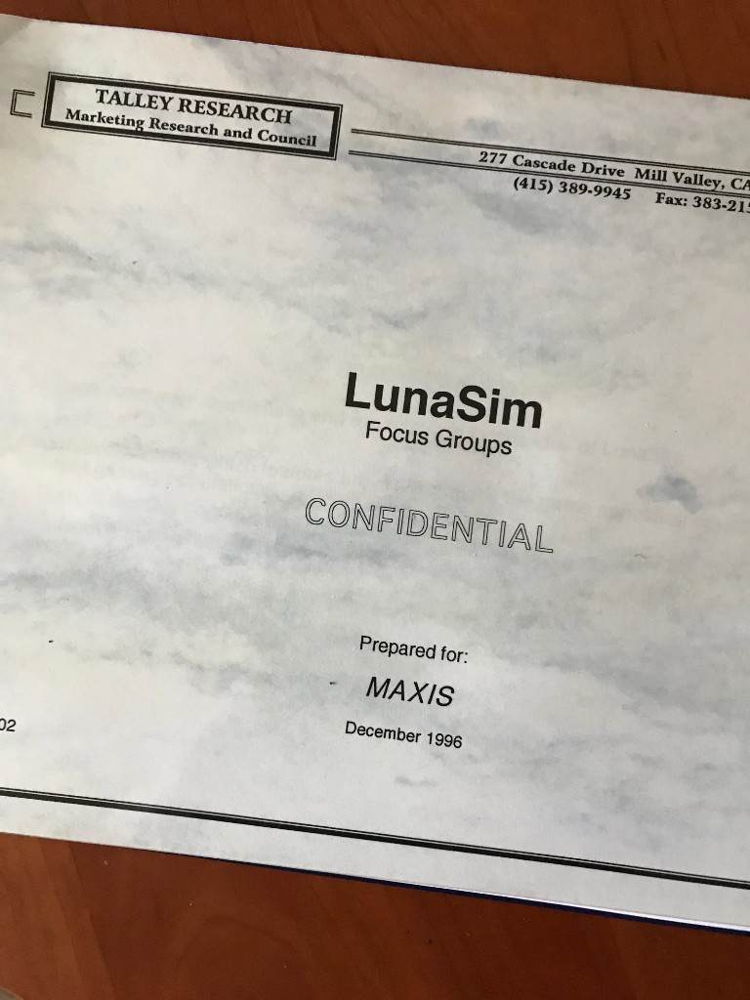
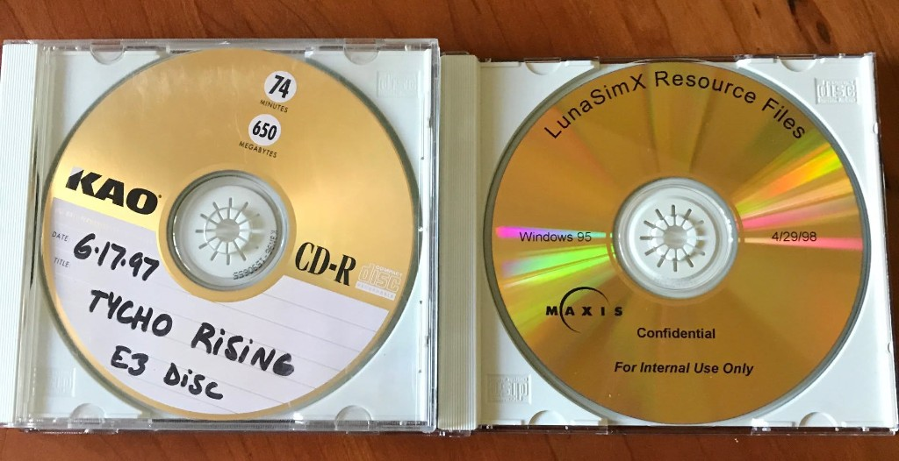
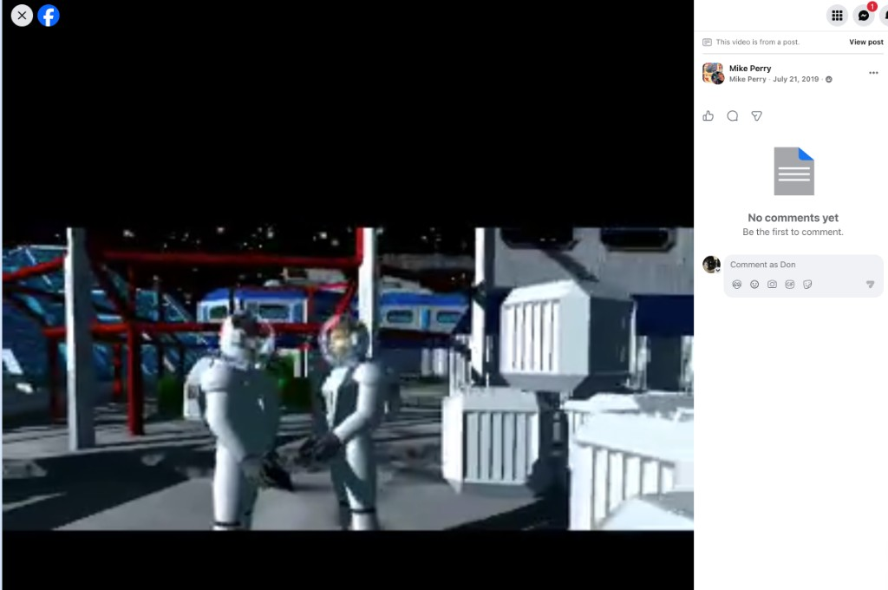
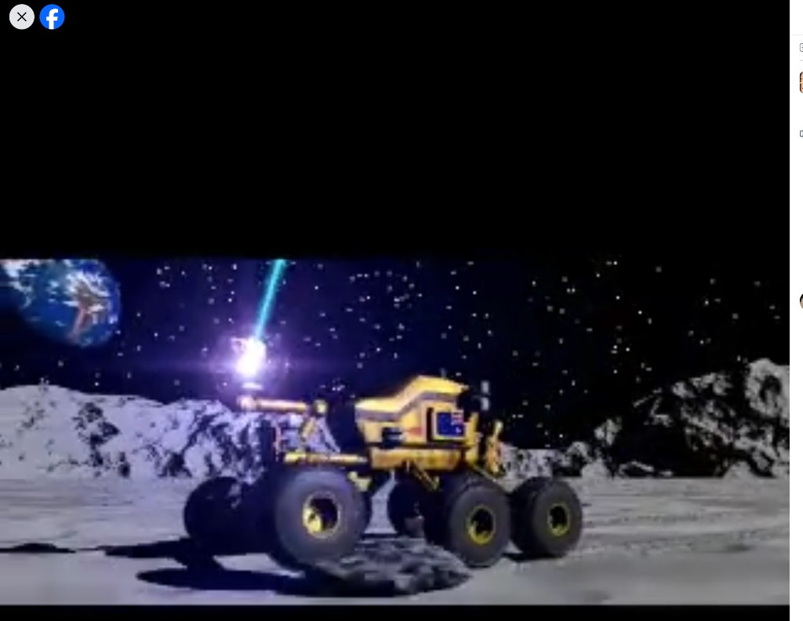
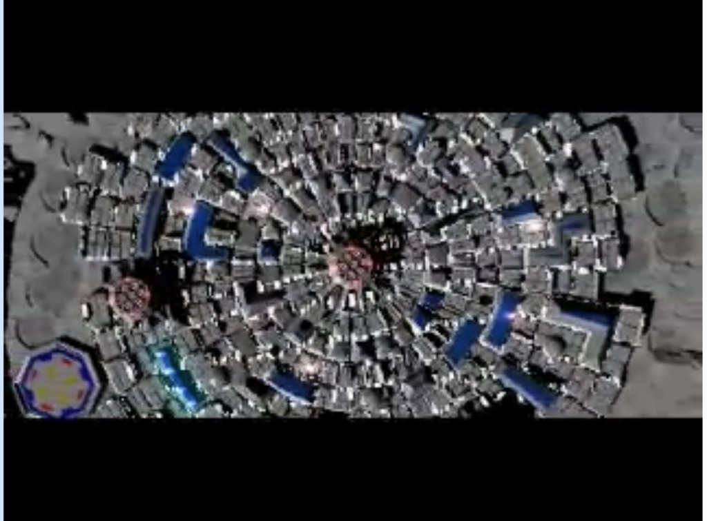
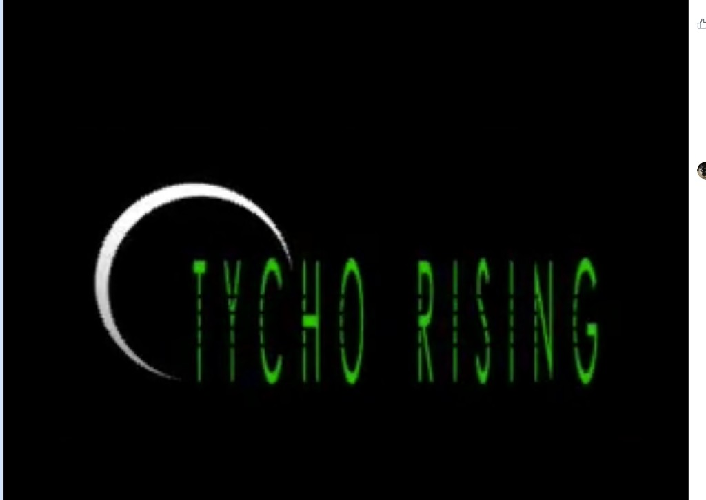

# LunaSim / Tycho Rising — an unreleased Maxis lunar colony simulator, 1996–1998

**Two independent sources**, which corroborate each other to the day:

1. [**Mike Perry** on Maxis Alumni, 21 July 2019](media/2019-07-21-maxis-alumni-post.jpg) — 27
   reactions, 1 comment. Photographs of **his own binder and discs**.
2. [**Phil Salvador** ([room](../phil-salvador/)), 2 May 2018](media/2018-05-02-phil-salvador-museum-of-play-post.jpg)
   — the **press fact sheet**, photographed in the collection of **The Strong / Museum of Play**.
   *"Meant to share these earlier! I was doing research at the Museum of Play and came across a few
   things that might be familiar… 🙂"*

The designer's private draft and the company's public announcement, found separately, a year apart.
They disagree in an informative way — see [Toy versus strategy game](#toy-versus-strategy-game).

> "In honor of the 50th anniversary of the first manned moon landing, I present… **LunaSim / Tycho
> Rising!** LunaSim was a moonbase sim game that I was designing at Maxis back in **1996**. By
> **1997** it had morphed into **Tycho Rising**, a sim game with **RTS combat** (for reasons I don't
> recall, but I'm sure it seemed cool at the time). It was **shelved shortly after EA bought Maxis**,
> in favor of a much more promising game called… **SimMars**. 🙂"
>
> — Mike Perry

## The document

> **LunaSim / Tycho Rising** — Lunar Colony Simulator
> Design Details · Written by **Michael Perry**
> *Confidential — July 22, 1997 — Rev A · Copyright 1997, Maxis · Page 1 of 49*

**The binder holds two different documents, both labeled "Rev A."** The title page, the resource
economy, and the robot specs carry the footer *July 22, 1997 — Rev A, Page N of **49***. The
Introduction carries *August 29, 1997 — Rev A, Page 4 of **36***. Either the design was cut by
thirteen pages five weeks later and the revision letter never advanced, or two drafts got filed
together. Worth resolving with Mike; either answer says something about how Maxis versioned paper.

### Introduction — the Maxis creed, stated internally

> **TYCHO RISING** is a game that builds on the solid foundation of Maxis's strength — simulations —
> and then adds a whole new dimension: jumping into the future of space colonization. Echoing NASA's
> own plans, we can use this successful lunar base as a springboard for even more daring explorations
> and settlements in outer space beyond Earth's orbit.
>
> First and foremost, TYCHO RISING will be the kind of product Maxis makes best — **a software toy
> whose uses are limited only by the player's imagination.** It will be an open-ended simulation
> with **no "winning" or "losing" conditions** (except in the storyline scenarios). The game will be
> infinitely replayable because players can alter the variables to suit their whims, and the game
> will be different each time. **The open-ended quality is one of the things that gives Maxis Sims
> their enduring popularity.**

This is the "software toy" doctrine written down in an internal pitch, in 1997, as an argument a
producer expected to persuade his own management. Compare the employee in the
[March 1996 newsletter](../will-wright/sources/1996-03-what-newsletter/README.md) explaining the
Maxis logo as the outline of a ball *"because a ball is a toy and you can make games with it —
software toys, you know the rest."* The staff had the creed by heart.

Note the sentence immediately after it: *"adds a whole new dimension"* and, by 1997, **RTS combat**.
The same document that professes no winning or losing conditions also gives every robot an Attack
Strength.

### The central mechanic: you can't touch anything

> One of the major innovations within TYCHO RISING will be **the way the player interacts with the
> simulation. Instead of directly implementing changes, the player must use special-function robots
> to perform the actions.** The player will give each robot a **set of instructions**, which the
> robot [carries out…]

This is the interesting idea in the binder, and it is worth stating plainly: **Tycho Rising removes
direct manipulation on purpose.** SimCity's player is a god with a bulldozer cursor. Tycho Rising's
player is a *programmer of agents* who must express intent as instructions and then watch machines
interpret them, with latency, failure, and distance in between.

That is a design decision with descendants everywhere — SimAntics-style scripted objects, *Robot
Odyssey*, factory games, and every modern "write the automation, don't do the task" game. Maxis
prototyped it on the Moon in 1997 and shelved it. It also runs precisely counter to the
[direct-manipulation lineage](https://github.com/SimHacker/moollm/tree/main/designs/pie-stack-views)
Don works in, which makes it a genuine argument rather than a curiosity.

### The economy

A single-page flow graph of the whole colony, plus the rules in prose:

| Resource | Where it comes from | What consumes it |
|---|---|---|
| **Power** | solar, nuclear fission, nuclear fusion | *every* structure and building (left off the diagram for clarity) |
| **Water** | frozen **ice deposits** on the lunar surface | Habitat Zones, Farm Zones |
| **Oxygen** | **LUNOX** plants | Habitat Zones |
| **Food** | Farm Zones | Habitat Zones |
| **Helium 3** | Mine Zones | Fusion Power Plants |
| **Titanium** | Mine Zones | Robot Factories, to build Robots |
| **Hydrogen** | arrives as **profits** from Earthbound Materials sold by Industry Zones | LUNOX, robot fuel |

> **LUNOX** is short for "Lunar Oxygen". The lunar regolith (soil) is about 40% oxygenated. A LUNOX
> plant **mixes Hydrogen with the regolith to make a kind of mud** which, through electrolysis,
> oxygen can be extracted.

Two things stand out. First, the chemistry is real — lunar regolith really is roughly 40% oxygen by
mass, and hydrogen reduction of regolith is an actual proposed ISRU method; this is a game design
doing its homework, which matches the *"Echoing NASA's own plans"* framing. Second, and more
elegant: **money is a gas.** Hydrogen — which the Moon does not have and which the entire oxygen
supply depends on — arrives only as the proceeds of exports to Earth. The colony's economy and its
ability to breathe are the same variable. That's a SimCity-grade central tension, and better
motivated than taxes.

### The robots

> **ROAD BUILDER.** The Road Builder makes roads on the Lunar surface by **melting the regolith with
> a high-powered laser beam.** It uses a three-axel locomotion system. A laser is mounted on the
> front of the robot.
>
> | Property | Value |
> |---|---|
> | Cost | x |
> | Speed | 4 |
> | Defense Strength | 12 |
> | Attack Strength | 20 |
> | Attack Range | x |
> | Accuracy | 1:1 |
>
> The Road Builder uses it's forward-mounted laser as it's attack method. It simply points at the
> target and shoots.

And immediately above, the Truck/Transport (Accuracy 1:3):

> The Truck/Transport's method of attack is **"rock throwing"**. The shovel arm digs in to the
> regolith, scoops up a rock, and **throws it as hard as it can** towards the target.

This is how the RTS layer was reconciled with a colony builder: **no weapons were designed.** Every
combat unit is a civilian machine using its job for violence. The road paver's paving laser is its
gun, at perfect accuracy. The dump truck throws a rock, badly. Unfinished balance values (`Cost: x`,
`Attack Range: x`) show it caught mid-design.

## It was announced: the E3 1997 press fact sheet

*Held by [The Strong / Museum of Play](https://www.museumofplay.org/), photographed by Phil Salvador.*

**This is not a cancelled prototype. It was a shipping product with a price.**

> **DESCRIPTION** — *Tycho Rising* is a strategic game of lunar colonization. Players start out with
> a small base and use limited local resources to build their settlement into a self-sufficient
> colony. To develop their base, **players command robots** to help establish colony facilities such
> as habitats, mining operations, agriculture facilities and factories. Numerous disasters and other
> events face players as they confront not only the challenges of the hostile lunar environment, but
> other colonies. Players can establish trading agreements with other colonies — as well as their
> homelands — or opt for more combative relations. Numerous options include mission play and support
> for eight players.
>
> **FEATURES**
> - Represent Earthly nations or devise your own, create alliances, declare war.
> - Multiple strategic and combat missions.
> - Advanced events ranging from founding a daughter colony to **launching a mission to Mars**.
> - Multiple structures to choose from including power plants (solar, nuclear fission, nuclear
>   fusion), habitats, roads, industry (life support, farming, recycling, factories), satellites,
>   supply drone spaceships.
> - Combat other lunar colonies or choose to trade with them for scarce resources (hydrogen, power,
>   food, helium 3, titanium, oxygen, water) and territory.
> - Struggle through numerous disasters, including **meteor strikes, rocket crashes, radiation, and
>   moonquakes**.
> - Onscreen advisors such as space agency head or original lunar explorer.
> - **Scientifically accurate with information from NASA and the USGS.**
> - **1-8 players; online play via modem, LAN, Internet.**
> - Multiple action movies with stunning 3D visuals and surround sound.
>
> **AVAILABILITY:** 1st Quarter 1998 · **ESTIMATED STREET PRICE:** $40 – $50
>
> **SYSTEM REQUIREMENTS:** Windows 95 · Pentium 90MHz · SVGA 65K colors · Double speed CD-ROM drive
> · 16 MB RAM
>
> *Tycho Rising is a trademark and Maxis is a registered trademark of Maxis, Inc.*

### The press kit

The sheet came out of a silver Maxis folder embossed **"10 YEARS OF FUN AND GAMES"** — Maxis was
founded in 1987 — with a gold sticker reading **"Preview Maxis' Fall Line-Up · BOOTH 4646 · SimCity
3000 Press Conference · June 18, 12:00 · Press Center"**, and *Tycho Rising* among the titles listed
around its rim. Also in Phil's photographs: a **35mm slide** labeled *SIMCITY 3000 · MAXIS (R) ·
510/933-5630*, and a Maxis newsletter page headed *"Windows (Games) of Opportunity"* with pieces on
*Railroad to Riches* and *A-Train*.

### The timeline closes

| Date | Artifact |
|---|---|
| **Dec 1996** | Talley Research runs LunaSim focus groups |
| **17 June 1997** | Mike's hand-labeled **TYCHO RISING E3 DISC** |
| **18 June 1997, noon** | Maxis press conference, Press Center — this fact sheet handed out |
| **19–21 June 1997** | E3, Atlanta — booth 4646 |
| **22 July 1997** | Design document Rev A, 49 pages |
| **29 Aug 1997** | Design document Rev A, 36 pages |
| **Q1 1998** | Announced ship date |
| **29 Apr 1998** | **LunaSimX Resource Files** disc pressed |

The demo disc is dated **one day before the press conference it was cut for**. Two sources that
never met, photographed twenty years later, agree on the week.

Note also what the design document was doing *after* the announcement: revised in July and again in
August, a month and two months **after** the game was publicly promised for Q1 1998.

### Toy versus strategy game

Read the two documents side by side and the project's fracture is right there in the prose:

| The internal design doc (Aug 1997) | The press sheet (June 1997) |
|---|---|
| "a **software toy** whose uses are limited only by the player's imagination" | "a **strategic game** of lunar colonization" |
| "an open-ended simulation with **no 'winning' or 'losing' conditions**" | "Multiple **strategic and combat missions**" |
| "The open-ended quality is one of the things that gives Maxis Sims their enduring popularity" | "create alliances, **declare war**" |

The marketing copy is not lying — the combat is in the design too. But the ordering is inverted.
Internally the toy comes "first and foremost" and combat is an addition; externally it is a strategy
game with a colony attached. Mike's own memory of the RTS turn — *"for reasons I don't recall, but
I'm sure it seemed cool at the time"* — is a designer who watched his toy get a genre and can no
longer reconstruct why. **Christine McGavran's comment on the post says the same thing about
SimMars.** That is two cancelled Maxis space games and two people naming the same cause.

The mechanic survived the translation intact, though: *"players command robots."* Whatever else
marketing changed, they kept the idea that you cannot touch the Moon yourself.

### The mission to Mars

Buried in the features list: **"Advanced events ranging from founding a daughter colony to launching
a mission to Mars."**

Tycho Rising shipped its own successor as an endgame event. The game it was shelved for was already
a win condition inside it.

## Market research, 1996

> **LunaSim Focus Groups** · CONFIDENTIAL · Prepared for: **MAXIS** · **December 1996**
> Talley Research, Marketing Research and Council — 277 Cascade Drive, Mill Valley, CA

Maxis paid an outside firm to focus-group an unreleased moon game. December 1996 sits between
"LunaSim, 1996" and "Tycho Rising with RTS combat, 1997" — the report may well contain the reason
Mike says he can't remember. **The contents are not in the photographs.** If he still has the
report, it is the single most interesting unread document in this batch.

## The discs

| Disc | Label |
|---|---|
| Gold KAO CD-R, 74 min / 650 MB, hand-labeled | **6-17-97 · TYCHO RISING E3 DISC** |
| Silver, Maxis-printed | **LunaSimX Resource Files** · Windows 95 · **4/29/98** · MAXIS · Confidential · For Internal Use Only |

The dates matter. **E3 1997 ran 19–21 June in Atlanta** — a disc dated 6-17-97 is a build cut two
days before the show. And **"LunaSimX Resource Files, 4/29/98"** is dated *ten months after* EA
completed the Maxis acquisition (June 1997) and after Mike says the project was shelved. Either
"shortly after" is longer than memory allows, or the resource files were archived on the way out.
Also note the name mutated again: **LunaSimX**.

Both are CD-Rs from 1997–98. Gold-phthalocyanine KAO discs age comparatively well; nothing is
guaranteed. **Imaging these should be the first thing anyone does.**

## The animation

Mike posted rendered footage with the binder. Stills:

| | |
|---|---|
|  |  |
| Astronauts inside the base — the colony at human scale | The laser vehicle in motion, Earth on the horizon |
|  |  |
| The colony from above — **radial, not gridded** | The title card, with the Maxis crescent |

The overhead view is the design's best argument for existing: **a city that grows in rings from a
single pressurized hub**, because on the Moon everything must connect to air. Not SimCity's grid
wearing a spacesuit — a different urban geometry falling out of a different physics.

## Where it went: Tycho Rising → SimMars → Spore

Mike's own account is that Tycho Rising was shelved **in favor of SimMars** — and SimMars is already
in this repo from the other end. Per [Jason Shankel's verified career notes](../jason-shankel/sources/spore-prototyping-career.md),
SimMars was a **Mars terraforming simulation, NASA-supported before its own cancellation**, whose
**planetary climate technology was reused in early Spore work**; Jason went on to be the first
programmer on Spore.

So the chain, each link sourced:

**LunaSim** (1996, open-ended moonbase toy) → **Tycho Rising** (1997, RTS combat, E3 disc) →
*shelved for* **SimMars** (Mars, NASA-backed) → *also cancelled, tech survives into* **Spore**.

Maxis spent years trying to leave Earth. Nothing shipped, and the code ended up in a game about
evolving life on other planets anyway. Worth asking Mike and Jason **in the same room**.

## Comments

**Christine McGavran** — the only comment on the post, 4 reactions:

> "I still think **SimMars** would have been awesome. If only it hadn't gone all 3D and just focused
> on the game."

A cancelled-project postmortem in two sentences, from someone who was there, blaming the same thing
Mike's own document was fighting: scope added on top of the toy. She has no room here yet.

## Open questions for Mike

1. Do the discs still read? May we image them?
2. Does the **Talley Research focus group report** (Dec 1996) survive, and does it explain the combat?
3. Why two "Rev A" documents dated five weeks apart with different page counts?
4. What was **LunaSimX** (4/29/98) — a rename, an engine, a salvage archive?
5. How far did the robot-instruction mechanic get in code? Was it ever playable?
6. Who rendered the animation and modeled the robots? Were the "multiple action movies" made?
7. It was announced for **Q1 1998** at a press conference and revised through August 1997. What was
   the state of the build at E3, and what actually killed it — the acquisition, the focus groups, or
   the genre confusion?
8. Full remaining page scans of the 49-page document, if he's willing.

## Open questions for the archives

- **What else is in The Strong's Maxis holdings?** Phil found the fact sheet in a **"10 Years of Fun
  and Games"** press kit. Press kits are complete by nature: that folder probably also held sheets
  for the rest of the Fall 1997 line-up, screenshots, and slides. Worth a request.
- **Trade press coverage, June 1997.** A press conference with a fact sheet and a booth means
  magazines wrote it up. There should be *Tycho Rising* previews in mid-1997 games press — findable,
  and they would tell us what the E3 build actually did.
- Whether any copy of the **E3 build** survives at Maxis/EA or in a private collection.

## Repo orbit

- [Mike Perry](README.md) — his room
- [Phil Salvador](../phil-salvador/) · [SimRefinery show seed](../../repo-shows/phil-salvador-simrefinery/README.md) — he found the press sheet; the same instinct that found SimRefinery
- [SimRefinery recovery](../will-wright/sources/simrefinery-recovery/README.md) — the other lost-Maxis-software recovery in this repo
- [*what Newsletter?*, March 1996](../will-wright/sources/1996-03-what-newsletter/README.md) — "Producers Michael Perry, Andy Larson and Chris Weiss"
- [Jason Shankel — SimMars → Spore](../jason-shankel/sources/spore-prototyping-career.md)
- [Will Wright, Stanford 1996](../will-wright/sources/1996-04-26-winograd-interfacing-to-microworlds/README.md) — data portability and the hobby model, the same spring LunaSim was being designed
- [SimCity 3000 3D preservation](../will-wright/sources/2026-simcity-3000-3d-preservation/README.md) — SimCity 3000 is the title on the slide and the press conference in the same folder
- [Micropolis](https://github.com/SimHacker/MicropolisCore) — the open-source SimCity line these zone economies descend from
