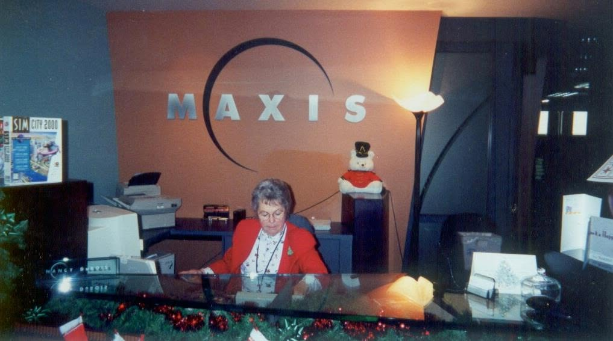
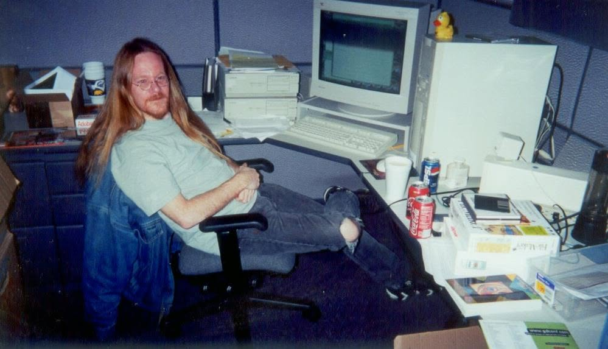
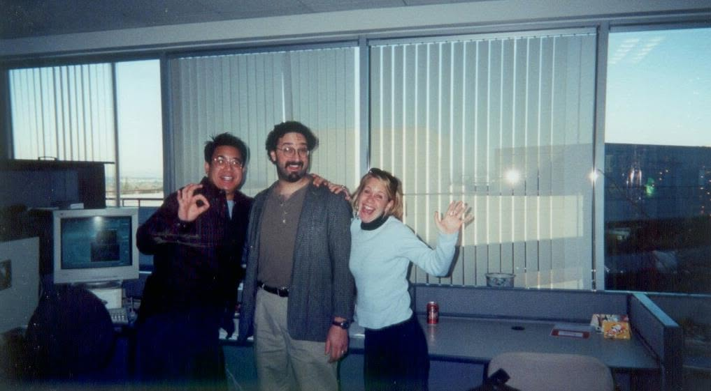
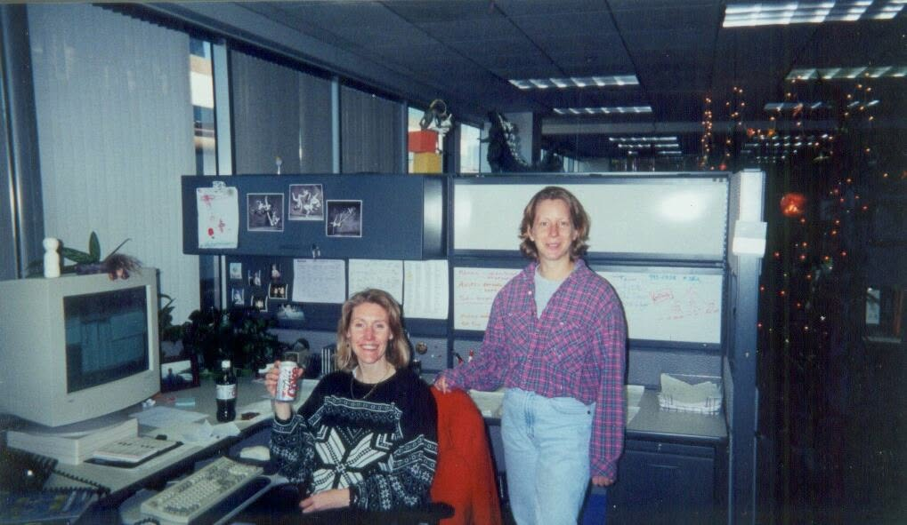
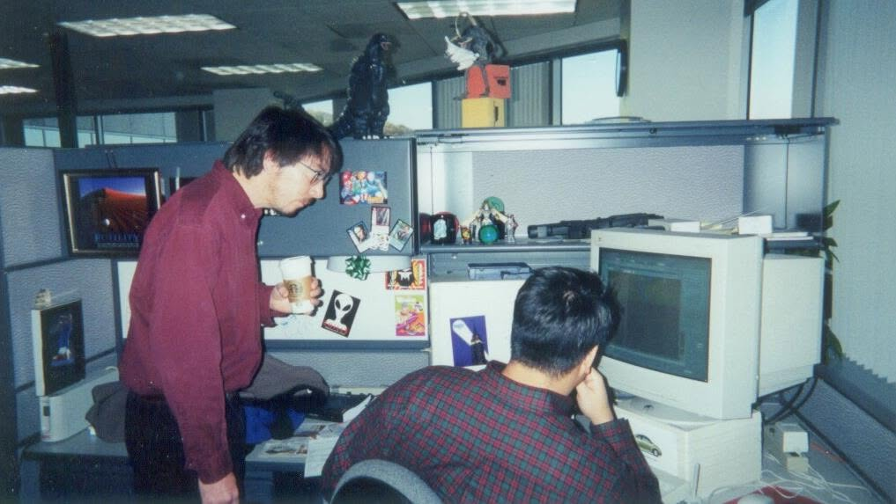
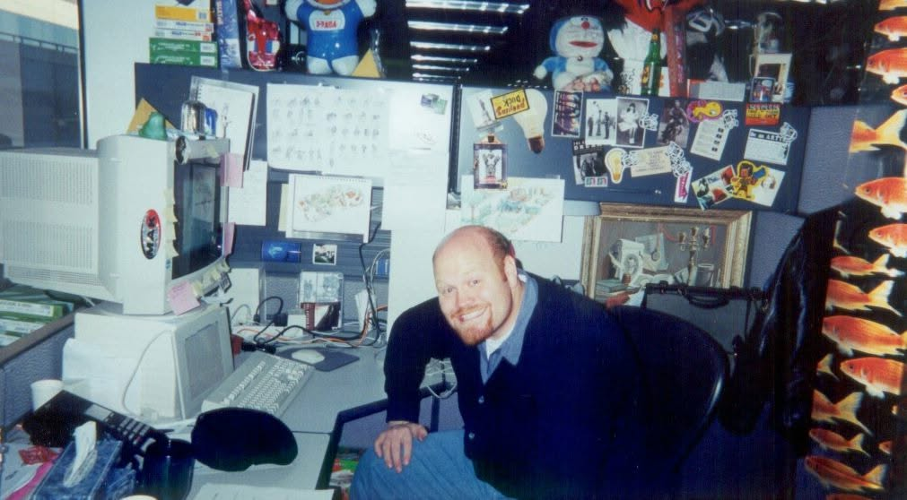

# Maxis, Christmas 1998 — Patrick's photos

*Guest hub:* [Patrick J. Barrett III](../README.md) · *The record:* [same-sex relationships](../same-sex-relationships-the-record.md)

Patrick took these at the **Maxis offices in Walnut Creek, CA** at **Christmas 1998** and posted them
to Facebook on **28 February 2012**. His caption:

> "Christmas 1998 I took some pictures to show my family where I worked. Some people already left
> for the holidays though."

**Why the date matters.** Patrick was hired in **October 1998** to implement social interactions.
These are the offices about two months in — the room, the desks, and the machines where he
implemented **same-sex relationships on his own initiative**, before the production database had
caught up with the design drafts. See
[the record](../same-sex-relationships-the-record.md). A new hire photographing his workplace for
his family happens to have documented the site of that work, by accident, at exactly the right
moment.

*Source screenshots:* [album post](2012-02-28-facebook-album-post.jpg) ·
[album comments](2012-02-28-facebook-album-comments.png) ·
[Don Hopkins photo thread](2012-02-28-facebook-don-hopkins-photo-thread.jpg) ·
[three-colleagues thread](2012-02-28-facebook-three-colleagues-thread.jpg) ·
[two-colleagues thread](2012-02-28-facebook-two-colleagues-thread.jpg)

## Reception

The **MAXIS** wordmark and crescent logo, a boxed **SimCity 2000** on the counter, holiday garland,
and a guardsman teddy bear. The nameplate reads **Nancy**. In the thread, **David Patch**:

> "Nancy was the best. Dear dear soul!"

## Don Hopkins at his desk

Patrick captioned this one:

> "Extremely rare photo of **Don Hopkins** at his desk."

Don, in the comments, spotted what the photo proves:

> "OMG I'm drinking both Coke and Pepsi at the same time! DON'T CROSS THE STREAMS!!!!"

This is the **primary evidence for the bicolar gag** — *"I finally figured out that I'm bicolar. I
love both Coke and Pepsi."* Both cans are open on the desk. Also visible: a **rubber duck** on the
monitor, and enough Adobe boxes to date the desk precisely.

Three more voices in that thread:

- **Erica Stein:** *"Before Red Bull!"*
- **Melissa Bachman-Wood:** *"this is before the collection of about 60 half-full (empty?) Coke and
  Pepsi cans took over the right side of the desk."*
- **Jim Mackraz** ([room](../../jim-mackraz/)), on an earlier era: *"Hop, you remember the meeting at
  that dumb ScriptX place you worked, where Bobo and I showed up to talk to your suits about their
  pipe dreams… you were late, burst in with a Coke and a Pepsi, which made it with me. The suit guys
  had that 'No more words in edgewise for us' look on their face. One of my favoritest meetings
  ebber."*

Mackraz's *"that dumb ScriptX place"* is **Kaleida Labs**, where Don worked on ScriptX and
DreamScape before Maxis — so the two-fisted Coke-and-Pepsi habit predates this desk by years and was
already load-bearing in meetings. *"Bobo"* appears to be **Eric Bowman**
([room](../../eric-bowman/)), who is addressed by that nickname elsewhere in Don's threads; not
independently confirmed.

## The office

Names below come **only from the Facebook threads**, where colleagues identified each other.
Everyone else is left undescribed by name on purpose — guessing would put wrong names into the
record permanently. Identifications welcome, from Patrick above all.

### Three colleagues by the windows

*Thread:* [screenshot](2012-02-28-facebook-three-colleagues-thread.jpg) — 14 reactions, 6 comments.

**Charles London** is identified here: Veronica Gonzalez tagged him (*"Charles London !!!"*) and he
answered (*"wow"*). Charles is the person who made the **Plumbob** — see
[the Brain UI thread](../../will-wright/sources/2021-05-31-brain-ui-beta-screenshots/README.md).

MJ Burk Chun asked **"Eric??"** and Charles replied **"yep"**, so one of the three is an Eric —
plausibly [Eric Bowman](../../eric-bowman/), *not confirmed which figure*. Jim Mackraz added
**"MJ Chun The Mighty Chin"**. Allyn Elissa Bruty: **"OMG!!"**

### Two colleagues in a cubicle

*Thread:* [screenshot](2012-02-28-facebook-two-colleagues-thread.jpg) — 8 reactions, 6 comments.

**David Patch dates the desk: "SimSafari Days!!!!!!!!!!!!"** — *SimSafari* shipped in 1998, so this
corner was the SimSafari team's. Whiteboards full of working notes, ballet photographs on the
partition, a Godzilla figure on the shelf above.

**Chris Trottier** ([room](../../chris-trottier/)) opened with **"Fashion emergency."** and doubled
down: *"seriously, dude. all wrong, no right."* Chris Bennett: *"Was it 'Mr. Greenjeans' Day? 🙂"*
Jim Mackraz: *"Howdy, gals!"*

And **Kana Ryan** ([room](../../kana-ryan/)) caught the detail that rhymes with Don's desk:

> "Please note, 1 diet coke in hand and one on the desk."

Two-fisted soda turns out to be a house style, not a Don eccentricity.

### The rest

| Photo | What's in frame |
|---|---|
|  | The universal posture of a desk visit — coffee in hand, leaning over someone's monitor. **Godzilla** and a caped figure on the partition top |
|  | The most content-rich cubicle: a **goldfish** poster, **Doraemon** and Gundam-era plush and models, and — pinned to the partition — what read as **character animation model sheets** and an **isometric layout drawing**. Sims-era production art on the wall |

Period detail worth having on the record: every machine is a **beige CRT**, the partitions are the
tall grey fabric kind, and the decoration is entirely **toys, trading cards, and printouts**. This
is what the studio looked like fourteen months before The Sims shipped.

Also in the album thread, **Kana Ryan** ([room](../../kana-ryan/)):

> "These are gems - thanks for sharing!"

## Orbit

- [Patrick's guest page](../README.md) · [the same-sex relationships record](../same-sex-relationships-the-record.md)
- [Steering committee demo, June 1998](../../will-wright/sources/1998-06-04-sims-steering-committee-demo/README.md) — the build, six months before these photos
- [`archie-suit.txt`, 1997](../../will-wright/sources/2022-05-18-archie-suit-cmx-whitman/README.md) — the character pipeline running on machines like these
- [Jim Mackraz](../../jim-mackraz/) · [Eric Bowman](../../eric-bowman/) · [Kana Ryan](../../kana-ryan/) — thread voices
