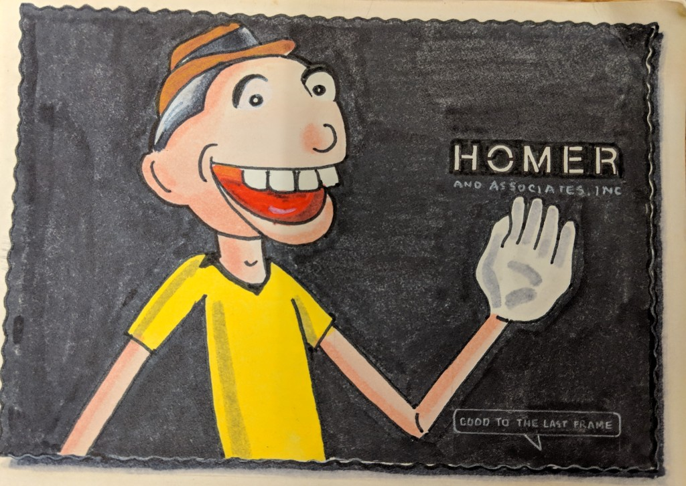

# Paul Rother 🕹️

**HOMER & Assoc.** in-house programmer. Hired to run a console nobody had
software for. Sat beside **[Charles Moore](../charles-moore/README.md)**. Put a paint system, an optical-
printer controller, an OS, a compiler, and a debugger in **32K**, and used
it on ***Abracadabra*** and ***Atomic Dog***.

*"I learned Object Oriented Programming without knowing it."*

Invitation portrayal — **not** Paul Rother.
[Standards](../../schemas/portrayal-standards.md)

[invitation.md](invitation.md) — send-ready, Coco intro 26 Aug 2026.

## The story

Sunset Gower, 1977–1997 (Stanford's finding aid says the shop closed 1996).
**[Peter](../peter-conn/README.md)** and **[Coco Conn](../coco-conn/README.md)**
built a real-time visual mixing desk named
**HOMER** — Hybrid Optical Montage Electronically Reproduced. Coco soldered
LEDs and ran cable. Peter built an optical printer. The engineer who wired
the desk moved to England. Then **Paul Rother** walked in.

**Homer II:** 16 slide projectors, 4 movie projectors, 24 Z80s with 2K EPROM
each, PolyForth on a master Z80 in 32K, touch faders, a joystick bumper
stolen from a 1964 Mustang. You performed fades like an audio mixer,
overdubbed, wrote the hero take to an 8-inch floppy, then burned 10–15
passes onto IP film. Forth, Inc. sent **[Charles Moore](../charles-moore/README.md)** for the host. Paul
programmed the channel EPROMs.

Peter wanted to see the printer move. They bought a **CAT-700** 7-bit S100
frame buffer from a log cabin in Truckee (the 8th bit never worked), flew
to Palo Alto to meet the French designer of the Van Gogh traces, slept at
a Stanford friend's who was building the **Lisa**. Paul got the board
running in Forth. Filter wheels on steppers: *it made music.* Millimeter
Magazine ran the photo as a two-page color spread.

1989: SIGGRAPH banned demo reels. Peter wrote ***Flying Logos*** — a client
calls to order chrome, then orders the cosmos — and sneaked the reel into
the Electronic Theater. Corey Burton on the phones. Niccograph of Japan;
Monitor Award for Best Showreel.

Paul's memoir is in [`sources/`](sources/README.md). Peter's papers, Coco's
post, and the HN posting live in those rooms. Two originals are already 404.

## Read in this order

1. [Paul's 1982 memoir](sources/1982-homer-and-associates.md) — his words,
   his photo
2. [Coco's 2021 post](../coco-conn/sources/2021-10-20-facebook-homer.md) — how you
   *played* the desk; comments that add history (phone-pencil, T2 scan,
   wire-wrap)
3. [Flying Logos](../peter-conn/sources/1989-flying-logos.md) — why it exists, proofread
   transcript
4. [Stanford M2262](../peter-conn/sources/stanford-m2262/GUIDE.md) — live catalog
   [archives.stanford.edu/catalog/m2262](https://archives.stanford.edu/catalog/m2262);
   finding aid in Peter's room. Announcement blog (404):
   [2019-05-17-stanford-peter-conn-papers.md](../peter-conn/sources/2019-05-17-stanford-peter-conn-papers.md)
5. [HN 18 Nov 2021](../don-hopkins/sources/2021-11-18-hn-homer-forth.md) — as posted, with
   a map of which links died

Coco's company page (SIGKids, Don):
[../coco-conn/homer-forth-flying-logos.md](../coco-conn/homer-forth-flying-logos.md).

## Watch

| | |
|---|---|
| *Flying Logos* | https://www.youtube.com/watch?v=9hIOfEiy4lc |
| *Atomic Dog* | https://www.youtube.com/watch?v=LMVZ36VA0wg |
| *Abracadabra* | https://www.youtube.com/watch?v=tY8B0uQpwZs |
| *Bongo Bongo* | https://www.youtube.com/watch?v=_NrsRZdMI-A |
| Peter's site (credits, still live) | https://www.milesconsulting.org/service.html |

## Show

[ideas.md](ideas.md) · seed [`repo-shows/coco-conn/`](../../repo-shows/coco-conn/)

↑ [Coco Conn](../coco-conn/README.md) · [Peter Conn](../peter-conn/README.md) · [Charles Moore](../charles-moore/README.md)
