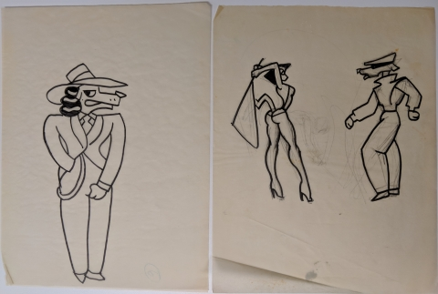
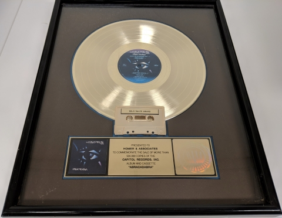
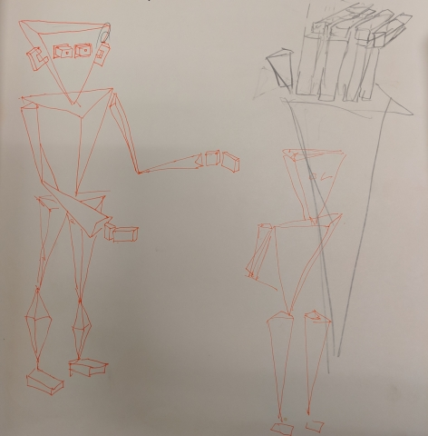
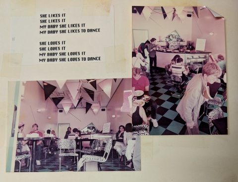
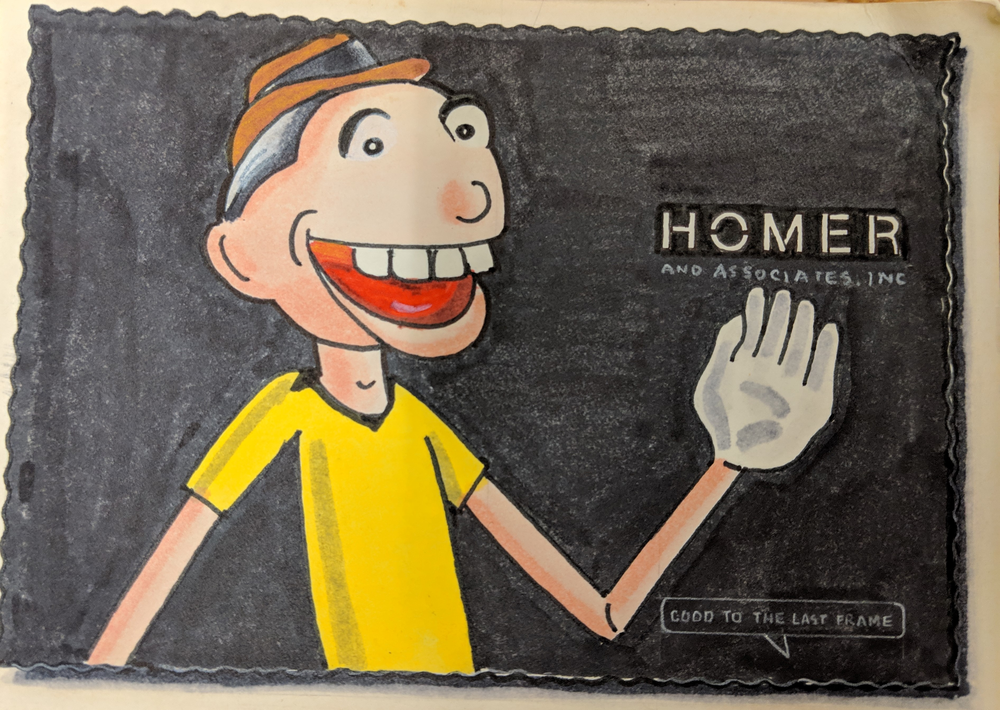
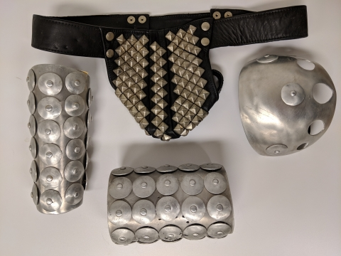

# Peter Conn papers available for research

*Vanished Stanford Libraries blog post, 17 May 2019, Brian Bethel.
Copied here because the URL is 404. It is an announcement, not the archive.*

**The papers:** [archives.stanford.edu/catalog/m2262](https://archives.stanford.edu/catalog/m2262)
— call number **M2262**, still in Green Library. Readable finding aid in this
repo: [stanford-m2262/GUIDE.md](stanford-m2262/GUIDE.md) (PDF and EAD XML
alongside). OAC mirror: [oac.cdlib.org/findaid/ark:/13030/c8n303pn/](https://oac.cdlib.org/findaid/ark:/13030/c8n303pn/).

31.5 linear feet. Nothing digitized. Do not try to copy the boxes.

What follows is the announcement text and the five photographs it used.
For biography, dates, and the container list, read the [guide](stanford-m2262/GUIDE.md).

---

*Posted 17 May 2019 in Special Collections Unbound by Brian Bethel.*

Stanford Special Collections is very pleased to announce that the Peter Conn
papers are now published and available for research!

Conn is a director and producer known for his advances in 3D
computer-generated animation, graphics, and motion capture technology,
primarily through his production company Homer & Associates. Over the years,
Conn has worked on music videos, commercials, television and film projects,
industry presentations, and stage shows, virtually all of which involve some
form of computer-generated imagery (CGI).

Conn founded Homer & Associates in 1977 with his wife Coco Conn. Initially a
multimedia effects company, Homer & Associates gradually transitioned to a
full-fledged 3d animation production company, known for special effects, 3D
computer animation and design, motion capture, computer rotoscoping, and slide
transfer services. Homer specialized in creating computer animated effects for
features like fire, smoke, and water.

The collection includes numerous materials related to music video and film
production, computer animation, and motion capture technology, such as
photographs and prints, film equipment, reels of film, costume pieces,
sketchbooks, storyboards, location scouting photos, casting sheets, headshots,
actor resumes, and production stills.

Conn directed or contributed effects to a number of music videos from the
1970s through 1990s. Below are some highlighted music videos and shorts, along
with pertinent materials in the collection.

## George Clinton — “Atomic Dog”, 1982

Conn directed George Clinton’s “Atomic Dog” music video in 1982.
Coincidentally, he also worked on special effects for Snoop Doggy Dogg’s
“What’s My Name” video eleven years later, which notably sampled and was based
on Clinton’s “Atomic Dog” song.

The Conn papers include sketchbooks and production notes for the music video
and its many canine and feline characters, such as the sketches seen below.

## Steve Miller Band — “Abracadabra”, 1982

Conn was nominated for ‘Director of the Year’ at the first American Video
Awards for his direction of the Steve Miller Band's extremely catchy 1982
"Abracadabra" single. In addition to production stills, slides, negatives, and
an original film reel of the music video, the Conn papers include the band's
Gold Sales Award for 500,000 album and cassette sales, pictured below.

## Steve Miller Band — “Bongo Bongo”, 1984

After his success with the Steve Miller Band's "Abracadabra" music video, Conn
went on to direct the video for their 1984 single, “Bongo Bongo.” The video
includes the computer-animated 'Bongo' character, one of the first examples of
a computer-rendered character interacting with live performers. The Conn
papers include sketches for the character, location scouting photo shoots,
storyboards, and a hand-made, three-dimensional paper model of Bongo himself.

## “Why do you think they call him dope?”, 1990

In this 1990 computer-animated short, entitled "Why Do You Think They Call Him
Dope?" and originally made for the record company Delicious Vinyl, a
Homer-created epicurean named 'Bonehead' enjoys the gourmet flavors of a local
record shop's vinyl. The Conn papers includes sketches, slides, negatives,
prints, and even hand-drawn portraits of Bonehead, such as the postcard below.

## Vince Neil — “Sister of Pain”, 1993

A notable early use of motion capture, Peter Conn's music video for the 1993
Vince Neil single "Sister of Pain" features a dystopian cityscape replete with
flaming smokestacks and, naturally, a leather-clad heavy metal band. Of the
different pertinent "Sister of Pain" materials in the collection, perhaps none
is as unique as the studded-leather costume that Neil donned in the video,
pictured below.

Explore these and many more film, video, and computer animation research
materials in the Peter Conn papers! Please note, however, that Special
Collections does not accept responsibility for "Abracadabra" being stuck in
your head indefinitely.

— Brian Bethel, Rare Books Cataloger / Project Archivist

↑ [guide M2262](stanford-m2262/GUIDE.md) · [Paul's 1982 page](../../paul-rother/sources/1982-homer-and-associates.md)
