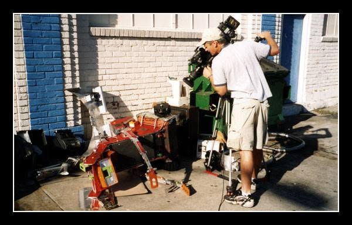
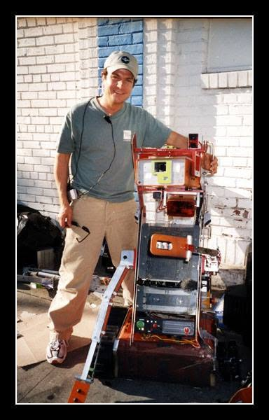
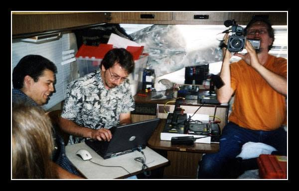
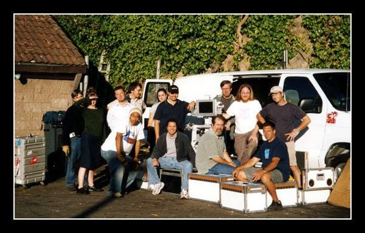
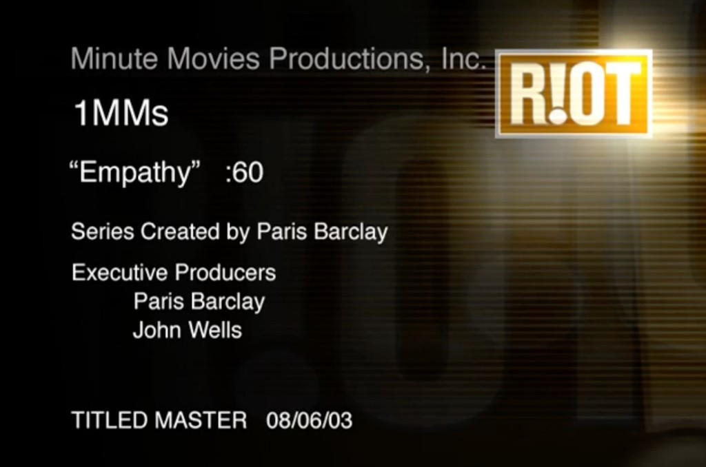

# Dents — photos

*Primary-source photos of the real **Stupid Fun Club** broken robot Don Hopkins teleoperated as
**Dents** for the *Empathy* hidden-camera shoot in **Oakland** (2003). Production stills are archived
alongside [Slats](../slats/photos.md) in the shared One Minute Movies folder.*

## Empathy street shoot

The crew hid in Don's **FMC Motorcoach** across the street — multiple operators remote-controlling
Dents and filming through shaded windows while real passersby encountered a fallen robot.

## Control room

## Title card

---

See also: [README.md](README.md) · [Empathy transcript](one-minute-movie-empathy.md) · [One Minute Movies overview](../slats/one-minute-movies.md) · [Slats](../slats/README.md)
