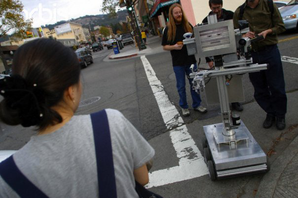

# Slats — The Stupid Fun Club "One Minute Movies"

*Primary-source documentation. **Slats** and **Dents** are fictional robot characters, but these films are **real**:
short hidden-camera robot sketches performed **"men and women behind the curtain"** (Wizard of Oz) through a
**web + pie-menu teleoperation rig** Don Hopkins built at Will Wright's **Stupid Fun Club** (Will
Wright wrote the robot pieces). They were produced in **2003** as part of the **One Minute Movies
(1MMs)** series and are posted publicly on Don Hopkins's YouTube channel.*

## What they are

The **One Minute Movies** are sixty-second (`:60`) sketches in which a real robot plays a scene with
unsuspecting people. The comedy comes from the gap between the robot's eager, literal patter and the
messy human situation it's dropped into — **Dents** earnestly begging for help on a sidewalk, or
**Slats** taking a lunch order and then desperate for a perfect 10. The robots aren't autonomous:
Will Wright wrote the premises and characters; **multiple humans perform and talk together behind the
scenes**, driving each robot live through Don's teleoperation rig (see *How the robots were driven*,
below).

The films' title-card masters credit the series itself: **Minute Movies Productions, Inc.** — *1MMs*,
**Series Created by Paris Barclay**, **Executive Producers Paris Barclay & John Wells**, post/VFX by
**RIOT**, titled master dated **08/06/03** (Aug 6, 2003).

In this repo, **Slats** is our portrayal of the *Servitude* waiter robot — *"hello, my name is Slats."*
**Dents** lives in [`../dents/`](../dents/README.md) — the broken robot from *Empathy*. Both share Don's teleoperation rig; they are not the same character.

More photos: [photos.md](photos.md) — Oakland shoots, FMC Motorcoach control room, restaurant setup.

## How the robots were driven (crew behind the curtain)

Neither robot was an autonomous AI — both were **partially automatic, "man behind the curtain"**
(classic Wizard of Oz). Don built a **web-based, pie-menu-driven teleoperation interface** so the
crew could perform each robot live, in real time — **several people talking and coordinating
together** off-camera while one unsuspecting mark dealt with the robot on the floor.

**The rig (both films):**

- **Canned, prefab phrases** triggered instantly from the web page and **pie menus** — reliable comic beats on tap.
- **Servitude extras:** the whole restaurant menu memorized and recitable on cue — including literal **Pie Menus** of edible pies (pie menus *of pies* 🥧).
- **A live text field** to improvise and type in real time, spoken aloud by the robot, for whatever the humans threw at it.

**Where the crew hid:**

| Film | Robot | Hide site |
|------|-------|-----------|
| **Servitude** | Slats | **Behind the restaurant** — BBQ-and-pies family spot in Oakland; hired extras in the dining room, crew running the waiter out of sight |
| **Empathy** | Dents | **Don's FMC Motorcoach** — parked across the Oakland side street; crew remote-controlled Dents and filmed reactions through shaded RV windows (street-filming permit; curious police shown the paperwork) |

That hybrid — fast canned reactions on radial menus *plus* real-time improv typing, performed by a
**roomful of humans** whispering and typing — is exactly the playground the **RoboResurrection**
wants to rebuild and play with again
([slats-reincarnation](../../../repo-shows/will-wright-premiere/slats-reincarnation.md)).

## The films

| Film | About | Transcript |
|------|-------|-----------|
| **Empathy** | **Dents** — robot empathy, fallen robot pleading for human assistance | [`../dents/one-minute-movie-empathy.md`](../dents/one-minute-movie-empathy.md) |
| **Servitude** | **Slats** — robot servitude, waiter desperate for a perfect rating | [`one-minute-movie-servitude.md`](one-minute-movie-servitude.md) |

## Built for the break (the anatomy of a 1MM)

The commercial timing is **built into the films** — they aren't just standalone `:60` spots that sat
*between* ads, they're structured to be **split around one**:

1. **Production slate card** at the head — identifies the clip for production, **not for broadcast**.
   Slice it off.
2. **PART ONE (:30)** — grabs your attention, sets the premise...
3. **...then a pause** — that's where the commercial goes —
4. **then PART TWO (:30)** — the payoff after the break.

Hook up front, commercial, payoff behind: part one buys the ad its audience. Natural cleavage
points: **these are the buns, without the burgers inserted.** Using them split around an ad is
using them **exactly as they were meant** — see the 1MM Sandwich format
([`../../../process/one-minute-movie-sandwich.md`](../../../process/one-minute-movie-sandwich.md)),
which supplies its own burgers: fake commercials on each film's concept.

**Measured** (Don, 2026-07-07): both films split clean at **30/30** — *Empathy* and *Servitude*
alike. So that's the house standard: **two slices of bread of the same thickness.** And *Empathy*'s
closing line — the passerby's *"just hang in there, okay?"* — is excellent standalone
micro-content: an affirming-faith blipvert. A human reassuring a broken robot, six words, complete.

## Credits (both films)

**Robot content (Stupid Fun Club):**
- **Concept / writing:** Will Wright
- **Robots designed & built by:** Will Wright
- **Web + pie-menu teleoperation rig (the "man behind the curtain"):** Don Hopkins
- **Robot segments directed by:** James Moll
- **Studio:** Stupid Fun Club

**One Minute Movies series (per the title-card masters):**
- **Production:** Minute Movies Productions, Inc. — *One Minute Movies* (1MMs), `:60` spots
- **Series created by:** Paris Barclay
- **Executive producers:** Paris Barclay, John Wells
- **Post / VFX:** RIOT
- **Titled master:** Aug 6, 2003 (08/06/03)
- **Posted to YouTube by:** Don Hopkins, Jan 8, 2016

## How they were made (hidden-camera reality)

These were **hidden-camera** pieces with **real, unsuspecting people**, not actors — ensemble
tele-robotic "wizard-of-Oz" performances. **Servitude** ("Restaurant") put Slats, a fully functional
6-foot robot waiter, into a **BBQ-and-pies family restaurant in Oakland**, surrounded by hired
extras, to serve an unknowing customer while the **crew worked from behind the restaurant**.
**Empathy** planted broken-down **Dents** on a side street in **Oakland**; as people passed, Dents
pleaded "Help me." The crew hid **across the street inside Don's FMC Motorcoach** — multiple
operators remote-controlling Dents, talking through lines together, filming through shaded windows —
to catch reactions from apathy to empathy.
(Don has noted, deadpan, that the robot's injuries and Professor Johnson's phone number were fake,
and the robot waiter was fired.) Beyond NBC's goal of keeping viewers through ad breaks,
Will's real interest was probing how people interact with, empathize with, and can be convinced to
play along with robots.

## What happened to them

NBC's *One Minute Movies* mostly **never aired**: after running only one of the films (**"The
Pussycat Dolls"**), NBC stopped airing the rest — and the robot pieces in particular ran into
**NBC/SAG contractual problems**. So *Empathy* and *Servitude* sat until Don posted them to YouTube
in 2016. (After his short waiter career, Slats went on to other Stupid Fun Club adventures around
Berkeley.)

## Why they matter here

These are the source texts for the two robot voices in this repo:

- **Slats** (*Servitude*) — loud, eager, literal, over-committed, desperate for a good score; call-in sidekick and Drag Race celebrity judge.
- **Dents** (*Empathy*) — frightened, pleading, empathy-mismatch comedy; the broken robot the internet loved first.

When in doubt about how Slats talks, read the *Servitude* transcript. When in doubt about Dents, read *Empathy*.

*The transcripts in this folder are the raw YouTube auto-captions (lightly punctuated). They are
flagged for a future human review-and-polish pass to add speaker labels and fix caption errors.*

## Sources

- Empathy: <https://www.youtube.com/watch?v=KXrbqXPnHvE> · Servitude: <https://www.youtube.com/watch?v=NXsUetUzXlg>
- NBC "One-Minute Movies" (1MMs) press, 2003 — John Wells Productions + Paris Barclay; e.g. *The New York Times* / Adweek / Variety coverage.
- Allentown Productions project page (archived): <https://web.archive.org/web/20141028194536/http://www.allentownproductions.com/project.php?p=nbc> — credits the robots to Will Wright and the segments to James Moll.

See also: [README.md](README.md) · [Dents](../dents/README.md) · [RoboResurrection](../../../repo-shows/will-wright-premiere/slats-reincarnation.md) · [Stupid Fun Club robots theme](../../../bits/theme-stupid-fun-club-robots/theme-stupid-fun-club-robots.md) · [Empathy & Servitude talk](../../don-hopkins/stupid-fun-club-empathy-and-servitude.md)
