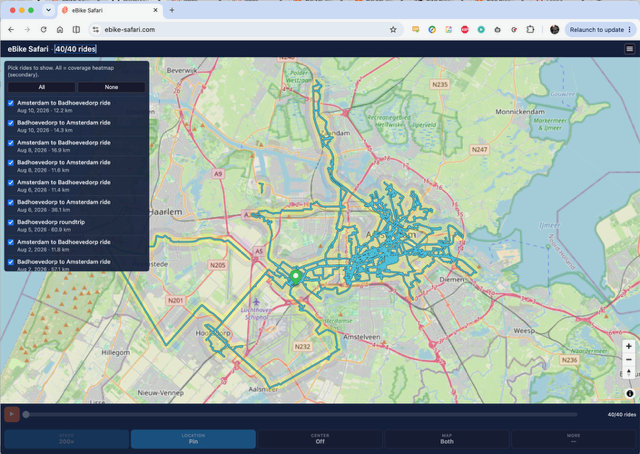
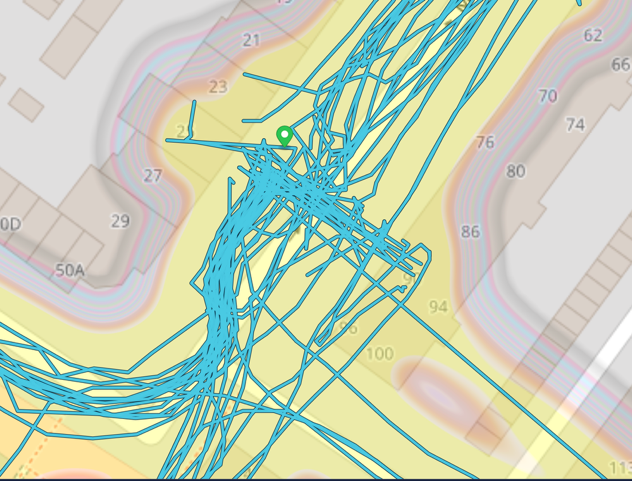
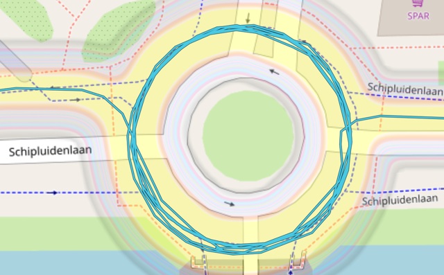
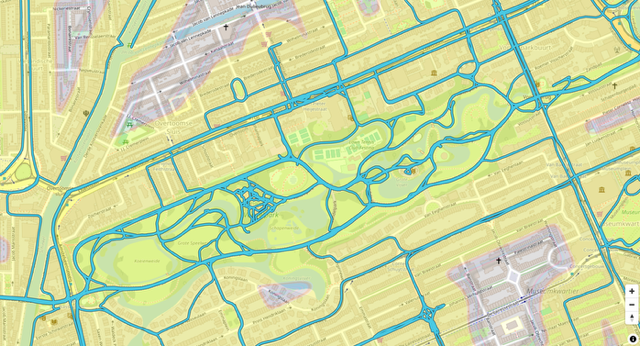
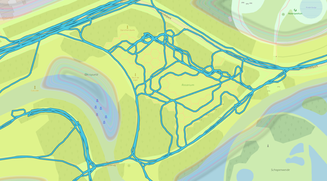
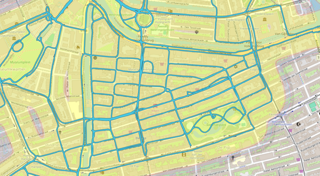
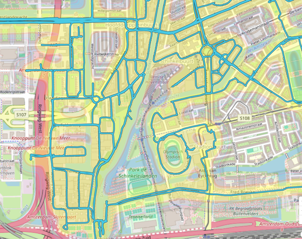

# Repo Show invitation thread — Sam accepts, July–August 2026

**Girder:** `repo-show-thread-2026.yml` · Channel: email (Don ↔ Sam)

The invitation thread that converted Sam from warm contact to **confirmed conversation
guest** — and the first email demo of [eBike Safari](../../../apps/ebike-safari/) to
anyone on the show roster.

---

## 2026-07-31 — Don: the invitation

Key beats of Don's pitch:

- **"Will Wright is in"** — accepted and signed on for the premiere Repo Show.
- Sam invited **as co-architect rather than audience**. His beats: Maxis Labs 2 /
  Microcosm Industries as institution design (Overedge lens on "why did we stop shipping
  simulation toys?"), humanistic computation next to glass-box Micropolis and Snap!,
  HyperCard-for-simulation, *The Magic of Code* a year on.
- Guest page + [invitation](../invitation.md) links; **zero homework, async by design,
  "later" and "no" both honored gracefully**; repo in quiet mode, hold links.
- Two questions: (1) was Sam at the **2006 Long Now Eno × Will** night? (2) who else
  belongs in the Sam × Reese × Will × Chaim stack?

## 2026-08-03 — Sam: first reply (from vacation in Japan)

> "This is exciting! … love this. Would love to record a conversation with you, if that
> can work. And re your questions, **I wasn't at the 2006 talk at long now** and will
> think of more folks who could be good fellow travelers here."

Answers the open question in [long-now-thread.md](long-now-thread.md): **Sam was not at
the 2006 event.** No faked co-presence needed — the 2006 room → 2016 Sam → 2024–26 repo
beat stands as is.

## 2026-08-13 11:39 — Sam: conversation as forcing function

> "This all seems super exciting. Would doing a conversation with me work? That might be
> easier for me, **as a forcing function** to talk about the things you want me to talk
> about, rather than just me rambling into a camera."

## 2026-08-13 11:52 — Don: the time-shifted conversation architecture

Don's reply is a compact statement of the Repo Show conversation model:

- Conversations both **answer questions and raise more questions**; others watch later,
  record their own answers and questions, and the conversation **bounces between people,
  shifted in time**.
- **The repo is the central grounding and stage** — enables time shifting, rich content,
  preparation, later study, and audience participation.
- Escalation ladder: **solo video** (simplest base case) → **one-on-one** (both read and
  add to the repo before, follow along in real time, browse afterwards) → **several
  people + live audience** (YouTube/Twitch) → ultimately **edited into a coherent long
  form show**.

## 2026-08-13 12:06 — Sam: accepted, with Chaim pairing

> "Sounds great! Happy to do one with you, **or Chaim**, which I think you mention in the
> repo as a good pairing; **it's always fun to riff with him!**"

Sam read the repo closely enough to find the pairing suggestion. Status:
**one-on-one conversation confirmed** (Don or [Chaim](../../chaim-gingold/)); informal
private chats first to plan.

## 2026-08-13 12:08 — Don: the eBike Safari demo email

Don's follow-up demoed [ebike-safari.com](https://ebike-safari.com) — built the previous
day, designed for decades — including the story of taking a scheduled call with
**David Temkin** from a park bench by the zoo mid-ride
([OpenLaszlo reunion](../../david-temkin/sources/2026-openlaszlo-5.0-linkedin-thread.md)).

> "There's just one map of reality, but many different games you can play in the real
> world!"

Lineage cited: StoryMaker, Bar Karma, and Urban Safari at Stupid Fun Club with Will —
see [LEGACY-urban-safari.md](../../../apps/ebike-safari/LEGACY-urban-safari.md).

### The seven screenshots (now canonical app media)

All in [`apps/ebike-safari/media/`](../../../apps/ebike-safari/media/MANIFEST.yml):

| Image | Story |
|-------|-------|
|  | Whole area, all 40 rides — trails + heat map |
|  | Home, where most rides start and end |
|  | Roundabout ridden backwards late at night — "a few other confused bicyclists … looked at me funny" |
|  | Vondelpark — random riding, eating, laptop stops |
|  | The Rose Garden |
|  | De Pijp flood filled — "reverse Pac-Man, leaving dots behind instead of eating them" |
|  | Olympic Stadium neighborhood: stadium, canal lock, graveyard |

---

## Open items

- Sam still owes: fellow-traveler suggestions for the stack (promised 2026-08-03).
- Schedule informal private one-on-one chat (Don ↔ Sam) to plan recorded discussion.
- Decide pairing: Don × Sam, Chaim × Sam, or both as separate episodes.

↑ [sources README](README.md) · [correspondence](../correspondence.yml) · [invitation](../invitation.md)
