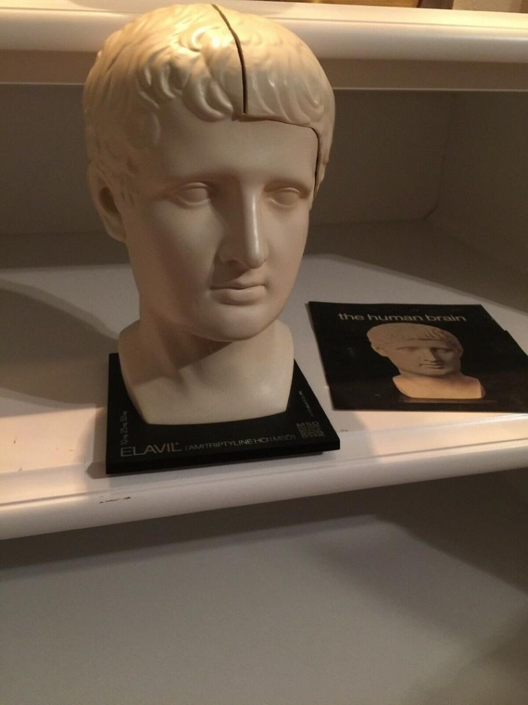
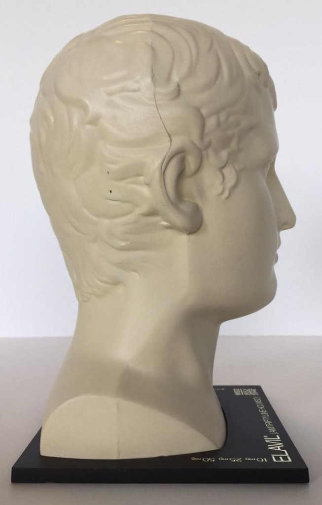
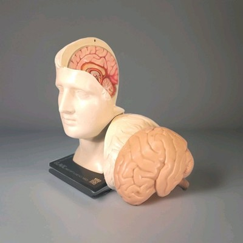
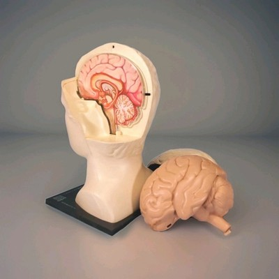
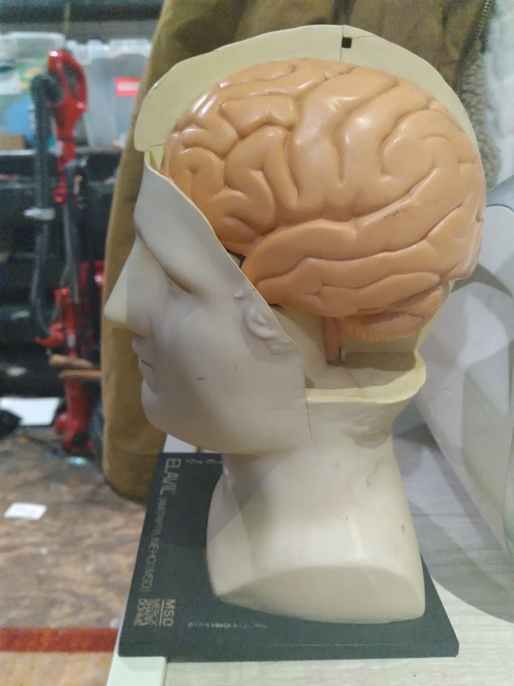
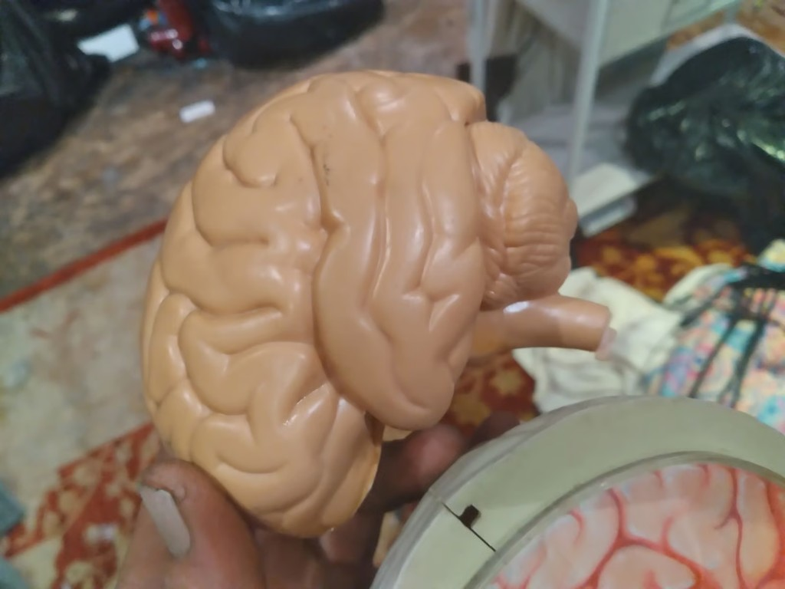

# Ideas to explore with Scott Draves ("Spot") ⚡🐑

*Conversation hooks for a Repo Show — **Don's proposed topics**, each grounded in Scott's own
public work or in their documented friendship. Things Don would love to riff on **with** Scott;
not quotes, not claims about what he thinks.*
[Portrayal standards](../../schemas/portrayal-standards.yml) · old friend — likely yes

## Why these ideas fit

Don and Scott have been circling the same questions since **Silicon Valley in the early '90s** —
Don running Scott's early Flame screensaver on his SparcStation II while building his CAM6
cellular-automata platform — and on through **Carnegie Mellon** (Scott's CS PhD with Andy Witkin then Peter Lee; Don with Brad Myers on the Garnet Lisp reactive UI): beauty from simple rules, distributed systems, feedback. They recently teamed up again on the **Electric Sheep / Unity** client, and Scott just relaunched the
Sheep as **Infinidream**. Perfect timing for a generative-art show with running code.

## The hooks

### 1. The whole arc, end to end

**fnord** (Brown, 1990 — the functional geometry language he co-wrote with Nick Thompson) →
**Fractal Flame** (1991; the form Don first saw it in was a **screen saver** — the `flame` hack in
xlock and Jamie Zawinski's **xscreensaver**; open-sourced 1992) → **Electric Sheep** (distributed,
vote-bred) → **Dreams in High Fidelity** (an evolving painting) → **Infinidream** (2026, AI-native).
Read the old Flame papers, run the Sheep live, and trace how the idea mutated across 35 years. The
constant: **describe generative form as data, then render and evolve it.**

### 2. Collective intelligence, made literal

Electric Sheep is "the collective dream of a cyborg mind" — hundreds of thousands of computers and
people, voting + a genetic algorithm breeding the favorites. A live look at **emergent taste**:
how a crowd + machines + selection grow beauty no one designed. (Pairs with Eno's *scenius*.)

### 3. Open source as an art strategy

Open-sourcing the **Flame algorithm** in 1992 is *why* it spread everywhere — a Paul Simon album
cover, Hawking's *The Grand Design*, the SIGGRAPH 2008 "Evolve" identity. Worth a frank thread:
giving the algorithm away vs. funding the work (Patreon, Infinidream's model) — the same
non-extractive question Don keeps hitting.

### 4. It's always the feedback — iterated graphical systems

The family Don and Scott keep trading: **CAM6** cellular automata, **Sandspiel**, video feedback,
the **Moveable Feast Machine**, music-reactive visuals, Don's **self-aware image pipeline**. Build
a tiny feedback loop on stream and watch it come alive.

### 5. Hand-authored math vs. learned models

Infinidream brings AI image generation into the flock. The real question: what does AI **change**
about generative art, and what does it **keep**? Flame genomes are interpretable; diffusion models
aren't — what's gained, what's lost, what's the hybrid?

### 6. The screensaver as a planet-scale render farm

It started humble: Scott's flame was a **screen hack** — first in **xlock**, then ported into
**Jamie Zawinski's xscreensaver** (the man page still credits *"Scott Graves [sic]
&lt;spot@cs.cmu.edu&gt;, 06-Jun-91"* and *"xscreensaver port by jwz, 18-Oct-93"*). That same
"pretty idle-screen toy" idea grew up into **Electric Sheep** (1999) — idle machines turned into
distributed compute decades before "cloud GPU" was a phrase. Revisit it now: crowd compute, fair
attribution, and the **derived-DB / proof** angle from the brain-stream work (who contributed which
cycles). *(Don knew **jwz** from that era too — see the 6Heads note.)*

### 7. Music-reactive / VJ performance

Scott's real-time audio-reactive work (**Electric Dots**, the ENORCHESTRA-adjacent live sets,
EchoNest-style analysis). A live segment: drive the flock from sound — the Sheep as instrument.

### 8. The Electric Sheep / Unity engine

The thing they **designed together** (c.2020–2023): seamless cross-platform video playback,
fade-not-cut, decode-vs-playback speed, WebGPU/Metal, Syphon (with Anton Marini). They brainstormed
the architecture and how to do it in Unity; **Don did research and built a prototype**, then had to
turn back to **Leela** work, and **Scott and others carried it forward** (developing or
re-developing it — Scott can fill in the current state on the show; Don's prototype may or may not
have landed in the shipping product, and some ideas may have been reimplemented since). That's the
honest, fun version — *no ego in code.* The point isn't whose lines shipped; it's the **ideas and
designs getting reimplemented again and again** across situations and platforms — exactly like Don's
SimCity and CAM6 *plays*. Show the guts, compare notes, talk shop.

### 9. The 2006 reunion thread

The night Don brought **Brian Eno** to Scott's apartment after the Long Now talk. Generative across
media — Sheep, ambient music, simulation — with **Brian** and **Will** as dream co-guests.

### 10. fnord — the origin (and the joke)

Before the Sheep there was **`fnord`** — Scott's 1990 Brown BS thesis, *"fnord (visualization of
mathematics and geometry),"* a **functional language for describing form** he co-wrote with **Nick
Thompson** (Don's housemate, the guy who introduced them) and that became the **workhorse for Thomas
Banchoff's** higher-dimensional-geometry art — even an animation on *Star Trek: TNG*. It's the deep
root of everything after: *describe generative form as data, then render and evolve it.* And the
name is the perfect hacker koan — a **fnord** (Shea & Wilson's *Illuminatus!*) is the word you're
conditioned **not to perceive**. Fittingly, Don had completely forgotten Scott named it that until it
resurfaced. *That's how fnords work.* Worth resurrecting/reimagining live.

### 10b. Origins → now

Silicon Valley in the early '90s (Flame on a SparcStation II, Don's CAM6 platform — the Bay Area
*before* it enshittified and scattered the techno-hippies to Amsterdam and beyond), Andy Witkin's
graphics lab at CMU, Don's Lisp-UI/SimCity-porting era — and the long arc from there to generative
AI. The friendship as a through-line for the whole field.

### 11. The 6Heads house — 1990 Mountain View (banter + storytelling)

  
  
  
  
  
  

*The actual model — an **ELAVIL** (amitriptyline HCl) anatomical head, a 1974 **MSD / Merck** pharma
gift to doctors, with a removable skull panel and lift-out brain. **We had six**, lined up along the
mantelpiece. (Photos found online of the same model.)*

The *how-we-met* story, told properly for once. Don's Mountain View household — **"6Heads,"** named
for those six plastic anatomical heads with removable skull panels (drug-rep swag for **ELAVIL** /
amitriptyline) abandoned in the garage when they moved in — was Don plus **Nick Thompson** (SGI; who
brought Spot by) and **Steve Zellers** (Sun, then Dave Winer's *More*/**Frontier**), living **next
door to Joy Mountford** (Apple Human Interface Group; Don later knew her at Interval). Don, Nick, and
Steve were fresh out of college in their first Silicon Valley jobs; **Scott was the visiting
friend** — about to head to **CMU for his PhD** (so he's the grad-school-bound one, not a
first-jobber). When they met, Spot's **Flame** already ran as a screen saver (the `flame` hack that
went into xlock and then jwz's xscreensaver) — very likely how Don first laid eyes on it. All of it
in the 1990 Silicon Valley zeitgeist — *before it enshittified and scattered the techno-hippies to
Amsterdam and beyond.* **Ask Spot to tell HIS post-graduation story** — what he did, where he landed,
how we converged in that scene (was it the summer of 1990, between Brown and CMU?). We'll fill each
other in on all the stuff we never asked about back then.

*Same scene, same wire:* Don also knew **Jamie Zawinski ("jwz")** from that era — the CMU/Lucid
**Lisp** world, the **UNIX-HATERS** mailing list and book (Don wrote the *X-Windows Disaster*
chapter; jwz was a contributor), and **xscreensaver** itself, which carried Scott's flame to the
world. (He'd make a great guest someday — xscreensaver, Mozilla, the DNA Lounge.)

## Sources (real, public)

- Electric Sheep: [https://electricsheep.org/](https://electricsheep.org/) · code: [https://github.com/scottdraves/electricsheep](https://github.com/scottdraves/electricsheep)
- Fractal Flame: [https://flam3.com/](https://flam3.com/) · paper: [https://flam3.com/flame.pdf](https://flam3.com/flame.pdf)
- Papers: NPAR 2006 ([http://draves.org/npar06/npar06draves.pdf](http://draves.org/npar06/npar06draves.pdf)), AOAE 2007 ([http://draves.org/aoae07/draves-aoae07.pdf](http://draves.org/aoae07/draves-aoae07.pdf))
- Dreams in High Fidelity (MoMA / Google / Adler Planetarium); Infinidream: [https://infinidream.ai/](https://infinidream.ai/) · [https://draves.ai/](https://draves.ai/)
- Friendship timeline: `[correspondence.yml](correspondence.yml)`

