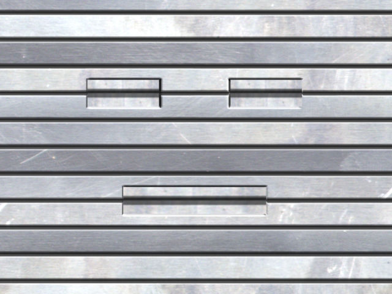
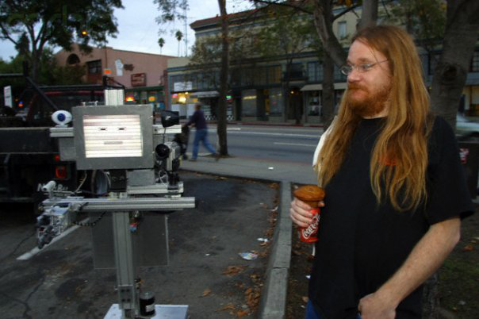
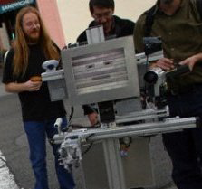
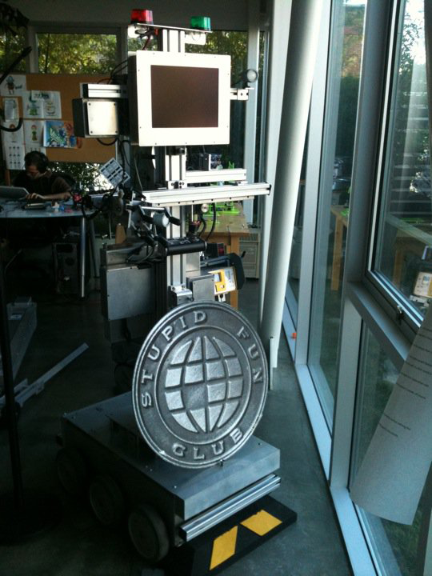

# Slats 🤖

**Fictional sidekick** — not a human guest invitation.

Slats is the robot Don programmed at Will Wright's **Stupid Fun Club**. The name says it all: his
face is a stack of metal **slats** with cut-out eyes and a mouth. The **RoboResurrection** quest on
the Will Wright kickoff show: find the code, revive him, call-in sidekick, interview, reprogram,
iterate.

**Primary sources** — the real Stupid Fun Club **One Minute Movies** (written by Will Wright, robot
brain by Don Hopkins), with transcripts: [`one-minute-movies.md`](one-minute-movies.md) — including
[*Servitude*](one-minute-movie-servitude.md), where the robot says *"hello, my name is Slats."*

## Photos that tell the story

Slats was built and brained at the **Stupid Fun Club** shop in **Emeryville**, then taken out to play
in **Berkeley** — and the home base for the street shoots was **Au Coquelet Cafe Restaurant** at
2000 University Ave (one of Don's favorite, most-frequent Berkeley hangouts; sadly now closed).

*Don with a coffee and muffin outside **Au Coquelet** ([Yelp](https://www.yelp.com/biz/au-coquelet-cafe-restaurant-berkeley)), Slats at his side, dusk.*

*Across the street from Au Coquelet — the crew running Slats for a hidden-camera shoot.*

*Home at the **Stupid Fun Club** shop in Emeryville, wearing the cast SFC globe emblem.*

Full gallery (incl. his slatted **face** and the SFC seal): [`photos.md`](photos.md).

See [`../../repo-shows/will-wright/slats-reincarnation.yml`](../../repo-shows/will-wright/slats-reincarnation.yml) · [Browse for Will](../../repo-shows/will-wright/BROWSE.md)

Will will love this. ⛪🤖
